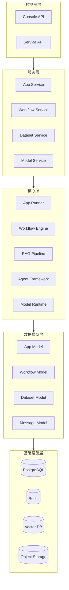

# 现状架构诊断

> **TL;DR**: Dify 采用 Flask + Next.js 前后端分离架构，基于 DDD 分层，支持 20+ 向量数据库，通过 Docker Compose 部署。企业级部署的主要差距在于多租户隔离、审计日志、SSO 集成和监控指标。

## 概述

Dify 是一个开源的 LLM 应用开发平台，提供 AI 工作流编排、RAG 管道、智能体框架和模型管理等核心能力。当前架构设计面向开源社区和中小规模部署，在企业级场景下存在以下关键差距：

**核心优势：**
- 模块化架构，扩展性强
- 支持多种模型提供商和向量数据库
- 可视化工作流编排
- 完善的 API 接口

**主要局限性：**
- 多租户隔离不够细粒度
- 审计日志不够完善
- 缺少企业级 SSO 集成
- 监控和可观测性不足
- 容量规划工具缺失

## 详细设计

### 1. 后端架构

**技术栈：**
- **框架**：Flask（Python Web 框架）
- **架构模式**：DDD（领域驱动设计）分层架构
- **异步任务**：Celery + Redis
- **数据库**：PostgreSQL（主库）+ Redis（缓存/队列）

**分层结构：**

```
api/
├── controllers/          # 控制器层（HTTP 接口）
│   ├── console/          # 控制台 API
│   └── service_api/      # 服务 API（对外）
├── services/             # 服务层（业务逻辑）
├── core/                 # 核心层（领域逻辑）
│   ├── app/              # 应用管理
│   ├── workflow/         # 工作流引擎
│   ├── rag/              # RAG 管道
│   ├── agent/            # 智能体框架
│   ├── model_runtime/    # 模型运行时
│   └── ...               # 40+ 子模块
├── models/               # 数据模型层
├── extensions/           # 扩展机制
└── tasks/                # 异步任务
```

**核心模块：**

| 模块 | 路径 | 职责 |
|------|------|------|
| 应用管理 | `api/core/app/` | 应用创建、配置、运行 |
| 工作流引擎 | `api/core/workflow/` | 可视化工作流编排和执行 |
| RAG 管道 | `api/core/rag/` | 知识库构建、文档处理、检索增强 |
| 智能体框架 | `api/core/agent/` | Agent 能力、工具调用 |
| 模型运行时 | `api/core/model_runtime/` | 模型提供商集成、调用管理 |
| 扩展机制 | `api/core/extension/` | 插件系统、扩展点 |

**扩展机制：**

Dify 提供 20+ 扩展点，支持：
- 模型提供商扩展
- 工具扩展
- 数据源扩展
- 审核模块扩展

扩展采用插件化设计，通过 `Extensible` 基类和 `ExtensionModule` 枚举实现。

### 2. 前端架构

**技术栈：**
- **框架**：Next.js 14+（App Router）
- **语言**：TypeScript（严格模式）
- **状态管理**：Jotai（原子状态）+ TanStack Query（服务端状态）
- **样式**：Tailwind CSS
- **组件库**：自研 108 个基础组件

**目录结构：**

```
web/
├── app/                  # Next.js App Router
│   ├── layout.tsx        # 根布局（Providers）
│   ├── components/       # 组件（108 个基础组件）
│   └── [routes]/         # 页面路由
├── contract/             # API 契约（类型定义）
├── service/              # API 服务层（55 个 composables）
├── context/              # React Context
├── hooks/                # 自定义 Hooks
└── i18n/                 # 国际化（23 种语言）
```

**核心特性：**
- **工作流画布**：基于 React Flow 的可视化编排界面
- **实时协作**：WebSocket 支持实时消息推送
- **主题系统**：支持亮色/暗色主题切换
- **响应式设计**：适配桌面和移动端

### 3. 数据架构

**主数据库：PostgreSQL**
- 存储应用配置、用户数据、工作流定义等结构化数据
- 使用 SQLAlchemy ORM
- 支持数据库迁移（Alembic/Flask-Migrate）

**缓存/队列：Redis**
- 会话缓存
- Celery 任务队列
- 速率限制
- 发布/订阅

**向量数据库：支持 20+ 种**
- Milvus
- Pinecone
- Weaviate
- Qdrant
- Chroma
- PGVector
- ...（完整列表见配置）

**文件存储：S3 兼容存储**
- 支持 AWS S3、MinIO、阿里云 OSS 等
- 存储上传文件、生成的图片、导出的数据

**配置管理：**
- 680+ 环境变量
- Pydantic Settings 验证
- 分层配置（默认值 → 环境变量 → 运行时覆盖）

### 4. 部署架构

**Docker Compose：**
- 单镜像三进程模式（API + Worker + Beat）
- 通过 `MODE` 环境变量区分进程角色
- 自动生成的 compose 配置（基于模板）

**核心服务：**
- `dify-api`：Flask API 服务
- `dify-worker`：Celery Worker（异步任务）
- `dify-beat`：Celery Beat（定时任务）
- `dify-web`：Next.js 前端
- `postgres`：PostgreSQL 数据库
- `redis`：Redis 缓存/队列
- `sandbox`：代码执行沙箱
- `vector-db`：向量数据库（可选）

**CI/CD：**
- 22 个 GitHub Actions 工作流
- 自动化测试（API、Web、VDB）
- 代码风格检查（Ruff、ESLint）
- 类型检查（basedpyright、mypy）
- 自动发布 Docker 镜像

### 5. 安全现状

**认证机制：**
- JWT Token（API 认证）
- Session Cookie（Web 界面）
- 支持邮箱/密码登录
- 支持 GitHub/Google OAuth

**授权机制：**
- 基于租户（Tenant）的资源隔离
- 角色：Owner、Admin、Editor、Viewer
- 工作空间级别的权限控制

**审计日志：**
- 基础操作日志（应用创建、修改、删除）
- 消息历史记录
- 缺少细粒度的审计日志（如配置变更、权限变更）

**合规支持：**
- EU AI Act 合规文档
- 数据隐私保护（GDPR 就绪）
- 内容审核机制

### 6. 差距分析

| 领域 | 现状 | 企业级需求 | 差距 |
|------|------|----------|------|
| **多租户隔离** | 租户级隔离 | 工作空间级 + 项目级细粒度隔离 | 需要增强权限模型 |
| **审计日志** | 基础操作日志 | 完整的审计追踪（谁、何时、做了什么） | 需要完善日志体系 |
| **SSO 集成** | OAuth（GitHub/Google） | 企业 SSO（SAML、OIDC、LDAP） | 需要添加企业级 SSO |
| **监控指标** | 基础日志 | 完整的可观测性（Metrics、Traces、Logs） | 需要集成 Prometheus/Grafana |
| **容量规划** | 手动评估 | 自动化容量评估和预警 | 需要开发容量规划工具 |
| **备份容灾** | 基础备份 | 自动化备份、跨区域容灾 | 需要完善备份策略 |
| **高可用** | 单点部署 | 多副本、负载均衡、故障转移 | 需要 HA 架构设计 |

## 附录

### A. 核心模块依赖图



### B. 环境变量分类清单

| 类别 | 数量 | 示例 |
|------|------|------|
| 数据库配置 | 15+ | `DB_HOST`, `DB_PORT`, `DB_USERNAME`, `DB_PASSWORD` |
| Redis 配置 | 10+ | `REDIS_HOST`, `REDIS_PORT`, `REDIS_DB` |
| 存储配置 | 20+ | `STORAGE_TYPE`, `S3_BUCKET`, `S3_ACCESS_KEY` |
| 模型配置 | 50+ | `OPENAI_API_KEY`, `ANTHROPIC_API_KEY` |
| 向量数据库 | 30+ | `VECTOR_STORE_TYPE`, `MILVUS_HOST` |
| 安全配置 | 25+ | `SECRET_KEY`, `JWT_SECRET`, `CORS_ORIGINS` |
| 日志配置 | 10+ | `LOG_LEVEL`, `LOG_FILE` |
| 其他 | 520+ | 各种功能开关、限制参数 |

**总计：680+ 环境变量**

## 变更日志

| 版本 | 日期 | 作者 | 变更内容 |
|------|------|------|----------|
| 1.0 | 2026-07-19 | AI Assistant | 初始版本 |
