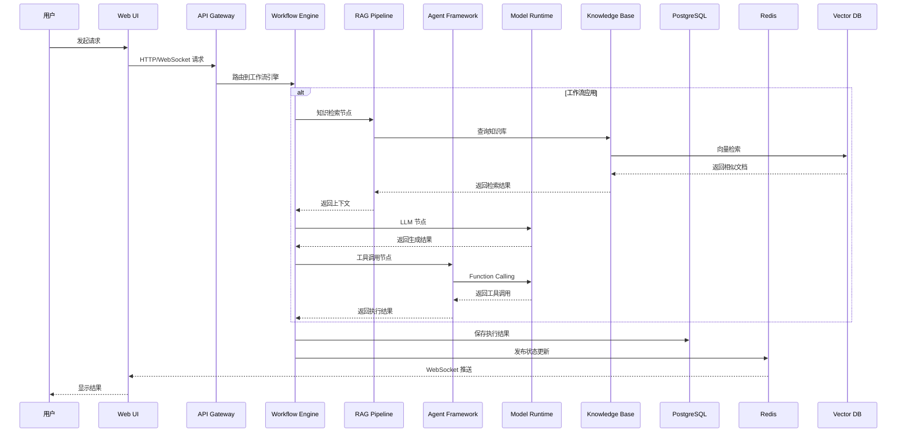

# 总体架构全景图

> **TL;DR**: Dify 平台由展示层、应用层、核心层、基础设施层四层组成，核心能力包括工作流引擎、RAG 管道、智能体框架和模型管理。

## 概述

Dify 采用分层架构设计，将系统划分为四个主要层次：展示层、应用层、核心层和基础设施层。这种分层设计实现了关注点分离，便于独立开发、测试和部署。

**核心设计原则：**
- **分层解耦**：各层职责清晰，通过定义良好的接口通信
- **模块化设计**：核心能力模块化，支持独立扩展和替换
- **插件化扩展**：通过扩展点机制支持第三方集成
- **多租户隔离**：租户级别的资源和数据隔离

## 详细设计

### 1. 架构分层

```mermaid
graph TB
    subgraph Presentation["展示层 (Presentation Layer)"]
        WebUI[Web UI<br/>Next.js App Router]
        APIGateway[API Gateway<br/>RESTful API]
        WebSocket[WebSocket<br/>实时通信]
    end
    
    subgraph Application["应用层 (Application Layer)"]
        WorkflowEngine[Workflow Engine<br/>工作流引擎]
        RAGPipeline[RAG Pipeline<br/>RAG 管道]
        AgentFramework[Agent Framework<br/>智能体框架]
        AppManager[App Manager<br/>应用管理]
    end
    
    subgraph Core["核心层 (Core Layer)"]
        ModelRuntime[Model Runtime<br/>模型运行时]
        KnowledgeBase[Knowledge Base<br/>知识库]
        ToolIntegration[Tool Integration<br/>工具集成]
        PromptEngine[Prompt Engine<br/>提示词引擎]
        Moderation[Moderation<br/>内容审核]
    end
    
    subgraph Infrastructure["基础设施层 (Infrastructure Layer)"]
        PostgreSQL[(PostgreSQL<br/>主数据库)]
        Redis[(Redis<br/>缓存/队列)]
        VectorDB[(Vector DB<br/>向量数据库)]
        ObjectStorage[(Object Storage<br/>对象存储)]
        MessageQueue[(Message Queue<br/>消息队列)]
    end
    
    Presentation --> Application
    Application --> Core
    Core --> Infrastructure
    
    style Presentation fill:#e1f5ff
    style Application fill:#fff4e1
    style Core fill:#e8f5e9
    style Infrastructure fill:#f3e5f5
```

#### 1.1 展示层

**职责**：用户界面和 API 接口

**组件：**
- **Web UI**：基于 Next.js App Router 的单页应用
  - 工作流可视化编辑器
  - 应用配置界面
  - 知识库管理界面
  - 监控和日志查看器
  
- **API Gateway**：RESTful API 接口
  - Console API（控制台管理）
  - Service API（对外服务）
  
- **WebSocket**：实时通信通道
  - 工作流执行状态推送
  - 聊天消息实时推送
  - 日志流式输出

**技术栈**：
- Next.js 14+（App Router）
- TypeScript（严格模式）
- Tailwind CSS
- React Flow（工作流画布）

#### 1.2 应用层

**职责**：业务逻辑编排和应用管理

**核心组件：**

**Workflow Engine（工作流引擎）**
- 可视化工作流编排
- 节点类型：LLM、知识检索、代码执行、条件分支、循环等
- 执行引擎：支持同步和异步执行
- 状态管理：工作流实例状态追踪

**RAG Pipeline（RAG 管道）**
- 文档处理：PDF、PPT、Word 等格式解析
- 文本分块：智能分块策略
- 向量化：调用模型生成嵌入
- 检索增强：基于相似度的文档检索
- 上下文组装：将检索结果注入提示词

**Agent Framework（智能体框架）**
- Agent 模式：Function Calling、ReAct
- 工具调用：50+ 内置工具（Google Search、DALL·E 等）
- 自定义工具：支持 OpenAPI Schema 定义
- 记忆管理：短期记忆、长期记忆

**App Manager（应用管理）**
- 应用创建和配置
- 模型选择和质量
应用层负责将用户请求转化为具体的执行流程，协调核心层的各个组件完成业务逻辑。

#### 1.3 核心层

**职责**：核心能力提供和领域逻辑实现

**核心组件：**

**Model Runtime（模型运行时）**
- 模型提供商集成：OpenAI、Anthropic、本地模型等
- 模型调用抽象：统一的调用接口
- 负载均衡：多模型实例负载均衡
- 故障转移：自动切换到备用模型
- 成本控制：Token 使用量追踪和限制

**Knowledge Base（知识库）**
- 文档管理：上传、解析、存储
- 向量存储：支持 20+ 向量数据库
- 检索策略：相似度检索、关键词检索、混合检索
- 权限控制：知识库级别的访问控制

**Tool Integration（工具集成）**
- 内置工具：50+ 预集成工具
- 自定义工具：支持 OpenAPI Schema
- 工具市场：工具发现和分享
- 工具执行沙箱：安全执行环境

**Prompt Engine（提示词引擎）**
- 提示词模板：变量替换、条件渲染
- 提示词优化：自动优化提示词质量
- 版本管理：提示词版本追踪
- A/B 测试：多版本提示词对比

**Moderation（内容审核）**
- 敏感词过滤：基于词典的过滤
- 内容分类：有害内容识别
- 自定义规则：支持自定义审核规则
- 第三方审核：集成第三方审核服务

#### 1.4 基础设施层

**职责**：基础服务提供和资源管理

**核心组件：**

**PostgreSQL（主数据库）**
- 存储内容：应用配置、用户数据、工作流定义、消息历史
- ORM：SQLAlchemy
- 迁移：Alembic/Flask-Migrate
- 多租户：基于 `tenant_id` 的数据隔离

**Redis（缓存/队列）**
- 缓存：会话缓存、配置缓存
- 队列：Celery 任务队列
- 发布/订阅：实时消息推送
- 速率限制：API 调用频率控制

**Vector DB（向量数据库）**
- 支持：Milvus、Pinecone、Weaviate、Qdrant、Chroma、PGVector 等 20+ 种
- 存储内容：文档嵌入向量
- 检索：相似度搜索（余弦相似度、欧氏距离等）
- 索引：HNSW、IVF 等索引算法

**Object Storage（对象存储）**
- 支持：AWS S3、MinIO、阿里云 OSS 等
- 存储内容：上传文件、生成的图片、导出的数据
- 访问控制：基于签名的临时访问

**Message Queue（消息队列）**
- 实现：Redis Queue / Celery
- 异步任务：文档处理、邮件发送、数据同步
- 定时任务：Celery Beat 调度
- 任务重试：失败任务自动重试

### 2. 核心组件交互

### 3. 数据流

**典型请求处理流程：**

1. **用户输入**
   - Web UI 接收用户输入（文本、文件）
   - 通过 API Gateway 发送到后端

2. **请求路由**
   - API Gateway 根据应用类型路由到对应的处理器
   - 工作流应用 → Workflow Engine
   - 聊天应用 → Agent Framework
   - 文本生成应用 → 直接调用 Model Runtime

3. **业务处理**
   - Workflow Engine 按节点顺序执行
   - 知识检索节点 → RAG Pipeline → Knowledge Base → Vector DB
   - LLM 节点 → Model Runtime → 模型提供商 API
   - 工具调用节点 → Agent Framework → 工具执行

4. **结果返回**
   - 执行结果保存到 PostgreSQL
   - 通过 Redis 发布状态更新
   - WebSocket 推送到 Web UI
   - Web UI 渲染结果给用户

### 4. 技术栈

| 层次 | 技术栈 |
|------|--------|
| **展示层** | Next.js 14+, TypeScript, Tailwind CSS, React Flow |
| **应用层** | Flask, Celery, SQLAlchemy |
| **核心层** | Python, Pydantic, LangChain (部分) |
| **基础设施层** | PostgreSQL, Redis, 20+ Vector DBs, S3-compatible Storage |
| **部署** | Docker Compose, Kubernetes (Helm Charts) |
| **CI/CD** | GitHub Actions (22 workflows) |
| **监控** | 基础日志（待完善 Prometheus/Grafana） |

## 附录

### A. 组件清单表

| 组件 | 类型 | 职责 | 依赖 |
|------|------|------|------|
| Web UI | 展示层 | 用户界面 | API Gateway |
| API Gateway | 展示层 | API 接口 | 应用层 |
| Workflow Engine | 应用层 | 工作流编排 | RAG, Agent, Model |
| RAG Pipeline | 应用层 | 检索增强生成 | Knowledge Base, Model |
| Agent Framework | 应用层 | 智能体框架 | Model, Tools |
| Model Runtime | 核心层 | 模型调用 | 模型提供商 API |
| Knowledge Base | 核心层 | 知识库管理 | Vector DB |
| Tool Integration | 核心层 | 工具集成 | 外部 API |
| PostgreSQL | 基础设施 | 主数据库 | - |
| Redis | 基础设施 | 缓存/队列 | - |
| Vector DB | 基础设施 | 向量存储 | - |
| Object Storage | 基础设施 | 文件存储 | - |

### B. 架构决策记录

**ADR-001: 选择 Flask 而非 FastAPI**
- **决策**：使用 Flask 作为后端框架
- **原因**：Flask 生态成熟，社区支持好，团队经验丰富
- **权衡**：性能略低于 FastAPI，但开发效率更高

**ADR-002: 选择 Celery 而非 RQ**
- **决策**：使用 Celery 作为异步任务队列
- **原因**：Celery 功能更强大，支持定时任务、任务重试、任务路由
- **权衡**：配置复杂，依赖 Redis/RabbitMQ

**ADR-003: 支持多种向量数据库**
- **决策**：支持 20+ 种向量数据库
- **原因**：不同场景适合不同的向量数据库，提供选择灵活性
- **权衡**：维护成本高，需要为每种数据库编写适配器

## 变更日志

| 版本 | 日期 | 作者 | 变更内容 |
|------|------|------|----------|
| 1.0 | 2026-07-19 | AI Assistant | 初始版本 |
