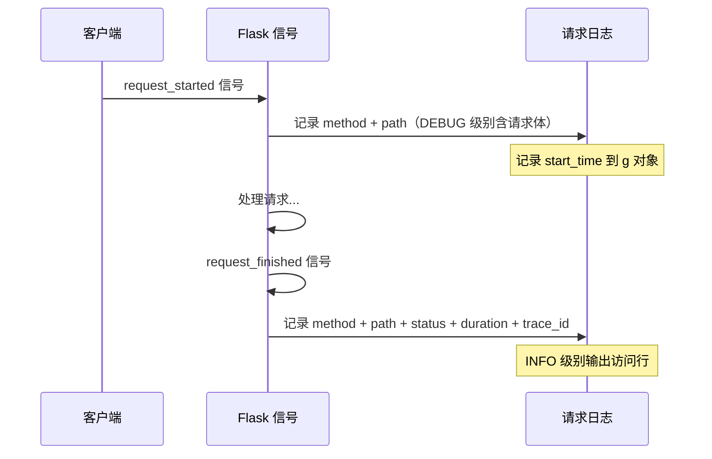
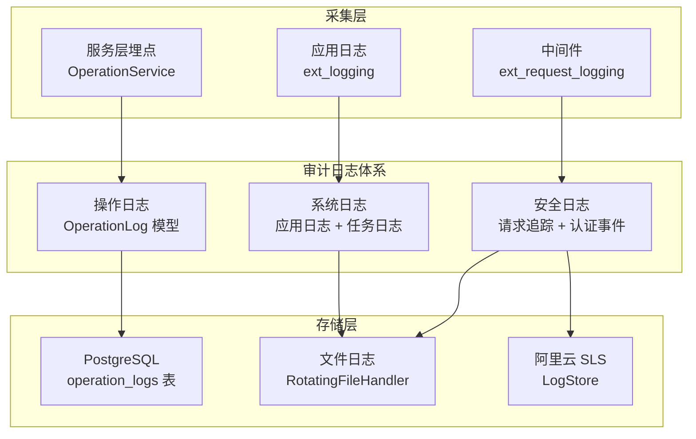
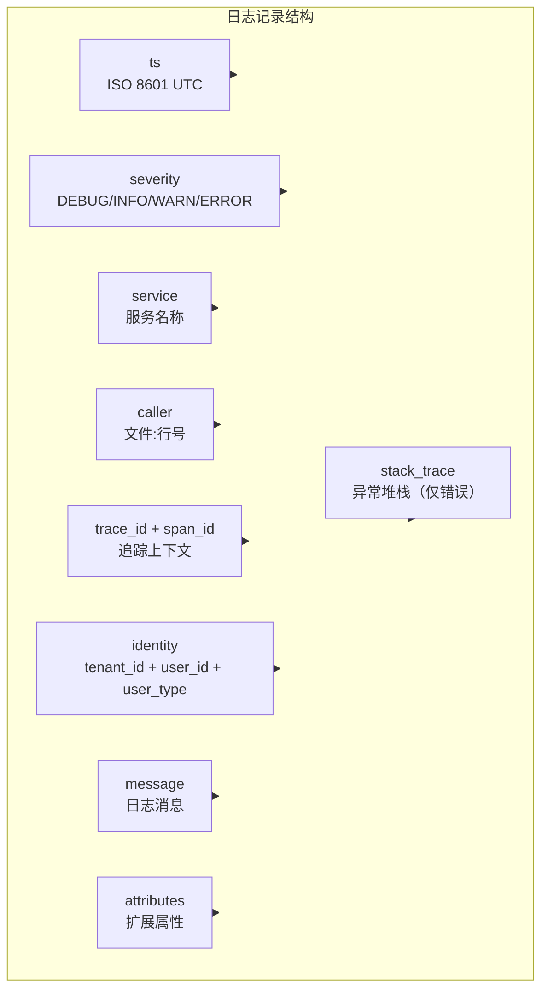
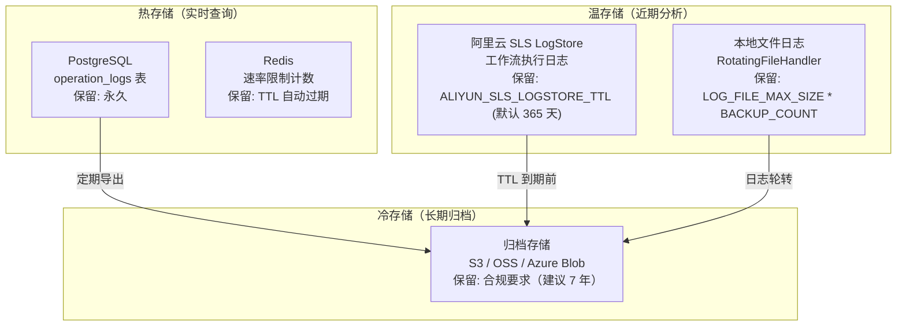
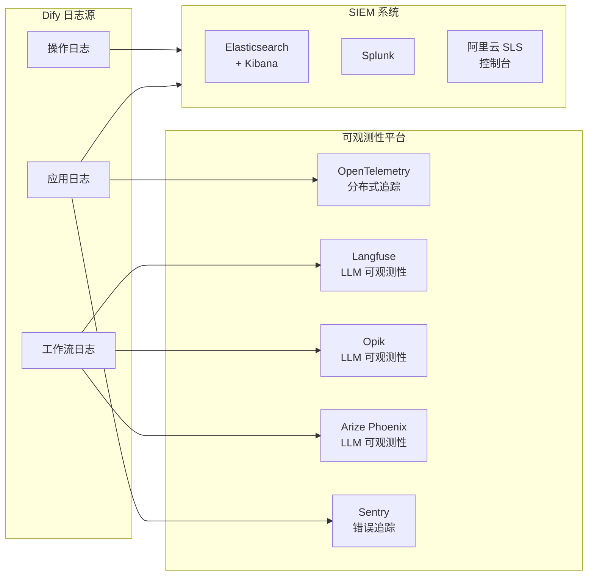
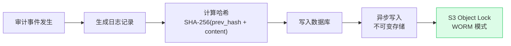
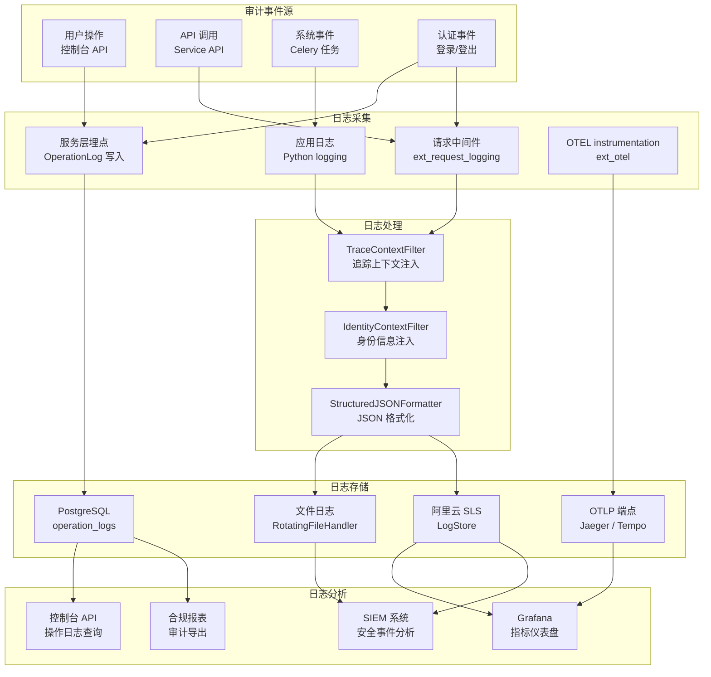

# 日志审计方案

> **TL;DR**: Dify 通过 OperationLog 操作日志模型、结构化 JSON 日志、请求追踪链路和阿里云 SLS LogStore 集成，构建覆盖操作审计、安全审计和系统审计的多层日志体系，支持 EU AI Act、GDPR 和 SOC 2 合规要求。

## 概述

日志审计是 Dify 安全架构的最后一道防线。当认证、授权和数据安全机制被绕过或失效时，审计日志提供事后追溯能力，帮助安全团队还原事件全貌。

Dify 的审计体系围绕三个目标设计：记录谁在什么时间做了什么操作（操作审计），追踪每次请求的完整链路（安全审计），保留系统运行的关键指标（系统审计）。所有日志均支持结构化输出，便于接入外部 SIEM 系统。

**核心审计原则：**

- **不可篡改**：审计日志一经写入不可修改，通过数据库 `server_default` 和 `onupdate` 机制保证时间戳可信
- **租户隔离**：所有审计记录强制包含 `tenant_id`，查询时自动限定租户范围
- **链路完整**：每条日志携带 `trace_id` 和 `request_id`，支持跨服务关联分析
- **合规就绪**：日志格式和保留策略满足 EU AI Act、GDPR 和 SOC 2 要求

## 详细设计

### 1. 审计日志现状

Dify 当前已建立多层日志机制，覆盖操作记录、请求追踪和结构化输出三个维度。

#### 1.1 操作日志模型

`OperationLog` 模型（`api/models/model.py`）是 Dify 的核心审计记录，存储于 PostgreSQL `operation_logs` 表：

| 字段 | 类型 | 说明 |
|------|------|------|
| `id` | UUID | 主键，自动生成 |
| `tenant_id` | UUID | 操作所属租户，强制非空 |
| `account_id` | UUID | 执行操作的用户账户，强制非空 |
| `action` | String(255) | 操作类型标识（如 `create_app`、`update_model_config`） |
| `content` | JSON | 操作详情，存储变更前后快照 |
| `created_at` | DateTime | 操作时间，数据库默认当前时间戳 |
| `created_ip` | String(255) | 操作来源 IP 地址 |
| `updated_at` | DateTime | 记录更新时间，自动刷新 |

索引设计：`operation_log_account_action_idx` 覆盖 `(tenant_id, account_id, action)` 三元组，支持按租户和用户快速查询操作历史。

#### 1.2 登录审计

账户模型（`api/models/account.py`）内置登录审计字段：

| 字段 | 说明 | 更新时机 |
|------|------|---------|
| `last_login_at` | 最后登录时间 | 每次成功登录 |
| `last_login_ip` | 最后登录 IP | 每次成功登录 |
| `last_active_at` | 最后活跃时间 | 每 10 分钟更新 |

#### 1.3 请求日志

`ext_request_logging.py` 扩展通过 Flask 信号机制记录所有 HTTP 请求：



请求日志输出格式（INFO 级别）：

```
GET /console/api/apps 200 45.123 ms 0123456789abcdef0123456789abcdef
```

配置项：`ENABLE_REQUEST_LOGGING=true` 启用（默认关闭）。

#### 1.4 结构化 JSON 日志

`StructuredJSONFormatter`（`api/core/logging/structured_formatter.py`）提供标准化的 JSON 日志格式：

```json
{
  "ts": "2026-07-19T10:30:00.123Z",
  "severity": "INFO",
  "service": "dify-api",
  "caller": "app_factory.py:42",
  "trace_id": "0123456789abcdef0123456789abcdef",
  "span_id": "0123456789abcdef",
  "identity": {
    "tenant_id": "abc-123",
    "user_id": "def-456",
    "user_type": "account"
  },
  "message": "Request processed successfully",
  "attributes": {
    "app_id": "xyz-789",
    "workflow_id": "uvw-012"
  }
}
```

配置项：`LOG_OUTPUT_FORMAT=json` 启用 JSON 格式（默认 `text`）。

#### 1.5 阿里云 SLS LogStore

`ext_logstore.py` 扩展集成阿里云日志服务（SLS），将工作流执行日志存储到云端：

| LogStore 名称 | 存储内容 | 索引策略 |
|---------------|---------|---------|
| `workflow_execution` | 工作流运行记录 | 自动从 `WorkflowRun` 模型生成 |
| `workflow_node_execution` | 节点执行记录 | 自动从 `WorkflowNodeExecutionModel` 生成 |

LogStore 支持 PG 协议和 SDK 两种模式，默认 TTL 为 365 天（`ALIYUN_SLS_LOGSTORE_TTL`）。

### 2. 日志分类设计

Dify 的审计日志分为三大类，每类有不同的采集方式、存储策略和查询场景。



#### 2.1 操作日志

操作日志记录用户在控制台的关键操作，用于事后审计和合规检查。

**覆盖场景：**

| 操作类别 | 典型 action 值 | 记录内容 |
|---------|---------------|---------|
| 应用管理 | `create_app`, `update_app`, `delete_app` | 应用配置变更 |
| 模型配置 | `update_model_config`, `add_provider` | 模型供应商变更 |
| 知识库 | `create_dataset`, `update_document` | 文档和分段变更 |
| 成员管理 | `invite_member`, `remove_member`, `change_role` | 租户成员变更 |
| 工作流 | `publish_workflow`, `update_workflow` | 工作流版本变更 |

**采集方式：** 服务层在业务逻辑执行后主动写入 `OperationLog` 记录。

#### 2.2 安全日志

安全日志记录认证、授权和访问控制相关事件，用于安全监控和入侵检测。

**覆盖场景：**

| 事件类别 | 日志来源 | 关键字段 |
|---------|---------|---------|
| 登录成功/失败 | `AccountService.login()` | 账户 ID、IP、时间 |
| 令牌刷新 | `PassportService.refresh_token()` | 旧/新令牌时间 |
| 权限拒绝 | 装饰器链检查失败 | 用户角色、请求路径 |
| API Key 使用 | `validate_app_token()` | Key 标识、调用接口 |
| CSRF 验证失败 | `check_csrf_token()` | 请求来源、Token 差异 |
| 速率限制触发 | 各类 rate_limiter | 限制类型、触发阈值 |

**采集方式：** 中间件自动记录（`ext_request_logging`）+ 服务层关键路径埋点。

#### 2.3 系统日志

系统日志记录应用运行状态和异步任务执行情况，用于故障排查和性能分析。

**覆盖场景：**

| 日志类别 | 来源 | 输出目标 |
|---------|------|---------|
| 应用运行日志 | `logging.getLogger(__name__)` | 文件 + 控制台 |
| Celery 任务日志 | 异步任务执行 | 文件 + 控制台 |
| 工作流执行日志 | `WorkflowRun` / `WorkflowNodeExecution` | PostgreSQL + SLS |
| 数据库迁移日志 | Alembic/Flask-Migrate | 控制台 |
| 错误追踪 | Sentry SDK | Sentry 平台 |

### 3. 日志格式和标准

#### 3.1 统一日志结构

所有日志输出遵循统一的结构化格式，便于聚合分析：



#### 3.2 字段定义规范

| 字段 | 类型 | 必填 | 说明 | 示例 |
|------|------|------|------|------|
| `ts` | String | 是 | ISO 8601 UTC 时间戳，毫秒精度 | `2026-07-19T10:30:00.123Z` |
| `severity` | String | 是 | 日志级别映射 | `INFO`, `WARN`, `ERROR` |
| `service` | String | 是 | 服务标识 | `dify-api` |
| `caller` | String | 是 | 代码位置 | `app_factory.py:42` |
| `trace_id` | String | 否 | OpenTelemetry trace ID（32 hex） | `0123456789abcdef0123456789abcdef` |
| `span_id` | String | 否 | OpenTelemetry span ID（16 hex） | `0123456789abcdef` |
| `identity.tenant_id` | String | 否 | 租户 ID | `abc-123-def` |
| `identity.user_id` | String | 否 | 用户 ID | `user-456` |
| `identity.user_type` | String | 否 | 用户类型 | `account` 或 `end_user` |
| `message` | String | 是 | 日志消息 | `Workflow executed successfully` |
| `attributes` | Object | 否 | 扩展键值对 | `{"app_id": "xyz"}` |
| `stack_trace` | String | 否 | 异常堆栈（仅 ERROR 级别） | 完整 traceback |

#### 3.3 时间戳格式

所有时间戳统一使用 ISO 8601 格式，UTC 时区，毫秒精度：

```
2026-07-19T10:30:00.123Z
```

文本格式日志支持时区配置（`LOG_TZ` 环境变量），通过 `pytz` 转换本地时间显示。JSON 格式始终输出 UTC 时间。

#### 3.4 操作日志 content 字段规范

`OperationLog.content` 字段使用 JSON 格式存储操作详情，建议遵循以下结构：

```json
{
  "action": "update_app",
  "target_type": "app",
  "target_id": "app-uuid-123",
  "before": {
    "name": "旧名称",
    "description": "旧描述"
  },
  "after": {
    "name": "新名称",
    "description": "新描述"
  },
  "metadata": {
    "user_agent": "Mozilla/5.0...",
    "referer": "https://console.dify.ai/apps"
  }
}
```

### 4. 日志存储和归档

#### 4.1 存储架构



#### 4.2 存储策略

| 日志类型 | 存储位置 | 保留期限 | 配置项 |
|---------|---------|---------|--------|
| 操作日志 | PostgreSQL | 永久（建议定期归档） | 无自动清理 |
| 请求日志 | 文件 / stdout | 按文件大小轮转 | `LOG_FILE_MAX_SIZE`, `LOG_FILE_BACKUP_COUNT` |
| 工作流执行日志 | PostgreSQL + SLS | SLS: 365 天（可配置） | `ALIYUN_SLS_LOGSTORE_TTL` |
| 工作流日志清理 | PostgreSQL | 可配置天数 | `WORKFLOW_LOG_RETENTION_DAYS`（默认 30 天） |
| Celery 任务日志 | 文件 / stdout | 按文件大小轮转 | 同请求日志 |

#### 4.3 归档策略

**工作流日志清理：**

Dify 提供内置的工作流日志清理机制（`WORKFLOW_LOG_CLEANUP_ENABLED`）：

| 配置项 | 默认值 | 说明 |
|--------|--------|------|
| `WORKFLOW_LOG_CLEANUP_ENABLED` | `false` | 是否启用自动清理 |
| `WORKFLOW_LOG_RETENTION_DAYS` | `30` | 保留天数 |
| `WORKFLOW_LOG_CLEANUP_BATCH_SIZE` | 可配置 | 每批清理数量 |
| `WORKFLOW_LOG_CLEANUP_SPECIFIC_WORKFLOW_IDS` | 空 | 指定工作流 ID 清理 |

**长期归档建议：**

| 合规要求 | 建议保留期 | 归档格式 |
|---------|-----------|---------|
| EU AI Act | 10 年 | 结构化 JSON + 原始数据库备份 |
| GDPR | 目的存续期 | 加密存储 + 访问控制 |
| SOC 2 | 7 年 | 不可变存储（WORM） |
| 等保三级 | 6 个月 | 本地 + 异地备份 |

#### 4.4 日志文件大小控制

文件日志通过 `RotatingFileHandler` 控制大小：

| 配置项 | 默认值 | 说明 |
|--------|--------|------|
| `LOG_FILE` | 无（仅控制台） | 日志文件路径 |
| `LOG_FILE_MAX_SIZE` | 可配置（MB） | 单文件最大大小 |
| `LOG_FILE_BACKUP_COUNT` | 可配置 | 保留的轮转文件数 |

### 5. 日志查询和分析

#### 5.1 查询接口

**操作日志查询：**

操作日志通过控制台 API 查询，支持按租户、用户和操作类型过滤：

```
GET /console/api/operation-logs
  ?tenant_id=xxx
  &account_id=yyy
  &action=create_app
  &page=1
  &limit=20
```

**工作流日志查询：**

工作流执行日志支持通过控制台 API 和 SLS SQL 两种查询方式：

| 查询方式 | 适用场景 | 查询能力 |
|---------|---------|---------|
| 控制台 API | 单个工作流调试 | 按 app_id、status、时间范围过滤 |
| SLS SQL | 批量分析和报表 | 全字段索引、聚合查询、时间序列 |

#### 5.2 分析工具集成

Dify 支持与多种可观测性工具集成，实现日志的集中分析：



**集成配置：**

| 工具 | 配置项 | 用途 |
|------|--------|------|
| OpenTelemetry | `ENABLE_OTEL=true` | 分布式追踪、指标收集 |
| Langfuse | 内置集成 | LLM 调用链追踪 |
| Opik | 内置集成 | LLM 调用链追踪 |
| Arize Phoenix | 内置集成 | LLM 调用链追踪 |
| Sentry | `SENTRY_DSN=xxx` | 错误追踪和告警 |
| 阿里云 SLS | `ALIYUN_SLS_*` | 工作流日志存储和查询 |

#### 5.3 报表生成

**合规报表数据源：**

| 报表类型 | 数据来源 | 生成方式 |
|---------|---------|---------|
| 操作审计报告 | `operation_logs` 表 | SQL 聚合查询 |
| 登录活动报告 | `accounts.last_login_at/ip` | 定时任务导出 |
| 工作流执行报告 | SLS / PostgreSQL | SLS SQL 或 Grafana |
| Token 消耗报告 | `workflow_runs.total_tokens` | 聚合统计 |
| 错误率报告 | Sentry / 应用日志 | Sentry API |

### 6. 日志合规要求

#### 6.1 EU AI Act 合规

EU AI Act 对高风险 AI 系统的日志记录提出明确要求（Article 12）：

| 要求 | Dify 支持 | 实现方式 |
|------|----------|---------|
| 对话日志 | 已覆盖 | `messages` 表完整记录对话历史 |
| 模型追踪 | 已覆盖 | 每条消息记录 `model_id` 和 `model_provider` |
| Token 用量 | 已覆盖 | `message_tokens` / `workflow_runs.total_tokens` |
| 文档检索 | 已覆盖 | RAG 检索记录来源文档和得分 |
| 用户标识 | 已覆盖 | `end_user_id` / `account_id` 关联 |
| 错误日志 | 已覆盖 | `workflow_runs.error` + 应用错误日志 |
| 数据保留 | 部署方责任 | `WORKFLOW_LOG_RETENTION_DAYS` + 归档策略 |

#### 6.2 GDPR 合规

GDPR 对日志中的个人数据处理提出要求：

| 要求 | Dify 措施 | 配置建议 |
|------|----------|---------|
| 数据最小化 | 日志中不记录请求体明文（仅 DEBUG 级别） | 生产环境 `LOG_LEVEL=INFO` |
| 删除权 | 用户删除时清理关联日志 | 实现数据清理任务 |
| 访问控制 | 日志查询接口强制租户隔离 | 确保所有查询包含 `tenant_id` |
| 跨境传输 | SLS 支持选择区域 | 配置 `ALIYUN_SLS_REGION` 为合规区域 |
| 处理记录 | 操作日志记录数据处理行为 | 扩展 `OperationLog` 覆盖范围 |

#### 6.3 SOC 2 合规

SOC 2 Type II 要求证明安全控制的持续有效性：

| 信任原则 | 日志支持 | 审计证据 |
|---------|---------|---------|
| 安全性 | 登录审计 + 权限检查日志 | 访问控制有效性证明 |
| 可用性 | 系统运行日志 + 错误追踪 | 服务连续性证明 |
| 处理完整性 | 工作流执行日志 | 数据处理完整性证明 |
| 机密性 | 凭证加密日志 + 访问日志 | 数据保护证明 |
| 隐私 | 操作审计 + 数据访问日志 | 隐私控制证明 |

### 7. 企业级审计增强方案

为满足企业级审计需求，建议在现有基础上进行以下增强。

#### 7.1 审计事件扩展

扩展 `OperationLog` 的覆盖范围，增加以下审计事件：

| 事件类别 | 新增 action | 触发时机 |
|---------|------------|---------|
| 认证事件 | `login`, `logout`, `login_failed`, `token_refresh` | 认证流程 |
| 密钥管理 | `create_api_key`, `delete_api_key`, `rotate_key` | API Key 操作 |
| 数据导出 | `export_conversations`, `export_dataset` | 数据导出操作 |
| 配置变更 | `update_tenant_config`, `update_security_settings` | 租户配置变更 |
| 插件操作 | `install_plugin`, `uninstall_plugin`, `update_plugin` | 插件生命周期 |

#### 7.2 审计日志防篡改



**实现方案：**

1. **链式哈希**：每条审计日志包含前一条日志的哈希值，形成链式结构
2. **异步复制**：日志写入后异步复制到对象存储（S3 Object Lock / OSS WORM）
3. **定期校验**：后台任务定期验证日志链完整性

#### 7.3 实时告警

集成告警机制，对异常审计事件实时通知：

| 告警场景 | 触发条件 | 通知方式 |
|---------|---------|---------|
| 暴力破解 | 同一 IP 连续 5 次登录失败 | 邮件 + Webhook |
| 异常访问 | 非工作时间的大量数据访问 | 邮件 + Webhook |
| 权限提升 | 角色变更操作 | 邮件通知 Owner |
| 敏感操作 | 批量数据导出/删除 | 邮件通知 Admin |

## 附录

### 审计日志流程图



### 日志字段定义表

#### 操作日志字段（OperationLog）

| 字段 | 数据库类型 | Python 类型 | 必填 | 索引 | 说明 |
|------|-----------|------------|------|------|------|
| `id` | UUID | `str` | 是 | PK | 唯一标识 |
| `tenant_id` | UUID | `str` | 是 | 联合索引 | 租户 ID |
| `account_id` | UUID | `str` | 是 | 联合索引 | 操作者 ID |
| `action` | String(255) | `str` | 是 | 联合索引 | 操作类型 |
| `content` | JSON | `Any` | 否 | 无 | 操作详情 |
| `created_at` | DateTime | `datetime` | 是 | 无 | 创建时间 |
| `created_ip` | String(255) | `str` | 是 | 无 | 来源 IP |
| `updated_at` | DateTime | `datetime` | 是 | 无 | 更新时间 |

联合索引：`operation_log_account_action_idx (tenant_id, account_id, action)`

#### 结构化日志字段（JSON 格式）

| 字段 | 类型 | 必填 | 来源 | 说明 |
|------|------|------|------|------|
| `ts` | String | 是 | `StructuredJSONFormatter` | ISO 8601 UTC 时间戳 |
| `severity` | String | 是 | `logging.LogRecord.levelno` | 日志级别 |
| `service` | String | 是 | `dify_config.APPLICATION_NAME` | 服务名称 |
| `caller` | String | 是 | `filename:lineno` | 代码位置 |
| `trace_id` | String | 否 | `TraceContextFilter` | OTEL trace ID |
| `span_id` | String | 否 | `TraceContextFilter` | OTEL span ID |
| `identity.tenant_id` | String | 否 | `IdentityContextFilter` | 租户 ID |
| `identity.user_id` | String | 否 | `IdentityContextFilter` | 用户 ID |
| `identity.user_type` | String | 否 | `IdentityContextFilter` | 用户类型 |
| `message` | String | 是 | `LogRecord.getMessage()` | 日志消息 |
| `attributes` | Object | 否 | 手动附加 | 扩展属性 |
| `stack_trace` | String | 否 | `LogRecord.exc_info` | 异常堆栈 |

#### 相关配置项

| 配置项 | 类型 | 默认值 | 说明 |
|--------|------|--------|------|
| `LOG_LEVEL` | String | `INFO` | 日志级别 |
| `LOG_OUTPUT_FORMAT` | `text` / `json` | `text` | 日志输出格式 |
| `LOG_FILE` | String | 无 | 日志文件路径 |
| `LOG_FILE_MAX_SIZE` | Int (MB) | 可配置 | 单文件最大大小 |
| `LOG_FILE_BACKUP_COUNT` | Int | 可配置 | 轮转文件保留数 |
| `LOG_FORMAT` | String | 可配置 | 文本格式模板 |
| `LOG_DATEFORMAT` | String | 可配置 | 日期格式 |
| `LOG_TZ` | String | 无 | 文本日志时区 |
| `ENABLE_REQUEST_LOGGING` | Bool | `false` | 请求日志开关 |
| `ALIYUN_SLS_LOGSTORE_TTL` | Int | `365` | SLS 日志保留天数 |
| `WORKFLOW_LOG_RETENTION_DAYS` | Int | `30` | 工作流日志保留天数 |
| `WORKFLOW_LOG_CLEANUP_ENABLED` | Bool | `false` | 自动清理开关 |

### 关键文件索引

| 文件 | 职责 |
|------|------|
| `api/models/model.py` | `OperationLog` 操作日志模型 |
| `api/models/account.py` | 账户模型（含 `last_login_at/ip` 审计字段） |
| `api/extensions/ext_logging.py` | 日志系统初始化（文本/JSON 格式） |
| `api/extensions/ext_request_logging.py` | HTTP 请求日志中间件 |
| `api/extensions/ext_logstore.py` | 阿里云 SLS LogStore 初始化 |
| `api/extensions/logstore/aliyun_logstore.py` | SLS LogStore 客户端实现 |
| `api/core/logging/structured_formatter.py` | JSON 结构化日志格式化器 |
| `api/core/logging/context.py` | 请求上下文（request_id, trace_id） |
| `api/core/logging/filters.py` | 日志过滤器（追踪 + 身份） |
| `api/configs/feature/__init__.py` | 日志相关配置项定义 |
| `api/configs/deploy/__init__.py` | `ENABLE_REQUEST_LOGGING` 配置 |

## 变更日志

| 日期 | 版本 | 变更内容 |
|------|------|---------|
| 2026-07-19 | 1.0 | 初始版本，覆盖审计日志现状、分类设计、格式标准、存储归档、查询分析和合规要求 |
