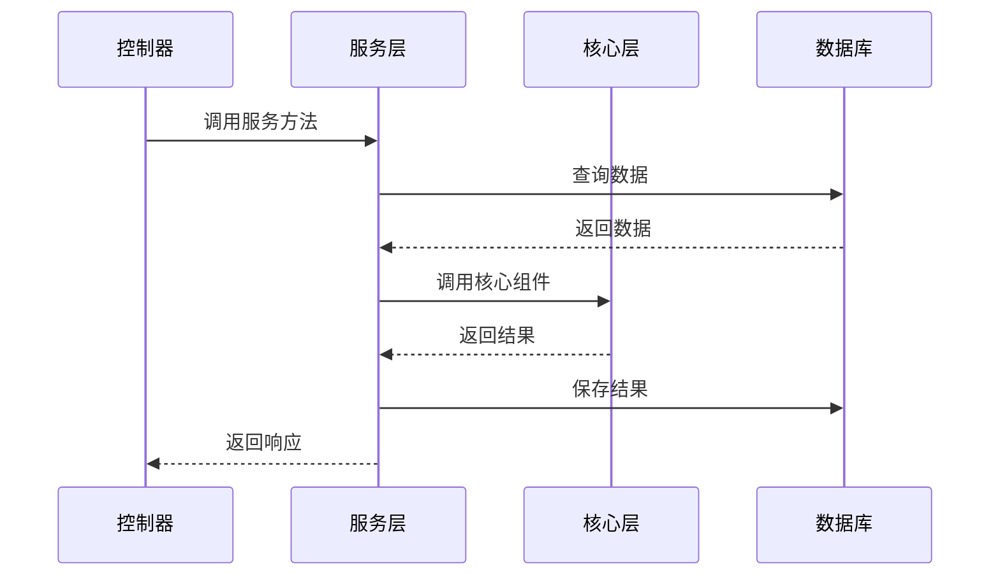
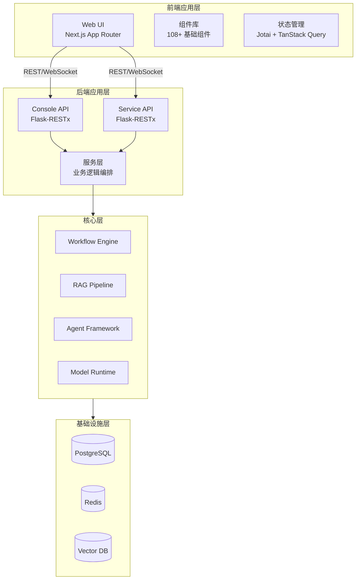

# 应用架构

> **TL;DR**: Dify 应用层采用前后端分离架构，后端基于 Flask + Flask-RESTx 提供 Console API 和 Service API 两套接口，前端基于 Next.js App Router 构建 SPA 应用，通过 REST 和 WebSocket 进行通信。

## 概述

应用层是 Dify 平台的业务逻辑编排层，负责将用户请求转化为对核心层组件的调用。应用层包含三个主要部分：

1. **后端控制器层**：基于 Flask-RESTx 的 RESTful API，分为 Console API（控制台管理）和 Service API（对外服务）
2. **后端服务层**：封装业务逻辑，协调核心层组件
3. **前端应用层**：基于 Next.js App Router 的单页应用，提供可视化工作流编辑器、应用配置界面等

## 详细设计

### 1. 应用层组件

#### 1.1 后端控制器层

Dify 后端提供两套 API 接口，分别服务于不同的使用场景：

**Console API（控制台管理接口）**

- 路径前缀：`/console/api`
- 框架：Flask + Flask-RESTx
- 认证：JWT + Session Cookie
- 用途：控制台管理界面的后端接口

主要控制器模块：

| 模块 | 路径 | 职责 |
|------|------|------|
| `app/` | `controllers/console/app/` | 应用管理（创建、配置、运行） |
| `auth/` | `controllers/console/auth/` | 认证（登录、OAuth、密码重置） |
| `datasets/` | `controllers/console/datasets/` | 知识库管理（文档、分段、检索测试） |
| `workspace/` | `controllers/console/workspace/` | 工作空间管理（成员、模型、插件） |
| `explore/` | `controllers/console/explore/` | 应用探索（推荐应用、已安装应用） |
| `billing/` | `controllers/console/billing/` | 计费管理 |
| `admin/` | `controllers/console/admin/` | 管理员功能 |

**Service API（对外服务接口）**

- 路径前缀：`/v1/`
- 框架：Flask + Flask-RESTx
- 认证：API Key
- 用途：供外部应用调用 Dify 能力

主要接口：

| 接口 | 路径 | 职责 |
|------|------|------|
| 应用 | `/v1/app` | 应用信息查询 |
| 聊天 | `/v1/chat-messages` | 聊天消息发送 |
| 工作流 | `/v1/workflows/run` | 工作流执行 |
| 知识库 | `/v1/datasets` | 知识库操作 |
| 文件 | `/v1/files` | 文件上传下载 |

#### 1.2 后端服务层

服务层封装业务逻辑，协调核心层组件完成具体功能。服务层采用静态方法组织，便于测试和维护。

核心服务模块：

| 服务 | 路径 | 职责 |
|------|------|------|
| `AppService` | `services/app_service.py` | 应用生命周期管理 |
| `WorkflowService` | `services/workflow/` | 工作流编排和执行 |
| `DatasetService` | `services/dataset_service.py` | 知识库管理 |
| `ModelService` | `services/model_` | 模型配置和调用 |
| `AccountService` | `services/account_service.py` | 账户和权限管理 |
| `PluginService` | `services/plugin/` | 插件管理 |

服务层设计原则：

1. **单一职责**：每个服务类负责一个明确的业务领域
2. **无状态**：服务方法不持有状态，通过参数传递上下文
3. **依赖倒置**：服务层依赖核心层接口，而非具体实现
4. **事务管理**：服务层负责数据库事务的提交和回滚

#### 1.3 前端应用层

前端基于 Next.js 14+ App Router 构建，采用 TypeScript 严格模式。

**目录结构：**

```
web/
├── app/                    # Next.js App Router
│   ├── layout.tsx          # 根布局（Providers）
│   ├── components/         # 组件（108 个基础组件）
│   │   ├── base/           # 基础 UI 组件
│   │   ├── app/            # 应用相关组件
│   │   ├── workflow/       # 工作流画布组件
│   │   └── datasets/       # 知识库组件
│   └── [routes]/           # 页面路由
├── contract/               # API 契约（oRPC 类型定义）
├── service/                # API 服务层（55 个 composables）
├── context/                # React Context
├── hooks/                  # 自定义 Hooks
└── i18n/                   # 国际化（23 种语言）
```

**核心组件：**

| 组件类别 | 数量 | 说明 |
|----------|------|------|
| 基础 UI 组件 | 108+ | Button、Input、Modal、Table 等 |
| 工作流组件 | 30+ | 节点编辑器、画布、连线等 |
| 知识库组件 | 20+ | 文档上传、分段预览、检索测试 |
| 应用组件 | 40+ | 应用配置、日志查看、统计分析 |

### 2. 应用层职责

#### 2.1 请求处理

后端应用层负责：

1. **请求验证**：使用 Pydantic 验证请求参数
2. **认证授权**：通过装饰器链进行权限检查
3. **路由分发**：将请求路由到对应的服务方法
4. **响应格式化**：统一响应格式，处理错误

```python
# 典型的控制器方法
@console_ns.route("/apps")
class AppListApi(Resource):
    @setup_required
    @login_required
    @account_initialization_required
    def get(self):
        user, tenant_id = current_account_with_tenant()
        apps = AppService.get_apps(tenant_id=tenant_id, user=user)
        return {"data": apps, "has_more": False}
```

#### 2.2 业务逻辑编排

服务层负责编排核心层组件，完成复杂的业务逻辑：



#### 2.3 UI 渲染

前端应用层负责：

1. **页面路由**：基于 Next.js App Router 的文件系统路由
2. **状态管理**：Jotai（原子状态）+ TanStack Query（服务端状态）
3. **数据获取**：通过 oRPC 契约调用后端 API
4. **交互处理**：用户输入、表单验证、错误处理

### 3. 前后端交互模式

#### 3.1 REST API

主要的交互模式，用于常规的数据查询和操作：

- **请求格式**：JSON
- **响应格式**：JSON
- **认证方式**：JWT Token（Console API）、API Key（Service API）
- **错误处理**：统一错误码和错误消息

#### 3.2 WebSocket

用于实时通信场景：

- **工作流执行状态**：实时推送工作流节点执行状态
- **聊天消息**：流式输出 LLM 生成的文本
- **日志流**：实时推送应用运行日志

#### 3.3 文件上传/下载

用于文件操作：

- **上传**：multipart/form-data
- **下载**：二进制流
- **存储**：S3 兼容对象存储

### 4. API 设计

#### 4.1 API 规范

- **风格**：RESTful
- **版本管理**：URL 路径版本（`/v1/`）
- **分页**：基于 page/page_size 的分页
- **排序**：通过 sort_by/sort_order 参数
- **过滤**：通过查询参数过滤

#### 4.2 错误处理

统一错误响应格式：

```json
{
  "code": "error_code",
  "message": "Error description",
  "status": 400
}
```

常见错误码：

| 错误码 | 含义 | HTTP 状态码 |
|--------|------|-------------|
| `app_not_found` | 应用不存在 | 404 |
| `permission_denied` | 权限不足 | 403 |
| `invalid_parameter` | 参数无效 | 400 |
| `rate_limit_exceeded` | 超出速率限制 | 429 |
| `internal_error` | 内部错误 | 500 |

#### 4.3 速率限制

基于 Redis 的速率限制：

- Console API：按用户限制
- Service API：按 API Key 限制
- 限制维度：每分钟请求数（RPM）、每小时请求数（RPH）

## 附录

### A. 应用架构图



### B. API 清单

**Console API 主要端点：**

| 端点 | 方法 | 描述 |
|------|------|------|
| `/console/api/apps` | GET/POST | 应用列表/创建 |
| `/console/api/apps/<id>` | GET/PUT/DELETE | 应用详情/更新/删除 |
| `/console/api/workflows/run` | POST | 执行工作流 |
| `/console/api/chat-messages` | POST | 发送聊天消息 |
| `/console/api/datasets` | GET/POST | 知识库列表/创建 |
| `/console/api/workspaces/current/members` | GET/POST | 成员管理 |

**Service API 主要端点：**

| 端点 | 方法 | 描述 |
|------|------|------|
| `/v1/chat-messages` | POST | 发送聊天消息 |
| `/v1/workflows/run` | POST | 执行工作流 |
| `/v1/datasets` | GET/POST | 知识库操作 |
| `/v1/files/upload` | POST | 文件上传 |

## 变更日志

| 版本 | 日期 | 作者 | 变更内容 |
|------|------|------|----------|
| 1.0 | 2026-07-19 | AI Assistant | 初始版本 |
