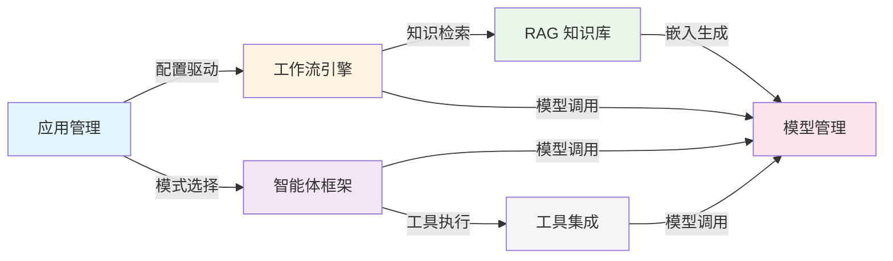
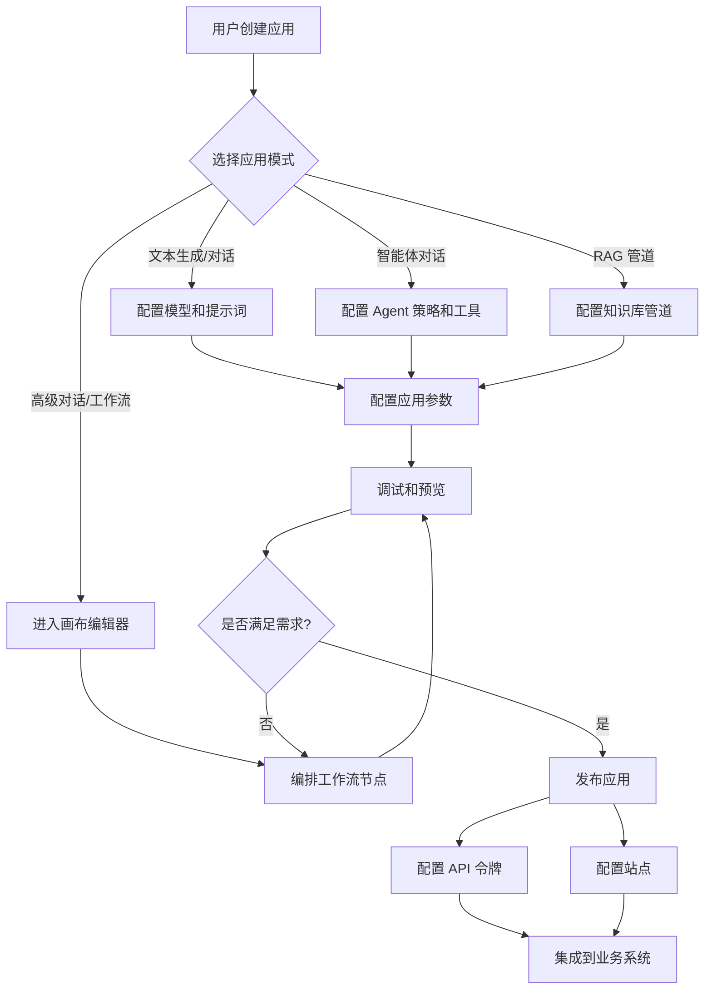
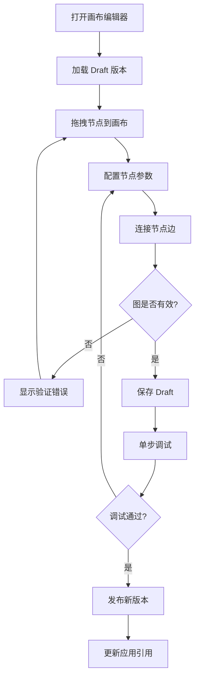
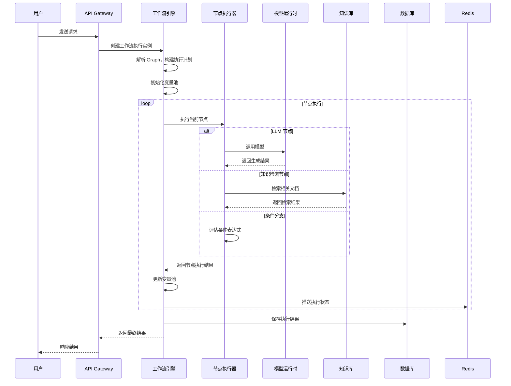
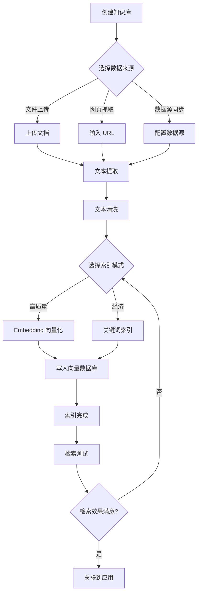

# 业务架构

> **TL;DR**: Dify 围绕五大核心业务领域构建：应用管理、工作流引擎、RAG 知识库、智能体框架和模型管理，通过领域间的协作实现从原型到生产的 AI 应用全生命周期管理。

## 概述

Dify 是一个开源 LLM 应用开发平台，将 AI 工作流编排、RAG 管道、智能体能力和模型管理整合为统一的产品体验。平台面向两类核心用户：构建 AI 应用的开发者和消费应用服务的终端用户。

**核心业务能力：**

- **应用管理**：支持 7 种应用模式，覆盖从简单文本生成到复杂工作流编排的全场景
- **工作流引擎**：可视化画布编排，30 种节点类型，支持同步和异步执行
- **RAG 知识库**：完整的文档摄入到检索增强管道，支持 20+ 向量数据库
- **智能体框架**：Function Calling 和 Chain-of-Thought 双策略，50+ 内置工具
- **模型管理**：数百个模型提供商统一接入，负载均衡和故障转移

**领域交互模型：**



## 详细设计

### 1. 核心业务领域

#### 1.1 应用管理

应用管理是 Dify 的入口领域，负责应用的全生命周期管理。

**应用模式：**

| 模式 | 标识 | 说明 | 典型场景 |
|------|------|------|----------|
| 文本生成 | `completion` | 单次文本生成，无对话上下文 | 翻译、摘要、代码生成 |
| 对话 | `chat` | 基础多轮对话 | 客服机器人、问答助手 |
| 高级对话 | `advanced-chat` | 工作流驱动的对话应用 | 复杂对话逻辑、多步骤推理 |
| 智能体对话 | `agent-chat` | 基于 Agent 策略的对话 | 自主决策、工具调用型助手 |
| 工作流 | `workflow` | 纯工作流应用，无对话上下文 | 数据处理管道、批量任务 |
| 频道 | `channel` | 频道类应用 | 消息分发、广播 |
| RAG 管道 | `rag-pipeline` | 专用知识库构建管道 | 自动化文档摄入 |

**核心实体关系：**

```
App (应用)
├── AppModelConfig (应用模型配置 / 旧结构)
├── Workflow (工作流定义)
│   ├── 版本管理 (draft / published)
│   ├── Graph (节点 + 边)
│   ├── Features (功能开关)
│   ├── EnvironmentVariables (环境变量)
│   └── ConversationVariables (会话变量)
├── Site (站点配置)
├── ApiToken (API 令牌)
└── Annotation (标注数据)
```

**关键能力：**
- 应用创建、编辑、发布、归档
- 应用导入/导出（DSL 格式）
- 应用模板市场
- 站点配置（自定义域名、主题）
- API 令牌管理（速率限制：RPM/RPH）

#### 1.2 工作流引擎

工作流引擎是 Dify 的核心编排能力，提供可视化画布上的节点编排和图执行。

**节点类型（30 种）：**

| 类别 | 节点 | 说明 |
|------|------|------|
| **流程控制** | Start, End, If/Else, Iteration, Loop | 流程分支和循环 |
| **AI 能力** | LLM, Knowledge Retrieval, Parameter Extractor, Question Classifier | 模型调用和知识检索 |
| **数据处理** | Code, HTTP Request, Template Transform, Variable Aggregator, Variable Assigner, List Operator, Document Extractor | 数据转换和处理 |
| **交互** | Answer, Human Input | 用户交互 |
| **触发器** | Trigger Webhook, Trigger Schedule, Trigger Plugin | 异步触发 |
| **工具** | Tool, Agent | 外部工具和智能体 |
| **知识库** | Knowledge Index | 知识库写入 |

**执行模型：**

- **同步执行**：用户请求实时处理，适用于对话和简单工作流
- **异步执行**：通过 Celery 任务队列处理，适用于 Webhook 触发和批量任务
- **CFS 调度**：Completely Fair Scheduler 策略，确保工作流执行的公平调度
- **流式输出**：SSE（Server-Sent Events）实时推送执行状态和中间结果

**版本管理：**
- 每个应用维护一个 `draft` 版本（可编辑）
- 发布时创建带版本号的快照
- 支持版本回滚和对比

#### 1.3 RAG 知识库

RAG（Retrieval-Augmented Generation）知识库提供从文档摄入到检索增强的完整管道。

**管道阶段：**

```
文档上传 → 文本提取 → 文本清洗 → 分块 → 向量化 → 索引存储 → 检索 → 上下文组装
```

**核心能力：**

| 阶段 | 能力 | 实现 |
|------|------|------|
| **文本提取** | PDF、PPT、Word、Excel、HTML、Markdown | unstructured、python-docx、beautifulsoup4 |
| **文本清洗** | 去除噪声、格式标准化 | cleaner 模块 |
| **文本分块** | 固定长度、智能分块、递归分块 | splitter 模块 |
| **向量化** | 调用 Embedding 模型生成向量 | model_runtime 统一调用 |
| **索引存储** | 支持 20+ 向量数据库 | Milvus、Pinecone、Weaviate、Qdrant、PGVector 等 |
| **检索** | 向量检索、关键词检索、混合检索 | retrieval 模块 |
| **重排序** | 二次排序提升精度 | rerank 模块 |
| **后处理** | 结果过滤、格式化 | data_post_processor 模块 |

**索引模式：**
- **高质量模式**：使用 Embedding 模型生成向量，支持语义检索
- **经济模式**：使用关键词索引，成本更低
- **RAG Pipeline 应用**：专用的自动化知识库构建管道

#### 1.4 智能体框架

智能体框架提供自主决策和工具调用能力，支持两种核心策略。

**Agent 策略：**

| 策略 | 标识 | 说明 |
|------|------|------|
| Function Calling | `function-calling` | 模型原生工具调用能力，精度高 |
| Chain of Thought | `chain-of-thought` | 思维链推理，可解释性强 |

**核心组件：**

- **AgentRunner**：智能体执行器，协调推理循环
  - `FcAgentRunner`：Function Calling 策略实现
  - `CotAgentRunner`：Chain of Thought 策略实现
  - `CotChatAgentRunner`：对话模式 CoT
  - `CotCompletionAgentRunner`：补全模式 CoT

- **Scratchpad**：推理过程记录
  - Thought（思考）→ Action（行动）→ Observation（观察）循环
  - 支持最大迭代次数限制（默认 10 次）

- **工具集成**：
  - 50+ 内置工具（Google Search、DALL·E、Stable Diffusion、WolframAlpha 等）
  - 自定义工具（OpenAPI Schema 定义）
  - 插件市场工具

**Agent 在工作流中：**
- Agent 节点可作为工作流中的一个节点使用
- 通过策略解析器（StrategyResolver）动态加载 Agent 策略
- 支持参数映射和凭证管理

#### 1.5 模型管理

模型管理提供统一的模型接入和调用抽象，屏蔽底层模型提供商的差异。

**核心能力：**

| 能力 | 说明 |
|------|------|
| **多提供商接入** | OpenAI、Anthropic、Google、本地模型等数百个提供商 |
| **模型类型** | LLM（对话/补全）、Embedding、Rerank、Speech2Text、Text2Speech、Moderation |
| **负载均衡** | 多模型实例轮询、加权分配 |
| **故障转移** | 主模型失败自动切换备用模型 |
| **成本控制** | Token 使用量追踪、配额管理 |
| **模型状态** | active、no-configure、quota-exceeded、no-permission、disabled、credential-removed |

**接入方式：**
- **预置模型**：平台内置的模型提供商配置
- **自定义模型**：用户自行配置的模型（API Key + 端点）
- **本地部署**：通过 Ollama、vLLM 等本地推理框架

**调用链路：**
```
应用请求 → Model Runtime → Model Provider → 模型 API → 响应解析 → 返回结果
```

### 2. 业务流程

#### 2.1 应用创建流程



#### 2.2 工作流编排流程



**工作流执行流程：**



#### 2.3 知识库构建流程



### 3. 业务规则和约束

#### 3.1 多租户隔离

| 规则 | 说明 |
|------|------|
| 数据隔离 | 所有数据按 `tenant_id` 隔离，查询必须带租户过滤 |
| 资源隔离 | 每个租户独立的模型配额、API 令牌、知识库 |
| 成员权限 | 工作空间级别的成员角色和权限控制 |

#### 3.2 API 访问控制

| 规则 | 说明 |
|------|------|
| 速率限制 | `api_rpm`（每分钟请求数）、`api_rph`（每小时请求数） |
| 令牌管理 | 每个应用独立的 API 令牌，支持创建和撤销 |
| 最大并发 | `max_active_requests` 限制应用的最大并发请求数 |
| CSRF 保护 | 控制台 API 强制 CSRF Token 验证 |

#### 3.3 资源限制

| 资源 | 限制 | 说明 |
|------|------|------|
| 文件大小 | 可配置 | 上传文件的大小限制 |
| 文件数量 | 可配置 | 单次上传的文件数量限制 |
| Token 配额 | 按模型/租户 | 模型调用的 Token 使用量限制 |
| 知识库文档数 | 可配置 | 单个知识库的文档数量限制 |
| 工作流节点数 | 可配置 | 单个工作流的节点数量限制 |
| Agent 迭代次数 | 默认 10 | 智能体最大推理迭代次数 |

#### 3.4 内容安全

| 规则 | 说明 |
|------|------|
| 内容审核 | 支持敏感词过滤和有害内容识别 |
| 自定义规则 | 支持自定义审核规则 |
| 第三方审核 | 集成第三方内容审核服务 |
| 输入/输出过滤 | 对用户输入和模型输出进行双向审核 |

### 4. 业务能力矩阵

| 业务能力 | 状态 | 说明 |
|----------|------|------|
| 应用 CRUD | ✅ 成熟 | 7 种应用模式，完整的生命周期管理 |
| 工作流编排 | ✅ 成熟 | 30 种节点类型，可视化画布 |
| 工作流版本管理 | ✅ 成熟 | Draft + 发布版本，支持回滚 |
| 异步工作流触发 | ✅ 成熟 | Webhook、定时、插件触发 |
| RAG 文档摄入 | ✅ 成熟 | PDF/PPT/Word/HTML/Markdown |
| 向量检索 | ✅ 成熟 | 20+ 向量数据库支持 |
| 混合检索 | ✅ 成熟 | 向量 + 关键词 + 重排序 |
| Function Calling Agent | ✅ 成熟 | 模型原生工具调用 |
| Chain of Thought Agent | ✅ 成熟 | 思维链推理 |
| 模型负载均衡 | ✅ 成熟 | 多实例轮询和加权分配 |
| 模型故障转移 | ✅ 成熟 | 自动切换备用模型 |
| 工具集成 | ✅ 成熟 | 50+ 内置工具 + 自定义工具 |
| 插件系统 | ✅ 成熟 | 插件市场，第三方扩展 |
| 内容审核 | ✅ 成熟 | 敏感词 + 第三方审核 |
| 应用导入/导出 | ✅ 成熟 | DSL 格式 |
| 应用模板市场 | ✅ 成熟 | 推荐应用和模板 |
| LLMOps 监控 | ✅ 成熟 | 日志、追踪、标注 |
| MCP 服务器 | ✅ 新增 | Model Context Protocol 支持 |
| 多模态支持 | ✅ 成熟 | 图片、音频、视频处理 |
| 人类输入节点 | ✅ 成熟 | 工作流中的人工干预 |

## 附录

### A. 业务流程图汇总

本文档包含以下 Mermaid 流程图：

1. **领域交互模型**：展示五大核心业务领域之间的协作关系
2. **应用创建流程**：从创建应用到集成上线的完整流程
3. **工作流编排流程**：画布编辑到版本发布的工作流
4. **工作流执行流程**：运行时节点执行的时序图
5. **知识库构建流程**：从数据摄入到检索测试的完整管道

### B. 业务能力清单

**应用管理能力：**
- 应用 CRUD（创建、读取、更新、删除）
- 应用模式切换
- 应用导入/导出（DSL）
- 应用模板市场
- 站点配置和自定义域名
- API 令牌管理

**工作流能力：**
- 30 种节点类型
- 可视化画布编排
- 版本管理（Draft + Published）
- 同步/异步执行
- 流式输出（SSE）
- 单步调试
- 环境变量和会话变量
- Webhook/定时/插件触发

**RAG 能力：**
- 多格式文档解析（PDF/PPT/Word/Excel/HTML/Markdown）
- 智能文本分块
- Embedding 向量化
- 20+ 向量数据库支持
- 向量检索 + 关键词检索 + 混合检索
- 重排序（Rerank）
- 检索测试（Hit Testing）

**智能体能力：**
- Function Calling 策略
- Chain of Thought 策略
- 50+ 内置工具
- 自定义工具（OpenAPI Schema）
- 推理过程记录（Scratchpad）
- 最大迭代控制

**模型管理能力：**
- 数百个模型提供商
- 多模型类型（LLM/Embedding/Rerank/TTS/STT/Moderation）
- 负载均衡
- 故障转移
- Token 配额管理
- 模型状态监控

## 变更日志

| 版本 | 日期 | 作者 | 变更内容 |
|------|------|------|----------|
| 1.0 | 2026-07-19 | AI Assistant | 初始版本 |
