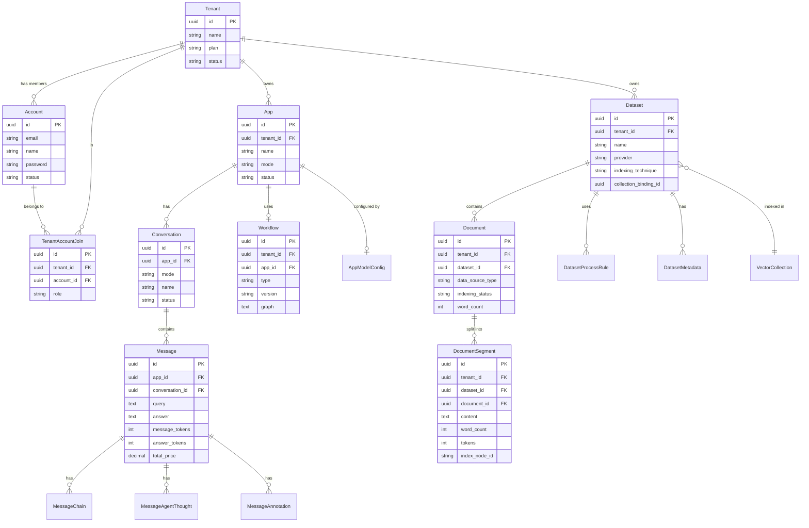

# 数据架构

> **TL;DR**: Dify 采用 PostgreSQL（或 MySQL）作为主数据库存储业务数据，Redis 作为缓存和消息队列，支持 30+ 种向量数据库用于 RAG 场景的向量存储与检索。

## 概述

Dify 的数据架构围绕三个核心存储层构建：

1. **关系型数据库**：存储应用配置、用户数据、对话记录、知识库元数据等业务数据
2. **向量数据库**：存储文档向量嵌入，支持语义检索
3. **对象存储**：存储上传文件、图片等二进制资源

所有业务数据按租户（Tenant）隔离，确保多租户环境下的数据安全。

## 详细设计

### 1. 数据模型

Dify 的数据模型分为五大领域：用户与权限、应用与工作流、对话与消息、知识库与文档、工具与扩展。

#### 1.1 用户与权限

| 实体 | 表名 | 说明 |
|------|------|------|
| `Account` | `accounts` | 用户账号，包含邮箱、密码、头像、语言偏好等 |
| `Tenant` | `tenants` | 工作空间（租户），包含名称、计划、状态 |
| `TenantAccountJoin` | `tenant_account_joins` | 用户与工作空间的多对多关系，记录角色（owner/admin/editor/dataset_editor） |

**核心字段：**

- `Account.id`：用户唯一标识（UUID）
- `Account.email`：登录邮箱，建有索引
- `Tenant.plan`：订阅计划（basic/pro/enterprise）
- `TenantAccountJoin.role`：用户在工作空间中的角色

#### 1.2 应用与工作流

| 实体 | 表名 | 说明 |
|------|------|------|
| `App` | `apps` | 应用定义，包含名称、模式、图标、状态 |
| `Workflow` | `workflows` | 工作流定义，存储画布配置（JSON）和特性 |
| `AppModelConfig` | `app_model_configs` | 应用模型配置（提示词、参数等） |

**App 模式（AppMode）：**

- `chat`：对话型应用
- `completion`：文本生成应用
- `workflow`：工作流应用
- `agent-chat`：Agent 对话应用
- `advanced-chat`：高级对话应用（基于工作流）

**Workflow 核心字段：**

- `graph`：工作流画布配置（JSON），包含节点和边的完整定义
- `version`：版本号，`draft` 表示草稿，其他为发布版本
- `features`：应用特性配置（文件上传、建议问题等）
- `environment_variables`：环境变量（加密存储）

#### 1.3 对话与消息

| 实体 | 表名 | 说明 |
|------|------|------|
| `Conversation` | `conversations` | 对话会话，关联应用和用户 |
| `Message` | `messages` | 单条消息，包含用户输入和 AI 回复 |
| `MessageChain` | `message_chains` | 消息处理链（工具调用、知识库检索等） |
| `MessageAgentThought` | `message_agent_thoughts` | Agent 思考过程记录 |
| `MessageAnnotation` | `message_annotations` | 消息标注（用于改进模型） |

**Message 核心字段：**

- `query`：用户输入
- `answer`：AI 回复
- `message_tokens` / `answer_tokens`：Token 消耗
- `total_price`：本次调用的费用
- `provider_response_latency`：模型响应延迟
- `status`：消息状态（normal/hidden）

#### 1.4 知识库与文档

| 实体 | 表名 | 说明 |
|------|------|------|
| `Dataset` | `datasets` | 知识库定义，包含名称、索引策略、检索配置 |
| `Document` | `documents` | 知识库中的文档，记录处理状态和元数据 |
| `DocumentSegment` | `document_segments` | 文档分段（Chunk），存储文本内容和向量索引 |
| `DatasetProcessRule` | `dataset_process_rules` | 文档处理规则（分段策略、预处理规则） |
| `DatasetMetadata` | `dataset_metadatas` | 知识库元数据定义 |

**Document 处理状态流转：**

```
waiting → parsing → cleaning → splitting → indexing → completed
                                    ↓
                                  paused / error
```

**DocumentSegment 核心字段：**

- `content`：分段文本内容
- `word_count` / `tokens`：字数和 Token 数
- `index_node_id`：向量数据库中的节点 ID
- `index_node_hash`：内容哈希（用于增量更新）
- `hit_count`：被检索命中的次数
- `keywords`：关键词（用于混合检索）

#### 1.5 工具与扩展

| 实体 | 表名 | 说明 |
|------|------|------|
| `ToolProvider` | `tool_providers` | 工具提供者（内置/自定义/API） |
| `ApiBasedExtension` | `api_based_extensions` | API 扩展 |
| `OAuthApp` | `oauth_apps` | OAuth 应用配置 |

### 2. 数据库设计

#### 2.1 主数据库

Dify 支持两种关系型数据库：

| 数据库 | 版本 | 说明 |
|--------|------|------|
| **PostgreSQL** | 15+ | 默认选择，推荐生产环境使用 |
| **MySQL** | 8.0+ | 可选替代方案 |

**PostgreSQL 配置参数（Docker 部署）：**

```yaml
max_connections: 100
shared_buffers: 128MB
work_mem: 4MB
maintenance_work_mem: 64MB
effective_cache_size: 4096MB
statement_timeout: 0  # 无超时限制
```

#### 2.2 索引策略

Dify 在关键查询路径上建立了丰富的索引：

**Account 表：**
- `account_email_idx`：邮箱索引，用于登录查询

**App 表：**
- `app_tenant_id_idx`：租户索引，用于按工作空间过滤

**Dataset 表：**
- `dataset_tenant_idx`：租户索引
- `retrieval_model_idx`：检索模型 JSON 索引

**Document 表：**
- `document_dataset_id_idx`：知识库索引
- `document_tenant_idx`：租户索引
- `document_is_paused_idx`：暂停状态索引
- `document_metadata_idx`：元数据 JSON 索引

**DocumentSegment 表：**
- `document_segment_dataset_id_idx`：知识库索引
- `document_segment_document_id_idx`：文档索引
- `document_segment_tenant_dataset_idx`：租户 + 知识库复合索引
- `document_segment_node_dataset_idx`：节点 + 知识库复合索引

**Message 表：**
- `message_app_id_idx`：应用 + 创建时间复合索引
- `message_conversation_id_idx`：对话索引
- `message_end_user_idx`：终端用户索引
- `message_workflow_run_id_idx`：工作流运行索引

#### 2.3 缓存层

**Redis** 用于：

- 会话缓存（Session）
- Celery 消息队列 Broker
- 速率限制计数器
- 临时数据存储

**Redis 配置（Docker 部署）：**

```yaml
image: redis:6-alpine
requirepass: ${REDIS_PASSWORD}
maxmemory: 根据部署配置
```

### 3. 向量数据库集成

Dify 支持 30+ 种向量数据库，通过统一的 `VectorBase` 抽象层实现插件化集成。

#### 3.1 支持的向量数据库

| 类别 | 向量数据库 | 说明 |
|------|-----------|------|
| **专用向量数据库** | Weaviate、Qdrant、Milvus、Chroma | 原生向量检索引擎 |
| **PostgreSQL 扩展** | PGVector、PGVecto.rs | 基于 PG 的向量扩展 |
| **搜索引擎** | ElasticSearch、OpenSearch | 全文检索 + 向量检索 |
| **云原生数据库** | AnalyticDB、Tencent、Baidu、Huawei Cloud | 云厂商向量检索服务 |
| **分布式数据库** | TiDB、OceanBase、Couchbase、MatrixOne | 支持向量的分布式数据库 |
| **其他** | Oracle、IRIS、Lindorm、Upstash、VikingDB、Relyt、Tablestore、ClickZetta、Hologres、openGauss、Vastbase、MyScale | 各类支持向量的数据库 |

#### 3.2 向量数据库抽象层

```python
# api/core/rag/datasource/vdb/vector_base.py
class VectorBase(ABC):
    @abstractmethod
    def create(self, collection_name: str, dimension: int): ...
    
    @abstractmethod
    def add_documents(self, collection_name: str, documents: list[Document]): ...
    
    @abstractmethod
    def search(self, collection_name: str, query_vector: list[float], top_k: int) -> list[Document]: ...
    
    @abstractmethod
    def delete(collection_name: str, document_ids: list[str]): ...
```

#### 3.3 向量存储配置

每个知识库（Dataset）关联一个向量集合（Collection），命名规则：

```
{VECTOR_INDEX_NAME_PREFIX}_{dataset_id_normalized}_Node
```

例如：`Vector_index_abc123def456_Node`

**索引配置：**

- `embedding_model`：嵌入模型（如 `text-embedding-ada-002`）
- `embedding_model_provider`：嵌入模型提供商
- `collection_binding_id`：向量集合绑定 ID
- `indexing_technique`：索引技术（`high_quality` / `economy`）

#### 3.4 检索策略

Dify 支持多种检索策略：

| 策略 | 说明 |
|------|------|
| **语义检索** | 基于向量相似度的检索 |
| **全文检索** | 基于关键词的全文检索 |
| **混合检索** | 语义 + 全文的混合检索，支持 Reranking |

**检索配置（retrieval_model）：**

```json
{
  "search_method": "semantic_search",
  "reranking_enable": false,
  "reranking_model": {
    "reranking_provider_name": "",
    "reranking_model_name": ""
  },
  "top_k": 2,
  "score_threshold_enabled": false,
  "score_threshold": 0.0
}
```

### 4. 数据流和数据存储

#### 4.1 数据流向

```
┌─────────────────────────────────────────────────────────────────┐
│                        用户请求                                  │
└───────────────────────────┬─────────────────────────────────────┘
                            │
                            ▼
┌─────────────────────────────────────────────────────────────────┐
│                      API 服务层                                  │
│  ┌─────────────┐  ┌─────────────┐  ┌─────────────────────────┐ │
│  │ Controller  │→ │  Service    │→ │  Core / Domain          │ │
│  └─────────────┘  └─────────────┘  └─────────────────────────┘ │
└───────────────────────────┬─────────────────────────────────────┘
                            │
            ┌───────────────┼───────────────┐
            │               │               │
            ▼               ▼               ▼
┌───────────────┐  ┌───────────────┐  ┌───────────────┐
│  PostgreSQL   │  │    Redis      │  │  向量数据库    │
│  (业务数据)   │  │  (缓存/队列)  │  │  (向量存储)   │
└───────────────┘  └───────────────┘  └───────────────┘
                            │
                            ▼
┌─────────────────────────────────────────────────────────────────┐
│                    对象存储（可选）                                │
│         Local / S3 / Azure Blob / GCS / OSS 等                  │
└─────────────────────────────────────────────────────────────────┘
```

#### 4.2 RAG 数据流

```
文档上传 → 文本提取 → 文本清洗 → 分段 → 向量化 → 写入向量数据库
                                              ↓
用户查询 → 查询向量化 → 向量检索 → Reranking → 返回结果
```

**详细流程：**

1. **文档上传**：用户上传文档到对象存储，创建 Document 记录
2. **文本提取**：根据文档类型（PDF/DOCX/TXT 等）提取纯文本
3. **文本清洗**：应用预处理规则（去除多余空格、URL、邮箱等）
4. **分段**：按配置的分段策略将文本切分为 Chunk
5. **向量化**：调用 Embedding 模型生成向量
6. **写入向量数据库**：将向量和文本存储到向量数据库

#### 4.3 对话数据流

```
用户输入 → 创建 Message → 调用模型 → 流式响应 → 保存完整回复
                    ↓
              记录 MessageChain（工具调用、知识库检索等）
                    ↓
              记录 MessageAgentThought（Agent 思考过程）
```

#### 4.4 存储策略

**对象存储配置：**

| 存储类型 | 说明 |
|---------|------|
| `local` | 本地文件系统（默认） |
| `s3` | Amazon S3 或兼容存储 |
| `azure-blob` | Azure Blob Storage |
| `gcs` | Google Cloud Storage |
| `aliyun-oss` | 阿里云对象存储 |
| `tencent-cos` | 腾讯云对象存储 |
| `huawei-obs` | 华为云对象存储 |
| `volcengine-tos` | 火山引擎对象存储 |

**文件存储路径：**

```
{STORAGE_PATH}/
├── upload_files/          # 用户上传文件
├── tool_files/            # 工具生成的文件
└── dataset_files/         # 知识库相关文件
```

## 附录

### A. ER 图



### B. 核心表清单

| 表名 | 所属领域 | 主要用途 |
|------|---------|---------|
| `accounts` | 用户 | 用户账号信息 |
| `tenants` | 用户 | 工作空间/租户 |
| `tenant_account_joins` | 用户 | 用户与工作空间关系 |
| `apps` | 应用 | 应用定义 |
| `app_model_configs` | 应用 | 应用模型配置 |
| `workflows` | 应用 | 工作流定义 |
| `conversations` | 对话 | 对话会话 |
| `messages` | 对话 | 消息记录 |
| `message_chains` | 对话 | 消息处理链 |
| `message_agent_thoughts` | 对话 | Agent 思考记录 |
| `message_annotations` | 对话 | 消息标注 |
| `datasets` | 知识库 | 知识库定义 |
| `documents` | 知识库 | 文档记录 |
| `document_segments` | 知识库 | 文档分段 |
| `dataset_process_rules` | 知识库 | 处理规则 |
| `dataset_metadatas` | 知识库 | 元数据定义 |
| `tool_providers` | 工具 | 工具提供者 |
| `api_based_extensions` | 扩展 | API 扩展 |
| `oauth_apps` | 扩展 | OAuth 应用 |

### C. 向量数据库对照表

| 向量数据库 | Docker Profile | 默认端口 | 说明 |
|-----------|---------------|---------|------|
| Weaviate | `weaviate` | 8080 | 默认选择 |
| Qdrant | `qdrant` | 6333 | 高性能向量数据库 |
| Milvus | `milvus` | 19530 | 需要 etcd + minio |
| PGVector | `pgvector` | 5432 | PostgreSQL 扩展 |
| Chroma | `chroma` | 8000 | 轻量级向量数据库 |
| ElasticSearch | `elasticsearch` | 9200 | 全文 + 向量检索 |
| OpenSearch | `opensearch` | 9200 | AWS 开源搜索 |
| MyScale | `myscale` | 8123 | 基于 ClickHouse |
| OceanBase | `oceanbase` | 2881 | 蚂蚁分布式数据库 |
| Couchbase | `couchbase` | 8091 | NoSQL + 向量 |
| Oracle | `oracle` | 1521 | 企业级数据库 |

## 变更日志

| 版本 | 日期 | 变更内容 |
|------|------|---------|
| 1.0 | 2026-07-19 | 初始版本，涵盖数据模型、数据库设计、向量数据库集成、数据流 |
