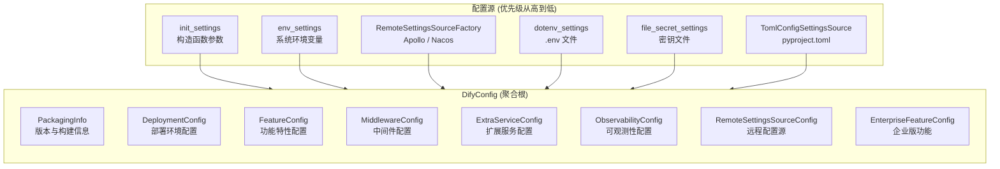
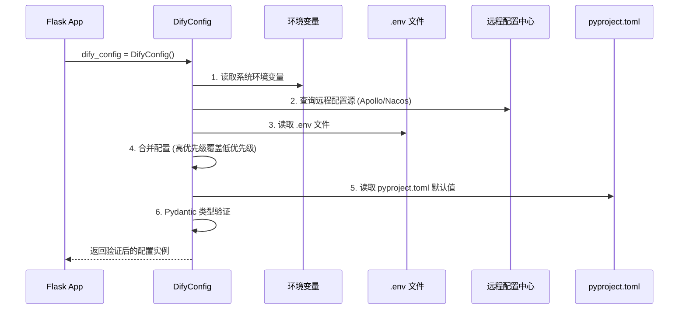
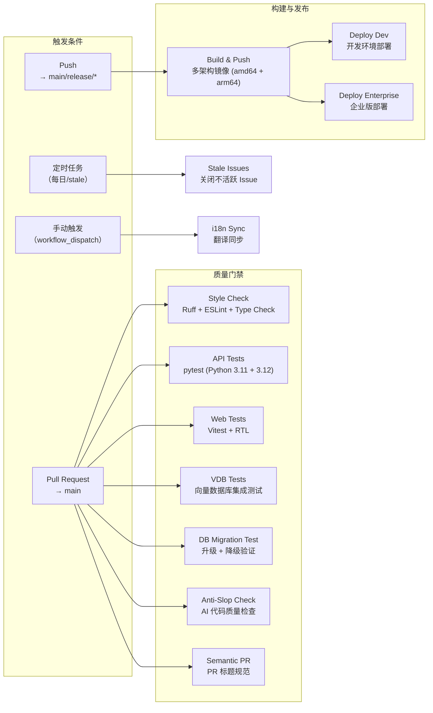
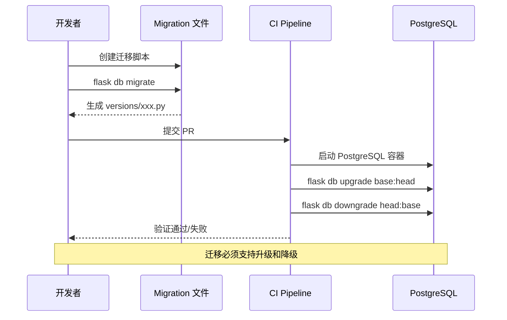
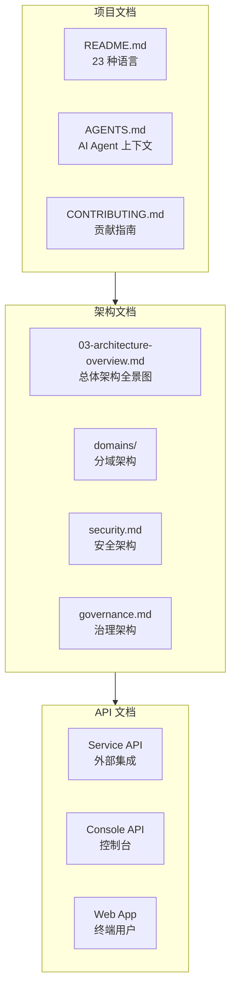
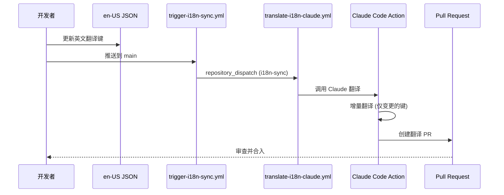
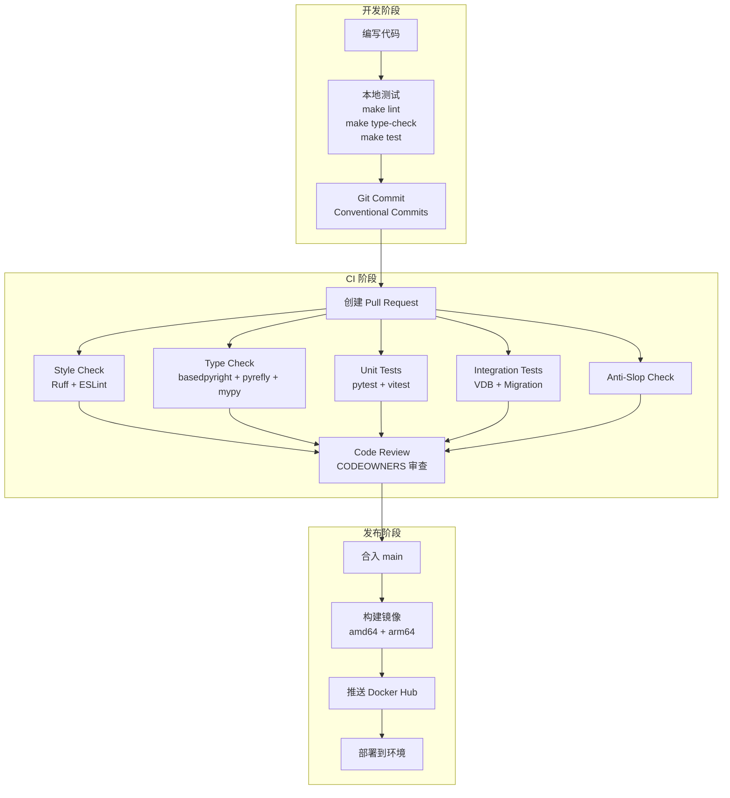

# 治理架构

> **TL;DR**: Dify 通过 Pydantic 分层配置体系、23 个 GitHub Actions 自动化工作流、CODEOWNERS 代码所有权机制和多语言文档体系，实现从配置管理、变更控制到合规审计的全链路治理。

## 概述

Dify 的治理架构围绕三个核心目标设计：确保 680+ 配置项在不同环境下正确生效（配置管理），确保代码变更经过自动化验证和安全审查后合入主干（变更管理），确保系统行为可追溯、合规要求可满足（合规与审计）。

治理机制贯穿 Dify 的整个生命周期，从开发环境的配置加载，到 CI/CD 流水线的质量门禁，再到生产环境的版本发布和回滚，每个环节都有对应的控制点。

**核心治理原则：**

- **配置即代码**：所有配置通过 Pydantic 模型定义，类型安全、可验证、有文档
- **自动化优先**：CI/CD 流水线覆盖代码风格、类型检查、测试、构建、发布全流程
- **所有权明确**：CODEOWNERS 定义每个模块的负责人，变更需经对应 owner 审查
- **多语言覆盖**：23 种语言的文档和界面，通过自动化翻译保持同步

## 详细设计

### 1. 配置管理

Dify 的配置管理体系以 Pydantic v2 Settings 为核心，支持多源配置加载、远程配置中心集成和严格的类型验证。

#### 1.1 配置分层架构



**配置分组：**

| 配置组 | 目录 | 职责 | 典型配置项 |
|--------|------|------|-----------|
| PackagingInfo | `configs/packaging/` | 版本与构建信息 | `COMMIT_SHA`, 版本号 |
| DeploymentConfig | `configs/deploy/` | 部署环境 | `EDITION`, `DEPLOY_ENV`, `DEBUG` |
| FeatureConfig | `configs/feature/` | 功能特性 | `SECRET_KEY`, 速率限制, 邮件配置 |
| MiddlewareConfig | `configs/middleware/` | 中间件连接 | 数据库、Redis、存储、向量库 |
| ExtraServiceConfig | `configs/extra/` | 扩展服务 | Sentry, Notion, 归档存储 |
| ObservabilityConfig | `configs/observability/` | 可观测性 | OpenTelemetry, tracing |
| RemoteSettingsSourceConfig | `configs/remote_settings_sources/` | 远程配置中心 | Apollo, Nacos |
| EnterpriseFeatureConfig | `configs/enterprise/` | 企业版功能 | `ENTERPRISE_ENABLED`, Logo 定制 |

#### 1.2 配置加载流程



**配置源优先级（从高到低）：**

1. **init_settings**：构造函数传入的参数（最高优先级）
2. **env_settings**：系统环境变量
3. **RemoteSettingsSourceFactory**：远程配置中心（Apollo / Nacos）
4. **dotenv_settings**：`.env` 文件
5. **file_secret_settings**：密钥文件（Docker secrets）
6. **TomlConfigSettingsSource**：`pyproject.toml` 中的默认值（最低优先级）

#### 1.3 远程配置中心

Dify 支持通过 `REMOTE_SETTINGS_SOURCE_NAME` 环境变量启用远程配置中心，目前支持两种实现：

| 配置中心 | 实现类 | 适用场景 |
|---------|--------|---------|
| Apollo | `ApolloSettingsSource` | 企业级配置管理，支持灰度发布 |
| Nacos | `NacosSettingsSource` | 微服务配置管理，支持动态刷新 |

远程配置源通过 `RemoteSettingsSourceFactory` 动态加载，根据 `REMOTE_SETTINGS_SOURCE_NAME` 的值选择对应的实现。未配置或配置不支持的值时，工厂返回空配置，不影响其他配置源的加载。

#### 1.4 中间件配置

`MiddlewareConfig` 是配置体系中最大的分组，涵盖 20+ 种向量数据库、20+ 种对象存储和多种缓存/消息队列的配置。

**向量数据库配置（部分）：**

| 向量数据库 | 配置类 | 关键配置项 |
|-----------|--------|-----------|
| Weaviate | `WeaviateConfig` | `WEAVIATE_ENDPOINT`, `WEAVIATE_API_KEY` |
| Milvus | `MilvusConfig` | `MILVUS_URI`, `MILVUS_TOKEN` |
| Qdrant | `QdrantConfig` | `QDRANT_URL`, `QDRANT_API_KEY` |
| PGVector | `PGVectorConfig` | 复用 PostgreSQL 连接配置 |
| ElasticSearch | `ElasticsearchConfig` | `ES_URL`, `ES_USERNAME`, `ES_PASSWORD` |
| Chroma | `ChromaConfig` | `CHROMA_HOST`, `CHROMA_PORT` |

**对象存储配置（部分）：**

| 存储后端 | 配置类 | 关键配置项 |
|---------|--------|-----------|
| 本地存储 | `OpenDALStorageConfig` | `STORAGE_TYPE=local` |
| S3 | `S3StorageConfig` | `S3_BUCKET_NAME`, `S3_REGION` |
| Azure Blob | `AzureBlobStorageConfig` | `AZURE_BLOB_ACCOUNT_NAME`, `AZURE_BLOB_ACCOUNT_KEY` |
| 阿里云 OSS | `AliyunOSSStorageConfig` | `ALIYUN_OSS_BUCKET_NAME`, `ALIYUN_OSS_ACCESS_KEY` |
| Google Cloud | `GoogleCloudStorageConfig` | `GOOGLE_STORAGE_BUCKET_NAME` |

#### 1.5 环境变量模板

Dify 在 `docker/.env.example` 中提供 680+ 环境变量的完整模板，按功能分组：

```
docker/.env.example
├── Common Variables          # 通用变量（URL、域名）
├── Server Configuration      # 服务器配置（日志、调试）
├── Database Configuration    # 数据库连接
├── Redis Configuration       # Redis 连接
├── Celery Configuration      # 异步任务队列
├── Storage Configuration     # 对象存储
├── Vector Database           # 向量数据库
├── CORS Configuration        # 跨域配置
├── OpenTelemetry             # 可观测性
└── ... (更多分组)
```

**环境同步工具：**

升级 Dify 时，可使用 `dify-env-sync.sh` 脚本将 `.env.example` 中新增的变量同步到现有 `.env` 文件，保留用户自定义值：

```bash
# 同步环境变量（保留现有值，仅添加新变量）
./dify-env-sync.sh
```

### 2. 变更管理

Dify 通过 23 个 GitHub Actions 工作流实现从代码提交到生产发布的全自动化变更管理。

#### 2.1 CI/CD 流水线总览



#### 2.2 核心工作流

**Main CI Pipeline (`main-ci.yml`)：**

主 CI 流水线通过路径过滤实现按需执行，避免无关变更触发不必要的测试：

| 路径变更 | 触发的测试 |
|---------|-----------|
| `api/**`, `docker/**` | API Tests |
| `web/**` | Web Tests |
| `api/core/rag/datasource/**` | VDB Tests |
| `api/migrations/**` | DB Migration Test |
| 任意变更 | Style Check |

**Style Check (`style.yml`)：**

代码风格检查覆盖后端和前端，包含多个维度的验证：

| 检查项 | 工具 | 范围 |
|--------|------|------|
| Python 格式化 | Ruff | `api/` |
| Python 类型检查 | basedpyright + pyrefly + mypy | `api/` |
| Python import 顺序 | import-linter | `api/` |
| 环境变量规范 | dotenv-linter | `.env.example` |
| 前端格式化 | ESLint + Prettier | `web/` |
| 前端类型检查 | TypeScript | `web/` |

**Anti-Slop PR Check (`anti-slop.yml`)：**

自动化检查 AI 生成代码的质量，识别常见的 AI 代码异味（slop），确保代码符合项目标准：

```yaml
# 检查 AI 代码质量
- uses: peakoss/anti-slop@v0.2.1
  with:
    github-token: ${{ secrets.GITHUB_TOKEN }}
    close-pr: false
    failure-add-pr-labels: "needs-revision"
```

**Semantic Pull Request (`semantic-pull-request.yml`)：**

强制 PR 标题遵循 Conventional Commits 规范，确保变更历史可读：

```
feat: 新功能描述
fix: 修复的问题描述
docs: 文档变更
style: 代码格式调整
refactor: 重构
test: 测试相关
chore: 构建/工具变更
```

#### 2.3 构建与发布

**多架构镜像构建 (`build-push.yml`)：**

Dify 的 API 和 Web 镜像支持 `linux/amd64` 和 `linux/arm64` 双架构，推送到 Docker Hub：

| 镜像 | 标签规则 | 架构 |
|------|---------|------|
| `langgenius/dify-api` | `main`, `release/*`, `hotfix/*`, tags | amd64 + arm64 |
| `langgenius/dify-web` | `main`, `release/*`, `hotfix/*`, tags | amd64 + arm64 |

**发布分支策略：**

| 分支模式 | 用途 | 示例 |
|---------|------|------|
| `main` | 主干开发，每日构建 | `main` |
| `release/*` | 发布分支 | `release/v1.0.0` |
| `hotfix/*` | 热修复 | `hotfix/fix-critical-bug` |
| `deploy/*` | 部署配置 | `deploy/production` |
| `build/*` | 构建测试 | `build/test-arm64` |

#### 2.4 数据库迁移管理

数据库迁移通过 Alembic/Flask-Migrate 管理，CI 中验证迁移的可逆性：



**迁移验证规则：**

1. **升级测试**：从 `base` 到 `head` 的完整升级必须成功
2. **降级测试**：从 `head` 到 `base` 的完整降级必须成功
3. **离线支持**：迁移脚本必须支持 `--sql` 模式（离线生成 SQL）

#### 2.5 依赖管理

**Dependabot 配置 (`dependabot.yml`)：**

Dify 使用 Dependabot 自动更新依赖，按功能分组减少 PR 数量：

| 生态系统 | 更新频率 | PR 限制 | 分组策略 |
|---------|---------|---------|---------|
| pip | 每周 | 10 | flask, google, opentelemetry, pydantic, llm, database, storage, vdb, dev |
| uv | 每周 | 10 | 同 pip 分组 |
| github-actions | 每周 | 5 | 所有 actions 合并为一个 PR |

**依赖分组示例：**

```yaml
groups:
  flask:
    patterns: ["flask", "flask-*", "werkzeug", "gunicorn"]
  database:
    patterns: ["sqlalchemy", "psycopg2*", "redis*", "alembic*"]
  vdb:
    patterns: ["chromadb", "pymilvus", "qdrant-client", "weaviate-*", ...]
```

#### 2.6 代码所有权

**CODEOWNERS 机制：**

Dify 通过 `.github/CODEOWNERS` 定义每个模块的负责人，PR 变更自动请求对应 owner 审查：

| 模块 | Owner | 职责 |
|------|-------|------|
| `*` (默认) | `@crazywoola @laipz8200 @Yeuoly` | 全局审查 |
| `/api/` | `@QuantumGhost` | 后端默认 |
| `/api/core/mcp/` | `@Nov1c444` | MCP 协议 |
| `/api/core/rag/` | `@JohnJyong` | RAG 管道 |
| `/api/core/plugin/` | `@Mairuis @Yeuoly @Stream29` | 插件系统 |
| `/api/core/workflow/` | `@laipz8200 @QuantumGhost` | 工作流引擎 |
| `/web/` | `@iamjoel` | 前端默认 |
| `/docker/` | `@laipz8200` | Docker 部署 |
| `/docs/` | `@crazywola` | 文档 |

#### 2.7 Issue 和 PR 管理

**Stale 管理 (`stale.yml`)：**

自动关闭不活跃的 Issue 和 PR，保持仓库整洁：

| 类型 | 标记 stale | 关闭 | 触发条件 |
|------|-----------|------|---------|
| Issue | 15 天无活动 | 标记后 3 天 | 标签包含 `duplicate`, `question`, `invalid` 等 |
| PR | 15 天无活动 | 标记后 3 天 | 标签包含 `no-pr-activity` 等 |

**PR 模板 (`pull_request_template.md`)：**

PR 必须包含以下内容：

```markdown
## Summary
<!-- 变更摘要和关联 Issue -->

## Screenshots
<!-- Before/After 对比 -->

## Checklist
- [ ] 需要更新文档
- [ ] 已添加测试
- [ ] 已运行 make lint 和 make type-check
```

### 3. 合规和审计

#### 3.1 合规要求

Dify 提供 EU AI Act 合规指南（`docs/eu-ai-act-compliance.md`），帮助欧盟地区用户满足 AI 法案要求。

**合规文档体系：**

| 文档 | 位置 | 内容 |
|------|------|------|
| EU AI Act 合规 | `docs/eu-ai-act-compliance.md` | 欧盟 AI 法案合规指南 |
| 安全架构 | `docs/architecture/domains/security.md` | 认证、授权、加密、审计 |
| 数据架构 | `docs/architecture/domains/data.md` | 数据模型、存储、迁移 |

#### 3.2 审计追踪

Dify 的审计能力通过以下机制实现：

**操作日志：**

- **请求日志**：通过 `ENABLE_REQUEST_LOGGING` 启用，记录所有 HTTP 请求和响应
- **应用日志**：结构化日志输出到 `LOG_FILE`，支持 JSON 格式
- **Celery 任务日志**：异步任务执行记录，包含任务 ID、状态、耗时

**数据库审计：**

- **租户隔离**：所有数据操作强制限定 `tenant_id`，防止跨租户访问
- **模型变更**：通过 Alembic 迁移记录数据库 schema 变更历史
- **版本追踪**：`COMMIT_SHA` 记录构建时的 Git commit，便于问题追溯

**可观测性集成：**

| 工具 | 集成方式 | 用途 |
|------|---------|------|
| OpenTelemetry | `ENABLE_OTEL=true` | 分布式追踪、指标收集 |
| Langfuse | 内置集成 | LLM 应用可观测性 |
| Opik | 内置集成 | LLM 应用可观测性 |
| Arize Phoenix | 内置集成 | LLM 应用可观测性 |
| Sentry | `SENTRY_DSN` | 错误追踪 |

### 4. 文档和知识管理

#### 4.1 文档体系

Dify 的文档体系分为三个层次：



**多语言支持：**

| 语言 | 目录 | 维护方式 |
|------|------|---------|
| 英语 | `README.md` | 手动维护 |
| 简体中文 | `docs/zh-CN/` | 自动翻译 + 手动校对 |
| 繁体中文 | `docs/zh-TW/` | 自动翻译 |
| 日语 | `docs/ja-JP/` | 自动翻译 |
| 韩语 | `docs/ko-KR/` | 自动翻译 |
| 西班牙语 | `docs/es-ES/` | 自动翻译 |
| 法语 | `docs/fr-FR/` | 自动翻译 |
| ... | ... | ... |

#### 4.2 AI Agent 知识管理

Dify 通过 `AGENTS.md` 文件为 AI 编码助手提供项目上下文：

| 文件 | 位置 | 内容 |
|------|------|------|
| 根 AGENTS.md | `./AGENTS.md` | 项目概览、结构、约定 |
| API AGENTS.md | `api/AGENTS.md` | 后端架构、编码规范 |
| Web AGENTS.md | `web/AGENTS.md` | 前端架构、组件规范 |
| Docker AGENTS.md | `docker/AGENTS.md` | 部署架构、Compose 规范 |

**AGENTS.md 内容结构：**

```markdown
# API KNOWLEDGE BASE

## STRUCTURE
# 目录结构和文件职责

## WHERE TO LOOK
# 任务到位置的映射表

## Coding Style
# 编码规范和反模式

## COMMANDS
# 常用命令速查
```

#### 4.3 国际化自动化

Dify 使用 Claude Code Action 自动化 i18n 翻译流程：



**翻译模式：**

| 模式 | 触发方式 | 行为 |
|------|---------|------|
| incremental | 默认 | 仅翻译新增/修改的键 |
| full | 手动触发 | 重新检查所有键 |

**支持的语言（23 种）：**

简体中文、繁体中文、日语、韩语、西班牙语、法语、德语、意大利语、葡萄牙语（巴西）、俄语、阿拉伯语、土耳其语、越南语、波兰语、荷兰语、乌克兰语、罗马尼亚语、希腊语、印地语、孟加拉语、斯洛文尼亚语、克林贡语、巴斯克语。

## 附录

### 治理流程图



### 配置项清单

**核心配置项（部分）：**

| 配置项 | 类型 | 默认值 | 说明 |
|--------|------|--------|------|
| `SECRET_KEY` | string | `""` | 会话 Cookie 签名密钥 |
| `EDITION` | string | `"SELF_HOSTED"` | 部署版本（SELF_HOSTED / CLOUD） |
| `DEPLOY_ENV` | string | `"PRODUCTION"` | 部署环境（PRODUCTION / DEVELOPMENT） |
| `DEBUG` | bool | `False` | 调试模式 |
| `LOG_LEVEL` | string | `"INFO"` | 日志级别 |
| `DB_TYPE` | string | `"postgresql"` | 数据库类型（postgresql / mysql） |
| `VECTOR_STORE` | string | `"weaviate"` | 向量数据库类型 |
| `STORAGE_TYPE` | string | `"local"` | 对象存储类型 |
| `REMOTE_SETTINGS_SOURCE_NAME` | string | `""` | 远程配置源（apollo / nacos） |
| `ENTERPRISE_ENABLED` | bool | `False` | 企业版功能开关 |
| `ENABLE_OTEL` | bool | `False` | OpenTelemetry 开关 |

**完整配置项列表请参考 `docker/.env.example`（680+ 变量）。**

### 工作流清单

| 工作流 | 文件名 | 触发条件 | 用途 |
|--------|--------|---------|------|
| Main CI | `main-ci.yml` | PR/Push to main | 主 CI 流水线 |
| API Tests | `api-tests.yml` | workflow_call | Python 测试 |
| Web Tests | `web-tests.yml` | workflow_call | 前端测试 |
| Style Check | `style.yml` | workflow_call | 代码风格 |
| VDB Tests | `vdb-tests.yml` | workflow_call | 向量数据库测试 |
| DB Migration | `db-migration-test.yml` | workflow_call | 迁移测试 |
| Build & Push | `build-push.yml` | Push to main/release/* | 镜像构建 |
| Anti-Slop | `anti-slop.yml` | PR | AI 代码质量 |
| Semantic PR | `semantic-pull-request.yml` | PR | PR 标题规范 |
| Stale | `stale.yml` | 每日 03:00 | 关闭不活跃 Issue |
| i18n Translate | `translate-i18n-claude.yml` | repository_dispatch | 翻译同步 |
| i18n Trigger | `trigger-i18n-sync.yml` | Push to main | 触发翻译 |
| Deploy Dev | `deploy-dev.yml` | workflow_dispatch | 开发环境部署 |
| Deploy Enterprise | `deploy-enterprise.yml` | workflow_dispatch | 企业版部署 |
| Docker Build | `docker-build.yml` | PR/Push | Docker 构建验证 |
| Labeler | `labeler.yml` | PR | 自动标签 |
| Autofix | `autofix.yml` | PR | 自动修复 |
| Pyrefly Diff | `pyrefly-diff.yml` | PR | 类型检查评论 |
| SDK Tests | `tool-test-sdks.yaml` | PR | SDK 测试 |

## 变更日志

| 日期 | 版本 | 变更内容 | 作者 |
|------|------|---------|------|
| 2026-07-19 | 1.0 | 初始版本，覆盖配置管理、变更管理、合规审计、文档管理 | AI Assistant |
