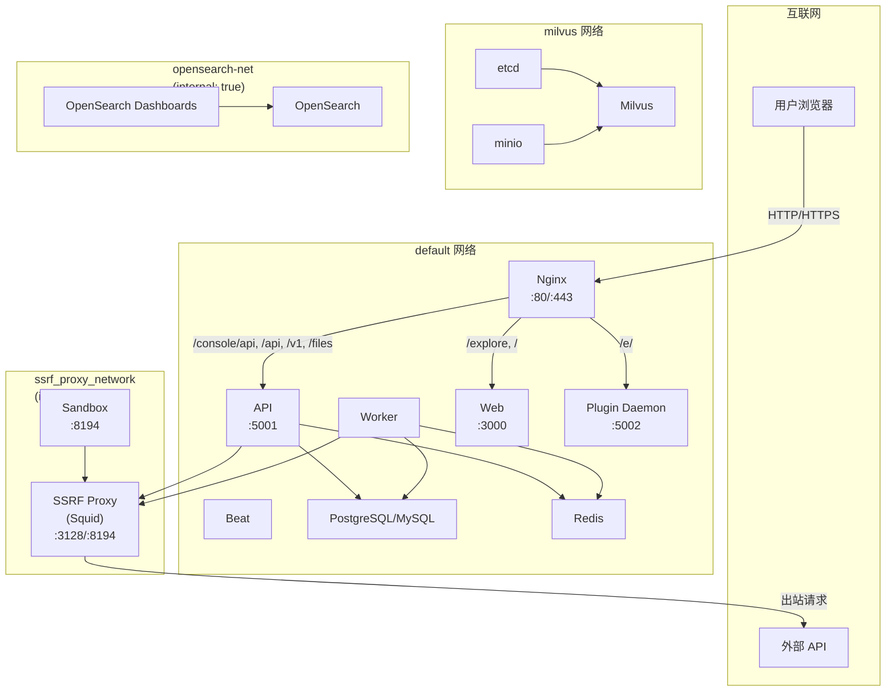
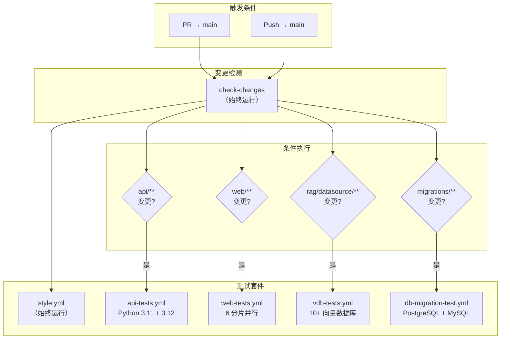
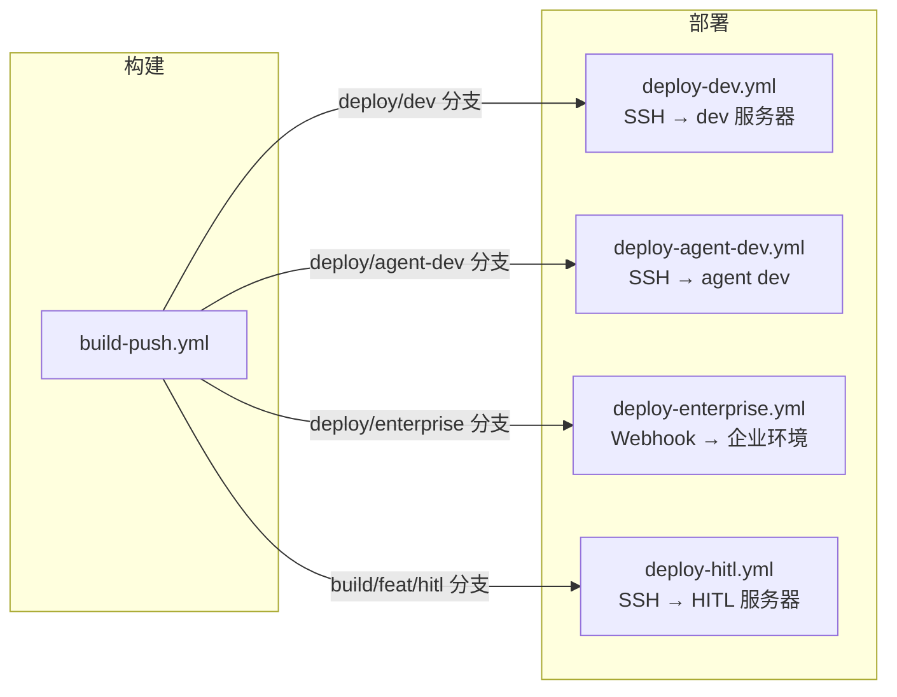
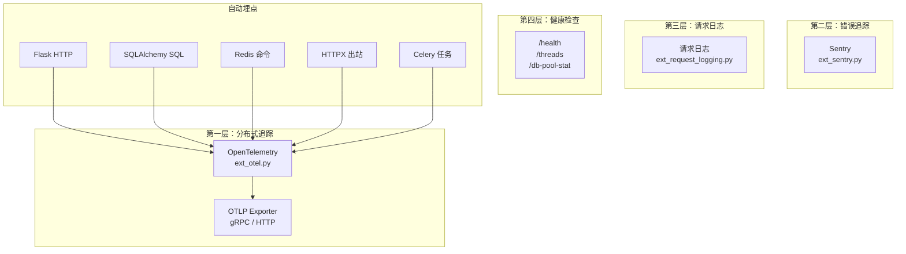
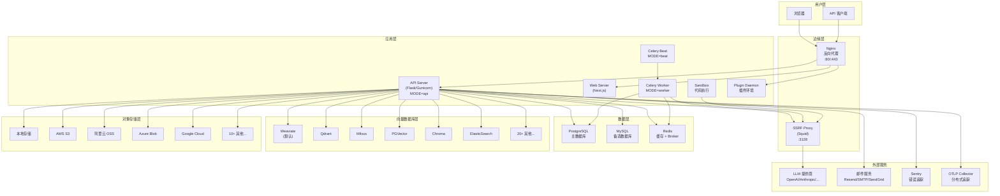

# 基础设施架构

> **TL;DR**: Dify 通过 Docker Compose 编排 30+ 个服务（单镜像三进程模式），配合 22 个 GitHub Actions 工作流实现全自动化 CI/CD，后端通过 27 个 Flask 扩展集成数据库、缓存、存储、消息队列和可观测性等基础设施能力。

## 概述

Dify 的基础设施围绕"容器化部署 + 自动化流水线 + 插件化扩展"三大支柱构建。部署层以 Docker Compose 为核心，通过自动化生成管道将模板和环境变量合并为生产级编排文件。CI/CD 层基于 GitHub Actions 构建了 22 个工作流，覆盖测试、代码质量、构建、部署和国际化全链路。应用层通过 Flask 扩展机制将 27 个基础设施组件按严格依赖顺序初始化，形成完整的运行时环境。

**核心设计原则：**
- **单镜像多进程**：一个 API 镜像通过 `MODE` 环境变量切换 api/worker/beat 三种角色
- **模板化生成**：Docker Compose 文件由模板 + 环境变量自动生成，禁止直接编辑
- **智能 CI 调度**：基于路径过滤的变更检测，仅运行受影响的测试套件
- **分层可观测**：OpenTelemetry + Sentry + 请求日志 + 健康端点构成四层监控体系

## 详细设计

### 1. 部署架构

#### 1.1 Docker Compose 生成管道

Docker Compose 采用**自动化生成管道**，禁止直接编辑最终文件：

```
.env.example（680+ 环境变量）
       │
       ▼
generate_docker_compose（Python 脚本）
       │
       ├── 解析 .env.example → 提取 KEY=VALUE 对
       ├── 生成 x-shared-env YAML 锚点块
       ├── 从模板中移除旧的共享环境块
       └── 注入共享环境 + 文件头 → docker-compose.yaml
       │
       ▼
docker-compose.yaml（自动生成，1639 行）
```

| 文件 | 角色 | 说明 |
|------|------|------|
| `docker-compose-template.yaml` | 主编辑点 | 服务 YAML 结构，不含共享环境变量 |
| `.env.example` | 环境变量模板 | 680+ 个配置项，涵盖所有类别 |
| `generate_docker_compose` | 生成器 | Python 脚本，解析 `.env.example` 生成最终文件 |
| `docker-compose.yaml` | 最终产物 | **自动生成，禁止直接编辑** |
| `docker-compose.middleware.yaml` | 开发中间件 | 本地开发用，仅启动 PostgreSQL/Redis/Sandbox 等 |
| `dify-env-sync.sh` / `.py` | 环境同步 | 增量合并 `.env.example` → `.env`，保留自定义值 |

#### 1.2 单镜像三进程模式

`langgenius/dify-api` 单个 Docker 镜像通过 `MODE` 环境变量服务三种进程角色：

| 角色 | MODE 值 | 进程 | 端口 | 职责 |
|------|---------|------|------|------|
| API 服务器 | `api` | Flask/Gunicorn | 5001（内部） | 处理 HTTP 请求 |
| Worker | `worker` | Celery Worker | - | 异步任务处理（数据集索引、工作流执行、邮件发送） |
| Beat | `beat` | Celery Beat | - | 定时任务调度（日志清理、插件检查、TTL 过期） |

这种设计确保 API、Worker 和 Beat 使用完全相同的代码版本，避免版本不一致问题。

#### 1.3 服务清单

**核心运行时服务（始终启动）：**

| 服务 | 镜像 | 用途 |
|------|------|------|
| `api` | `langgenius/dify-api` | Flask API 服务器 |
| `worker` | `langgenius/dify-api` | Celery 工作进程 |
| `worker_beat` | `langgenius/dify-api` | Celery Beat 调度器 |
| `web` | `langgenius/dify-web` | Next.js 前端服务器 |
| `nginx` | `nginx:latest` | 反向代理（端口 80/443） |
| `sandbox` | `langgenius/dify-sandbox` | 代码执行沙箱 |
| `plugin_daemon` | `langgenius/dify-plugin-daemon` | 插件执行环境 |
| `ssrf_proxy` | `ubuntu/squid` | SSRF 安全代理 |
| `init_permissions` | `busybox:latest` | 一次性卷权限修复 |

**基础设施服务（通过 Compose Profiles 切换）：**

| 类别 | 服务 | 默认 |
|------|------|------|
| 关系数据库 | PostgreSQL 15 / MySQL 8.0 | PostgreSQL |
| 缓存 | Redis 6 | ✅ |
| 向量数据库 | Weaviate / Qdrant / Milvus / PGVector / Chroma / ElasticSearch / OpenSearch / OceanBase / Oracle / Couchbase / IRIS / MyScale / MatrixOne / Vastbase / PGVecto.rs / OpenGauss / SeekDB 等 20+ | Weaviate |
| 文档解析 | Unstructured | 可选 |
| SSL 证书 | Certbot（Let's Encrypt） | 可选 |

#### 1.4 Celery 定时任务

Worker Beat 调度 13+ 个可配置定时任务：

| 任务 | 调度 | 用途 |
|------|------|------|
| `clean_embedding_cache_task` | 每日 2:00 | 清理嵌入缓存 |
| `clean_unused_datasets_task` | 每日 3:00 | 清理未使用数据集 |
| `clean_messages` | 每日 4:00 | 清理过期消息 |
| `clean_workflow_runlogs_precise` | 每日 2:00 | 清理工作流运行日志 |
| `clean_workflow_runs_task` | 每日 0:00 | 清理工作流运行记录 |
| `mail_clean_document_notify_task` | 每周一 10:00 | 文档清理通知邮件 |
| `check_upgradable_plugin_task` | 每 15 分钟 | 检查可升级插件 |
| `datasets-queue-monitor` | 可配置（默认 30 分钟） | 数据集队列监控 |
| `workflow_schedule_task` | 可配置 | 工作流定时调度 |
| `trigger_provider_refresh` | 可配置 | 提供者刷新 |
| `batch_update_api_token_last_used` | 可配置 | API Token 使用时间批更新 |
| `human_input_form_timeout` | 可配置 | 人工输入表单超时检查 |
| `create_tidb_serverless_task` | 每小时 | TiDB Serverless 创建 |

所有任务通过 `ENABLE_*` 环境变量独立控制开关。

#### 1.5 Kubernetes 部署

本仓库不含原生 Kubernetes 配置。社区维护了多种 K8s 部署方案：

| 方案 | 类型 | 说明 |
|------|------|------|
| [douban/charts](https://github.com/douban/charts/tree/master/charts/dify) | Helm Chart | 豆瓣维护 |
| [dify-helm](https://github.com/BorisPolonsky/dify-helm) | Helm Chart | 社区维护 |
| [ai-charts](https://github.com/magicsong/ai-charts) | Helm Chart | 社区维护 |
| [dify-kubernetes](https://github.com/Winson-030/dify-kubernetes) | YAML | 原生 K8s YAML |
| [DifyAI-Kubernetes](https://github.com/Zhoneym/DifyAI-Kubernetes) | YAML | 支持 v1.6.0+ |

**云平台一键部署：**

| 平台 | 工具 |
|------|------|
| Azure | Terraform |
| Google Cloud | Terraform |
| AWS | CDK（ECS / EKS） |
| 阿里云 | 计算巢 / 数据管理 DMS |

### 2. 网络和存储

#### 2.1 网络拓扑

Docker Compose 定义了 4 个网络，实现服务间隔离通信：



**网络说明：**

| 网络 | 类型 | 连接服务 | 用途 |
|------|------|----------|------|
| `default` | bridge | API、Worker、Beat、Web、Nginx、DB、Redis、Plugin Daemon | 标准服务间通信 |
| `ssrf_proxy_network` | bridge, internal | API、Worker、Beat、Sandbox、SSRF Proxy | 隔离出站代理，无直接互联网访问 |
| `milvus` | bridge | etcd、minio、milvus-standalone | Milvus 组件内部通信 |
| `opensearch-net` | bridge, internal | OpenSearch、Dashboards | OpenSearch 内部通信 |

**关键安全设计**：`ssrf_proxy_network` 设置为 `internal: true`，意味着该网络中的容器无法直接访问互联网。API 和 Worker 同时连接 `default` 和 `ssrf_proxy_network` 两个网络，因此既能访问本地服务（通过 default），又能通过 SSRF Proxy 安全地发出站请求。

#### 2.2 Nginx 路由表

Nginx 作为统一入口，根据 URL 路径分发请求：

| 路径 | 上游服务 | 说明 |
|------|----------|------|
| `/console/api` | `api:5001` | 控制台管理 API |
| `/api` | `api:5001` | 公共 API |
| `/v1` | `api:5001` | API v1 |
| `/files` | `api:5001` | 文件上传/下载 |
| `/mcp` | `api:5001` | MCP 协议端点 |
| `/triggers` | `api:5001` | 工作流触发器 |
| `/explore` | `web:3000` | 探索/应用页面 |
| `/e/` | `plugin_daemon:5002` | 插件 Webhook 端点 |
| `/` | `web:3000` | 前端 SPA（所有其他路径） |

Nginx 配置支持：
- **HTTPS**：通过 `NGINX_HTTPS_ENABLED` 启用，支持 Let's Encrypt（Certbot）自动证书
- **代理超时**：可配置的连接超时和读取超时
- **CORS**：可配置的跨域策略
- **请求体大小**：通过 `client_max_body_size` 控制上传限制

#### 2.3 SSRF 安全代理

SSRF 代理基于 Squid 实现，提供双向代理能力：

| 功能 | 端口 | 说明 |
|------|------|------|
| 出站正向代理 | 3128 | API/Worker 出站请求通过此端口 |
| Sandbox 反向代理 | 8194 | 外部请求转发至 Sandbox 容器 |

**安全策略：**
- ACL 限制：仅允许 HTTP/HTTPS 等安全端口（80、443 等）
- 域名白名单：可配置允许的出站域名
- 高性能配置：65536 文件描述符、256MB 缓存、持久连接

#### 2.4 存储方案

**文件存储**：通过 `STORAGE_TYPE` 环境变量切换，支持 12+ 种后端：

| 存储类型 | 实现类 | 配置前缀 |
|----------|--------|----------|
| `s3` | `AwsS3Storage` | `S3_*` |
| `local` | `OpenDALStorage(fs)` | `STORAGE_LOCAL_PATH` |
| `opendal` | `OpenDALStorage` | `OPENDAL_SCHEME` |
| `azure-blob` | `AzureBlobStorage` | `AZURE_BLOB_*` |
| `aliyun-oss` | `AliyunOssStorage` | `OSS_*` |
| `google-storage` | `GoogleCloudStorage` | `GCS_*` |
| `tencent-cos` | `TencentCosStorage` | `COS_*` |
| `huawei-obs` | `HuaweiObsStorage` | `OBS_*` |
| `baidu-obs` | `BaiduObsStorage` | `BOS_*` |
| `volcengine-tos` | `VolcengineTosStorage` | `TOS_*` |
| `supabase` | `SupabaseStorage` | `SUPABASE_*` |
| `oci-storage` | `OracleOCIStorage` | `OCI_*` |
| `clickzetta-volume` | `ClickZettaVolumeStorage` | `CLICKZETTA_VOLUME_*` |

**数据卷映射**：

| 服务 | 容器路径 | 宿主机路径 |
|------|----------|------------|
| API/Worker | `/app/api/storage` | `./volumes/app/storage` |
| PostgreSQL | `/var/lib/postgresql/data` | `./volumes/db/data` |
| MySQL | `/var/lib/mysql` | `./volumes/mysql/data` |
| Redis | `/data` | `./volumes/redis/data` |
| Weaviate | `/var/lib/weaviate` | `./volumes/weaviate` |
| Sandbox | `/dependencies`, `/conf` | `./volumes/sandbox/` |
| Plugin Daemon | `/app/storage` | `./volumes/plugin_daemon` |
| Certbot | `/etc/letsencrypt` | `./volumes/certbot/` |

#### 2.5 数据库连接

**关系数据库**：支持 PostgreSQL（默认）和 MySQL，通过 `DB_TYPE` 环境变量切换。

| 配置项 | 说明 |
|--------|------|
| `DB_TYPE` | 数据库类型（`postgresql` 或 `mysql`） |
| `DB_HOST` | 数据库主机 |
| `DB_PORT` | 数据库端口 |
| `DB_DATABASE` | 数据库名称 |
| `DB_USERNAME` | 数据库用户 |
| `DB_PASSWORD` | 数据库密码 |
| `SQLALCHEMY_POOL_SIZE` | 连接池大小 |
| `SQLALCHEMY_MAX_OVERFLOW` | 连接池最大溢出 |

**Redis 连接**：支持三种模式，自动检测：

| 模式 | 配置 | 说明 |
|------|------|------|
| Standalone | `REDIS_HOST`, `REDIS_PORT` | 单实例，支持 SSL |
| Sentinel | `REDIS_SENTINELS`, `REDIS_SENTINEL_SERVICE_NAME` | 哨兵模式，支持故障转移 |
| Cluster | `REDIS_CLUSTERS` | 集群模式 |

Redis 还承担 PubSub 层职责，支持三种通道类型：`BroadcastChannel`、`ShardedRedisBroadcastChannel`、`StreamsBroadcastChannel`。

### 3. CI/CD 流水线

#### 3.1 工作流总览

Dify 拥有 **22 个 GitHub Actions 工作流**，分为 7 个功能类别：

| 类别 | 数量 | 工作流 |
|------|------|--------|
| 主 CI 流水线 | 1 | `main-ci.yml` |
| 测试 | 4 | `api-tests.yml`, `web-tests.yml`, `vdb-tests.yml`, `db-migration-test.yml` |
| 代码质量 | 5 | `style.yml`, `anti-slop.yml`, `pyrefly-diff.yml`, `pyrefly-diff-comment.yml`, `semantic-pull-request.yml` |
| Docker 构建 | 2 | `docker-build.yml`, `build-push.yml` |
| 部署 | 4 | `deploy-dev.yml`, `deploy-agent-dev.yml`, `deploy-enterprise.yml`, `deploy-hitl.yml` |
| 自动化 | 4 | `autofix.yml`, `labeler.yml`, `stale.yml`, `tool-test-sdks.yaml` |
| 国际化 | 2 | `translate-i18n-claude.yml`, `trigger-i18n-sync.yml` |

#### 3.2 主 CI 流水线架构

`main-ci.yml` 采用**编排器模式**，通过路径过滤智能调度测试：



**路径过滤规则：**

| 过滤器 | 匹配路径 | 触发测试 |
|--------|----------|----------|
| `api` | `api/**`, `docker/**` | API 集成测试 |
| `web` | `web/**`, `.github/actions/setup-web/**` | Web 单元测试 |
| `vdb` | `api/core/rag/datasource/**`, `api/pyproject.toml` | 向量数据库测试 |
| `migration` | `api/migrations/**` | 数据库迁移测试 |

#### 3.3 测试策略

**API 测试**（`api-tests.yml`）：
- Python 3.11 + 3.12 矩阵测试
- 启动真实中间件：PostgreSQL、Redis、Sandbox、SSRF Proxy
- 测试范围：工作流集成测试、工具集成测试、容器集成测试、单元测试
- 覆盖率上报 Codecov（仅 Python 3.12）

**Web 测试**（`web-tests.yml`）：
- 6 个并行分片（Vitest blob reporter）
- 分片报告合并 + 覆盖率上报
- 独立的生产构建验证

**向量数据库测试**（`vdb-tests.yml`）：
- 同时启动 10+ 向量数据库服务
- 覆盖 Weaviate、Qdrant、Milvus、PGVector、Chroma、ElasticSearch、Couchbase、OceanBase 等
- 最重的测试工作流

**数据库迁移测试**（`db-migration-test.yml`）：
- PostgreSQL 和 MySQL 双数据库并行测试
- 离线 SQL 生成检查（`flask db upgrade 'base:head' --sql`）
- 在线迁移验证（`flask upgrade-db`）

#### 3.4 代码质量检查

| 工作流 | 检查内容 | 触发条件 |
|--------|----------|----------|
| `style.yml` | Python: Ruff lint + 三重类型检查（basedpyright + pyrefly + mypy）+ dotenv-linter<br/>Web: ESLint + TSS + TypeScript + knip 死代码检测<br/>其他: SuperLinter（Bash/Dockerfile/YAML/XML/EditorConfig） | 始终运行 |
| `anti-slop.yml` | AI 代码质量检查（`peakoss/anti-slop`），标记低质量 AI 生成代码 | 每个 PR |
| `pyrefly-diff.yml` | PR 分支 vs 基础分支的 Pyrefly 类型诊断差异 | PR 修改 `api/**/*.py` |
| `semantic-pull-request.yml` | PR 标题 Conventional Commits 格式验证 | 每个 PR |

#### 3.5 Docker 构建与发布

**PR 级构建验证**（`docker-build.yml`）：
- 触发：PR 修改 `api/Dockerfile` 或 `web/Dockerfile`
- 4 个并行构建：api-amd64、api-arm64、web-amd64、web-arm64
- 仅构建不推送，验证镜像可编译

**生产构建发布**（`build-push.yml`）：
- 触发分支：`main`、`deploy/**`、`build/**`、`release/e-*`、`hotfix/**`、tags
- 仅 `langgenius/dify` 仓库执行
- 架构：先分别构建 amd64/arm64，再合并为多架构 manifest
- 推送镜像：`langgenius/dify-api`、`langgenius/dify-web`
- 标签策略：`latest`（仅非预发布 tag）、分支名、commit SHA、tag 名

#### 3.6 部署流水线

4 个部署工作流链式触发于 `build-push.yml` 完成后：



#### 3.7 自动化工作流

**autofix.yml** — 自动代码修复：
- Docker Compose 模板变更后自动重新生成
- Python：Ruff 格式化 + lint 修复 + ast-grep 结构化重写（SQLAlchemy 2.0 迁移：`.filter()` → `.where()`、`db.Column` → `mapped_column`、`Optional[T]` → `T | None`）
- Web：ESLint 自动修复

**translate-i18n-claude.yml** — LLM 驱动国际化：
- 使用 Claude Code Action 自动翻译 `en-US` JSON 到 23 种语言
- 支持增量模式（仅翻译变更文件）和全量模式
- 三阶段流程：验证 → 同步 → 再验证 → 提交 PR

### 4. 监控和日志

#### 4.1 可观测性体系

Dify 后端通过 27 个 Flask 扩展构建了四层可观测性体系：



**OpenTelemetry 配置**（`ENABLE_OTEL` 控制）：

| 配置项 | 说明 |
|--------|------|
| `OTLP_TRACES_EXPORTER` | 追踪导出器（`otlp` 或 `console`） |
| `OTLP_METRICS_EXPORTER` | 指标导出器 |
| `OTEL_ENDPOINT` | OTLP 端点 |
| `OTEL_API_KEY` | 认证 API Key |
| `OTEL_SAMPLING_RATE` | 采样率 |

**自动埋点覆盖**：
- **Flask**：HTTP 请求 span + 响应指标（按状态码/方法/路由计数）
- **SQLAlchemy**：SQL 注释器 + 引擎埋点
- **Redis**：Redis 命令追踪
- **HTTPX**：出站 HTTP 请求追踪
- **Celery**：任务执行追踪（Flask 和 Worker 进程均埋点）
- **异常日志**：`logging.exception()` 调用自动捕获为 span 事件

**自定义语义属性**（`DifySpanAttributes`）：
- `dify.app_id`、`dify.tenant_id`、`dify.workflow_id`、`dify.invoke_from`
- GenAI 标准属性：model、tokens、finish_reason 等

#### 4.2 健康检查端点

| 端点 | 返回内容 |
|------|----------|
| `GET /health` | PID、状态、版本号 |
| `GET /threads` | 线程转储（名称、ID、存活状态） |
| `GET /db-pool-stat` | SQLAlchemy 连接池统计（大小、已借出、溢出、超时、回收） |

#### 4.3 Sentry 错误追踪

| 配置项 | 说明 |
|--------|------|
| `SENTRY_DSN` | Sentry DSN（设置后启用） |
| `SENTRY_TRACES_SAMPLE_RATE` | 追踪采样率 |
| `SENTRY_PROFILES_SAMPLE_RATE` | 性能分析采样率 |

集成：Flask + Celery。忽略的错误类型：`HTTPException`、`ValueError`、`FileNotFoundError`、`InvokeRateLimitError`。

#### 4.4 请求日志

通过 `ENABLE_REQUEST_LOGGING` 启用，基于 Flask 信号机制：
- **INFO 级别**：紧凑访问日志 `{method} {path} {status_code} {duration_ms} {trace_id}`
- **DEBUG 级别**：完整请求/响应 JSON body 转储

#### 4.5 阿里云 SLS LogStore

可选的阿里云日志服务集成（`ext_logstore.py`），支持双模式：

| 模式 | 协议 | 说明 |
|------|------|------|
| SDK 模式 | HTTP API | 标准阿里云 LogClient SDK |
| PG 模式 | PostgreSQL 线协议 | 通过 psycopg2 直连，更低延迟 |

自动管理 `workflow_execution` 和 `workflow_node_execution` 两个 LogStore，支持从 SQLAlchemy 模型定义自动生成索引配置。

#### 4.6 Grafana 监控仪表板

社区提供了 Grafana 仪表板，使用 Dify 的 PostgreSQL 数据库作为数据源，支持应用级、租户级、消息级的细粒度监控：
- [dify-grafana-dashboard](https://github.com/bowenliang123/dify-grafana-dashboard)

## 附录

### A. 部署拓扑图



### B. 基础设施清单

| 类别 | 组件 | 技术 | 配置方式 |
|------|------|------|----------|
| **关系数据库** | 主数据库 | PostgreSQL 15 / MySQL 8.0 | `DB_TYPE` 环境变量 |
| **缓存** | 缓存 + Broker | Redis 6（Standalone/Sentinel/Cluster） | `REDIS_*` 环境变量 |
| **消息队列** | 异步任务 | Celery 5.6 + Redis Broker | `CELERY_*` 环境变量 |
| **向量数据库** | 默认 | Weaviate 1.27 | `VECTOR_STORE=weaviate` |
| **向量数据库** | 支持 20+ | Qdrant, Milvus, PGVector, Chroma, ES, OpenSearch, OceanBase, Oracle, Couchbase, IRIS, MyScale, MatrixOne, Vastbase, PGVecto.rs, OpenGauss, SeekDB 等 | `VECTOR_STORE` + 对应连接配置 |
| **对象存储** | 默认 | 本地存储 | `STORAGE_TYPE=local` |
| **对象存储** | 支持 12+ | S3, Azure Blob, GCS, 阿里云 OSS, 腾讯云 COS, 华为云 OBS, 百度云 BOS, 火山引擎 TOS, Supabase, OCI, OpenDAL, ClickZetta | `STORAGE_TYPE` + 对应配置 |
| **反向代理** | 入口 | Nginx | `nginx/` 目录模板 |
| **安全代理** | SSRF 防护 | Squid | `ssrf_proxy/` 目录配置 |
| **沙箱** | 代码执行 | dify-sandbox | `sandbox` 服务 |
| **插件** | 插件运行时 | dify-plugin-daemon | `plugin_daemon` 服务 |
| **SSL** | 证书管理 | Certbot (Let's Encrypt) | `certbot/` 目录 |
| **文档解析** | ETL | Unstructured | `unstructured` 服务（可选） |
| **追踪** | 分布式追踪 | OpenTelemetry (OTLP) | `OTEL_*` 环境变量 |
| **错误追踪** | 异常捕获 | Sentry | `SENTRY_DSN` |
| **日志** | 请求日志 | 内置 | `ENABLE_REQUEST_LOGGING` |
| **日志** | 云日志 | 阿里云 SLS LogStore | `ALIYUN_SLS_*` 环境变量 |
| **邮件** | 邮件发送 | Resend / SMTP / SendGrid | `MAIL_TYPE` + 对应配置 |
| **监控** | 仪表板 | Grafana（社区） | 外部项目 |

### C. 扩展初始化顺序

后端 27 个 Flask 扩展按严格依赖顺序初始化：

```
 1. ext_timezone          → 设置 TZ=UTC
 2. ext_logging           → 日志配置
 3. ext_warnings          → 警告过滤
 4. ext_import_modules    → 事件处理器注册
 5. ext_orjson            → JSON 序列化
 6. ext_forward_refs      → Pydantic 前向引用解析
 7. ext_set_secretkey     → Flask 密钥
 8. ext_compress          → 响应压缩
 9. ext_code_based_extension → 插件系统
10. ext_database          → SQLAlchemy 数据库
11. ext_app_metrics       → 健康检查端点
12. ext_migrate           → Alembic 迁移
13. ext_redis             → Redis 客户端
14. ext_storage           → 文件存储
15. ext_logstore          → 阿里云 SLS
16. ext_celery            → Celery 任务队列
17. ext_login             → 认证
18. ext_mail              → 邮件
19. ext_hosting_provider  → 托管配置
20. ext_sentry            → Sentry 错误追踪
21. ext_proxy_fix         → 反向代理头
22. ext_blueprints        → 路由注册（7 个蓝图）
23. ext_commands          → CLI 命令（30+）
24. ext_fastopenapi       → OpenAPI 路由
25. ext_otel              → OpenTelemetry
26. ext_request_logging   → 请求日志
27. ext_session_factory   → 会话工厂
```

**关键依赖约束**：DB/Redis 在 Celery 之前（Celery 需要 DB 和 Redis）；蓝图在 OTEL 之前（追踪需要看到路由）；`ext_session_factory` 最后初始化。

### D. 环境变量分类

`.env.example` 包含 680+ 个环境变量，分为 21 个类别：

| 类别 | 示例变量 | 说明 |
|------|----------|------|
| 通用 | `CONSOLE_WEB_URL`, `CONSOLE_API_URL` | 基础 URL 配置 |
| 服务器 | `LOG_LEVEL`, `SECRET_KEY`, `DEBUG` | 服务器运行参数 |
| 存储 | `STORAGE_TYPE`, `S3_*`, `OSS_*` | 文件存储后端 |
| 知识库 | `UPLOAD_FILE_SIZE_LIMIT`, `ETL_TYPE` | 知识库限制 |
| 模型 | `MODEL_TOKEN_LIMIT` | 模型配置 |
| 多模态 | `MULTIMODAL_SEND_FORMAT` | 多模态限制 |
| Sentry | `SENTRY_DSN`, `SENTRY_TRACES_SAMPLE_RATE` | 错误追踪 |
| 邮件 | `MAIL_TYPE`, `RESEND_API_KEY`, `SMTP_*` | 邮件服务 |
| CORS | `WEB_API_CORS_ALLOW_ORIGIN` | 跨域策略 |
| Celery | `CELERY_BROKER_URL`, `CELERY_RESULT_BACKEND` | 任务队列 |
| Redis | `REDIS_HOST`, `REDIS_SENTINELS`, `REDIS_CLUSTERS` | 缓存连接 |
| 数据库 | `DB_TYPE`, `DB_HOST`, `SQLALCHEMY_POOL_SIZE` | 数据库连接 |
| 向量存储 | `VECTOR_STORE`, `WEAVIATE_*`, `QDRANT_*` | 向量数据库 |
| 工作流 | `WORKFLOW_MAX_*`, `ENABLE_*` | 工作流限制和任务开关 |
| Nginx | `NGINX_HTTPS_ENABLED`, `NGINX_FRONT_PROXY_TIMEOUT` | 反向代理 |
| SSRF | `SSRF_PROXY_PORT`, `SSRF_DEFAULT_TIMEOUT` | 安全代理 |
| 插件 | `PLUGIN_DAEMON_*` | 插件运行时 |
| OTLP | `OTEL_*`, `OTLP_*` | 可观测性 |
| 事件总线 | `EVENT_BUS_*` | Redis Pub/Sub/Streams |

## 变更日志

| 日期 | 版本 | 变更内容 | 作者 |
|------|------|----------|------|
| 2026-07-19 | 1.0 | 初始版本，基于 docker/、.github/workflows/、api/extensions/ 分析 | AI Assistant |
