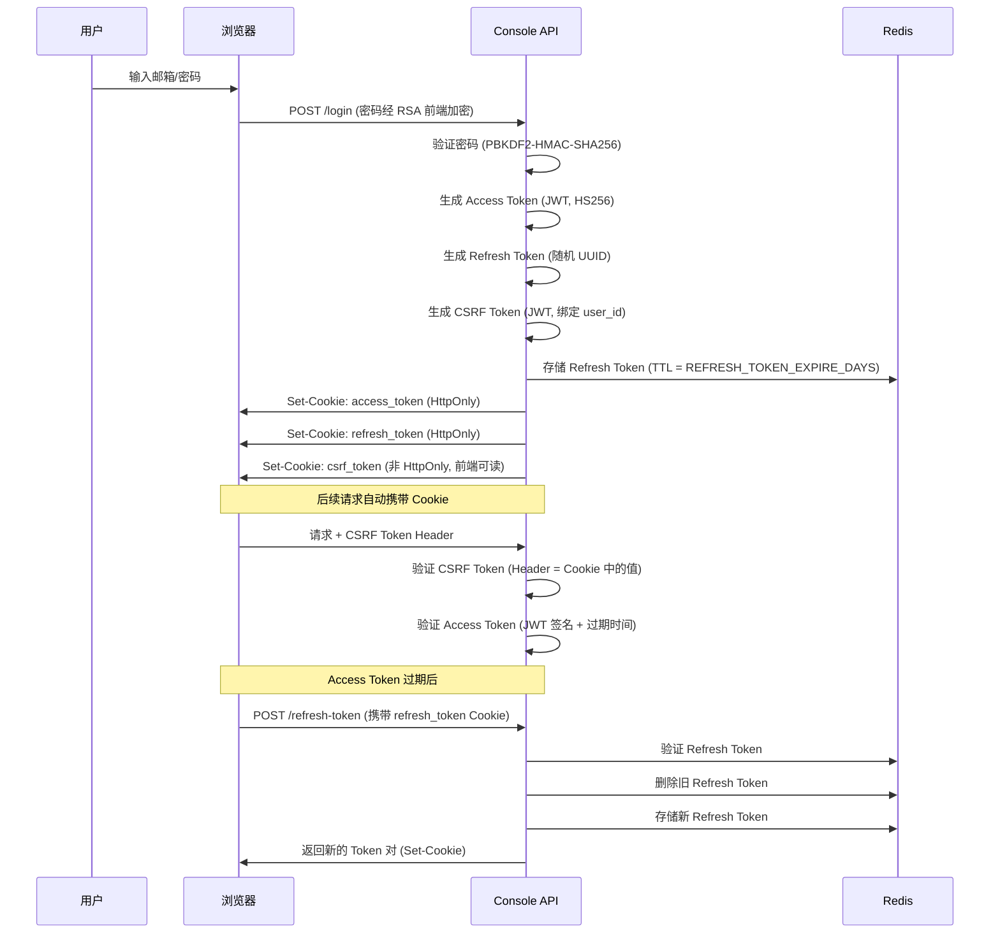
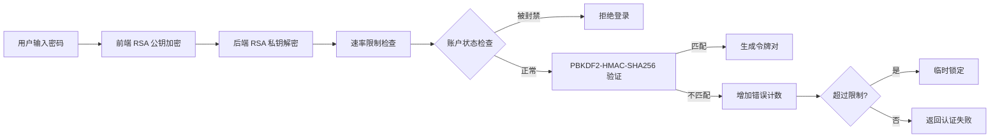
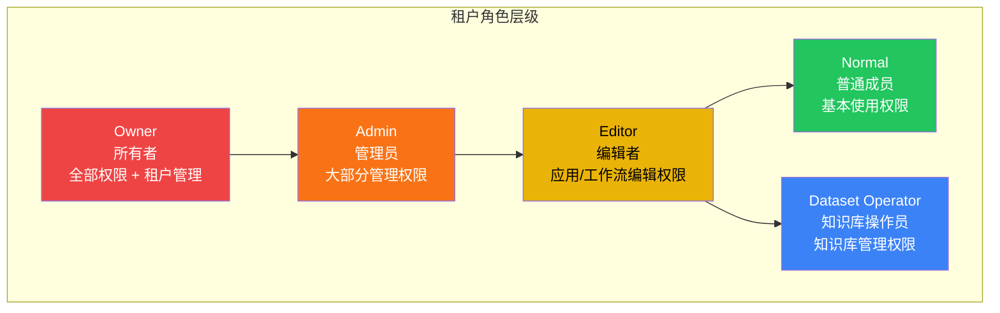
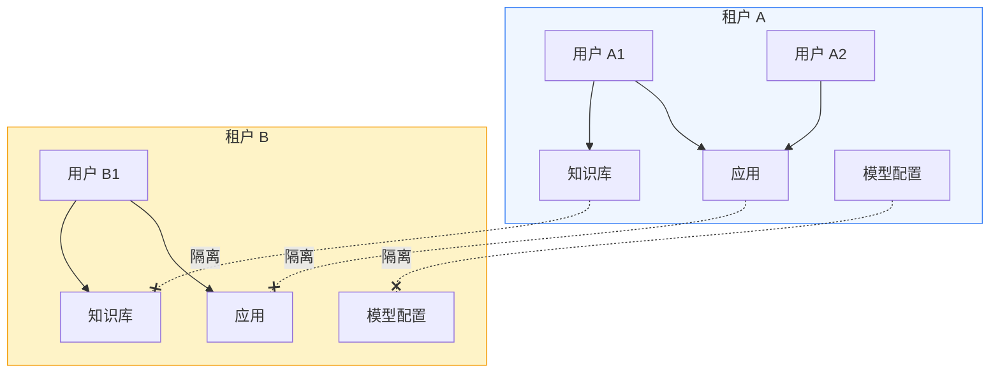
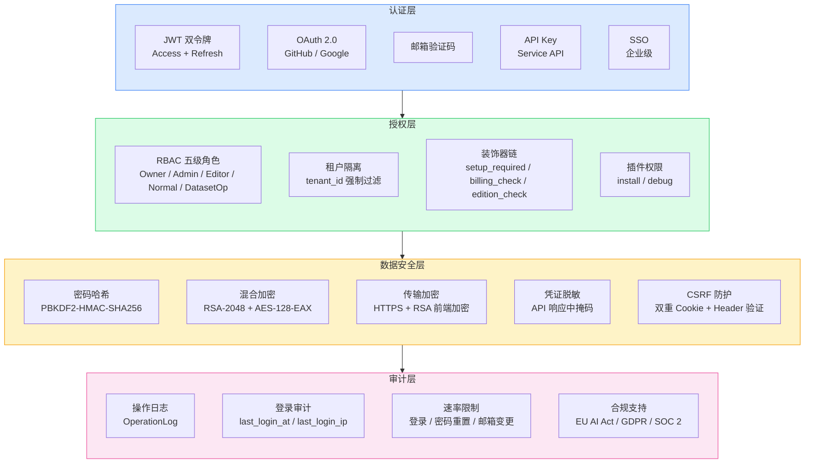

# 安全架构

> **TL;DR**: Dify 采用多层纵深防御体系，以 JWT + Refresh Token 双令牌认证为基础，结合 RBAC 五级角色授权、RSA+AES 混合加密、CSRF 防护和租户级数据隔离，构建覆盖认证、授权、数据保护和审计的全链路安全机制。

## 概述

Dify 的安全架构围绕四个核心目标设计：确保只有合法用户能访问系统（认证），确保用户只能执行其权限范围内的操作（授权），确保敏感数据在传输和存储中得到保护（数据安全），确保所有关键操作可追溯（审计）。

安全机制贯穿 Dify 的分层架构，从 API 网关层的请求验证，到服务层的权限检查，再到数据层的加密存储，每一层都有对应的安全控制点。

**核心安全原则：**

- **纵深防御**：多层安全控制，单点失效不导致系统沦陷
- **最小权限**：每个角色只拥有完成其职责所需的最小权限集
- **租户隔离**：所有数据操作强制限定在租户范围内
- **默认安全**：Cookie 默认 HttpOnly + Secure + SameSite，密码默认加盐哈希存储

## 详细设计

### 1. 认证机制

Dify 支持多种认证方式，覆盖控制台（Console API）、服务 API（Service API）和 Web 应用（Web App）三个入口。

#### 1.1 JWT 双令牌体系

控制台认证采用 Access Token + Refresh Token 双令牌模式，令牌通过 JWT（HS256 算法）签发。



**令牌参数：**

| 令牌类型 | 算法 | 有效期 | 存储位置 | 安全属性 |
|---------|------|--------|---------|---------|
| Access Token | JWT (HS256) | `ACCESS_TOKEN_EXPIRE_MINUTES` | HttpOnly Cookie | Secure, SameSite=Lax |
| Refresh Token | 随机字符串 | `REFRESH_TOKEN_EXPIRE_DAYS` | HttpOnly Cookie + Redis | Secure, SameSite=Lax |
| CSRF Token | JWT (HS256) | 同 Access Token | Cookie + 请求头 | Secure, SameSite=Lax |

**关键实现：**

- `PassportService`（`api/libs/passport.py`）：JWT 签发和验证，使用 `SECRET_KEY` 作为签名密钥
- `AccountService.login()`（`api/services/account_service.py`）：登录流程，生成令牌对并存储 Refresh Token 到 Redis
- `check_csrf_token()`（`api/libs/token.py`）：CSRF 验证，比对请求头中的 CSRF Token 与 Cookie 中的值

**Cookie 安全策略：**

- 当 `CONSOLE_WEB_URL` 和 `CONSOLE_API_URL` 均为 HTTPS 时，自动启用 `Secure` 标志
- 在 HTTPS + 无自定义 `COOKIE_DOMAIN` 的场景下，Cookie 名称自动添加 `__Host-` 前缀（浏览器强制 Secure + HttpOnly + 路径 `/`）
- Access Token 和 Refresh Token 设置为 HttpOnly，防止 XSS 窃取
- CSRF Token 不设 HttpOnly，前端 JavaScript 需要读取后放入请求头

#### 1.2 密码认证

密码认证流程包含多层防护：



**密码安全：**

- **哈希算法**：PBKDF2-HMAC-SHA256，10,000 次迭代（`api/libs/password.py`）
- **盐值**：每个账户独立的 16 字节随机盐，Base64 编码存储
- **密码策略**：至少 8 位，必须包含字母和数字（正则 `^(?=.*[a-zA-Z])(?=.*\d).{8,}$`）
- **传输加密**：前端使用租户级 RSA-2048 公钥加密密码，后端使用对应私钥解密（`@decrypt_password_field` 装饰器）

#### 1.3 OAuth 社交登录

支持 GitHub 和 Google 两个 OAuth 2.0 提供商（`api/controllers/console/auth/oauth.py`）：

- 通过 `GITHUB_CLIENT_ID` / `GITHUB_CLIENT_SECRET` 和 `GOOGLE_CLIENT_ID` / `GOOGLE_CLIENT_SECRET` 环境变量配置
- OAuth 回调后自动关联或创建账户（`AccountIntegrate` 表存储 provider + open_id 映射）
- 支持通过 `state` 参数传递邀请令牌

#### 1.4 邮箱验证码登录

无密码登录选项（`api/controllers/console/auth/login.py` 中的 `/email-code-login` 端点）：

- 6 位随机数字验证码，通过 `TokenManager` 生成带 TTL 的令牌
- 验证码存储在 Redis 中，自动过期
- 支持 IP 级别的发送频率限制

#### 1.5 Service API 认证

外部 API 调用使用 API Key 认证（`api/controllers/service_api/wraps.py`）：

- API Key 通过 `Authorization: Bearer {api_key}` 头传递
- 每个 API Key 绑定到特定租户，自动关联租户上下文
- 支持 Dataset API 和 App API 两种令牌类型

#### 1.6 Web App 认证

Web 应用支持三种访问模式（`api/services/webapp_auth_service.py`）：

| 模式 | 说明 | 认证要求 |
|------|------|---------|
| `public` | 公开访问 | 无需认证 |
| `internal` / `private` | 内部访问 | 需要登录 + 权限检查 |
| `sso_verified` | SSO 验证 | 需要外部 SSO 认证 |

### 2. 授权机制

#### 2.1 RBAC 角色模型

Dify 采用基于角色的访问控制（RBAC），定义了五级租户角色：



**角色权限矩阵：**

| 权限类别 | Owner | Admin | Editor | Normal | Dataset Operator |
|---------|-------|-------|--------|--------|-----------------|
| 租户管理（成员邀请/移除） | ✅ | ✅ | ❌ | ❌ | ❌ |
| 应用创建/编辑/删除 | ✅ | ✅ | ✅ | ❌ | ❌ |
| 知识库管理 | ✅ | ✅ | ✅ | ❌ | ✅ |
| 模型供应商配置 | ✅ | ✅ | ❌ | ❌ | ❌ |
| 插件安装 | ✅/可配置 | ✅/可配置 | 可配置 | 可配置 | ❌ |
| 工作空间自定义 | ✅ | ✅ | ❌ | ❌ | ❌ |

**角色检查实现：**

- `TenantAccountRole`（`api/models/account.py`）：角色枚举和权限判断方法
- `Account.is_admin_or_owner`、`Account.has_edit_permission` 等属性：便捷权限判断
- `current_account_with_tenant()`（`api/libs/login.py`）：每次请求验证用户、租户和角色的关联关系

#### 2.2 租户隔离

多租户隔离是 Dify 安全架构的核心约束：



**隔离机制：**

- **数据层**：所有数据库查询强制包含 `tenant_id` 过滤条件（`api/models/` 中所有模型均包含 `tenant_id` 字段）
- **关联表**：`TenantAccountJoin` 表管理用户与租户的多对多关系，包含角色信息
- **密钥隔离**：每个租户拥有独立的 RSA 密钥对（存储于 `privkeys/{tenant_id}/private.pem`），用于凭证加密
- **配置隔离**：`Tenant.encrypt_public_key` 存储租户级加密公钥，`Tenant.custom_config` 存储租户级自定义配置

#### 2.3 装饰器权限控制

权限检查通过装饰器链在控制器层实现（`api/controllers/console/wraps.py`）：

| 装饰器 | 作用 | 使用场景 |
|--------|------|---------|
| `@setup_required` | 验证系统已完成初始化 | 所有控制台 API |
| `@account_initialization_required` | 验证账户已完成初始化 | 需要完整账户状态的 API |
| `@cloud_edition_billing_resource_check` | 检查计费配额（成员数、应用数等） | 创建资源类 API |
| `@only_edition_self_hosted` | 限制仅自部署版本可访问 | 自部署专属功能 |
| `@enterprise_license_required` | 验证企业许可证 | 企业版功能 |
| `@email_password_login_enabled` | 检查是否启用邮箱密码登录 | 登录相关 API |

#### 2.4 插件权限

插件系统有独立的权限控制（`TenantPluginPermission` 模型）：

- **安装权限**：`everyone`（所有人）/ `admins`（仅管理员）/ `noone`（禁止安装）
- **调试权限**：`everyone` / `admins` / `noone`
- 权限按租户配置，存储在 `account_plugin_permissions` 表

### 3. 数据安全

#### 3.1 加密体系

Dify 采用混合加密方案保护敏感数据：

```mermaid
flowchart TB
    subgraph PasswordHash["密码存储"]
        P1[明文密码] --> P2[16 字节随机盐]
        P2 --> P3[PBKDF2-HMAC-SHA256<br/>10,000 次迭代]
        P3 --> P4[Base64 编码存储]
    end

    subgraph HybridEncrypt["供应商凭证加密"]
        H1[明文凭证] --> H2[生成 16 字节 AES 密钥]
        H2 --> H3[AES-128-EAX 加密<br/>生成密文 + Tag + Nonce]
        H3 --> H4[RSA-2048-OAEP 加密 AES 密钥]
        H4 --> H5["HYBRID:" + 加密密钥 + Nonce + Tag + 密文"]
    end

    subgraph TransitEncrypt["传输加密"]
        T1[前端密码输入] --> T2[RSA 公钥加密<br/>租户级密钥对]
        T2 --> T3[HTTPS 传输]
        T3 --> T4[RSA 私钥解密<br/>后端]
    end
```

**密码存储（`api/libs/password.py`）：**

- 算法：PBKDF2-HMAC-SHA256，10,000 次迭代
- 盐值：每账户独立 16 字节随机盐
- 存储格式：密码哈希和盐值均 Base64 编码后存入 `accounts` 表

**供应商凭证加密（`api/core/helper/provider_encryption.py` + `api/libs/rsa.py`）：**

- 混合加密方案：AES-128-EAX（对称加密数据）+ RSA-2048-OAEP（加密 AES 密钥）
- 每个租户独立的 RSA-2048 密钥对，私钥存储在对象存储中（`privkeys/{tenant_id}/private.pem`）
- 私钥通过 Redis 缓存（120 秒 TTL），缓存键使用 SHA3-256 哈希路径
- 加密数据前缀 `HYBRID:` 标识加密格式
- `ProviderConfigEncrypter` 类自动识别 `SECRET_INPUT` 类型字段并加密

**凭证脱敏（`ProviderConfigEncrypter.mask_credentials()`）：**

- 长度大于 6 的凭证：保留前 2 位和后 2 位，中间用 `*` 替换
- 长度小于等于 6 的凭证：全部用 `*` 替换

#### 3.2 传输安全

- **HTTPS 强制**：当 `CONSOLE_WEB_URL` 和 `CONSOLE_API_URL` 均为 HTTPS 时，Cookie 自动启用 `Secure` 标志
- **Cookie 安全**：Access Token 和 Refresh Token 使用 `HttpOnly` 标志，防止 XSS 攻击读取
- **SameSite 策略**：所有 Cookie 使用 `SameSite=Lax`，防御 CSRF 攻击
- **CSRF 双重验证**：CSRF Token 同时存储在 Cookie 和请求头中，服务端比对两者一致性

#### 3.3 令牌管理

`TokenManager`（`api/libs/helper.py`）提供通用令牌生命周期管理：

- 令牌存储在 Redis 中，支持可配置的 TTL
- 每个账户每种令牌类型只允许一个有效令牌（新令牌自动撤销旧令牌）
- 支持主动撤销（删除 Redis 中的令牌）
- 用于邮箱验证码、密码重置、账户删除验证等场景

### 4. 审计日志

#### 4.1 操作日志

`OperationLog` 模型（`api/models/model.py`）记录关键操作：

| 字段 | 说明 |
|------|------|
| `tenant_id` | 操作所属租户 |
| `account_id` | 执行操作的用户 |
| `action` | 操作类型（如 `create_app`、`update_model_config` 等） |
| `content` | 操作详情（JSON 格式） |
| `created_at` | 操作时间 |
| `created_ip` | 操作来源 IP |

索引设计：`operation_log_account_action_idx` 覆盖 `(tenant_id, account_id, action)` 三元组，支持按租户和用户快速查询操作历史。

#### 4.2 登录审计

账户模型内置登录审计字段：

- `last_login_at`：最后登录时间
- `last_login_ip`：最后登录 IP 地址
- `last_active_at`：最后活跃时间（每 10 分钟更新一次）

#### 4.3 EU AI Act 合规日志

Dify 的日志体系支持 EU AI Act 的记录保存要求（详见 `docs/eu-ai-act-compliance.md`）：

| 要求 | Dify 支持 | 状态 |
|------|----------|------|
| 对话日志 | 完整对话历史 + 时间戳 | 已覆盖 |
| 模型追踪 | 每次交互记录模型名称 | 已覆盖 |
| Token 用量 | 每条消息的 Token 计数 | 已覆盖 |
| 文档检索 | RAG 来源文档记录 | 已覆盖 |
| 用户标识 | 用户会话追踪 | 已覆盖 |
| 错误日志 | 生成失败记录 | 已覆盖 |
| 数据保留 | 可配置保留策略 | 部署方责任 |

### 5. 速率限制与防护

#### 5.1 登录防护

- **密码错误限速**：`AccountService.is_login_error_rate_limit()` 基于邮箱地址限制连续登录失败次数
- **IP 发送限制**：`AccountService.is_email_send_ip_limit()` 限制同一 IP 发送验证码的频率
- **成功登录重置**：登录成功后自动清除错误计数（`reset_login_error_rate_limit()`）

#### 5.2 敏感操作限速

| 操作 | 限速机制 | 说明 |
|------|---------|------|
| 密码重置邮件 | `reset_password_rate_limiter` | 基于邮箱地址限速 |
| 邮箱验证码登录 | `email_code_login` 令牌 TTL | 验证码自动过期 |
| 邮箱注册 | `email_register_rate_limiter` | 基于邮箱地址限速 |
| 邮箱变更 | `change_email_rate_limiter` | 基于邮箱地址限速 |
| 账户删除 | `email_code_account_deletion_rate_limiter` | 基于邮箱地址限速 |
| 工作空间所有权转让 | `owner_transfer_rate_limiter` | 基于邮箱地址限速 |
| 密码重置验证 | `forgot_password_error_rate_limiter` | 基于验证码错误次数 |

#### 5.3 API 限速

- **应用级限速**：`App.api_rpm`（每分钟请求数）和 `App.api_rph`（每小时请求数）
- **最大并发请求**：`App.max_active_requests` 限制应用的最大活跃请求数

### 6. 合规支持

#### 6.1 EU AI Act

Dify 提供 `docs/eu-ai-act-compliance.md` 合规指南，帮助部署者满足 EU AI Act 要求：

- **风险分类**：指导部署者判断其应用是否属于高风险 AI 系统
- **技术文档**（Article 11）：Dify 平台能力 + 部署方使用场景文档
- **记录保存**（Article 12）：内置日志覆盖大部分要求，数据保留策略由部署方配置
- **透明度**（Article 13/50）：RAG 引用功能支持来源归因，对话日志支持行为审计
- **人类监督**（Article 14）：标注/反馈系统、内容审核、工作流人工审批节点

#### 6.2 GDPR

GDPR 合规要点：

- **法律依据**（Article 6）：部署方需文档化 AI 处理的合法性基础
- **数据处理协议**（Article 28）：云 LLM 供应商需要签署 DPA
- **数据最小化**：RAG 管道中仅传递必要的上下文信息
- **删除权**：用户请求删除时需清理对话日志和向量存储中的相关数据
- **跨境传输**（Chapter V）：非 EEA 供应商需要标准合同条款（SCC）

#### 6.3 SOC 2

Dify Cloud 已通过 SOC 2 Type II 认证，覆盖平台级别的安全控制。

## 附录

### 安全架构图



### 安全检查清单

#### 部署安全检查

- [ ] 生成强 `SECRET_KEY`（用于 JWT 签名）
- [ ] 配置 HTTPS（`CONSOLE_WEB_URL` 和 `CONSOLE_API_URL` 使用 `https://`）
- [ ] 配置 `COOKIE_DOMAIN`（前后端不同子域名时）
- [ ] 为每个租户生成 RSA 密钥对
- [ ] 配置速率限制参数
- [ ] 设置数据保留策略
- [ ] 审查 OAuth 供应商配置（如启用）
- [ ] 确认 `ADMIN_API_KEY_ENABLE` 设置（生产环境建议关闭）

#### 代码安全检查

- [ ] 所有数据库查询包含 `tenant_id` 过滤
- [ ] 敏感字段使用 `ProviderConfigEncrypter` 加密
- [ ] API 响应中凭证已脱敏
- [ ] 密码字段使用 `@decrypt_password_field` 装饰器
- [ ] 权限装饰器正确应用于所有受保护的端点
- [ ] 速率限制器已配置并生效

### 关键文件索引

| 文件 | 职责 |
|------|------|
| `api/libs/passport.py` | JWT 签发和验证 |
| `api/libs/password.py` | 密码哈希、验证和策略 |
| `api/libs/token.py` | Cookie 管理、CSRF 验证、令牌提取 |
| `api/libs/rsa.py` | RSA+AES 混合加密 |
| `api/libs/helper.py` | TokenManager 通用令牌管理 |
| `api/libs/gmpy2_pkcs10aep_cipher.py` | RSA OAEP 填充实现（gmpy2 加速） |
| `api/services/account_service.py` | 账户认证、令牌生命周期 |
| `api/services/webapp_auth_service.py` | Web App 认证服务 |
| `api/controllers/console/auth/login.py` | 登录/登出/令牌刷新 API |
| `api/controllers/console/auth/oauth.py` | OAuth 社交登录 |
| `api/controllers/console/auth/forgot_password.py` | 密码重置流程 |
| `api/controllers/console/wraps.py` | 权限装饰器 |
| `api/controllers/service_api/wraps.py` | Service API 认证装饰器 |
| `api/models/account.py` | 账户、租户、角色模型 |
| `api/models/model.py` | OperationLog 操作日志模型 |
| `api/core/helper/provider_encryption.py` | 供应商凭证加密/脱敏 |
| `docs/eu-ai-act-compliance.md` | EU AI Act 合规指南 |

## 变更日志

| 日期 | 版本 | 变更内容 |
|------|------|---------|
| 2026-07-19 | 1.0 | 初始版本，覆盖认证、授权、数据安全、审计和合规五大领域 |
