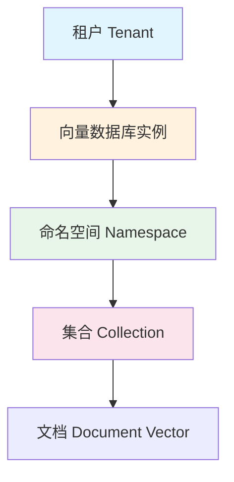
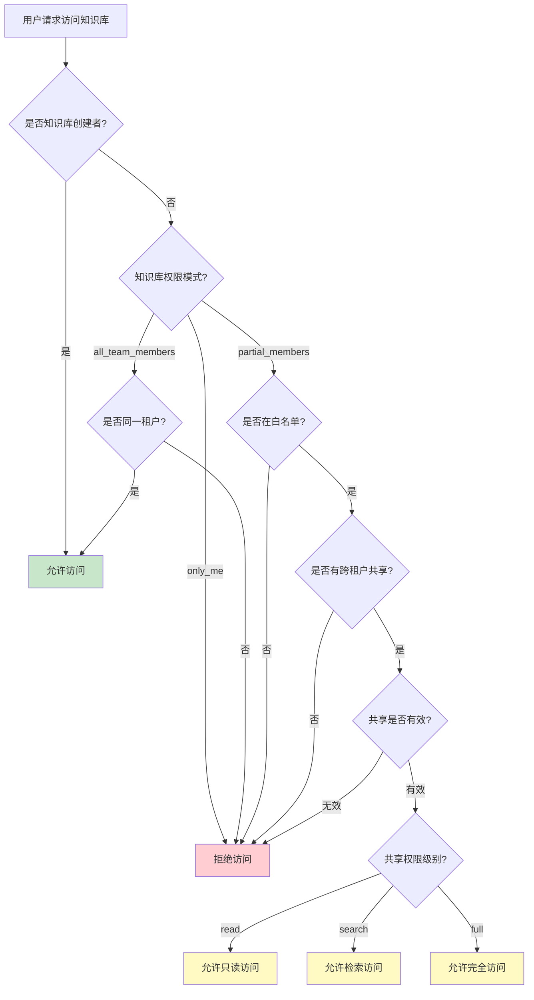
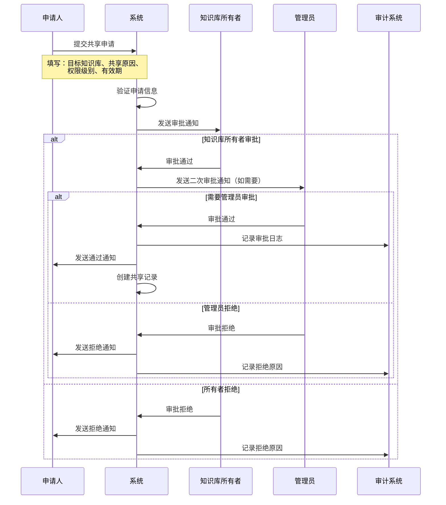
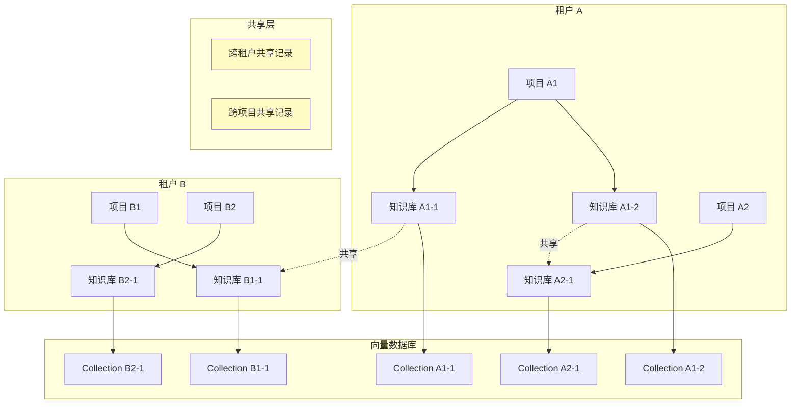
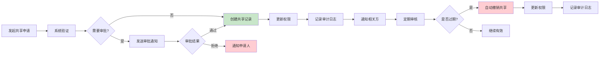
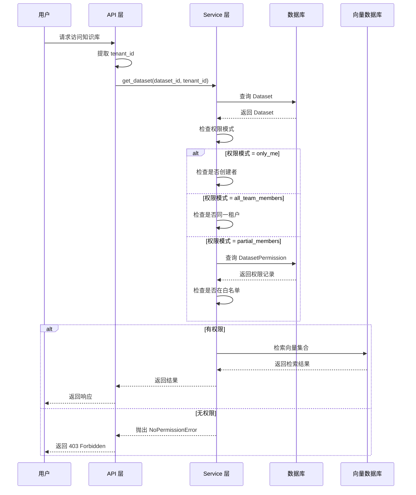

# 知识库隔离与共享审核方案

> **TL;DR**: Dify 知识库通过租户级数据隔离、向量集合隔离和三级权限模型（仅自己/全团队/部分成员）实现数据安全，本文档分析现状并提出跨租户共享、审核流程和细粒度权限控制的增强方案。

## 概述

知识库（Dataset）是 Dify 的核心数据资产，存储企业文档、产品手册、技术规范等关键信息。在多租户和多团队场景下，需要解决两个核心问题：

1. **隔离**：确保不同租户、不同团队的知识库数据互不可见、互不干扰
2. **共享**：在安全可控的前提下，支持知识库在授权范围内跨团队复用

本文档基于 Dify 现有代码实现，分析知识库隔离现状，设计共享机制和审核流程。

## 详细设计

### 1. 知识库现状分析

#### 1.1 数据模型

知识库的核心数据模型围绕 `Dataset` 实体展开，关联文档、分段、权限和向量集合。

| 实体 | 表名 | 隔离字段 | 说明 |
|------|------|---------|------|
| `Dataset` | `datasets` | `tenant_id` | 知识库定义，包含名称、索引策略、检索配置 |
| `Document` | `documents` | `tenant_id`, `dataset_id` | 知识库中的文档，记录处理状态和元数据 |
| `DocumentSegment` | `document_segments` | `tenant_id`, `dataset_id` | 文档分段（Chunk），存储文本内容和向量索引 |
| `DatasetPermission` | `dataset_permissions` | `tenant_id`, `dataset_id`, `account_id` | 细粒度权限记录，控制哪些用户可以访问 |
| `AppDatasetJoin` | `app_dataset_joins` | `dataset_id`, `app_id` | 应用与知识库的关联关系 |

**Dataset 核心字段：**

```python
class Dataset(Base):
    __tablename__ = "datasets"
    
    id: Mapped[str]                              # UUID 主键
    tenant_id: Mapped[str]                       # 租户隔离标识
    name: Mapped[str]                            # 知识库名称
    permission: Mapped[DatasetPermissionEnum]    # 权限模式
    embedding_model: Mapped[str]                 # 嵌入模型
    collection_binding_id: Mapped[str]           # 向量集合绑定 ID
    indexing_technique: Mapped[IndexTechniqueType]  # 索引技术
    retrieval_model: Mapped[dict]                # 检索配置（JSON）
```

#### 1.2 访问控制现状

Dify 当前采用三级权限模型：

| 权限模式 | 枚举值 | 说明 |
|---------|--------|------|
| 仅自己 | `only_me` | 只有创建者可以访问（默认值） |
| 全团队 | `all_team_members` | 同一租户下所有成员可访问 |
| 部分成员 | `partial_members` | 通过 `DatasetPermission` 表白名单控制 |

**权限检查逻辑（`DatasetPermissionService.check_permission`）：**

```python
@classmethod
def check_permission(cls, user, dataset, requested_permission, requested_partial_member_list):
    # 1. 基础角色检查：必须是 dataset_editor 及以上角色
    if not user.is_dataset_editor:
        raise NoPermissionError("User does not have permission to edit this dataset.")
    
    # 2. 操作员限制：dataset_operator 不能修改权限模式
    if user.is_dataset_operator and dataset.permission != requested_permission:
        raise NoPermissionError("Dataset operators cannot change the dataset permissions.")
    
    # 3. 部分成员限制：operator 不能修改成员列表
    if user.is_dataset_operator and requested_permission == "partial_members":
        local_member_list = cls.get_dataset_partial_member_list(dataset.id)
        request_member_list = [user["user_id"] for user in requested_partial_member_list]
        if set(local_member_list) != set(request_member_list):
            raise ValueError("Dataset operators cannot change the dataset permissions.")
```

**角色层级（从高到低）：**

- `owner`：工作空间所有者，拥有所有权限
- `admin`：管理员，拥有大部分权限
- `editor`：编辑者，可以创建和编辑知识库
- `dataset_editor`：知识库编辑者，专门的知识库操作角色
- `normal`：普通成员，只读权限

#### 1.3 向量数据库隔离

每个知识库在向量数据库中拥有独立的集合（Collection），通过命名规则实现物理隔离。

**集合命名规则：**

```
{VECTOR_INDEX_NAME_PREFIX}_{dataset_id_normalized}_Node
```

示例：`Vector_index_abc123def456_Node`

**隔离机制：**

1. **集合级隔离**：每个 Dataset 对应一个独立的向量集合，集合名称包含 Dataset ID，天然隔离
2. **绑定关系**：`collection_binding_id` 字段记录 Dataset 与向量集合的绑定关系
3. **查询隔离**：向量检索时，通过 `collection_name` 参数限定检索范围，不会跨集合查询

**向量数据库抽象层（`VectorBase`）：**

```python
class VectorBase(ABC):
    @abstractmethod
    def create(self, collection_name: str, dimension: int): ...
    
    @abstractmethod
    def add_documents(self, collection_name: str, documents: list[Document]): ...
    
    @abstractmethod
    def search(self, collection_name: str, query_vector: list[float], top_k: int) -> list[Document]: ...
    
    @abstractmethod
    def delete(self, collection_name: str, document_ids: list[str]): ...
```

所有向量数据库实现（Weaviate、Qdrant、Milvus、PGVector 等 30+ 种）都遵循此接口，集合名称作为参数传入，确保隔离逻辑一致。

### 2. 隔离方案设计

#### 2.1 租户级隔离

租户级隔离是 Dify 的基础隔离机制，所有数据操作都强制限定在租户范围内。

**实现方式：**

| 层级 | 隔离手段 | 代码位置 |
|------|---------|---------|
| API 层 | `current_account_with_tenant()` 提取当前租户 ID | `api/libs/login.py` |
| Service 层 | 所有查询强制添加 `tenant_id` 过滤条件 | `api/services/dataset_service.py` |
| Model 层 | `Dataset.tenant_id` 字段 + 数据库索引 | `api/models/dataset.py` |
| 向量层 | 集合名称包含 Dataset ID，间接实现租户隔离 | `api/core/rag/datasource/vdb/` |

**租户隔离查询模式：**

```python
# 所有知识库查询都必须包含 tenant_id
datasets = db.session.scalars(
    select(Dataset).where(
        Dataset.tenant_id == current_tenant_id,
        # 其他过滤条件...
    )
).all()
```

**安全增强建议：**

1. **中间件级租户校验**：在 API 中间件层统一校验 `tenant_id`，避免遗漏
2. **SQL 注入防护**：使用 SQLAlchemy ORM 的参数化查询，禁止拼接 SQL
3. **跨租户访问审计**：记录所有跨租户访问尝试，触发告警

#### 2.2 项目级隔离

项目级隔离在租户内部进一步按团队或项目划分知识库可见性。当前通过 `DatasetPermissionEnum.PARTIAL_TEAM` + `DatasetPermission` 表实现。

**现有机制：**

```python
class DatasetPermission(TypeBase):
    __tablename__ = "dataset_permissions"
    
    dataset_id: Mapped[str]      # 知识库 ID
    account_id: Mapped[str]      # 用户 ID
    tenant_id: Mapped[str]       # 租户 ID
    has_permission: Mapped[bool] # 是否有权限（默认 True）
```

**增强方案：引入项目（Project）概念**

```python
class Project(Base):
    __tablename__ = "projects"
    
    id: Mapped[str]
    tenant_id: Mapped[str]
    name: Mapped[str]
    description: Mapped[str]
    owner_id: Mapped[str]        # 项目负责人

class ProjectDatasetJoin(Base):
    __tablename__ = "project_dataset_joins"
    
    project_id: Mapped[str]
    dataset_id: Mapped[str]
    tenant_id: Mapped[str]
```

**项目级隔离规则：**

1. 知识库可以关联到一个或多个项目
2. 项目成员只能看到该项目关联的知识库
3. 未关联项目的知识库遵循原有的三级权限模型
4. 项目管理员可以管理项目内的知识库分配

#### 2.3 向量数据库隔离策略

向量数据库隔离在现有集合级隔离基础上，增加命名空间（Namespace）和访问控制层。

**隔离层级：**



**命名空间策略：**

| 向量数据库 | 命名空间实现 | 说明 |
|-----------|-------------|------|
| Weaviate | Class + Tenant Filter | 通过 multi-tenancy 特性实现 |
| Qdrant | Collection + Payload Index | 通过 payload 中的 tenant_id 过滤 |
| Milvus | Partition Key | 通过 partition_key 实现租户隔离 |
| PGVector | Schema 或 Table Prefix | 通过 PostgreSQL schema 隔离 |

**增强建议：**

1. **统一命名空间接口**：在 `VectorBase` 中增加 `namespace` 参数，所有向量数据库实现统一支持
2. **向量访问控制**：在向量检索前校验用户对 collection 的访问权限
3. **向量数据脱敏**：跨租户共享时，对向量数据进行脱敏处理（如添加噪声）

### 3. 共享机制设计

#### 3.1 跨租户共享

跨租户共享是高级功能，允许不同工作空间之间共享知识库。典型场景：

- 集团总部向子公司共享政策文档
- 合作伙伴之间共享技术文档
- 多租户 SaaS 场景下的公共知识库

**数据模型设计：**

```python
class CrossTenantSharing(Base):
    __tablename__ = "cross_tenant_sharings"
    
    id: Mapped[str]
    source_tenant_id: Mapped[str]      # 共享方租户 ID
    target_tenant_id: Mapped[str]      # 接收方租户 ID
    dataset_id: Mapped[str]            # 共享的知识库 ID
    permission_level: Mapped[str]      # 共享权限：read / search / full
    status: Mapped[str]                # 状态：pending / active / revoked
    created_by: Mapped[str]            # 创建人
    approved_by: Mapped[str]           # 审批人
    expires_at: Mapped[datetime]       # 过期时间
    created_at: Mapped[datetime]
```

**共享权限级别：**

| 权限级别 | 说明 | 适用场景 |
|---------|------|---------|
| `read` | 只读访问，可以查看知识库内容和检索结果 | 参考文档共享 |
| `search` | 可以检索知识库，但不能查看原始文档 | 知识库引用 |
| `full` | 完全访问，包括编辑和管理 | 协作编辑 |

**共享实现方式：**

1. **元数据共享**：在 `DatasetPermission` 表中添加跨租户记录，查询时扩展 `tenant_id` 过滤条件
2. **向量集合共享**：接收方租户直接访问源租户的向量集合（需要向量数据库支持跨租户查询）
3. **数据同步**：定期将源知识库的数据同步到接收方租户（适用于强隔离场景）

#### 3.2 跨项目共享

跨项目共享在租户内部实现，允许不同项目之间共享知识库。

**数据模型设计：**

```python
class ProjectSharing(Base):
    __tablename__ = "project_sharings"
    
    id: Mapped[str]
    source_project_id: Mapped[str]    # 源项目 ID
    target_project_id: Mapped[str]    # 目标项目 ID
    dataset_id: Mapped[str]           # 共享的知识库 ID
    permission_level: Mapped[str]     # 共享权限
    status: Mapped[str]               # 状态
    created_by: Mapped[str]
    created_at: Mapped[datetime]
```

**共享规则：**

1. 项目管理员可以发起共享请求
2. 目标项目管理员需要审批
3. 共享后，目标项目成员可以按权限级别访问知识库
4. 共享可以随时撤销

#### 3.3 共享权限控制

共享权限控制确保共享过程安全可控。

**权限检查流程：**



**权限矩阵：**

| 操作 | 创建者 | 全团队成员 | 部分成员 | 跨租户共享 |
|------|--------|-----------|---------|-----------|
| 查看知识库列表 | ✅ | ✅ | ✅ | ✅ |
| 查看知识库详情 | ✅ | ✅ | ✅ | ✅（按权限级别） |
| 检索知识库 | ✅ | ✅ | ✅ | ✅（search 及以上） |
| 编辑知识库 | ✅ | ❌ | ❌ | ✅（full） |
| 删除知识库 | ✅ | ❌ | ❌ | ❌ |
| 修改权限 | ✅ | ❌ | ❌ | ❌ |
| 共享给其他租户 | ✅ | ❌ | ❌ | ❌ |

### 4. 审核流程设计

#### 4.1 共享申请流程

共享申请流程确保所有共享操作都经过审批。

**申请流程：**



**申请信息：**

```python
class SharingRequest(BaseModel):
    dataset_id: str                    # 目标知识库 ID
    target_tenant_id: str | None       # 目标租户 ID（跨租户共享）
    target_project_id: str | None      # 目标项目 ID（跨项目共享）
    permission_level: str              # 权限级别：read / search / full
    reason: str                        # 共享原因
    expires_at: datetime | None        # 过期时间（可选）
    require_approval: bool = True      # 是否需要审批
```

#### 4.2 审批流程

审批流程支持多级审批和自动审批规则。

**审批规则：**

| 场景 | 审批人 | 审批级别 | 说明 |
|------|--------|---------|------|
| 租户内共享 | 知识库所有者 | 单级 | 默认规则 |
| 跨租户共享 | 知识库所有者 + 租户管理员 | 双级 | 安全要求高 |
| 公共知识库共享 | 系统管理员 | 单级 | 特殊场景 |
| 自动审批 | 系统 | 自动 | 符合预设规则时自动通过 |

**自动审批规则：**

```python
class AutoApprovalRule(Base):
    __tablename__ = "auto_approval_rules"
    
    id: Mapped[str]
    tenant_id: Mapped[str]
    rule_name: Mapped[str]
    conditions: Mapped[dict]           # 规则条件（JSON）
    auto_permission_level: Mapped[str] # 自动批准的权限级别
    is_active: Mapped[bool]
```

**规则示例：**

1. 同一组织内的只读共享自动批准
2. 标记为"公开"的知识库共享自动批准
3. 有效期小于 7 天的共享自动批准

#### 4.3 自动审核规则

自动审核规则用于检测异常共享行为和合规风险。

**审核规则：**

| 规则 | 检测内容 | 触发动作 |
|------|---------|---------|
| 高频共享检测 | 同一用户短时间内发起大量共享请求 | 告警 + 临时限制 |
| 敏感知识库检测 | 共享包含敏感信息的知识库 | 强制人工审批 |
| 过期共享清理 | 共享记录超过有效期 | 自动撤销共享 |
| 异常访问检测 | 共享后出现异常访问模式 | 告警 + 审计日志 |

**审核日志：**

```python
class SharingAuditLog(Base):
    __tablename__ = "sharing_audit_logs"
    
    id: Mapped[str]
    sharing_id: Mapped[str]            # 共享记录 ID
    action: Mapped[str]                # 操作：create / approve / reject / revoke
    actor_id: Mapped[str]              # 操作人 ID
    actor_type: Mapped[str]            # 操作人类型：user / system
    details: Mapped[dict]              # 操作详情（JSON）
    ip_address: Mapped[str]            # 操作 IP
    created_at: Mapped[datetime]
```

### 5. 权限控制

#### 5.1 细粒度权限

细粒度权限控制支持对知识库的不同操作设置不同的权限。

**权限模型：**

```python
class GranularPermission(Base):
    __tablename__ = "granular_permissions"
    
    id: Mapped[str]
    dataset_id: Mapped[str]
    account_id: Mapped[str]
    tenant_id: Mapped[str]
    
    # 细粒度权限
    can_view: Mapped[bool]             # 查看权限
    can_search: Mapped[bool]           # 检索权限
    can_edit: Mapped[bool]             # 编辑权限
    can_delete: Mapped[bool]           # 删除权限
    can_share: Mapped[bool]            # 共享权限
    can_manage_permission: Mapped[bool] # 权限管理
    
    created_at: Mapped[datetime]
    updated_at: Mapped[datetime]
```

**权限模板：**

| 模板名称 | can_view | can_search | can_edit | can_delete | can_share | can_manage |
|---------|----------|------------|----------|------------|-----------|------------|
| 只读 | ✅ | ✅ | ❌ | ❌ | ❌ | ❌ |
| 检索者 | ✅ | ✅ | ❌ | ❌ | ❌ | ❌ |
| 编辑者 | ✅ | ✅ | ✅ | ❌ | ❌ | ❌ |
| 管理员 | ✅ | ✅ | ✅ | ✅ | ✅ | ✅ |

#### 5.2 动态权限

动态权限根据上下文条件动态调整用户权限。

**动态权限因素：**

| 因素 | 说明 | 示例 |
|------|------|------|
| 时间 | 根据时间段调整权限 | 工作时间可访问，非工作时间限制 |
| 地点 | 根据地理位置调整权限 | 公司内网可访问，外网限制 |
| 设备 | 根据设备类型调整权限 | 公司设备可访问，个人设备限制 |
| 行为 | 根据用户行为调整权限 | 异常行为触发权限降级 |

**动态权限评估：**

```python
class DynamicPermissionEvaluator:
    def evaluate(self, user: Account, dataset: Dataset, context: RequestContext) -> PermissionResult:
        score = 100  # 基础分数
        
        # 时间因素
        if not self._is_work_hours(context.timestamp):
            score -= 20
        
        # 地点因素
        if not self._is_trusted_location(context.ip_address):
            score -= 30
        
        # 设备因素
        if not self._is_trusted_device(context.device_id):
            score -= 20
        
        # 行为因素
        if self._has_suspicious_behavior(user.id, dataset.id):
            score -= 50
        
        # 根据分数决定权限级别
        if score >= 80:
            return PermissionResult.FULL_ACCESS
        elif score >= 50:
            return PermissionResult.READ_ONLY
        else:
            return PermissionResult.DENIED
```

#### 5.3 权限审计

权限审计确保所有权限变更可追溯。

**审计日志：**

```python
class PermissionAuditLog(Base):
    __tablename__ = "permission_audit_logs"
    
    id: Mapped[str]
    dataset_id: Mapped[str]
    account_id: Mapped[str]
    tenant_id: Mapped[str]
    
    action: Mapped[str]                # 操作：grant / revoke / modify
    permission_type: Mapped[str]       # 权限类型：basic / granular / sharing
    old_value: Mapped[dict]            # 变更前权限（JSON）
    new_value: Mapped[dict]            # 变更后权限（JSON）
    reason: Mapped[str]                # 变更原因
    actor_id: Mapped[str]              # 操作人 ID
    ip_address: Mapped[str]            # 操作 IP
    created_at: Mapped[datetime]
```

**审计报告：**

定期生成权限审计报告，包含：

1. **权限概览**：各知识库的权限分布统计
2. **异常权限**：检测异常权限分配（如非管理员拥有编辑权限）
3. **权限变更历史**：记录所有权限变更操作
4. **合规检查**：检查是否符合预设的权限策略

## 附录

### A. 知识库隔离架构图



### B. 共享流程图



### C. 权限检查时序图



## 变更日志

| 版本 | 日期 | 变更内容 |
|------|------|---------|
| 1.0 | 2026-07-19 | 初始版本，涵盖现状分析、隔离方案、共享机制、审核流程、权限控制 |
