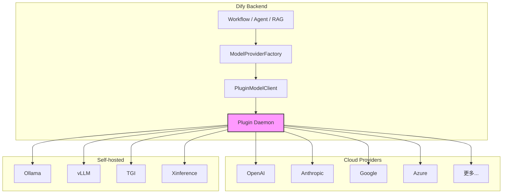
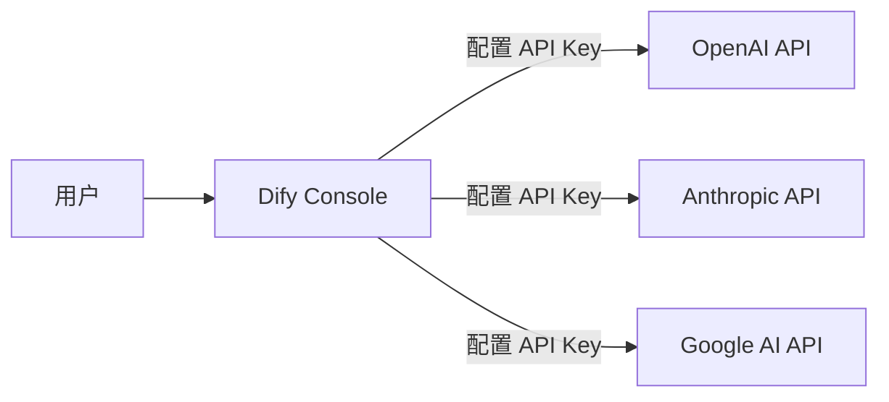
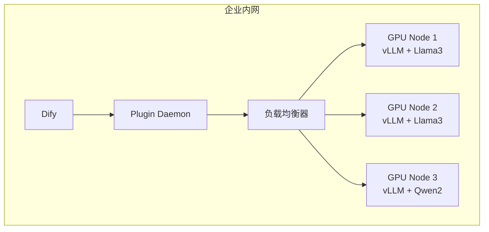
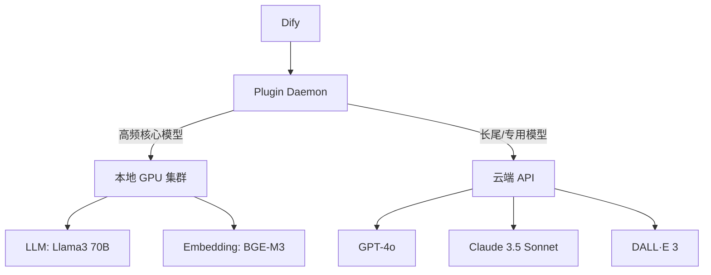
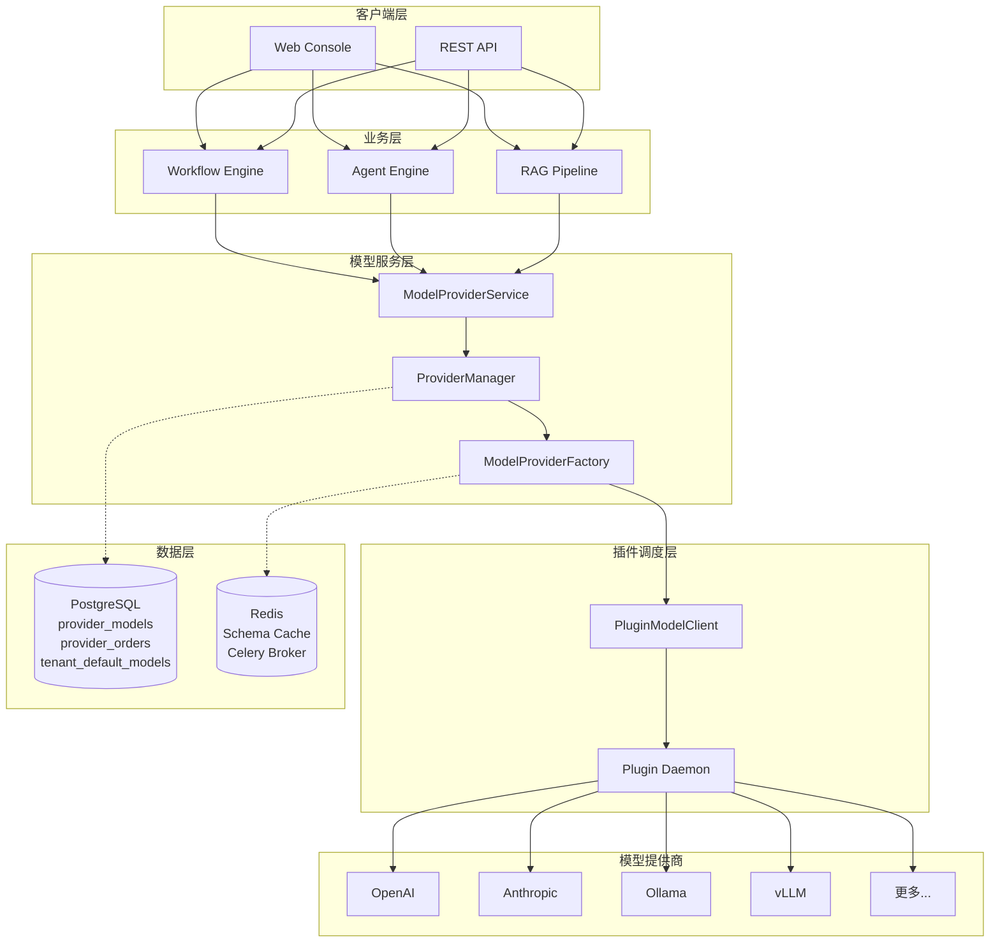

# 模型部署架构

> **TL;DR**: Dify 通过插件化的模型运行时（Model Runtime）统一接入数百个模型提供商，支持云端 API、本地 GPU 集群和混合部署三种模式，配合多凭证管理和模型级负载均衡实现高可用推理。

## 概述

Dify 的模型部署架构围绕「插件化 + 多提供商 + 高可用」三个核心目标设计。后端通过 `model_runtime` 层抽象出统一的模型调用接口，上层业务（Workflow、Agent、RAG 等）无需关心底层模型来自 OpenAI、Anthropic 还是自建的 Ollama 实例。

整个体系可以拆成四层：

- **模型运行时层**（`api/core/model_runtime/`）：定义模型类型、参数规则、调用协议
- **插件调度层**（`api/core/plugin/`）：通过 Plugin Daemon 对接外部模型插件
- **提供商管理层**（`api/core/provider_manager.py`）：管理凭证、配额、偏好、负载均衡
- **数据持久层**（`api/models/provider.py`）：存储租户级模型配置和凭证

## 详细设计

### 1. 现状分析

#### 1.1 支持的模型类型

Dify 定义了 6 种标准模型类型，覆盖主流 AI 能力：

| 模型类型 | 枚举值 | 典型用途 |
|---------|--------|---------|
| LLM | `llm` | 文本生成、对话、Agent 推理 |
| Text Embedding | `text-embedding` | 向量化，用于 RAG 检索 |
| Rerank | `rerank` | 检索结果重排序 |
| Speech2Text | `speech2text` | 语音识别 |
| TTS | `tts` | 文本转语音 |
| Moderation | `moderation` | 内容审核 |

每种类型对应一个模型实例类（如 `LargeLanguageModel`、`TextEmbeddingModel`），由 `ModelProviderFactory.get_model_type_instance()` 根据类型分发创建。

#### 1.2 模型提供商接入方式

提供商通过两种配置方式接入：

| 方式 | 枚举值 | 说明 |
|------|--------|------|
| 预定义模型 | `predefined-model` | 提供商声明一组固定模型（如 GPT-4o、Claude 3.5 Sonnet） |
| 可自定义模型 | `customizable-model` | 用户可手动添加任意模型名称（常见于 OpenAI 兼容接口） |

提供商的声明信息（`ProviderEntity`）包含：

- `provider`：提供商唯一标识（如 `openai`、`anthropic`）
- `supported_model_types`：支持的模型类型列表
- `configurate_methods`：配置方式列表
- `provider_credential_schema`：提供商级凭证表单（API Key 等）
- `model_credential_schema`：模型级凭证表单（用于自定义模型）

#### 1.3 插件化架构

Dify 的模型调用已全面迁移到插件体系。核心流程：

```
用户请求 → Controller → Service → ProviderConfiguration → ModelProviderFactory
    → PluginModelClient → Plugin Daemon (HTTP) → 模型插件 → 实际模型 API
```

`PluginModelClient` 封装了与 Plugin Daemon 的所有通信，按模型类型分发到不同端点：

| 操作 | Plugin Daemon 端点 |
|------|-------------------|
| 获取提供商列表 | `GET /plugin/{tenant_id}/management/models` |
| 获取模型 Schema | `POST /plugin/{tenant_id}/dispatch/model/schema` |
| 调用 LLM | `POST /plugin/{tenant_id}/dispatch/llm/invoke` |
| 调用 Text Embedding | `POST /plugin/{tenant_id}/dispatch/text_embedding/invoke` |
| 调用 Rerank | `POST /plugin/{tenant_id}/dispatch/rerank/invoke` |
| 调用 TTS | `POST /plugin/{tenant_id}/dispatch/tts/invoke` |
| 调用 Speech2Text | `POST /plugin/{tenant_id}/dispatch/speech2text/invoke` |
| 调用 Moderation | `POST /plugin/{tenant_id}/dispatch/moderation/invoke` |

每个请求通过 `X-Plugin-ID` Header 路由到对应的模型插件。

#### 1.4 凭证与配额管理

Dify 的凭证体系分为两层：

**提供商级凭证**（`ProviderCredentialSchema`）：
- 一套凭证作用于该提供商下所有模型
- 例如 OpenAI 的 API Key

**模型级凭证**（`ModelCredentialSchema`）：
- 每个模型独立配置凭证
- 适用于自定义模型或需要多账号隔离的场景

配额管理针对云端托管模式（`ProviderType.SYSTEM`），支持三种配额类型：

| 配额类型 | 说明 |
|---------|------|
| `PAID` | 付费配额 |
| `FREE` | 第三方免费配额 |
| `TRIAL` | 托管试用配额 |

优先级：付费配额 > 免费配额 > 试用配额。任一配额有效即视为可用。

#### 1.5 偏好与降级

每个提供商有一个 `preferred_provider_type`（`SYSTEM` 或 `CUSTOM`），决定优先使用托管配额还是用户自己的凭证。当首选不可用时自动降级：

- 首选 `SYSTEM` 但无有效配额 → 降级到 `CUSTOM`
- 首选 `CUSTOM` 但未配置凭证 → 降级到 `SYSTEM`

### 2. 目标架构设计

#### 2.1 多模型提供商集成



Plugin Daemon 作为统一网关，屏蔽了不同提供商的协议差异。新增提供商只需开发对应插件，无需修改 Dify 核心代码。

#### 2.2 本地模型部署

对于需要数据隐私或降低延迟的场景，Dify 支持对接本地推理服务：

| 推理框架 | 部署方式 | 适用场景 |
|---------|---------|---------|
| Ollama | Docker / 原生 | 个人开发、小规模部署 |
| vLLM | Docker / Kubernetes | 高吞吐生产环境 |
| TGI (Text Generation Inference) | Docker / Kubernetes | Hugging Face 模型 |
| Xinference | Docker | 多模型混合调度 |

本地模型通过 OpenAI 兼容接口接入，使用 `customizable-model` 配置方式添加。

#### 2.3 版本管理

模型版本通过模型名称隐式管理。提供商插件负责将模型名称映射到具体版本：

- 固定版本：`gpt-4o-2024-08-06`
- 动态版本：`gpt-4o`（由提供商决定指向哪个快照）

`AIModelEntity` 中的 `deprecated` 字段标记已废弃模型，前端自动灰显提示。

#### 2.4 性能监控

模型调用的可观测性通过多层机制实现：

- **Callback 体系**：`LargeLanguageModel.invoke()` 在调用前后触发 `on_before_invoke`、`on_new_chunk`、`on_after_invoke`、`on_invoke_error` 事件
- **Usage 追踪**：每次调用返回 `LLMUsage`，包含 token 数、延迟、费用
- **外部集成**：支持 Langfuse、LangSmith、Arize Phoenix、Opik、MLflow 等 LLM 可观测平台
- **OpenTelemetry**：分布式追踪覆盖 Plugin Daemon 调用链路

### 3. 部署方案

#### 3.1 云端 API 集成

最简单的部署方式。用户只需在 Dify 控制台配置各提供商的 API Key：



**优点**：零运维，按需付费，快速上手。
**缺点**：依赖外部服务可用性，数据经过第三方，延迟受网络影响。

#### 3.2 本地 GPU 集群部署

适合对数据隐私有要求或调用量大的团队：



**关键配置**：
- 推理框架选择：vLLM（高吞吐）、TGI（Hugging Face 生态）、Ollama（轻量）
- GPU 资源隔离：按模型类型分配 GPU（LLM 用 A100/H100，Embedding 用 T4）
- 模型热更新：通过 Plugin Daemon 动态加载新模型，无需重启 Dify

#### 3.3 混合部署

生产环境最常见的模式，核心模型走本地，长尾模型走云端：



**路由策略**：
- 通过 `preferred_provider_type` 控制默认走本地还是云端
- 通过模型级负载均衡（见下节）实现多实例分流
- 通过 `ModelSettings.enabled` 快速开关某个模型

### 4. 负载均衡策略

#### 4.1 模型级负载均衡

Dify 支持为单个模型配置多套凭证，实现请求级别的负载均衡：

```python
# 数据模型（api/core/entities/provider_entities.py）
class ModelSettings(BaseModel):
    model: str
    model_type: ModelType
    enabled: bool = True
    load_balancing_enabled: bool = False
    load_balancing_configs: list[ModelLoadBalancingConfiguration] = []

class ModelLoadBalancingConfiguration(BaseModel):
    id: str
    name: str
    credentials: dict
```

启用负载均衡后，同一模型的多次调用会分散到不同的凭证（对应不同的 API Key 或不同的推理实例），从而：

- 突破单账号 QPM/TPM 限制
- 在某个凭证失效时自动切换到其他凭证
- 跨多个推理实例分摊负载

#### 4.2 故障转移

故障转移依赖提供商偏好降级和负载均衡的组合：

1. **凭证级故障转移**：负载均衡下某个凭证调用失败，自动尝试下一个
2. **提供商级降级**：`preferred_provider_type` 首选不可用时降级到备选类型（SYSTEM ↔ CUSTOM）
3. **配额级降级**：托管模式下付费配额耗尽后自动切换到免费配额或试用配额

#### 4.3 成本控制

| 机制 | 说明 |
|------|------|
| 配额限制 | `QuotaConfiguration` 设置硬性配额上限（`quota_limit`），用完即停 |
| 定价信息 | `AIModelEntity.pricing` 包含输入/输出单价，用于费用计算 |
| 模型开关 | `ModelSettings.enabled` 可快速禁用高成本模型 |
| 默认模型 | `TenantDefaultModel` 控制各类型默认使用的模型，避免意外调用高价模型 |

### 5. 性能优化建议

#### 5.1 缓存策略

Dify 在模型 Schema 层实现了 Redis 缓存：

```python
# api/dify_graph/model_runtime/model_providers/model_provider_factory.py
cache_key = f"{tenant_id}:{plugin_id}:{provider_name}:{model_type.value}:{model}"
cache_key += ":".join([hashlib.md5(f"{k}:{v}".encode()).hexdigest() for k, v in sorted_credentials])

# 读取缓存
cached_schema_json = redis_client.get(cache_key)
if cached_schema_json:
    return AIModelEntity.model_validate_json(cached_schema_json)

# 写入缓存（TTL 由 PLUGIN_MODEL_SCHEMA_CACHE_TTL 控制）
redis_client.setex(cache_key, dify_config.PLUGIN_MODEL_SCHEMA_CACHE_TTL, schema.model_dump_json())
```

缓存键包含租户、插件、提供商、模型类型、模型名称和凭证哈希，确保不同配置不会串扰。TTL 通过环境变量 `PLUGIN_MODEL_SCHEMA_CACHE_TTL` 配置。

**建议**：
- 对频繁调用的模型适当延长 Schema 缓存 TTL
- 监控 Redis 内存占用，避免缓存键过多

#### 5.2 流式响应

LLM 调用默认启用流式（`stream=True`），通过 SSE（Server-Sent Events）逐 chunk 返回：

```python
# LargeLanguageModel.invoke() 返回 Generator
if stream and not isinstance(result, LLMResult):
    return self._invoke_result_generator(...)
```

流式响应的优势：
- 首 token 延迟（TTFT）显著降低
- 用户感知等待时间缩短
- 内存占用更平稳（无需缓存完整响应）

#### 5.3 异步调用

Dify 通过 Celery 将耗时任务异步化：

- 文档解析和向量化走 Celery Worker
- Workflow 执行可异步运行
- 邮件、通知等非关键路径异步处理

对于模型调用本身，当前通过 gevent 协程实现并发（Gunicorn worker 基于 gevent），单请求内多次模型调用（如 Workflow 中的并行分支）可并发执行。

#### 5.4 批处理

Text Embedding 和 Rerank 天然支持批处理：

```python
# Text Embedding 接受 texts 列表
def invoke_text_embedding(self, ..., texts: list[str], ...):
    ...

# Rerank 接受 docs 列表
def invoke_rerank(self, ..., query: str, docs: list[str], ...):
    ...
```

**建议**：
- RAG 管道中批量向量化文档片段，减少网络往返
- Rerank 时一次性传入所有候选文档

#### 5.5 Token 计数优化

Dify 支持两种 Token 计数方式：

- **插件化计数**（`PLUGIN_BASED_TOKEN_COUNTING_ENABLED=True`）：通过 Plugin Daemon 调用提供商的 tokenizer，精确但有一次网络往返
- **本地计数**（默认关闭）：使用本地 tiktoken/transformers 计算，零延迟但需维护 tokenizer 文件

**建议**：
- 对延迟敏感的场景关闭插件化计数，使用本地 tokenizer
- 对精度要求高的场景（如计费）启用插件化计数

## 附录

### A. 模型部署架构图



### B. 支持的模型提供商清单

Dify 通过插件体系支持数百个模型提供商，以下列出主要类别：

| 类别 | 代表提供商 |
|------|-----------|
| 国际大厂 | OpenAI、Anthropic、Google、Azure、Cohere、Mistral |
| 国内大厂 | 通义千问、智谱 AI、百度文心、讯飞星火、月之暗面、MiniMax、百川 |
| 开源推理 | Ollama、vLLM、TGI、Xinference、LocalAI |
| 多模型聚合 | OpenRouter、LiteLLM、One API |
| 专项能力 | ElevenLabs（TTS）、Whisper（Speech2Text）、BGE（Embedding） |

完整列表可通过 Dify 控制台的「设置 → 模型供应商」页面查看，或调用 `GET /console/api/workspaces/current/model-providers` 接口获取。

### C. 核心数据模型

| 数据模型 | 表名 | 用途 |
|---------|------|------|
| `Provider` | `providers` | 租户级提供商订单记录 |
| `ProviderModel` | `provider_models` | 租户级模型配置和凭证引用 |
| `ProviderModelCredential` | `provider_model_credentials` | 加密存储的凭证数据 |
| `TenantDefaultModel` | `tenant_default_models` | 各模型类型的默认模型选择 |
| `TenantPreferredModelProvider` | `tenant_preferred_model_providers` | 提供商偏好类型（SYSTEM/CUSTOM） |
| `ProviderModelSetting` | `provider_model_settings` | 模型开关和负载均衡配置 |
| `ProviderModelLoadBalancingConfig` | `provider_model_load_balancing_configs` | 模型级负载均衡凭证配置 |

## 变更日志

| 日期 | 版本 | 变更内容 |
|------|------|---------|
| 2026-07-19 | 1.0 | 初始版本，基于代码分析编写 |
