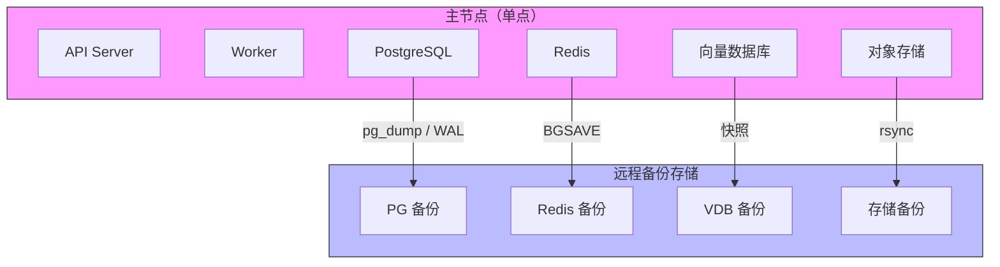
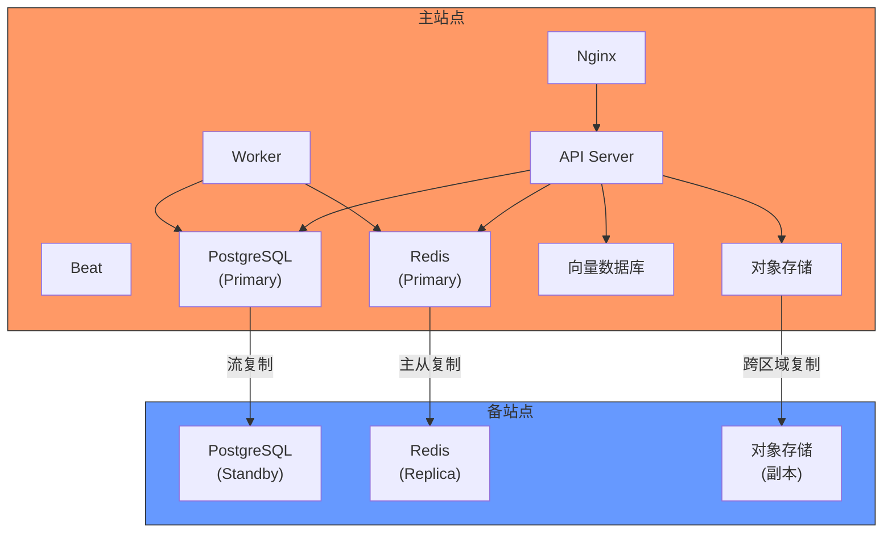
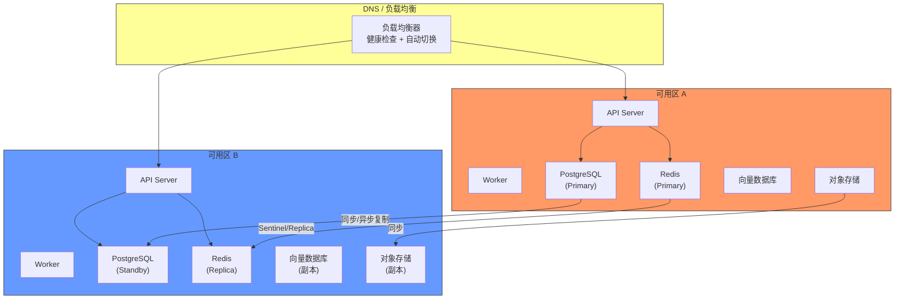
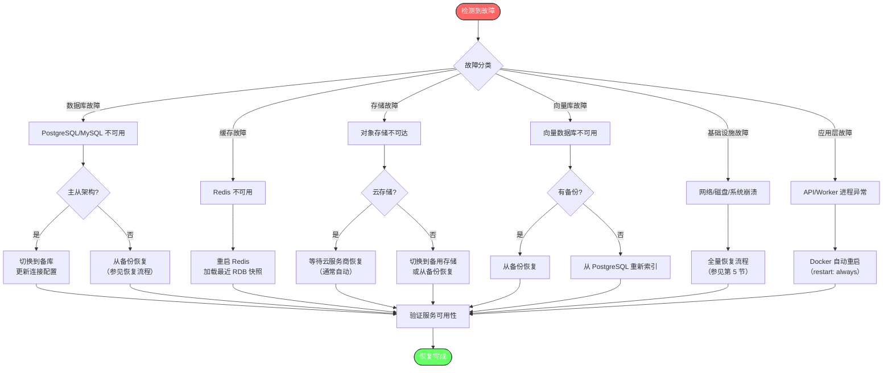
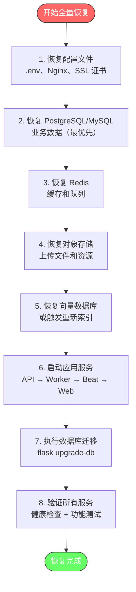
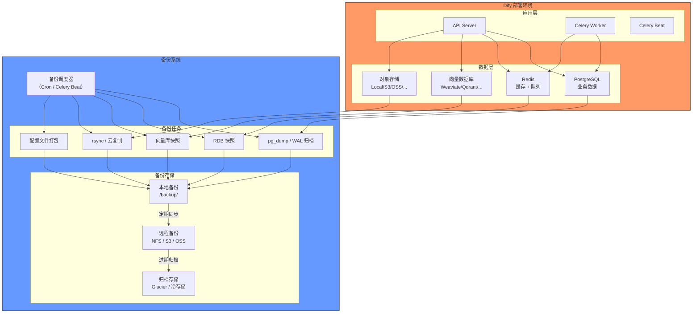
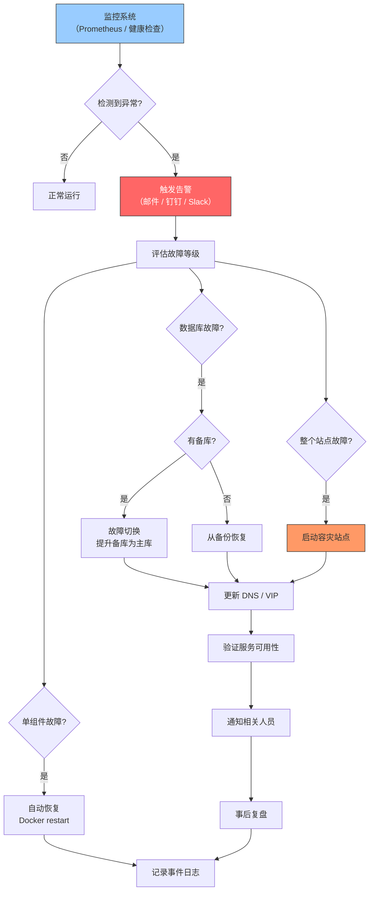

# 备份与容灾

> **TL;DR**: Dify 的备份与容灾方案覆盖四层数据存储（PostgreSQL/MySQL、Redis、向量数据库、对象存储），通过分级 RPO 目标、全量与增量结合的备份策略、以及多等级容灾架构，确保业务数据在故障场景下可快速恢复。

## 概述

Dify 作为 LLM 应用开发平台，其数据资产涵盖用户账号、应用配置、对话记录、知识库文档及向量索引、上传文件等。这些数据分布在四个独立的存储层中，每层数据的业务重要性和变更频率各不相同，需要差异化的备份与容灾策略。

**核心设计原则：**

- **分级保护**：按数据重要性划分 RPO/RTO 目标，核心业务数据（数据库）优先保护
- **存储解耦**：各存储层独立备份和恢复，互不依赖，避免级联故障
- **最小数据丢失**：关键数据实现小时级甚至分钟级 RPO
- **快速恢复**：提供标准化恢复流程和自动化脚本，降低人为操作风险
- **定期验证**：备份有效性通过定期恢复演练保证

## 详细设计

### 1. 备份需求分析

#### 1.1 数据分类与重要性

| 数据类别 | 存储位置 | 重要性 | 变更频率 | 可重建性 |
|----------|----------|--------|----------|----------|
| 业务数据（用户、应用、对话、消息） | PostgreSQL/MySQL | 极高 | 高（实时写入） | 不可重建 |
| 知识库元数据（Dataset、Document、Segment） | PostgreSQL/MySQL | 极高 | 中 | 不可重建 |
| 向量索引 | 向量数据库（Weaviate/Qdrant/Milvus 等） | 高 | 中（随文档更新） | 可从原始文档重建 |
| 上传文件（图片、文档） | 对象存储（本地/S3/OSS 等） | 高 | 低 | 不可重建 |
| 缓存数据 | Redis | 低 | 极高（秒级变化） | 可自动重建 |
| 任务队列 | Redis（Celery Broker） | 中 | 极高 | 任务可重发 |
| 插件数据 | Plugin Daemon 存储 | 中 | 低 | 可从市场重新安装 |
| 配置文件 | `.env`、Nginx 配置 | 高 | 极低 | 需人工重建 |

#### 1.2 RPO 与 RTO 目标

| 数据类别 | RPO（恢复点目标） | RTO（恢复时间目标） | 说明 |
|----------|-------------------|---------------------|------|
| PostgreSQL/MySQL（业务数据） | ≤ 1 小时 | ≤ 4 小时 | 核心数据，丢失不可接受 |
| 向量数据库 | ≤ 24 小时 | ≤ 8 小时 | 可从原始文档重新索引 |
| 对象存储 | ≤ 24 小时 | ≤ 4 小时 | 云存储自带冗余，本地需额外备份 |
| Redis | ≤ 5 分钟 | ≤ 1 小时 | 缓存可重建，队列任务可重发 |
| 配置文件 | ≤ 24 小时 | ≤ 2 小时 | 纳入版本管理 |

#### 1.3 备份范围

```
docker/volumes/
├── db/data/              # PostgreSQL 数据目录（核心）
├── mysql/data/           # MySQL 数据目录（备选）
├── redis/data/           # Redis 持久化数据
├── weaviate/             # Weaviate 向量数据（默认向量库）
├── app/storage/          # 应用文件存储（上传文件、工具文件）
├── plugin_daemon/        # 插件存储
├── sandbox/              # 沙箱依赖和配置
└── certbot/              # SSL 证书

docker/
├── .env                  # 环境变量配置
├── nginx/                # Nginx 配置
└── ssrf_proxy/           # SSRF 代理配置
```

### 2. 备份策略设计

#### 2.1 备份类型

| 备份类型 | 适用场景 | 频率 | 存储开销 | 恢复速度 |
|----------|----------|------|----------|----------|
| 全量备份 | 基础备份、灾备归档 | 每周日 02:00 | 大 | 快 |
| 增量备份 | 日常备份 | 每日 02:00（除周日） | 小 | 慢（需链式恢复） |
| 差异备份 | 折中方案 | 每日 02:00（除周日） | 中 | 中（仅需全量 + 最新差异） |
| WAL 归档（PostgreSQL） | 持续保护 | 实时 | 中 | 精确到时间点 |
| 快照备份 | 快速备份、云环境 | 可配置 | 取决于变化量 | 快 |

#### 2.2 推荐备份频率

```mermaid
gantt
    title 备份调度时间线（一周）
    dateFormat  HH:mm
    axisFormat  %H:%M
    
    section PostgreSQL
    WAL 归档（持续）        :active, wal, 00:00, 7d
    增量备份               :inc_pg, 2026-07-20 02:00, 60min
    增量备份               :inc_pg2, 2026-07-21 02:00, 60min
    增量备份               :inc_pg3, 2026-07-22 02:00, 60min
    增量备份               :inc_pg4, 2026-07-23 02:00, 60min
    增量备份               :inc_pg5, 2026-07-24 02:00, 60min
    增量备份               :inc_pg6, 2026-07-25 02:00, 60min
    全量备份               :full_pg, 2026-07-26 02:00, 120min
    
    section Redis
    RDB 快照（每 15 分钟）  :active, rdb, 00:00, 7d
    
    section 对象存储
    增量同步               :inc_os, 2026-07-20 03:00, 90min
    增量同步               :inc_os2, 2026-07-21 03:00, 90min
    增量同步               :inc_os3, 2026-07-22 03:00, 90min
    增量同步               :inc_os4, 2026-07-23 03:00, 90min
    增量同步               :inc_os5, 2026-07-24 03:00, 90min
    增量同步               :inc_os6, 2026-07-25 03:00, 90min
    全量同步               :full_os, 2026-07-26 03:00, 180min
    
    section 向量数据库
    快照备份               :snap_vdb, 2026-07-20 04:00, 120min
    快照备份               :snap_vdb2, 2026-07-22 04:00, 120min
    快照备份               :snap_vdb3, 2026-07-24 04:00, 120min
    快照备份               :snap_vdb4, 2026-07-26 04:00, 120min
    
    section 配置文件
    版本管理               :active, cfg, 00:00, 7d
```



#### 2.3 备份保留策略

| 备份类型 | 保留周期 | 保留数量 | 说明 |
|----------|----------|----------|------|
| 全量备份 | 90 天 | 最近 12 份 | 按周保留 |
| 增量/差异备份 | 30 天 | 最近 30 份 | 按日保留 |
| WAL 归档 | 7 天 | 随全量备份清理 | 配合全量备份使用 |
| Redis RDB | 7 天 | 最近 7 份 | 每日一份 |
| 配置文件 | 永久 | 通过 Git 管理 | 版本化存储 |

### 3. 数据备份方案

#### 3.1 PostgreSQL 备份

PostgreSQL 是 Dify 的默认主数据库，存储所有业务数据。推荐三种备份方式，按优先级排列。

**方式一：逻辑备份（pg_dump）**

适用于中小规模数据（< 50GB），备份文件可跨版本恢复。

```bash
#!/bin/bash
# postgresql_backup.sh - PostgreSQL 逻辑备份脚本

BACKUP_DIR="/backup/postgresql"
TIMESTAMP=$(date +%Y%m%d_%H%M%S)
RETENTION_DAYS=30

# 从 .env 读取配置
source /path/to/dify/docker/.env

# 创建备份目录
mkdir -p "${BACKUP_DIR}"

# 执行全量逻辑备份（自定义格式，支持并行恢复）
pg_dump \
  -h "${DB_HOST:-localhost}" \
  -p "${DB_PORT:-5432}" \
  -U "${DB_USERNAME}" \
  -d "${DB_DATABASE}" \
  -Fc \
  -Z 6 \
  -f "${BACKUP_DIR}/dify_full_${TIMESTAMP}.dump"

# 备份成功日志
echo "[$(date)] Full backup completed: dify_full_${TIMESTAMP}.dump"

# 清理过期备份
find "${BACKUP_DIR}" -name "dify_full_*.dump" -mtime +${RETENTION_DAYS} -delete
```

**方式二：WAL 归档（持续保护）**

适用于生产环境，支持时间点恢复（PITR），RPO 接近零。

```bash
# postgresql.conf 配置
wal_level = replica
archive_mode = on
archive_command = 'cp %p /backup/postgresql/wal/%f'
archive_timeout = 60          # 最多 60 秒强制归档一次
max_wal_senders = 5
wal_keep_size = 1GB

# 配合 pg_basebackup 做基础备份
pg_basebackup \
  -h "${DB_HOST}" \
  -p "${DB_PORT}" \
  -U "${DB_USERNAME}" \
  -D "/backup/postgresql/base_$(date +%Y%m%d)" \
  -Ft -z -P
```

**方式三：文件系统快照**

适用于 Docker 部署，配合存储层快照能力。

```bash
# 停止写入（短暂停服）
docker compose stop api worker worker_beat

# 快照 PostgreSQL 数据卷
# 具体命令取决于存储后端（LVM、云盘快照等）
# 示例：LVM 快照
lvcreate -L 10G -s -n pg_snapshot /dev/vg/data

# 恢复服务
docker compose start api worker worker_beat
```

**PostgreSQL 备份对比：**

| 方式 | RPO | 备份速度 | 恢复速度 | 复杂度 | 适用场景 |
|------|-----|----------|----------|--------|----------|
| pg_dump | 备份时刻 | 慢 | 慢 | 低 | 开发/测试、小数据量 |
| WAL 归档 | 接近零 | 快（持续） | 快 | 高 | 生产环境、大数据量 |
| 文件系统快照 | 快照时刻 | 极快 | 极快 | 中 | Docker 部署、云环境 |

#### 3.2 MySQL 备份

当 `DB_TYPE=mysql` 时，使用 MySQL 作为主数据库。

```bash
#!/bin/bash
# mysql_backup.sh - MySQL 备份脚本

BACKUP_DIR="/backup/mysql"
TIMESTAMP=$(date +%Y%m%d_%H%M%S)

source /path/to/dify/docker/.env

mkdir -p "${BACKUP_DIR}"

# 全量备份（单事务保证一致性）
mysqldump \
  -h "${DB_HOST:-localhost}" \
  -P "${DB_PORT:-3306}" \
  -u "${DB_USERNAME}" \
  -p"${DB_PASSWORD}" \
  --single-transaction \
  --routines \
  --triggers \
  --databases "${DB_DATABASE}" \
  | gzip > "${BACKUP_DIR}/dify_full_${TIMESTAMP}.sql.gz"

echo "[$(date)] MySQL backup completed: dify_full_${TIMESTAMP}.sql.gz"
```

#### 3.3 Redis 备份

Redis 在 Dify 中承担缓存和 Celery 消息队列 Broker 双重角色。数据可重建，但队列中的待处理任务需要保护。

**RDB 快照（默认推荐）：**

```bash
# 触发 Redis 后台保存
docker compose exec redis redis-cli -a "${REDIS_PASSWORD}" BGSAVE

# 复制 RDB 文件到备份目录
cp docker/volumes/redis/data/dump.rdb /backup/redis/dump_$(date +%Y%m%d_%H%M%S).rdb
```

**AOF 持久化（更细粒度保护）：**

```conf
# redis.conf 配置
appendonly yes
appendfsync everysec        # 每秒同步，RPO ≤ 1 秒
auto-aof-rewrite-percentage 100
auto-aof-rewrite-min-size 64mb
```

**Redis 备份注意事项：**

- Redis 作为 Celery Broker 时，队列中的消息在消费后自动删除。未消费的任务在 Redis 恢复后会保留
- 缓存数据无需备份，应用启动后自动重建
- 如果使用了 Redis Sentinel 或 Cluster 模式，需备份所有节点的配置

#### 3.4 向量数据库备份

Dify 支持 20+ 种向量数据库。向量数据可从原始文档重新索引生成，因此 RPO 要求相对宽松。

**Weaviate（默认向量库）备份：**

```bash
#!/bin/bash
# weaviate_backup.sh - Weaviate 备份脚本

BACKUP_DIR="/backup/weaviate"
TIMESTAMP=$(date +%Y%m%d_%H%M%S)

mkdir -p "${BACKUP_DIR}"

# 方式一：通过 Weaviate Backup API（推荐）
# 创建备份
curl -X POST "http://localhost:8080/v1/backups/filesystem" \
  -H "Content-Type: application/json" \
  -d "{\"id\": \"backup_${TIMESTAMP}\", \"include\": []}"

# 等待备份完成（轮询状态）
# 备份文件存储在 Weaviate 容器的 /var/lib/weaviate/backups/ 目录

# 方式二：直接备份数据卷（需停止服务）
docker compose stop weaviate
tar -czf "${BACKUP_DIR}/weaviate_${TIMESTAMP}.tar.gz" \
  -C docker/volumes/weaviate .
docker compose start weaviate
```

**Qdrant 备份：**

```bash
# Qdrant 提供快照 API
curl -X POST "http://localhost:6333/collections/{collection_name}/snapshots"

# 或直接备份数据卷
docker compose stop qdrant
tar -czf "/backup/qdrant/qdrant_$(date +%Y%m%d).tar.gz" \
  -C docker/volumes/qdrant/storage .
docker compose start qdrant
```

**Milvus 备份：**

```bash
# Milvus 依赖 etcd 和 MinIO，需同时备份三个组件
# 1. 备份 etcd（元数据）
docker compose exec etcd etcdctl snapshot save /backup/etcd_snap.db

# 2. 备份 MinIO（对象存储）
# 通过 MinIO Client 同步
mc mirror minio/dify-milvus /backup/milvus/minio/

# 3. 可选：备份 Milvus 数据目录
```

**PGVector 备份：**

PGVector 数据存储在 PostgreSQL 中，随主数据库一起备份，无需单独处理。

**向量数据库重建流程：**

当向量数据库完全丢失时，可从 PostgreSQL 中的 `document_segments` 表重建：

```
1. 部署并初始化空的向量数据库
2. 从 PostgreSQL 查询所有活跃的 DocumentSegment 记录
3. 按 Dataset 分组，重新调用 Embedding 模型生成向量
4. 写入向量数据库
5. 验证向量数量与 Segment 数量一致
```

Dify 提供了数据集重新索引的能力，可通过 API 触发：

```bash
# 触发知识库重新索引
curl -X POST "${CONSOLE_API_URL}/v1/datasets/{dataset_id}/documents/{document_id}/re-index" \
  -H "Authorization: Bearer {token}"
```

#### 3.5 对象存储备份

**本地存储备份：**

```bash
#!/bin/bash
# local_storage_backup.sh - 本地存储增量备份

BACKUP_DIR="/backup/storage"
SOURCE_DIR="/path/to/dify/docker/volumes/app/storage"
TIMESTAMP=$(date +%Y%m%d_%H%M%S)

mkdir -p "${BACKUP_DIR}"

# 使用 rsync 增量备份
rsync -avz --delete \
  --link-dest="${BACKUP_DIR}/latest" \
  "${SOURCE_DIR}/" \
  "${BACKUP_DIR}/incremental_${TIMESTAMP}/"

# 更新 latest 软链接
ln -sfn "${BACKUP_DIR}/incremental_${TIMESTAMP}" "${BACKUP_DIR}/latest"

echo "[$(date)] Storage backup completed: incremental_${TIMESTAMP}"
```

**云存储备份：**

当使用 S3、OSS、GCS 等云存储时，数据由云服务商负责持久性。建议开启以下功能：

| 云存储 | 推荐配置 | 说明 |
|--------|----------|------|
| AWS S3 | 版本控制 + 跨区域复制 | 自动保留历史版本 |
| 阿里云 OSS | 版本控制 + 跨区域复制 | 同城冗余或异地冗余 |
| Azure Blob | 软删除 + 快照 | 防止误删 |
| Google GCS | 对象版本控制 | 自动保留历史版本 |
| 腾讯云 COS | 版本控制 | 防止误删覆盖 |

**配置文件备份：**

```bash
#!/bin/bash
# config_backup.sh - 配置文件备份

BACKUP_DIR="/backup/config"
TIMESTAMP=$(date +%Y%m%d_%H%M%S)

mkdir -p "${BACKUP_DIR}"

# 打包关键配置文件
tar -czf "${BACKUP_DIR}/config_${TIMESTAMP}.tar.gz" \
  docker/.env \
  docker/nginx/ \
  docker/ssrf_proxy/ \
  docker/certbot/ \
  docker/startupscripts/

echo "[$(date)] Config backup completed: config_${TIMESTAMP}.tar.gz"
```

建议将配置文件纳入 Git 版本管理，实现变更追踪和回滚。

### 4. 容灾方案设计

#### 4.1 容灾等级

| 等级 | 架构 | RPO | RTO | 成本 | 适用场景 |
|------|------|-----|-----|------|----------|
| L1 本地备份 | 单节点 + 本地/远程备份 | 小时级 | 小时级 | 低 | 开发测试、小型部署 |
| L2 主从复制 | 数据库主从 + 存储复制 | 分钟级 | 30 分钟 | 中 | 中小型生产环境 |
| L3 跨可用区 | 多 AZ 部署 + 自动切换 | 秒级 | 分钟级 | 高 | 大型生产环境 |
| L4 跨区域 | 多 Region 部署 | 秒级 | 分钟级 | 极高 | 关键业务、合规要求 |

#### 4.2 L1 单节点备份恢复（基础方案）

适用于开发测试环境和小型部署。单节点运行，定期备份到远程存储。



#### 4.3 L2 主从复制（推荐生产方案）

数据库层实现主从复制，应用层保持单活。



**PostgreSQL 流复制配置：**

```conf
# 主节点 postgresql.conf
wal_level = replica
max_wal_senders = 5
wal_keep_size = 2GB
synchronous_commit = on    # 强一致场景设为 on

# 主节点 pg_hba.conf
host replication replicator standby_ip/32 md5

# 备节点 recovery.conf（PostgreSQL 12+ 使用 postgresql.conf + standby.signal）
primary_conninfo = 'host=primary_ip port=5432 user=replicator password=xxx'
```

#### 4.4 L3 跨可用区高可用

适用于大型生产环境，要求分钟级 RTO。



**关键组件高可用配置：**

| 组件 | 高可用方案 | 故障检测 | 切换方式 |
|------|-----------|----------|----------|
| PostgreSQL | 流复制 + Patroni / repmgr | 心跳检测 | 自动切换（VIP 漂移） |
| Redis | Sentinel 模式 | 心跳检测 | 自动切换 |
| 向量数据库 | 取决于具体产品（Milvus 集群版、Qdrant 分布式） | 产品内置 | 产品内置 |
| 对象存储 | 云存储自带多 AZ 冗余 | N/A | N/A |
| API Server | 多实例 + 负载均衡 | 健康检查（/health） | 负载均衡器自动摘除 |

#### 4.5 故障切换流程



### 5. 恢复流程

#### 5.1 PostgreSQL 恢复

**从 pg_dump 恢复：**

```bash
# 1. 停止应用服务
docker compose stop api worker worker_beat

# 2. 创建新数据库（或清空现有数据库）
createdb -h "${DB_HOST}" -p "${DB_PORT}" -U "${DB_USERNAME}" "${DB_DATABASE}_restore"

# 3. 恢复数据
pg_restore \
  -h "${DB_HOST}" \
  -p "${DB_PORT}" \
  -U "${DB_USERNAME}" \
  -d "${DB_DATABASE}_restore" \
  -j 4 \
  --clean \
  --if-exists \
  /backup/postgresql/dify_full_XXXXXXXX_XXXXXX.dump

# 4. 验证数据完整性
psql -h "${DB_HOST}" -p "${DB_PORT}" -U "${DB_USERNAME}" -d "${DB_DATABASE}_restore" \
  -c "SELECT count(*) FROM accounts; SELECT count(*) FROM apps; SELECT count(*) FROM messages;"

# 5. 切换数据库名称（原子操作）
psql -h "${DB_HOST}" -p "${DB_PORT}" -U "${DB_USERNAME}" -c "
  ALTER DATABASE ${DB_DATABASE} RENAME TO ${DB_DATABASE}_old;
  ALTER DATABASE ${DB_DATABASE}_restore RENAME TO ${DB_DATABASE};
"

# 6. 启动应用服务
docker compose start api worker worker_beat

# 7. 验证应用功能
curl -s http://localhost/health | jq .
```

**从 WAL 做时间点恢复（PITR）：**

```bash
# 1. 停止所有服务
docker compose stop api worker worker_beat

# 2. 恢复基础备份
rm -rf docker/volumes/db/data/*
tar -xzf /backup/postgresql/base_XXXXXXXX/base.tar.gz -C docker/volumes/db/data/

# 3. 配置恢复目标
cat > docker/volumes/db/data/postgresql.auto.conf << EOF
restore_command = 'cp /backup/postgresql/wal/%f %p'
recovery_target_time = '2026-07-19 12:00:00 UTC'
EOF

# 4. 创建恢复信号文件（PostgreSQL 12+）
touch docker/volumes/db/data/recovery.signal

# 5. 启动 PostgreSQL
docker compose start db_postgres

# 6. 等待恢复完成（查看日志）
docker compose logs -f db_postgres

# 7. 验证后启动应用
docker compose start api worker worker_beat
```

#### 5.2 Redis 恢复

```bash
# 1. 停止 Redis
docker compose stop redis

# 2. 备份当前数据（以防万一）
cp docker/volumes/redis/data/dump.rdb docker/volumes/redis/data/dump.rdb.broken

# 3. 恢复 RDB 快照
cp /backup/redis/dump_XXXXXXXX_XXXXXX.rdb docker/volumes/redis/data/dump.rdb

# 4. 启动 Redis
docker compose start redis

# 5. 验证
docker compose exec redis redis-cli -a "${REDIS_PASSWORD}" PING
# 应返回 PONG

# 6. 启动应用（Celery 队列中的过期任务会自动超时）
docker compose start api worker worker_beat
```

#### 5.3 向量数据库恢复

**Weaviate 恢复：**

```bash
# 1. 停止 Weaviate
docker compose stop weaviate

# 2. 清除现有数据
rm -rf docker/volumes/weaviate/*

# 3. 恢复备份数据
tar -xzf /backup/weaviate/weaviate_XXXXXXXX.tar.gz -C docker/volumes/weaviate/

# 4. 启动 Weaviate
docker compose start weaviate

# 5. 验证集合数量
curl -s http://localhost:8080/v1/schema | jq '.classes | length'
```

**从 PostgreSQL 重建向量索引：**

当向量数据库备份不可用时，可通过 Dify API 触发重新索引：

```bash
# 获取所有知识库列表
DATASETS=$(curl -s "${CONSOLE_API_URL}/v1/datasets" \
  -H "Authorization: Bearer ${TOKEN}" | jq -r '.data[].id')

# 逐个触发重新索引
for DATASET_ID in ${DATASETS}; do
  echo "Re-indexing dataset: ${DATASET_ID}"
  curl -X POST "${CONSOLE_API_URL}/v1/datasets/${DATASET_ID}/re-index" \
    -H "Authorization: Bearer ${TOKEN}"
done
```

#### 5.4 全量恢复流程

当整个系统需要从备份恢复时，按以下顺序执行：



**全量恢复脚本框架：**

```bash
#!/bin/bash
# full_restore.sh - 全量恢复脚本

set -euo pipefail

BACKUP_DIR="${1:?Usage: $0 <backup_dir>}"
DIFY_DIR="${2:-/path/to/dify/docker}"

echo "=== Dify 全量恢复 ==="
echo "备份目录: ${BACKUP_DIR}"
echo "Dify 目录: ${DIFY_DIR}"

# 步骤 1: 停止所有服务
echo "[1/8] 停止所有服务..."
docker compose -f "${DIFY_DIR}/docker-compose.yaml" stop

# 步骤 2: 恢复配置文件
echo "[2/8] 恢复配置文件..."
tar -xzf "${BACKUP_DIR}/config/config_*.tar.gz" -C "${DIFY_DIR}/"

# 步骤 3: 恢复 PostgreSQL
echo "[3/8] 恢复 PostgreSQL..."
# 清除现有数据
rm -rf "${DIFY_DIR}/volumes/db/data"
mkdir -p "${DIFY_DIR}/volumes/db/data"
# 恢复基础备份
tar -xzf "${BACKUP_DIR}/postgresql/base_*.tar.gz" -C "${DIFY_DIR}/volumes/db/data/"
# 启动数据库
docker compose -f "${DIFY_DIR}/docker-compose.yaml" start db_postgres
sleep 10
# 应用 WAL（如果有）
# ...

# 步骤 4: 恢复 Redis
echo "[4/8] 恢复 Redis..."
cp "${BACKUP_DIR}/redis/dump_*.rdb" "${DIFY_DIR}/volumes/redis/data/dump.rdb"

# 步骤 5: 恢复对象存储
echo "[5/8] 恢复对象存储..."
rsync -avz "${BACKUP_DIR}/storage/" "${DIFY_DIR}/volumes/app/storage/"

# 步骤 6: 恢复向量数据库
echo "[6/8] 恢复向量数据库..."
# 根据实际使用的向量数据库选择恢复方式

# 步骤 7: 启动应用服务
echo "[7/8] 启动应用服务..."
docker compose -f "${DIFY_DIR}/docker-compose.yaml" up -d

# 步骤 8: 验证
echo "[8/8] 验证服务状态..."
sleep 30
curl -sf http://localhost/health && echo "API: OK" || echo "API: FAILED"
curl -sf http://localhost/ && echo "Web: OK" || echo "Web: FAILED"

echo "=== 恢复完成 ==="
```

#### 5.5 恢复验证

恢复完成后，执行以下验证清单：

| 验证项 | 验证方法 | 预期结果 |
|--------|----------|----------|
| 数据库连接 | `docker compose exec api flask db current` | 显示当前迁移版本 |
| 用户登录 | 通过 Web 界面登录 | 成功进入控制台 |
| 应用列表 | `GET /console/api/apps` | 返回应用列表 |
| 对话功能 | 发送一条测试消息 | 正常收到 AI 回复 |
| 知识库检索 | 在知识库中搜索 | 返回相关文档片段 |
| 文件上传 | 上传一个测试文件 | 上传成功，可预览 |
| Celery Worker | 查看 Worker 日志 | 正常消费任务 |
| 健康端点 | `GET /health` | 返回 PID 和版本号 |

## 附录

### A. 备份架构图



### B. 容灾切换流程图



### C. 备份策略表

| 数据组件 | 备份方式 | 频率 | 保留策略 | 备份工具 | 存储位置 | RPO |
|----------|----------|------|----------|----------|----------|-----|
| PostgreSQL | pg_dump 全量 | 每周日 02:00 | 12 周 | pg_dump | 本地 + 远程 | 1 周 |
| PostgreSQL | WAL 归档 | 实时（60s 超时） | 7 天 | archive_command | 本地 + 远程 | 1 分钟 |
| PostgreSQL | pg_basebackup | 每日 02:00 | 7 天 | pg_basebackup | 本地 + 远程 | 1 天 |
| MySQL | mysqldump | 每日 02:00 | 30 天 | mysqldump | 本地 + 远程 | 1 天 |
| Redis | RDB 快照 | 每 15 分钟 | 7 天 | BGSAVE | 本地 | 15 分钟 |
| Weaviate | 数据卷快照 | 每 2 天 | 14 天 | tar + 卷备份 | 本地 + 远程 | 2 天 |
| Qdrant | 快照 API | 每 2 天 | 14 天 | Snapshot API | 本地 + 远程 | 2 天 |
| Milvus | etcd + MinIO | 每日 | 7 天 | etcdctl + mc | 本地 + 远程 | 1 天 |
| PGVector | 随 PostgreSQL | 同 PostgreSQL | 同 PostgreSQL | 同 PostgreSQL | 同 PostgreSQL | 同 PostgreSQL |
| 本地对象存储 | rsync 增量 | 每日 03:00 | 30 天 | rsync | 本地 + 远程 | 1 天 |
| 云对象存储 | 版本控制 + 跨区域复制 | 实时 | 按云商策略 | 云服务商原生 | 云存储 | 接近零 |
| 配置文件 | Git 版本管理 | 每次变更 | 永久 | Git | Git 仓库 | 0 |
| SSL 证书 | Certbot 自动续期 | 自动 | 持续 | Certbot | 本地 | 0 |

### D. 备份监控指标

| 指标 | 告警阈值 | 说明 |
|------|----------|------|
| 备份任务执行时间 | 超过预期 2 倍 | 可能数据量激增或存储性能下降 |
| 备份文件大小 | 偏离历史均值 50% | 可能备份异常或数据异常增长 |
| 备份任务成功率 | < 100% | 任何失败都需立即排查 |
| 备份存储可用空间 | < 20% | 需扩容或清理过期备份 |
| 最近备份时间 | 超过 RPO 目标 | 备份调度可能异常 |
| 恢复演练结果 | 任何失败 | 每季度至少一次恢复演练 |

### E. 常见问题

**Q: Docker 部署下如何备份 PostgreSQL 数据卷？**

A: 推荐两种方式。一是使用 `pg_dump` 做逻辑备份，无需停止服务，适合中小数据量。二是使用 `pg_basebackup` 配合 WAL 归档，支持时间点恢复，适合生产环境。直接复制 `volumes/db/data` 目录需要停止 PostgreSQL 服务，不推荐在生产环境使用。

**Q: 向量数据库丢失后如何恢复？**

A: 向量数据可以从原始文档重新生成。如果有备份，直接恢复向量数据库最快。如果没有备份，Dify 提供了重新索引的能力，可以从 PostgreSQL 中的 `document_segments` 表重新调用 Embedding 模型生成向量。重建时间与文档数量和 Embedding 模型速度相关。

**Q: 使用云存储（S3/OSS）还需要备份吗？**

A: 云存储本身提供 99.999999999%（11 个 9）的数据持久性，通常不需要额外备份。但建议开启版本控制功能防止误删，并配置跨区域复制应对区域级故障。对于合规要求严格的场景，可额外导出到不同云商或本地存储。

**Q: 如何验证备份的有效性？**

A: 定期（建议每季度）在隔离环境中执行恢复演练。验证步骤包括：恢复数据库后检查表结构和数据量、恢复后启动应用验证核心功能、对比恢复后的数据与生产数据的一致性。演练结果应记录存档。

## 变更日志

| 日期 | 版本 | 变更内容 | 作者 |
|------|------|----------|------|
| 2026-07-19 | 1.0 | 初始版本，涵盖备份需求分析、备份策略、各存储层备份方案、容灾架构设计、恢复流程 | AI Assistant |
