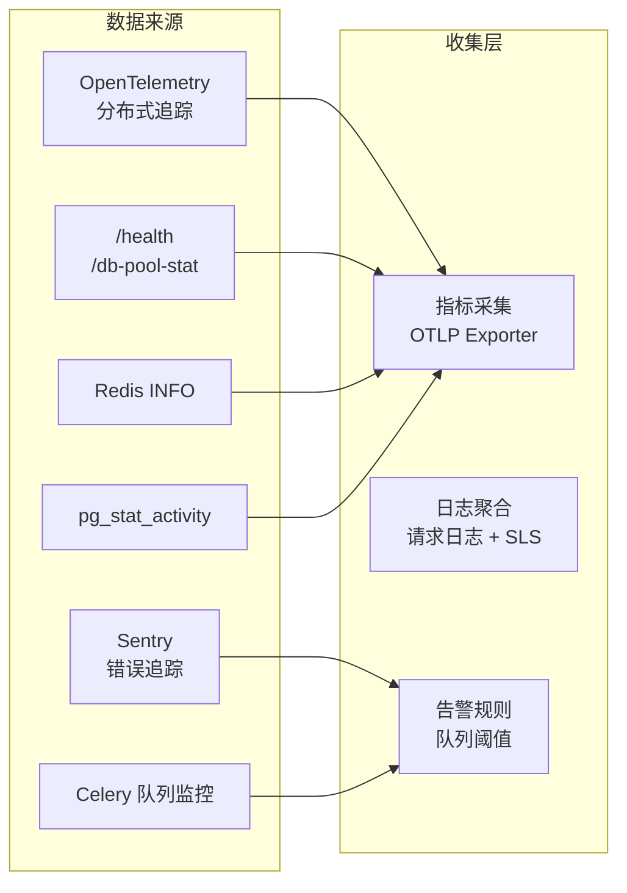
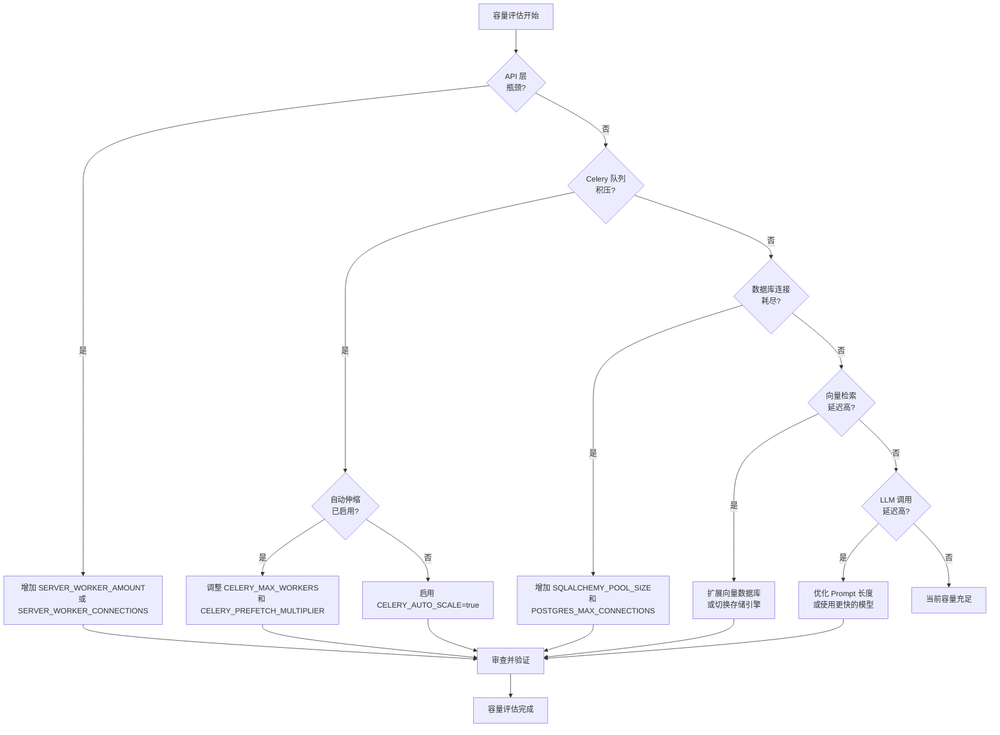
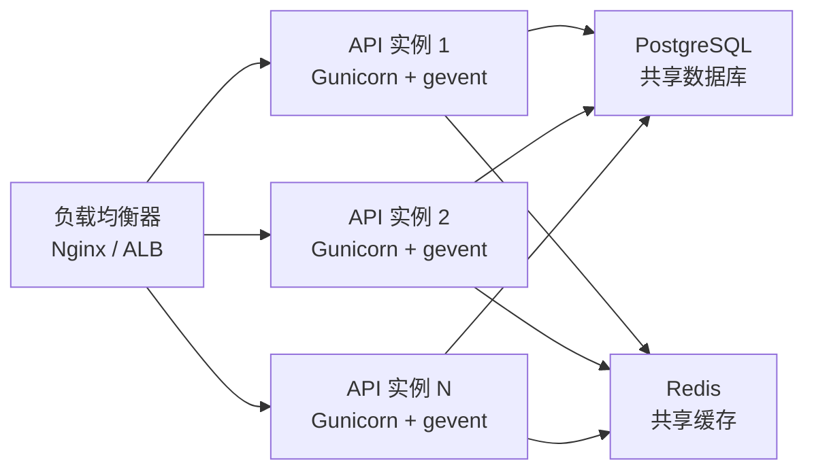
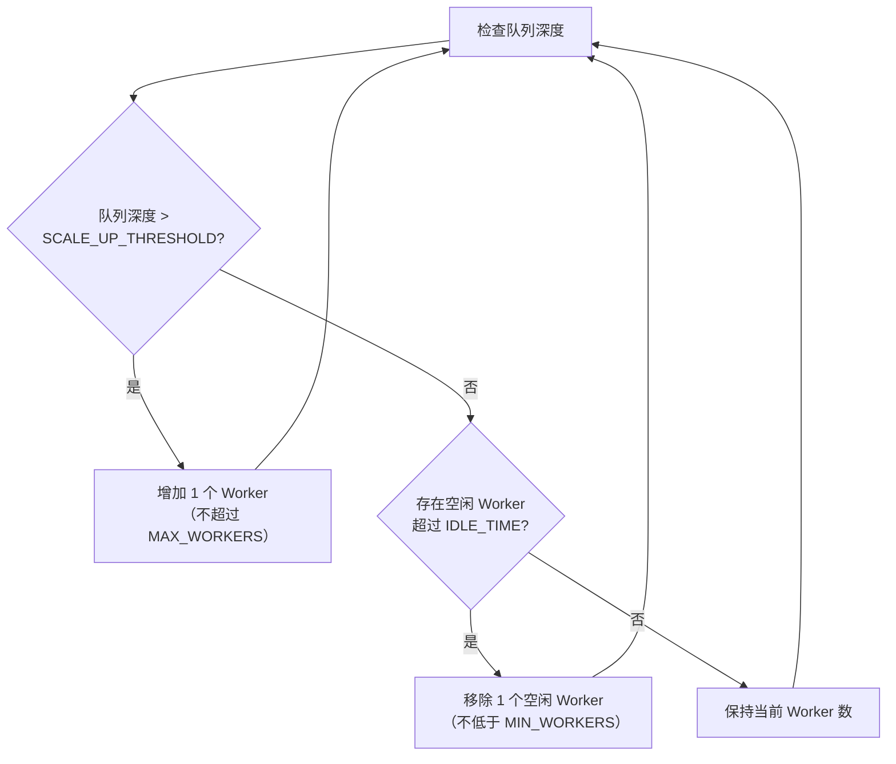
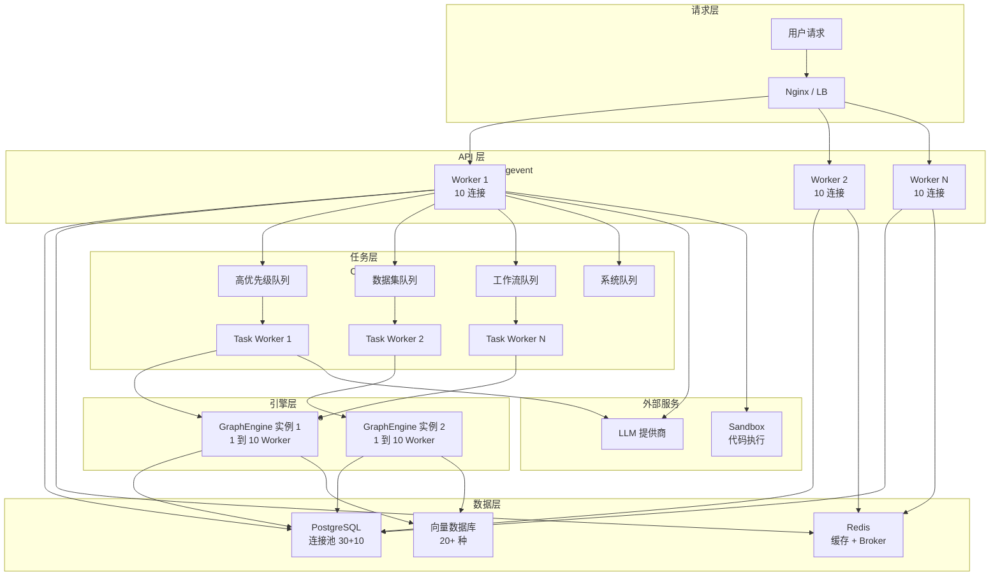

# 容量评估与性能指标

> **TL;DR**: Dify 的容量规划围绕 Gunicorn + gevent 异步 API 层、Celery + gevent 异步任务层、PostgreSQL 连接池和 Redis 缓存四大核心组件展开，通过 680+ 环境变量提供细粒度的资源调优能力，支持垂直扩展、水平扩展和 Celery 自动伸缩三种扩展模式。

## 概述

Dify 作为 LLM 应用开发平台，其性能瓶颈集中在三个维度：LLM 调用的外部延迟、工作流引擎的计算密度、以及 RAG 管道的 I/O 吞吐。容量评估需要同时考虑同步请求路径（API → LLM → 响应）和异步任务路径（Celery → 向量数据库 → 索引写入）两条链路。

当前架构通过以下机制提供容量弹性：

- **Gunicorn + gevent**：单 worker 支持 10 个并发连接（默认），通过协程处理 I/O 密集请求
- **Celery 自动伸缩**：基于 CPU 核心数动态调整 worker 数量（`CELERY_AUTO_SCALE`）
- **GraphEngine 工作池**：工作流节点执行支持 1 到 10 个 worker 的自动扩缩容
- **SQLAlchemy 连接池**：默认 30 连接 + 10 溢出，可配置 LIFO 和 pre-ping 策略
- **队列隔离**：21 个独立 Celery 队列按优先级分离数据集处理、工作流执行和系统任务

## 详细设计

### 1. 容量评估需求

#### 1.1 评估目标

容量评估需要回答三个核心问题：

1. **当前能支撑多少并发**：API 层、任务层、数据库层各自的并发上限
2. **瓶颈在哪里**：LLM 调用延迟、向量检索吞吐、数据库连接池耗尽、Celery 队列积压
3. **扩展路径是什么**：垂直扩展（加 CPU/内存）还是水平扩展（加实例）

#### 1.2 评估范围

| 层级 | 评估对象 | 关键指标 |
|------|----------|----------|
| API 层 | Gunicorn worker + gevent 连接 | 并发请求数、P99 响应时间 |
| 任务层 | Celery worker + 队列 | 任务吞吐量、队列深度、任务等待时间 |
| 数据层 | PostgreSQL 连接池 | 活跃连接数、连接等待时间、慢查询数 |
| 缓存层 | Redis | 命中率、内存使用、连接数 |
| 向量层 | 向量数据库 | 检索延迟、索引写入吞吐 |
| 外部依赖 | LLM 提供商 | 调用延迟、Token 速率、错误率 |

#### 1.3 评估周期

| 场景 | 频率 | 触发条件 |
|------|------|----------|
| 日常监控 | 持续 | 自动化指标采集 |
| 容量审查 | 每周 | 流量增长超过 20% |
| 扩展规划 | 每月 | 资源利用率持续超过 70% |
| 压力测试 | 每季度 | 大版本发布前 |

### 2. 容量评估模型

#### 2.1 API 层资源模型

API 服务基于 Gunicorn + gevent 协程模型，单 worker 可处理多个并发请求。

**核心配置参数：**

| 参数 | 环境变量 | 默认值 | 说明 |
|------|----------|--------|------|
| Worker 数量 | `SERVER_WORKER_AMOUNT` | 1 | 建议公式：CPU 核心数 × 2 + 1（sync 模式），gevent 模式下 1 即可 |
| Worker 类型 | `SERVER_WORKER_CLASS` | gevent | 协程 worker，强烈不建议修改 |
| 单 Worker 连接数 | `SERVER_WORKER_CONNECTIONS` | 10 | gevent worker 的最大并发连接数 |
| 请求超时 | `GUNICORN_TIMEOUT` | 360 | SSE 长连接需要较长超时 |

**并发能力估算：**

```
最大并发请求 = SERVER_WORKER_AMOUNT × SERVER_WORKER_CONNECTIONS
```

默认配置下：1 × 10 = 10 个并发请求。生产环境建议将 `SERVER_WORKER_AMOUNT` 设为 CPU 核心数，`SERVER_WORKER_CONNECTIONS` 根据请求类型调整（SSE 密集型建议 50 到 100）。

#### 2.2 任务层资源模型

Celery Worker 处理所有异步任务，包括数据集索引、工作流执行、邮件发送等。

**核心配置参数：**

| 参数 | 环境变量 | 默认值 | 说明 |
|------|----------|--------|------|
| Worker 数量 | `CELERY_WORKER_AMOUNT` | 1 | 固定模式下的并发 worker 数 |
| 自动伸缩 | `CELERY_AUTO_SCALE` | false | 启用后根据负载动态调整 |
| 最大 Worker | `CELERY_MAX_WORKERS` | CPU 核心数 | 自动伸缩的上限 |
| 最小 Worker | `CELERY_MIN_WORKERS` | 1 | 自动伸缩的下限 |
| Worker 池类型 | `CELERY_WORKER_CLASS` / `CELERY_WORKER_POOL` | gevent | 协程池，与 Gunicorn 一致 |
| 子任务上限 | `MAX_TASKS_PER_CHILD` | 50 | 每个 worker 处理 N 个任务后重启，防止内存泄漏 |
| 预取倍数 | `CELERY_PREFETCH_MULTIPLIER` | 1 | 每个 worker 预取的任务数 |

**队列分布：**

Dify 默认配置 21 个独立队列，按优先级和职能分组：

| 队列组 | 队列名称 | 用途 |
|--------|----------|------|
| 高优先级 | `priority_dataset`, `priority_pipeline` | 优先数据集和管道处理 |
| 数据集 | `dataset`, `dataset_summary` | 文档索引、摘要生成 |
| 管道 | `pipeline` | RAG 管道处理 |
| 工作流 | `workflow`, `workflow_storage` | 工作流执行和存储 |
| 调度 | `schedule_poller`, `schedule_executor` | 定时任务轮询和执行 |
| 触发器 | `triggered_workflow_dispatcher`, `trigger_refresh_executor` | 工作流触发器 |
| 系统 | `api_token`, `mail`, `ops_trace`, `app_deletion`, `plugin`, `conversation`, `retention` | 系统维护任务 |

#### 2.3 数据层资源模型

**PostgreSQL 连接池：**

| 参数 | 环境变量 | 默认值 | 说明 |
|------|----------|--------|------|
| 连接池大小 | `SQLALCHEMY_POOL_SIZE` | 30 | 每个 API/Worker 进程的常驻连接数 |
| 最大溢出 | `SQLALCHEMY_MAX_OVERFLOW` | 10 | 峰值时可额外创建的连接数 |
| 连接回收 | `SQLALCHEMY_POOL_RECYCLE` | 3600 | 连接最大存活时间（秒） |
| 获取超时 | `SQLALCHEMY_POOL_TIMEOUT` | 30 | 等待可用连接的超时时间 |
| LIFO 模式 | `SQLALCHEMY_POOL_USE_LIFO` | false | 启用后减少空闲连接占用 |
| Pre-ping | `SQLALCHEMY_POOL_PRE_PING` | false | 获取连接前检测活性 |

**总连接数估算：**

```
最大数据库连接 = (API 实例数 × (POOL_SIZE + MAX_OVERFLOW)) + (Worker 实例数 × (POOL_SIZE + MAX_OVERFLOW))
```

PostgreSQL 默认 `max_connections=100`，需要确保总连接数不超过数据库上限。

**PostgreSQL 服务端配置：**

| 参数 | 环境变量 | 默认值 | 说明 |
|------|----------|--------|------|
| 最大连接数 | `POSTGRES_MAX_CONNECTIONS` | 100 | 数据库全局连接上限 |
| 语句超时 | `POSTGRES_STATEMENT_TIMEOUT` | 0 | 0 表示不限制，建议设置防止慢查询 |
| 空闲事务超时 | `POSTGRES_IDLE_IN_TRANSACTION_SESSION_TIMEOUT` | 0 | 防止连接泄漏 |

#### 2.4 工作流引擎资源模型

GraphEngine 使用内部线程池执行工作流节点，支持自动扩缩容。

| 参数 | 环境变量 | 默认值 | 说明 |
|------|----------|--------|------|
| 最小 Worker | `GRAPH_ENGINE_MIN_WORKERS` | 1 | 每个工作流执行的最小线程数 |
| 最大 Worker | `GRAPH_ENGINE_MAX_WORKERS` | 10 | 每个工作流执行的最大线程数 |
| 扩容阈值 | `GRAPH_ENGINE_SCALE_UP_THRESHOLD` | 3 | 队列深度超过此值时扩容 |
| 缩容空闲时间 | `GRAPH_ENGINE_SCALE_DOWN_IDLE_TIME` | 5.0 | Worker 空闲超过此时间后缩容 |

#### 2.5 外部调用资源模型

| 参数 | 环境变量 | 默认值 | 说明 |
|------|----------|--------|------|
| HTTP 连接超时 | `HTTP_REQUEST_MAX_CONNECT_TIMEOUT` | 10 | 出站 HTTP 连接超时 |
| HTTP 读取超时 | `HTTP_REQUEST_MAX_READ_TIMEOUT` | 600 | LLM 流式响应需要较长超时 |
| HTTP 写入超时 | `HTTP_REQUEST_MAX_WRITE_TIMEOUT` | 600 | 大请求体上传超时 |
| SSRF 连接池 | `SSRF_POOL_MAX_CONNECTIONS` | 100 | SSRF 代理连接池上限 |
| 代码执行连接池 | `CODE_EXECUTION_POOL_MAX_CONNECTIONS` | 100 | Sandbox 连接池上限 |
| 代码执行超时 | `CODE_EXECUTION_CONNECT_TIMEOUT` / `READ_TIMEOUT` / `WRITE_TIMEOUT` | 10 / 60 / 10 | Sandbox 调用超时 |

### 3. 性能指标定义

#### 3.1 响应时间指标

| 指标 | 目标值 | 测量方法 | 告警阈值 |
|------|--------|----------|----------|
| API P50 响应时间 | < 200 ms | OpenTelemetry HTTP span | > 500 ms |
| API P95 响应时间 | < 1000 ms | OpenTelemetry HTTP span | > 2000 ms |
| API P99 响应时间 | < 3000 ms | OpenTelemetry HTTP span | > 5000 ms |
| LLM 首 Token 延迟 | < 2000 ms | GenAI span attributes | > 5000 ms |
| 向量检索延迟 | < 100 ms | 向量数据库指标 | > 500 ms |
| 工作流节点执行时间 | 因节点而异 | 工作流运行日志 | 超过 `WORKFLOW_MAX_EXECUTION_TIME`（默认 1200 s） |

#### 3.2 吞吐量指标

| 指标 | 测量方法 | 基准参考 |
|------|----------|----------|
| API 请求 QPS | OpenTelemetry HTTP 计数器 | 取决于 LLM 调用比例，纯 API 路由可达数千 QPS |
| 数据集索引吞吐 | Celery 任务完成速率 | 受文档大小和嵌入模型影响 |
| 工作流并发执行数 | 活跃 GraphEngine 实例数 | 受 `GRAPH_ENGINE_MAX_WORKERS` 和 Celery 并发限制 |
| Celery 任务处理速率 | 任务完成数 / 时间 | 受 worker 数量和任务复杂度影响 |

#### 3.3 并发数指标

| 指标 | 计算方式 | 默认上限 |
|------|----------|----------|
| API 最大并发请求 | `SERVER_WORKER_AMOUNT × SERVER_WORKER_CONNECTIONS` | 10 |
| Celery 最大并发任务 | `CELERY_WORKER_AMOUNT` 或 `CELERY_MAX_WORKERS` | 1（或 CPU 核心数） |
| 数据库最大连接 | `POSTGRES_MAX_CONNECTIONS` | 100 |
| 活跃应用请求 | `APP_MAX_ACTIVE_REQUESTS` | 0（不限制） |
| 工作流最大执行步骤 | `WORKFLOW_MAX_EXECUTION_STEPS` | 500 |
| 工作流最大执行时间 | `WORKFLOW_MAX_EXECUTION_TIME` | 1200 s |
| 工作流调用深度 | `WORKFLOW_CALL_MAX_DEPTH` | 5 |

#### 3.4 资源利用率指标

| 指标 | 健康阈值 | 告警阈值 | 危险阈值 |
|------|----------|----------|----------|
| CPU 使用率 | < 60% | 60% 到 80% | > 80% |
| 内存使用率 | < 70% | 70% 到 85% | > 85% |
| 数据库连接池使用率 | < 60% | 60% 到 80% | > 80% |
| Redis 内存使用率 | < 60% | 60% 到 80% | > 80% |
| Celery 队列深度 | < 50 | 50 到 `QUEUE_MONITOR_THRESHOLD`（200） | > 200 |
| 磁盘使用率 | < 70% | 70% 到 85% | > 85% |

### 4. 容量规划流程

#### 4.1 数据收集



**关键健康端点：**

| 端点 | 返回内容 | 用途 |
|------|----------|------|
| `GET /health` | PID、状态、版本号 | 存活检测 |
| `GET /threads` | 线程转储（名称、ID、存活状态） | 线程泄漏排查 |
| `GET /db-pool-stat` | 连接池统计（大小、已借出、溢出、超时、回收） | 连接池容量评估 |

**队列监控：**

通过 `ENABLE_DATASETS_QUEUE_MONITOR`（默认关闭）启用队列深度监控，当队列长度超过 `QUEUE_MONITOR_THRESHOLD`（默认 200）时触发告警。监控间隔由 `QUEUE_MONITOR_INTERVAL`（默认 30 分钟）控制。

#### 4.2 分析评估

**容量评估检查清单：**

1. **API 层**
   - 当前 `SERVER_WORKER_AMOUNT × SERVER_WORKER_CONNECTIONS` 是否满足峰值并发
   - P99 响应时间是否在 `GUNICORN_TIMEOUT` 的 50% 以内
   - 是否存在 SSE 连接超时导致的 worker 占用

2. **任务层**
   - Celery 队列深度是否持续超过 `QUEUE_MONITOR_THRESHOLD`
   - Worker 是否需要自动伸缩（`CELERY_AUTO_SCALE`）
   - 各队列的任务处理延迟是否可接受

3. **数据层**
   - `/db-pool-stat` 显示的连接借出率是否超过 80%
   - 是否存在连接等待超时（`SQLALCHEMY_POOL_TIMEOUT`）
   - 慢查询数量是否增长

4. **缓存层**
   - Redis 内存使用是否接近上限
   - 缓存命中率是否低于 80%
   - 连接数是否接近 `REDIS_MAX_CONNECTIONS`

#### 4.3 规划决策



#### 4.4 扩展执行

扩展操作按风险从低到高排列：

| 优先级 | 操作 | 风险 | 回滚难度 |
|--------|------|------|----------|
| 1 | 调整环境变量（超时、连接池） | 低 | 重启即恢复 |
| 2 | 增加 Celery Worker 数量 | 低 | 减少 worker 即可 |
| 3 | 增加 Gunicorn Worker 数量 | 中 | 减少 worker 即可 |
| 4 | 增加数据库连接池 | 中 | 需确保数据库连接上限 |
| 5 | 水平扩展 API 实例 | 中 | 需要负载均衡器配合 |
| 6 | 水平扩展 Celery Worker 实例 | 中 | 需要确保队列路由正确 |
| 7 | 扩展向量数据库集群 | 高 | 需要数据迁移 |

### 5. 扩展策略

#### 5.1 垂直扩展

垂直扩展是最直接的扩容方式，通过增加单实例的 CPU 和内存资源提升处理能力。

**适用场景：**
- 单实例 CPU 使用率持续超过 70%
- Celery Worker 数量受限于 CPU 核心数
- GraphEngine 工作池需要更多线程

**操作方式：**

| 组件 | 扩展维度 | 配置调整 |
|------|----------|----------|
| API 服务 | CPU | 增加 `SERVER_WORKER_AMOUNT`（gevent 模式下 1 个 worker 即可处理大量并发） |
| API 服务 | 内存 | 增加 `SERVER_WORKER_CONNECTIONS`（每个 gevent 协程占用约 10 到 50 KB） |
| Celery Worker | CPU | 增加 `CELERY_WORKER_AMOUNT` 或 `CELERY_MAX_WORKERS` |
| Celery Worker | 内存 | 降低 `MAX_TASKS_PER_CHILD` 减少内存积累 |
| PostgreSQL | 内存 | 增加 `POSTGRES_MAX_CONNECTIONS` 和共享缓冲区 |
| Redis | 内存 | 调整 `maxmemory` 配置 |

#### 5.2 水平扩展

水平扩展通过增加实例数量提升系统整体容量。

**API 层水平扩展：**

Dify API 服务是无状态的（会话数据存储在 Redis），可以直接部署多个 API 实例，通过 Nginx 或负载均衡器分发请求。



**注意事项：**
- 所有 API 实例必须使用相同的 `SECRET_KEY`
- 会话和缓存通过 Redis 共享，无需额外配置
- 数据库连接总数 = 实例数 × (`SQLALCHEMY_POOL_SIZE` + `SQLALCHEMY_MAX_OVERFLOW`)，需同步调整 `POSTGRES_MAX_CONNECTIONS`

**Celery Worker 水平扩展：**

可以部署多个 Celery Worker 实例，每个实例监听不同的队列子集，实现任务隔离和并行处理。

```bash
# Worker 实例 1：专注数据集处理
CELERY_WORKER_QUEUES=priority_dataset,dataset,dataset_summary
CELERY_WORKER_CONCURRENCY=8

# Worker 实例 2：专注工作流执行
CELERY_WORKER_QUEUES=workflow,workflow_storage
CELERY_WORKER_CONCURRENCY=4

# Worker 实例 3：处理系统任务
CELERY_WORKER_QUEUES=api_token,mail,ops_trace,app_deletion,plugin,conversation,retention
CELERY_WORKER_CONCURRENCY=2
```

#### 5.3 自动扩展

**Celery 自动伸缩：**

```bash
CELERY_AUTO_SCALE=true
CELERY_MAX_WORKERS=16    # 上限：CPU 核心数或更高
CELERY_MIN_WORKERS=2     # 下限：保持最少 2 个 worker
```

自动伸缩算法根据当前任务负载动态调整 worker 数量。适用于任务负载波动较大的场景。

**GraphEngine 工作池自动伸缩：**

工作流引擎内置了基于队列深度的自动扩缩容机制：



#### 5.4 预置扩展

对于可预见的流量高峰（如活动发布、批量导入），建议提前调整以下参数：

| 场景 | 预调整参数 | 建议值 |
|------|------------|--------|
| 大批量文档导入 | `CELERY_WORKER_AMOUNT` | 增加到 CPU 核心数的 2 倍 |
| 高并发 API 调用 | `SERVER_WORKER_CONNECTIONS` | 增加到 50 到 100 |
| 复杂工作流执行 | `GRAPH_ENGINE_MAX_WORKERS` | 增加到 20 |
| 长时 SSE 连接 | `GUNICORN_TIMEOUT` | 增加到 600 或更高 |
| 数据库密集操作 | `SQLALCHEMY_POOL_SIZE` | 增加到 50，同步调整 `POSTGRES_MAX_CONNECTIONS` |

## 附录

### A. 容量评估模型图



### B. 性能指标基准表

| 场景 | 并发用户 | API Worker | Celery Worker | DB 连接池 | 预期 P99 延迟 |
|------|----------|------------|---------------|-----------|---------------|
| 开发/测试 | < 10 | 1 × 10 | 1 | 30 | < 1 s |
| 小规模生产 | 10 到 50 | 2 × 20 | 4 | 30 | < 2 s |
| 中规模生产 | 50 到 200 | 4 × 50 | 8 到 16 | 50 | < 3 s |
| 大规模生产 | 200 到 1000 | 8 × 100 | 16 到 32 | 100 | < 5 s |

> **注意**：以上基准假设 LLM 调用延迟在 1 到 3 s 范围内。实际延迟主要取决于 LLM 提供商的响应速度。

### C. 资源需求估算表

| 部署规模 | CPU | 内存 | 存储 | 网络 |
|----------|-----|------|------|------|
| 最小部署（开发） | 2 核 | 4 GiB | 20 GiB | 10 Mbps |
| 小规模生产 | 4 核 | 8 GiB | 100 GiB | 100 Mbps |
| 中规模生产 | 8 核 | 16 GiB | 500 GiB | 1 Gbps |
| 大规模生产 | 16+ 核 | 32+ GiB | 1+ TiB | 1 Gbps |

> **说明**：以上为单实例资源需求。大规模生产环境建议通过水平扩展使用多个较小实例，而非单个大实例。

### D. 关键环境变量速查

**API 服务调优：**

```bash
SERVER_WORKER_AMOUNT=4          # Gunicorn worker 数
SERVER_WORKER_CONNECTIONS=50    # 每 worker 并发连接
GUNICORN_TIMEOUT=360            # 请求超时（秒）
APP_MAX_ACTIVE_REQUESTS=0       # 最大活跃请求（0=不限）
APP_MAX_EXECUTION_TIME=1200     # 最大执行时间（秒）
```

**Celery 任务调优：**

```bash
CELERY_AUTO_SCALE=true          # 启用自动伸缩
CELERY_MAX_WORKERS=16           # 最大 worker 数
CELERY_MIN_WORKERS=2            # 最小 worker 数
CELERY_PREFETCH_MULTIPLIER=1    # 预取倍数
MAX_TASKS_PER_CHILD=50          # 子任务上限（防内存泄漏）
```

**数据库连接调优：**

```bash
SQLALCHEMY_POOL_SIZE=30         # 连接池大小
SQLALCHEMY_MAX_OVERFLOW=10      # 最大溢出
SQLALCHEMY_POOL_TIMEOUT=30      # 获取超时（秒）
SQLALCHEMY_POOL_RECYCLE=3600    # 连接回收（秒）
POSTGRES_MAX_CONNECTIONS=100    # PostgreSQL 最大连接
```

**工作流引擎调优：**

```bash
GRAPH_ENGINE_MIN_WORKERS=1      # 最小线程数
GRAPH_ENGINE_MAX_WORKERS=10     # 最大线程数
GRAPH_ENGINE_SCALE_UP_THRESHOLD=3   # 扩容阈值
GRAPH_ENGINE_SCALE_DOWN_IDLE_TIME=5 # 缩容空闲时间（秒）
WORKFLOW_MAX_EXECUTION_STEPS=500    # 最大执行步骤
WORKFLOW_MAX_EXECUTION_TIME=1200    # 最大执行时间（秒）
WORKFLOW_CALL_MAX_DEPTH=5           # 最大调用深度
```

## 变更日志

| 日期 | 版本 | 变更内容 | 作者 |
|------|------|----------|------|
| 2026-07-19 | 1.0 | 初始版本，基于 `docker/.env.example`、`api/configs/`、`api/docker/entrypoint.sh`、`api/gunicorn.conf.py` 分析 | AI Assistant |
