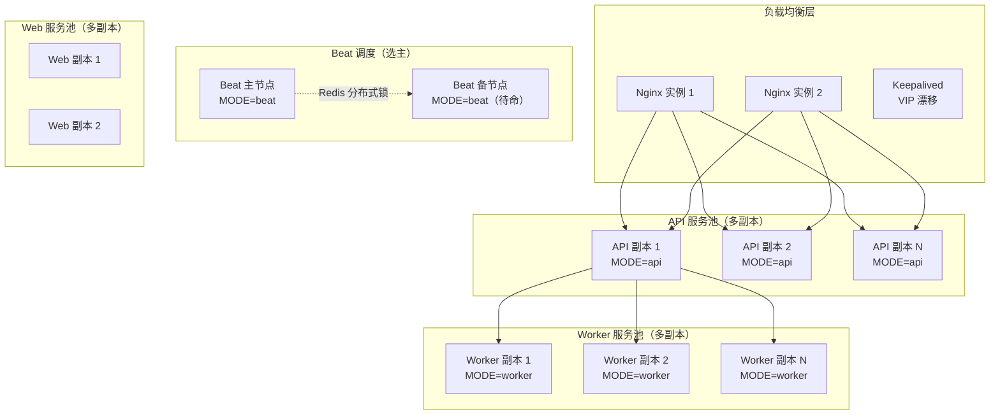
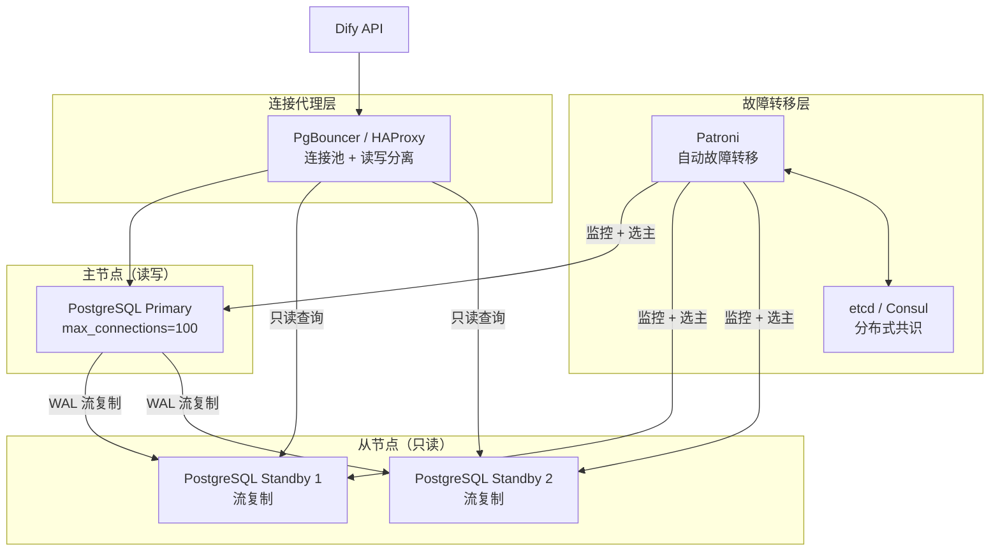
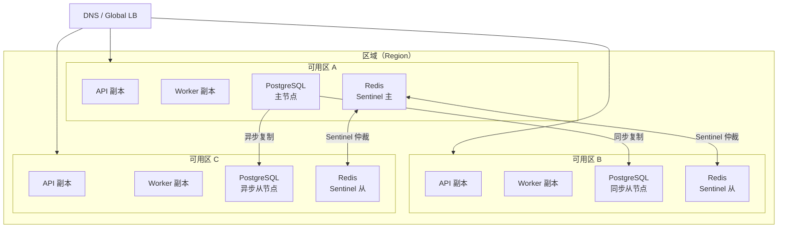
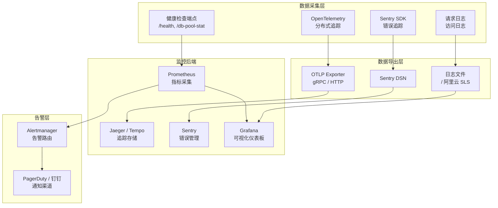
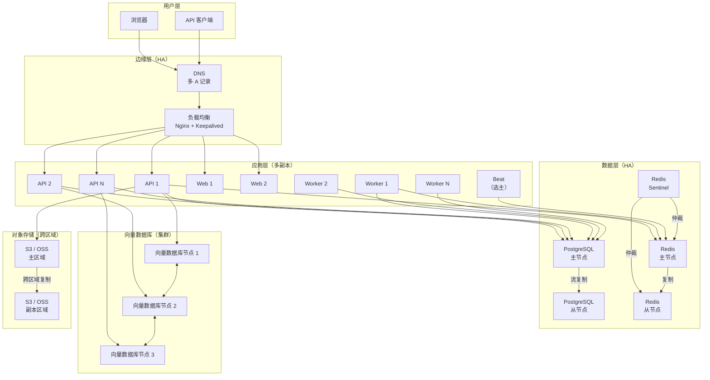
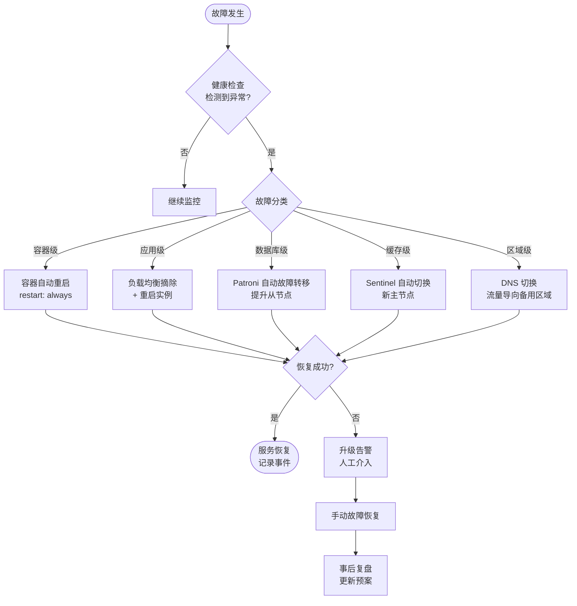

# 高可用架构

> **TL;DR**: Dify 当前通过 Docker Compose 单实例部署，内置健康检查、Redis Sentinel/Cluster 故障转移和 Celery 自动重连等基础 HA 机制。企业级高可用需要在此基础上引入多副本部署、数据库主从复制、跨区域容灾和完善的故障检测与自动恢复体系。

## 概述

Dify 的高可用设计围绕"分层容错、自动恢复、水平扩展"三个原则展开。应用层（API、Worker、Web）无状态，天然支持多副本水平扩展。数据层（PostgreSQL、Redis、向量数据库）是 HA 的关键挑战，需要根据不同组件的特性设计主从复制、故障转移和数据同步策略。

**当前已有的 HA 能力：**

| 能力 | 实现方式 | 覆盖范围 |
|------|----------|----------|
| 进程自动重启 | Docker `restart: always` 策略 | 所有服务容器 |
| 健康检查 | `/health`、`/threads`、`/db-pool-stat` 端点 | API 服务 |
| 数据库健康检查 | Docker Compose healthcheck（`pg_isready`、`mysqladmin ping`） | PostgreSQL、MySQL |
| Redis 故障转移 | Sentinel 模式 + `RedisClientWrapper` 延迟初始化 | 缓存层 |
| Redis 集群 | Redis Cluster 模式支持 | 缓存层 |
| Celery 重连 | `broker_connection_retry_on_startup=True` | 任务队列 |
| Celery Sentinel | Broker 支持 Sentinel 自动发现 Master | 任务队列 |
| 连接池管理 | SQLAlchemy 连接池 + 溢出控制 + 回收策略 | 数据库层 |
| Redis 降级 | `redis_fallback` 装饰器，Redis 不可用时返回默认值 | 缓存层 |
| gevent 兼容 | 安全的连接回滚和重置机制 | 数据库连接 |
| 可观测性 | OpenTelemetry + Sentry + 请求日志 | 全链路 |

**企业级 HA 需要补充的能力：**

- API/Worker 多副本部署和负载均衡
- PostgreSQL 主从复制和自动故障转移
- Redis 持久化和集群化
- Celery Beat 选主（避免重复调度）
- 跨区域数据同步和流量切换
- 完善的告警和自动化运维

## 详细设计

### 1. 高可用需求分析

#### 1.1 SLA 目标

| 等级 | 可用性 | 年停机时间 | 适用场景 |
|------|--------|----------|----------|
| 基础级 | 99.9% | 8.76 小时 | 内部工具、开发测试环境 |
| 标准级 | 99.95% | 4.38 小时 | 中小企业生产环境 |
| 企业级 | 99.99% | 52.6 分钟 | 大型企业、SaaS 服务 |
| 关键级 | 99.999% | 5.26 分钟 | 金融、医疗等关键业务 |

#### 1.2 RTO 和 RPO 要求

| 指标 | 定义 | 企业级目标 | 关键级目标 |
|------|------|----------|----------|
| RTO（恢复时间目标） | 故障发生到服务恢复的最大可接受时间 | < 5 分钟 | < 30 秒 |
| RPO（恢复点目标） | 故障发生到最近可用备份的数据丢失时间 | < 1 分钟 | 0（零数据丢失） |

#### 1.3 故障场景分析

| 故障类型 | 发生频率 | 影响范围 | 当前应对 | 企业级方案 |
|----------|----------|----------|----------|----------|
| 单容器崩溃 | 高 | 单进程 | `restart: always` 自动重启 | 多副本 + 自动扩缩容 |
| 宿主机故障 | 中 | 全部服务 | 无 | 多可用区部署 |
| PostgreSQL 主库故障 | 低 | 全部读写 | 无（服务中断） | 主从复制 + 自动故障转移 |
| Redis 主节点故障 | 低 | 缓存/队列 | Sentinel 自动切换 | Sentinel/Cluster 模式 |
| 向量数据库故障 | 低 | 检索功能 | 无 | 集群模式 + 副本 |
| 网络分区 | 低 | 部分服务 | 无 | 多可用区 + DNS 切换 |
| 区域级灾难 | 极低 | 全部服务 | 无 | 跨区域容灾 |
| LLM 提供商故障 | 中 | AI 功能 | 无 | 多提供商 fallback |

### 2. 高可用架构设计

#### 2.1 多副本部署架构

应用层（API、Worker、Web）无状态，可以直接水平扩展：



**关键设计决策：**

| 组件 | 扩展策略 | 注意事项 |
|------|----------|----------|
| API | 水平扩展（多副本） | 无状态，通过 Nginx 负载均衡 |
| Worker | 水平扩展（多副本） | Celery 自动分配任务，按队列长度扩缩 |
| Web | 水平扩展（多副本） | 无状态 Next.js 服务 |
| Beat | 主备模式 | 必须单活，通过 Redis 分布式锁选主 |
| Nginx | 主备 + VIP | Keepalived 实现 VIP 漂移 |

#### 2.2 Celery Beat 选主机制

Celery Beat 是有状态的调度器，多实例会导致任务重复执行。推荐方案：

**方案一：Redis 分布式锁（推荐）**

```python
# 伪代码示意
class HighlyAvailableBeat:
    def acquire_leadership(self):
        """通过 Redis 锁竞争 Beat 领导权"""
        lock = redis_client.lock(
            "celery-beat-leader",
            timeout=60,           # 锁超时 60 秒
            blocking_timeout=10,  # 等待 10 秒
        )
        if lock.acquire():
            # 启动 Beat 调度循环
            self.start_beat()
            # 定期续期锁
            self.renew_lock_periodically()
        else:
            # 进入待命模式，定期尝试获取锁
            self.standby_and_retry()
```

**方案二：Kubernetes Leader Election**

在 K8s 环境中，使用 `Lease` 资源实现选主，避免对 Redis 的额外依赖。

#### 2.3 负载均衡策略

| 层级 | 方案 | 配置要点 |
|------|------|----------|
| DNS 层 | 多 A 记录 + 健康检查 | TTL 设短（30-60 秒），配合健康检查 |
| VIP 层 | Keepalived + Nginx | `vrrp_script` 检测 Nginx 存活 |
| 反向代理层 | Nginx upstream | `upstream` 配置多个 API 后端 |

Nginx 负载均衡配置示例：

```nginx
upstream dify_api {
    least_conn;  # 最少连接数策略
    server api-1:5001 max_fails=3 fail_timeout=30s;
    server api-2:5001 max_fails=3 fail_timeout=30s;
    server api-3:5001 max_fails=3 fail_timeout=30s;
    keepalive 64;  # 长连接池
}
```

### 3. 组件级高可用

#### 3.1 API 服务高可用

**现有机制：**

- `/health` 端点返回 PID、状态和版本号，供外部负载均衡器探测
- `/threads` 端点提供线程转储，辅助诊断死锁
- `/db-pool-stat` 端点暴露连接池状态（大小、已借出、溢出、超时、回收）
- Gunicorn + gevent 工作进程模型，单容器内多协程并发
- `X-Version` 和 `X-Env` 响应头，支持灰度发布

**企业级增强：**

| 增强项 | 实现方式 | 效果 |
|--------|----------|------|
| 优雅关闭 | 捕获 SIGTERM，等待进行中的请求完成 | 滚动更新零丢请求 |
| 优雅启动 | 预热连接池和缓存后再接受流量 | 避免冷启动延迟 |
| 熔断器 | LLM 调用添加超时和重试限制 | 防止级联故障 |
| 限流 | 基于 Redis 的分布式限流 | 防止过载 |
| 健康检查增强 | 检查 DB、Redis、向量数据库连通性 | 更准确的存活判断 |

#### 3.2 Worker 服务高可用

**现有机制：**

- Celery Worker 通过 Redis Broker 接收任务，天然支持多 Worker 竞争消费
- `broker_connection_retry_on_startup=True` 确保 Broker 断开后自动重连
- Celery 任务通过 `task_annotations` 配置软/硬超时
- 事件驱动架构（`events/`）解耦组件，失败不影响其他流程

**企业级增强：**

| 增强项 | 实现方式 | 效果 |
|--------|----------|------|
| 任务重试 | `autoretry_for` + `retry_backoff` | 瞬态故障自动恢复 |
| 死信队列 | 失败任务路由到专用队列 | 便于排查和重放 |
| 任务可见性 | Flower 或自定义监控面板 | 实时观察队列积压 |
| 按队列扩缩 | 不同队列独立 Worker 池 | 关键任务优先处理 |
| 幂等设计 | 任务携带唯一 ID，执行前检查 | 避免重复执行副作用 |

#### 3.3 数据库高可用

**PostgreSQL 高可用方案：**



**关键配置：**

| 配置项 | 推荐值 | 说明 |
|--------|--------|------|
| `synchronous_commit` | `on`（关键级）/ `remote_apply`（企业级） | 控制 WAL 同步级别 |
| `max_wal_senders` | 10 | 允许的最大流复制连接数 |
| `wal_keep_size` | 1GB | 保留的 WAL 日志大小 |
| `hot_standby` | `on` | 允许从节点接受只读查询 |
| `SQLALCHEMY_POOL_SIZE` | 按副本数调整 | 连接池大小 |
| `SQLALCHEMY_MAX_OVERFLOW` | `POOL_SIZE * 0.5` | 连接池溢出上限 |

**MySQL 高可用方案：**

使用 MySQL InnoDB Cluster（基于 Group Replication）+ MySQL Router 实现自动故障转移和读写分离。

#### 3.4 缓存层高可用

**现有机制：**

Dify 已内置三种 Redis 部署模式的支持：

| 模式 | 配置 | HA 能力 |
|------|------|---------|
| Standalone | `REDIS_HOST` + `REDIS_PORT` | 无（单点） |
| Sentinel | `REDIS_SENTINELS` + `REDIS_SENTINEL_SERVICE_NAME` | 自动故障转移 |
| Cluster | `REDIS_CLUSTERS` | 数据分片 + 自动故障转移 |

`RedisClientWrapper` 类支持 Sentinel 故障转移后的客户端重初始化，`redis_fallback` 装饰器在 Redis 不可用时返回默认值而非抛出异常。

**企业级增强：**

| 增强项 | 实现方式 | 效果 |
|--------|----------|------|
| 持久化 | RDB + AOF 混合模式 | 重启后数据恢复 |
| 内存管理 | `maxmemory-policy allkeys-lru` | 内存满时自动淘汰 |
| 客户端缓存 | `REDIS_ENABLE_CLIENT_SIDE_CACHE` | 减少网络往返（已支持） |
| 连接池 | `REDIS_MAX_CONNECTIONS` | 控制连接数上限 |
| SSL 加密 | `REDIS_USE_SSL` + 证书配置 | 传输层加密 |

#### 3.5 向量数据库高可用

| 向量数据库 | HA 方案 | 说明 |
|-----------|---------|------|
| Milvus | 集群模式（已内置 etcd + minio） | 多 QueryNode + DataNode 副本 |
| Weaviate | 多节点集群 + 复制因子 | `REPLICATION_FACTOR` 配置 |
| Qdrant | 分布式模式 + Raft 共识 | 多节点分片和复制 |
| PGVector | 依赖 PostgreSQL HA | 随主库故障转移 |
| ElasticSearch | 集群模式 + 副本分片 | 内置分片和副本机制 |
| OpenSearch | 集群模式 + 副本分片 | 内置分片和副本机制 |

### 4. 跨区域高可用

#### 4.1 多可用区部署



**部署原则：**

- 应用层（API、Worker、Web）跨所有可用区部署，无状态
- 数据层至少跨两个可用区，主节点和同步从节点在不同可用区
- 第三个可用区放置异步从节点，用于灾难恢复

#### 4.2 数据同步策略

| 数据类型 | 同步方式 | 延迟 | 一致性 |
|----------|----------|------|--------|
| PostgreSQL | 流复制（同步/异步） | 同步: 0, 异步: < 1s | 同步: 强一致, 异步: 最终一致 |
| Redis | Sentinel 复制 / Cluster 分片 | < 1s | 最终一致 |
| 文件存储 | 对象存储跨区域复制 | 分钟级 | 最终一致 |
| 向量数据 | 向量数据库内置复制 | 取决于实现 | 取决于实现 |

#### 4.3 故障切换流程

跨区域故障切换需要协调 DNS、应用和数据三层：

1. **检测层**：健康检查连续失败触发告警
2. **决策层**：运维确认故障，或自动化系统判断
3. **数据层**：提升从节点为主节点，确认数据同步完成
4. **应用层**：更新连接配置，重启或重配置应用实例
5. **流量层**：DNS 切换或 VIP 漂移，将流量导向新主节点

### 5. 健康检查和监控

#### 5.1 健康检查端点

Dify 提供三个内置健康检查端点：

| 端点 | 方法 | 返回内容 | 用途 |
|------|------|----------|------|
| `/health` | GET | `{"pid": ..., "status": "ok", "version": ...}` | 存活探针（Liveness） |
| `/threads` | GET | 线程列表（名称、ID、存活状态） | 诊断死锁和线程泄漏 |
| `/db-pool-stat` | GET | 连接池统计（大小、已借出、溢出、超时、回收） | 就绪探针（Readiness）辅助 |

**建议增强的健康检查：**

| 检查项 | 实现方式 | 分类 |
|--------|----------|------|
| 数据库连通性 | `SELECT 1` 查询 | 就绪探针 |
| Redis 连通性 | `PING` 命令 | 就绪探针 |
| 向量数据库连通性 | 向量数据库健康 API | 就绪探针 |
| 对象存储连通性 | 列出存储桶或检查文件 | 就绪探针 |
| LLM 提供商可达性 | 轻量级 API 调用 | 深度健康检查 |

#### 5.2 Docker Compose 健康检查配置

当前 Docker Compose 中已配置的健康检查：

| 服务 | 检查命令 | 间隔 | 超时 | 重试次数 |
|------|----------|------|------|----------|
| PostgreSQL | `pg_isready -h db_postgres -U <user> -d <db>` | 1s | 3s | 60 |
| MySQL | `mysqladmin ping -u root -p<password>` | 1s | 3s | 30 |
| Redis | `redis-cli -a <password> ping \| grep -q PONG` | 默认 | 默认 | 默认 |
| Sandbox | `curl -f http://localhost:8194/health` | 默认 | 默认 | 默认 |

API 和 Worker 服务当前未配置 Docker Compose 级别的 healthcheck，依赖 `/health` 端点由外部负载均衡器探测。

#### 5.3 监控和告警体系



**关键监控指标：**

| 类别 | 指标 | 告警阈值 | 说明 |
|------|------|----------|------|
| API 可用性 | `/health` 成功率 | < 99.9% | 服务存活 |
| API 延迟 | P99 响应时间 | > 5s | 性能退化 |
| 错误率 | 5xx 响应占比 | > 1% | 服务端错误 |
| 连接池 | 已借出连接 / 池大小 | > 80% | 连接池即将耗尽 |
| 连接池 | 溢出连接数 | > 0 | 池大小不足 |
| 连接池 | 超时次数 | > 0 | 连接获取超时 |
| Celery | 队列积压长度 | > 1000 | 任务处理不过来 |
| Celery | 任务失败率 | > 5% | 任务执行异常 |
| 数据库 | 活跃连接数 | > `max_connections * 0.8` | 数据库连接饱和 |
| 数据库 | 复制延迟 | > 10s | 主从同步异常 |
| Redis | 内存使用率 | > 80% | 内存即将耗尽 |
| Redis | 连接数 | > `maxclients * 0.8` | 连接数饱和 |
| 磁盘 | 存储使用率 | > 85% | 磁盘空间不足 |

#### 5.4 故障检测与自动恢复

| 故障类型 | 检测方式 | 自动恢复动作 | 恢复时间 |
|----------|----------|------------|----------|
| 容器崩溃 | Docker healthcheck 失败 | 自动重启容器 | < 30 秒 |
| API 进程挂起 | `/health` 超时 | 负载均衡器摘除 + 重启 | < 1 分钟 |
| PostgreSQL 主库故障 | Patroni 心跳检测 | 提升从节点为主节点 | < 30 秒 |
| Redis 主节点故障 | Sentinel 仲裁 | Sentinel 自动故障转移 | < 15 秒 |
| Worker 全部不可用 | Celery 队列积压告警 | 自动扩容 Worker | 2-5 分钟 |
| 网络分区 | 健康检查超时 | DNS 切换流量 | 1-5 分钟 |

## 附录

### A. 高可用架构图



### B. 故障转移流程图



### C. SLA 指标表

| 指标 | 计算公式 | 基础级目标 | 标准级目标 | 企业级目标 |
|------|----------|----------|----------|----------|
| 服务可用性 | `(总时间 - 停机时间) / 总时间 * 100%` | 99.9% | 99.95% | 99.99% |
| 平均恢复时间（MTTR） | `总停机时间 / 故障次数` | < 30 分钟 | < 10 分钟 | < 5 分钟 |
| 平均故障间隔（MTBF） | `总运行时间 / 故障次数` | > 720 小时 | > 1440 小时 | > 7200 小时 |
| 数据持久性 | `无数据丢失的运行时间占比` | 99.9% | 99.99% | 99.999% |
| RTO | `从故障到恢复的时间` | < 30 分钟 | < 10 分钟 | < 5 分钟 |
| RPO | `从故障到最近备份的时间` | < 1 小时 | < 5 分钟 | < 1 分钟 |

### D. Kubernetes 部署参考

Dify 官方仓库不含原生 Kubernetes 配置，社区维护了多种 K8s 部署方案：

| 方案 | 类型 | HA 能力 |
|------|------|---------|
| [douban/charts](https://github.com/douban/charts/tree/master/charts/dify) | Helm Chart | 多副本 + HPA |
| [dify-helm](https://github.com/BorisPolonsky/dify-helm) | Helm Chart | 多副本 + PodDisruptionBudget |
| [ai-charts](https://github.com/magicsong/ai-charts) | Helm Chart | 多副本 + 反亲和性 |
| [dify-kubernetes](https://github.com/Winson-030/dify-kubernetes) | YAML | 基础多副本 |
| [DifyAI-Kubernetes](https://github.com/Zhoneym/DifyAI-Kubernetes) | YAML | 支持 v1.6.0+ |

K8s 环境下的 HA 增强建议：

| 能力 | K8s 资源 | 说明 |
|------|----------|------|
| 多副本 | `Deployment` + `replicas` | API、Worker、Web 多副本 |
| 自动扩缩 | `HorizontalPodAutoscaler` | 基于 CPU/内存/自定义指标 |
| 滚动更新 | `Deployment` strategy | `maxSurge=1, maxUnavailable=0` |
| 优雅终止 | `terminationGracePeriodSeconds` | 等待进行中的请求完成 |
| 存活探针 | `livenessProbe` | 调用 `/health` 端点 |
| 就绪探针 | `readinessProbe` | 检查 DB/Redis 连通性 |
| 反亲和性 | `podAntiAffinity` | 副本分布在不同节点 |
| 拓扑分散 | `topologySpreadConstraints` | 副本分布在不同可用区 |
| 中断预算 | `PodDisruptionBudget` | 确保最少可用副本数 |
| Beat 选主 | `Lease` + leader election | 避免多 Beat 实例 |

## 变更日志

| 日期 | 版本 | 变更内容 | 作者 |
|------|------|----------|------|
| 2026-07-19 | 1.0 | 初始版本，基于 docker/、api/extensions/ 分析 | AI Assistant |
