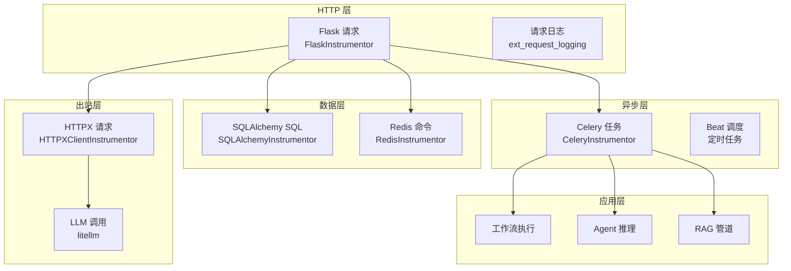
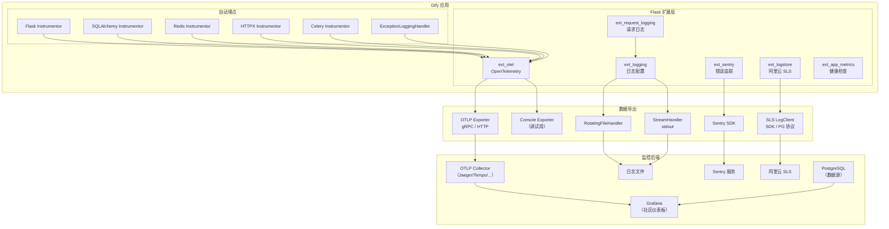
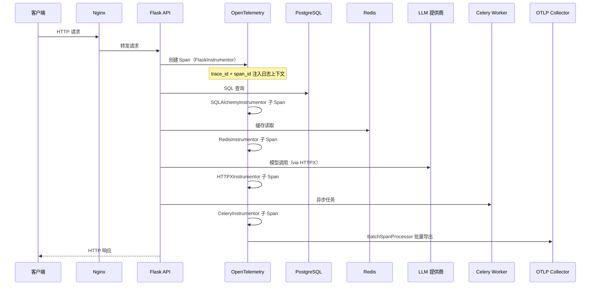
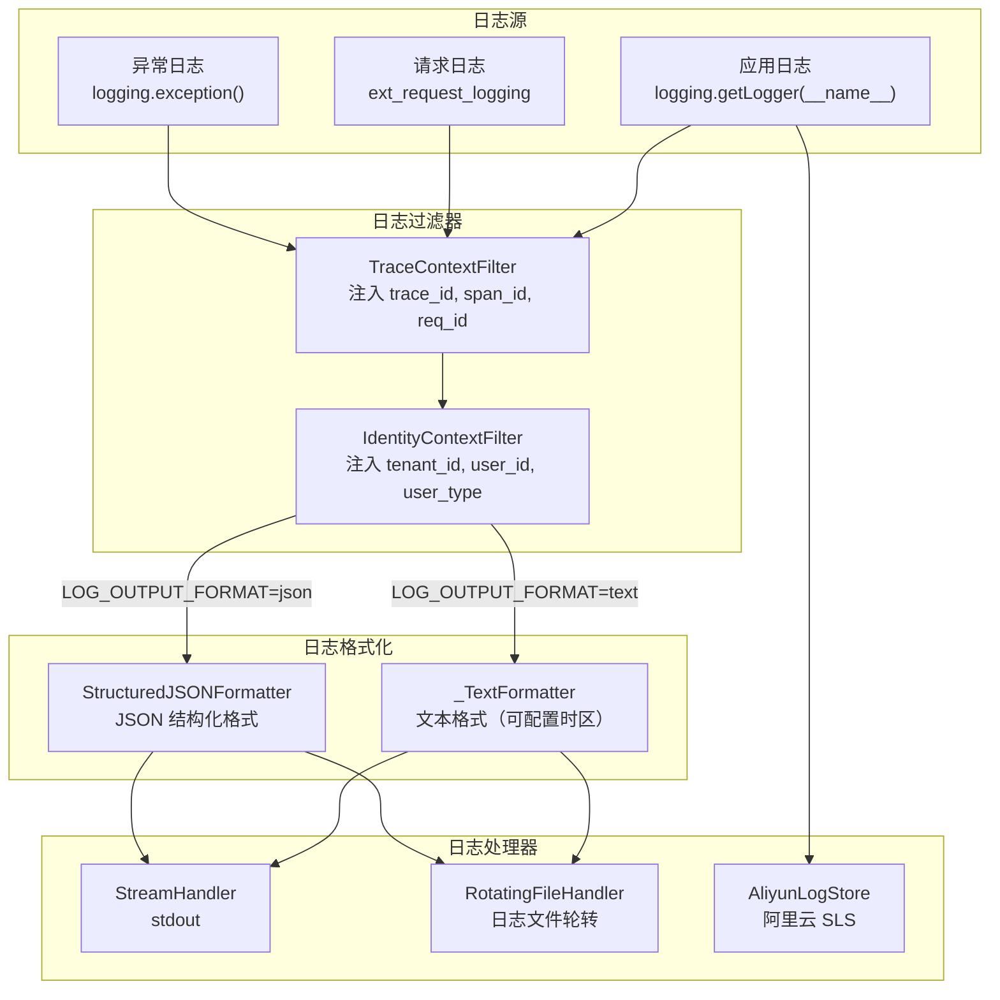
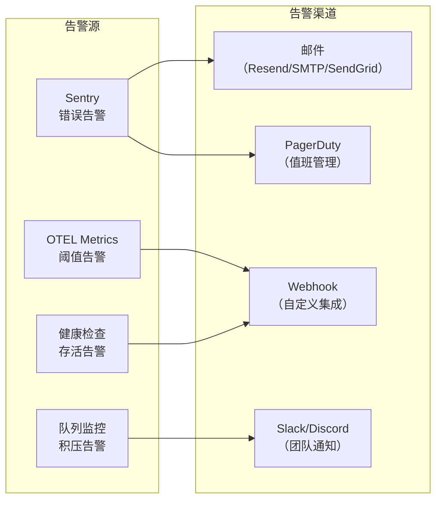
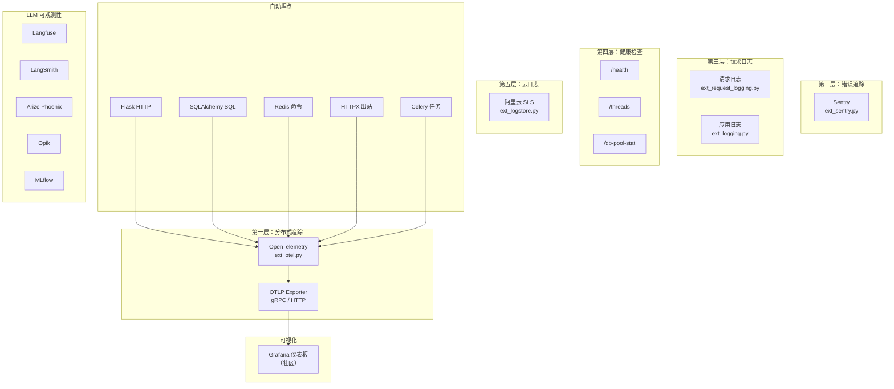

# 监控体系

> **TL;DR**: Dify 通过 OpenTelemetry（分布式追踪 + 指标）、Sentry（错误捕获）、结构化日志（文本/JSON 双格式）、阿里云 SLS LogStore（云日志）和健康检查端点构建了四层可观测性体系，配合自动埋点覆盖 Flask、SQLAlchemy、Redis、HTTPX、Celery 五大组件，支持 Grafana 社区仪表板实现应用级监控。

## 概述

Dify 的监控体系遵循"三支柱"可观测性模型（Metrics、Traces、Logs），在此基础上叠加了错误追踪和健康检查两个补充层。后端通过 27 个 Flask 扩展中的 5 个可观测性扩展（`ext_logging`、`ext_otel`、`ext_sentry`、`ext_request_logging`、`ext_logstore`）按严格顺序初始化，形成完整的运行时监控能力。

**核心设计原则：**

- **分层可观测**：分布式追踪、错误捕获、请求日志、健康端点四层独立，按需启用
- **自动埋点优先**：通过 OpenTelemetry Instrumentation 自动覆盖 HTTP、SQL、Redis、出站请求、异步任务，零侵入
- **结构化日志**：支持文本和 JSON 双格式输出，日志自动注入 trace_id、span_id、tenant_id、user_id 上下文
- **多后端适配**：OTLP 支持 gRPC/HTTP 双协议导出，日志支持控制台、文件、阿里云 SLS 三种输出目标
- **LLM 专属可观测**：集成 Langfuse、LangSmith、Arize Phoenix、Opik、MLflow 等 LLM 专用观测平台

## 详细设计

### 1. 监控需求分析

#### 1.1 监控目标

| 目标 | 说明 | 实现方式 |
|------|------|----------|
| 请求可追踪 | 每个 HTTP 请求从进入到响应全链路可追踪 | OpenTelemetry + trace_id 注入日志 |
| 异常可捕获 | 未处理异常自动上报，附带完整上下文 | Sentry + OTEL ExceptionLoggingHandler |
| 性能可度量 | HTTP 延迟、SQL 耗时、任务执行时间可量化 | OTEL Metrics + BatchSpanProcessor |
| 健康可探测 | 进程、线程、连接池状态可实时查询 | `/health`、`/threads`、`/db-pool-stat` 端点 |
| 业务可分析 | 工作流执行、节点运行数据可查询和审计 | 阿里云 SLS LogStore + Grafana 仪表板 |
| LLM 可观测 | 模型调用的 token 消耗、延迟、质量可追踪 | Langfuse/LangSmith/Phoenix/Opik 集成 |

#### 1.2 监控范围



#### 1.3 告警需求

| 告警场景 | 触发条件 | 告警级别 | 通知渠道 |
|----------|----------|----------|----------|
| 服务不可用 | `/health` 端点连续失败 | P0 紧急 | Sentry + 运维平台 |
| 错误率飙升 | 5xx 错误率超过阈值 | P1 高 | Sentry + 告警平台 |
| 延迟异常 | P99 延迟超过阈值 | P1 高 | OTEL Metrics 告警 |
| 连接池耗尽 | `checked_out` 接近 `pool_size` | P1 高 | `/db-pool-stat` 轮询 |
| 队列积压 | Celery 任务队列长度超限 | P2 中 | `queue_monitor_task` |
| LLM 调用失败 | 模型提供商返回错误 | P2 中 | Sentry + 应用日志 |

### 2. 监控架构设计

#### 2.1 整体架构



#### 2.2 扩展初始化顺序

监控相关扩展在 27 个 Flask 扩展中的初始化顺序：

```
 2. ext_logging           → 日志配置（最先，其他扩展依赖日志）
11. ext_app_metrics       → 健康检查端点
15. ext_logstore          → 阿里云 SLS LogStore
20. ext_sentry            → Sentry 错误追踪
25. ext_otel              → OpenTelemetry（在蓝图之后，需要看到路由）
26. ext_request_logging   → 请求日志（最后阶段）
```

**关键约束**：`ext_logging` 必须最先初始化，因为后续所有扩展都依赖日志系统。`ext_otel` 在蓝图注册之后初始化，这样 Flask Instrumentor 能正确匹配路由规则。

#### 2.3 监控工具链

| 层次 | 工具 | 用途 | 启用条件 |
|------|------|------|----------|
| 分布式追踪 | OpenTelemetry | 全链路追踪 + 指标采集 | `ENABLE_OTEL=true` |
| 错误追踪 | Sentry | 异常捕获 + 性能分析 | `SENTRY_DSN` 非空 |
| 结构化日志 | 内置 logging | 文本/JSON 格式日志 | 始终启用 |
| 请求日志 | 内置 request_logging | 访问日志 + body 转储 | `ENABLE_REQUEST_LOGGING=true` |
| 云日志 | 阿里云 SLS | 工作流执行日志持久化 | `ALIYUN_SLS_ENDPOINT` 非空 |
| 健康检查 | 内置端点 | 进程/线程/连接池状态 | 始终启用 |
| 仪表板 | Grafana（社区） | 应用级监控可视化 | 外部部署 |
| LLM 观测 | Langfuse/Phoenix/... | 模型调用追踪 | 应用内配置 |

### 3. 指标监控

#### 3.1 OpenTelemetry 指标

OTEL 通过 `MeterProvider` 和 `PeriodicExportingMetricReader` 采集和导出指标数据。

**HTTP 响应指标**（`init_flask_instrumentor` 中定义）：

| 指标名 | 类型 | 说明 | 属性 |
|--------|------|------|------|
| `http.server.response.count` | Counter | HTTP 响应总数 | `status_code`、`status_class`（2xx/4xx/5xx）、`http.route`、`http.request.method` |

**Resource 属性**（每个指标和 span 都携带）：

| 属性 | 来源 | 示例 |
|------|------|------|
| `service.name` | `APPLICATION_NAME` | `dify` |
| `service.version` | `project.version-COMMIT_SHA` | `dify-1.0.0-abc1234` |
| `process.pid` | `os.getpid()` | `12345` |
| `deployment.environment.name` | `DEPLOY_ENV-EDITION` | `production-SELF_HOSTED` |
| `host.name` | `socket.gethostname()` | `dify-api-01` |
| `host.arch` | `platform.machine()` | `arm64` |
| `os.type` | `platform.system()` | `linux` |
| `custom.deployment.git_commit` | `COMMIT_SHA` | `abc1234` |

#### 3.2 业务指标

通过 Grafana 社区仪表板（[dify-grafana-dashboard](https://github.com/bowenliang123/dify-grafana-dashboard)）从 PostgreSQL 数据库直接查询业务指标：

| 指标类别 | 示例指标 | 数据源 |
|----------|----------|--------|
| 应用级 | 应用数量、活跃应用数、消息量 | PostgreSQL |
| 租户级 | 租户 token 消耗、API 调用量 | PostgreSQL |
| 消息级 | 消息延迟、对话轮次、用户满意度 | PostgreSQL |
| 模型级 | 模型调用次数、token 消耗、错误率 | PostgreSQL |
| 工作流级 | 执行次数、成功率、平均耗时 | PostgreSQL |

#### 3.3 系统指标

通过健康检查端点暴露的系统运行时指标：

**`GET /health`**：

```json
{
  "pid": 12345,
  "status": "ok",
  "version": "1.0.0"
}
```

**`GET /threads`**：

```json
{
  "pid": 12345,
  "thread_num": 42,
  "threads": [
    {"name": "MainThread", "id": 140704, "is_alive": true},
    {"name": "ThreadPoolExecutor-0_0", "id": 140705, "is_alive": true}
  ]
}
```

**`GET /db-pool-stat`**：

```json
{
  "pid": 12345,
  "pool_size": 10,
  "checked_in_connections": 8,
  "checked_out_connections": 2,
  "overflow_connections": 0,
  "connection_timeout": 30,
  "recycle_time": 3600
}
```

#### 3.4 自定义指标（Dify Span Attributes）

通过 `DifySpanAttributes` 定义的 Dify 专属语义属性，附加到追踪 span 上：

| 属性 | 键名 | 说明 |
|------|------|------|
| 应用 ID | `dify.app_id` | 当前请求关联的应用 |
| 租户 ID | `dify.tenant_id` | 当前请求的租户 |
| 用户类型 | `dify.user_type` | Account 或 EndUser |
| 流式标志 | `dify.streaming` | 是否启用流式响应 |
| 工作流 ID | `dify.workflow_id` | 当前执行的工作流 |
| 调用来源 | `dify.invoke_from` | SERVICE_API / WEB_APP / DEBUGGER |

GenAI 标准属性（遵循 OpenTelemetry GenAI Semantic Conventions）：

| 属性 | 说明 |
|------|------|
| `gen_ai.model` | 模型名称 |
| `gen_ai.tokens` | Token 消耗量 |
| `gen_ai.finish_reason` | 生成结束原因 |

### 4. 链路追踪

#### 4.1 追踪架构



#### 4.2 TracerProvider 配置

| 配置项 | 默认值 | 说明 |
|--------|--------|------|
| `ENABLE_OTEL` | `false` | 总开关 |
| `OTEL_EXPORTER_TYPE` | `otlp` | 导出器类型（`otlp` 或 `console`） |
| `OTEL_EXPORTER_OTLP_PROTOCOL` | `http`（默认） | OTLP 协议（`grpc` 或 `http`） |
| `OTLP_BASE_ENDPOINT` | - | OTLP 基础端点 |
| `OTLP_TRACE_ENDPOINT` | `{base}/v1/traces` | 追踪专用端点 |
| `OTLP_METRIC_ENDPOINT` | `{base}/v1/metrics` | 指标专用端点 |
| `OTLP_API_KEY` | - | Bearer Token 认证 |
| `OTEL_SAMPLING_RATE` | `0.1` | 采样率（0.0 到 1.0） |
| `OTEL_MAX_QUEUE_SIZE` | `2048` | BatchSpanProcessor 最大队列 |
| `OTEL_MAX_EXPORT_BATCH_SIZE` | `512` | 单次导出最大 span 数 |
| `OTEL_BATCH_EXPORT_SCHEDULE_DELAY` | - | 批量导出调度延迟 |
| `OTEL_BATCH_EXPORT_TIMEOUT` | `10000` | 批量导出超时（ms） |
| `OTEL_METRIC_EXPORT_INTERVAL` | `60000` | 指标导出间隔（ms） |
| `OTEL_METRIC_EXPORT_TIMEOUT` | `30000` | 指标导出超时（ms） |

**采样策略**：使用 `ParentBasedTraceIdRatio` 采样器，尊重父 span 的采样决策，对根 span 按 `OTEL_SAMPLING_RATE` 概率采样。

#### 4.3 自动埋点覆盖

| 组件 | Instrumentor | 埋点内容 | 初始化条件 |
|------|-------------|----------|------------|
| Flask | `FlaskInstrumentor` | HTTP 请求 span + 响应指标（按状态码/方法/路由） | 非 Celery Worker 进程 |
| SQLAlchemy | `SQLAlchemyInstrumentor` | SQL 注释器 + 引擎埋点 | 始终（Flask 进程） |
| Redis | `RedisInstrumentor` | Redis 命令追踪 | 始终 |
| HTTPX | `HTTPXClientInstrumentor` | 出站 HTTP 请求追踪 | 始终 |
| Celery | `CeleryInstrumentor` | 任务执行追踪 | Flask 进程中初始化 |
| 异常日志 | `ExceptionLoggingHandler` | `logging.exception()` 自动捕获为 span 事件 | 始终 |

**异常日志处理**（`ExceptionLoggingHandler`）：

当代码调用 `logging.exception()` 时，该 handler 不会创建新 span，而是在当前 span 上执行：
1. 设置 span 状态为 `ERROR`
2. 添加 `log.exception` 事件（包含 log.level、log.message、log.logger、log.file.path、log.file.line）
3. 记录异常对象（`span.record_exception`）
4. 设置 `exception.type` 属性

#### 4.4 上下文传播

通过 `setup_context_propagation()` 实现跨进程追踪上下文传播：

- **Flask → Celery**：Flask 进程发起的异步任务自动继承 trace context
- **Celery Worker**：Worker 进程通过 `CeleryInstrumentor` 恢复追踪上下文
- **日志关联**：`TraceContextFilter` 从 OpenTelemetry 当前 span 提取 `trace_id` 和 `span_id`，注入每条日志记录

#### 4.5 性能瓶颈定位

追踪数据支持以下性能分析场景：

| 场景 | 方法 |
|------|------|
| 慢请求定位 | 按 `duration` 排序 span，找到耗时最长的子 span |
| SQL 慢查询 | SQLAlchemy span 包含 SQL 注释，定位具体查询语句 |
| LLM 调用延迟 | HTTPX span 追踪到模型提供商的响应时间 |
| 异步任务延迟 | Celery span 追踪任务排队时间和执行时间 |
| 缓存命中率 | Redis span 追踪缓存操作频率和耗时 |

### 5. 日志监控

#### 5.1 日志架构



#### 5.2 日志配置

| 配置项 | 默认值 | 说明 |
|--------|--------|------|
| `LOG_LEVEL` | `INFO` | 日志级别 |
| `LOG_OUTPUT_FORMAT` | `text` | 输出格式（`text` 或 `json`） |
| `LOG_FILE` | - | 日志文件路径（空则仅控制台输出） |
| `LOG_FILE_MAX_SIZE` | - | 单个日志文件最大大小（MB） |
| `LOG_FILE_BACKUP_COUNT` | - | 轮转备份数量 |
| `LOG_FORMAT` | - | 文本格式模板 |
| `LOG_DATEFORMAT` | - | 日期格式模板 |
| `LOG_TZ` | - | 日志时区（仅文本格式生效） |

#### 5.3 结构化日志格式

**JSON 格式输出**（`StructuredJSONFormatter`）：

```json
{
  "ts": "2026-07-19T10:30:00.123Z",
  "severity": "INFO",
  "service": "dify",
  "caller": "workflow_service.py:42",
  "message": "Workflow execution completed",
  "trace_id": "abc123def456",
  "span_id": "789xyz",
  "identity": {
    "tenant_id": "tenant-001",
    "user_id": "user-001",
    "user_type": "account"
  },
  "attributes": {
    "workflow_id": "wf-001",
    "duration_ms": 1234
  }
}
```

**文本格式输出**（`_TextFormatter`）：

自动注入 `trace_id`、`span_id`、`req_id` 字段，即使上下文中不存在也保留空值，确保日志格式一致。

#### 5.4 日志上下文注入

**TraceContextFilter**：

| 字段 | 来源 | 说明 |
|------|------|------|
| `trace_id` | OpenTelemetry 当前 span（优先）或 ContextVar（回退） | 追踪 ID |
| `span_id` | OpenTelemetry 当前 span | Span ID |
| `req_id` | ContextVar（`core.logging.context`） | 请求 ID（向后兼容） |

**IdentityContextFilter**：

| 字段 | 来源 | 说明 |
|------|------|------|
| `tenant_id` | Flask-Login `current_user` | 租户 ID |
| `user_id` | Flask-Login `current_user` | 用户 ID |
| `user_type` | Flask-Login `current_user` | 用户类型（`account` 或 `end_user`） |

#### 5.5 请求日志

通过 `ENABLE_REQUEST_LOGGING` 启用，基于 Flask 信号机制（`request_started` / `request_finished`）：

| 日志级别 | 内容 | 说明 |
|----------|------|------|
| INFO | `{method} {path} {status_code} {duration_ms} {trace_id}` | 紧凑访问日志，始终输出 |
| DEBUG | 完整请求/响应 JSON body 转储 | 仅 DEBUG 级别输出，含格式化 JSON |

**请求计时**：通过 `time.perf_counter()` 在 `request_started` 信号中记录起始时间，在 `request_finished` 信号中计算耗时，精度达微秒级。

#### 5.6 阿里云 SLS LogStore

可选的阿里云日志服务集成（`ext_logstore.py`），专注于工作流执行日志的持久化和查询：

| 特性 | 说明 |
|------|------|
| 双模式 | SDK 模式（HTTP API）和 PG 模式（PostgreSQL 线协议，更低延迟） |
| 自动建表 | 自动创建 `workflow_execution` 和 `workflow_node_execution` 两个 LogStore |
| 自动索引 | 从 SQLAlchemy 模型定义自动生成字段索引配置 |
| 智能合并 | 更新索引时保留用户自定义字段，仅补充缺失字段 |
| 连通性预检 | 启动时检查 SLS 端点可达性，防止无限挂起 |
| TTL 管理 | 可配置日志保留天数（默认 365 天） |

**配置项**：

| 配置项 | 说明 |
|--------|------|
| `ALIYUN_SLS_ENDPOINT` | SLS 服务端点 |
| `ALIYUN_SLS_ACCESS_KEY_ID` | 访问密钥 ID |
| `ALIYUN_SLS_ACCESS_KEY_SECRET` | 访问密钥 Secret |
| `ALIYUN_SLS_REGION` | 服务区域 |
| `ALIYUN_SLS_PROJECT_NAME` | SLS 项目名称 |
| `ALIYUN_SLS_LOGSTORE_TTL` | 日志保留天数 |
| `LOGSTORE_PG_MODE_ENABLED` | 是否启用 PG 协议模式 |

### 6. 告警和通知

#### 6.1 Sentry 错误追踪

Sentry 是 Dify 的主要错误捕获和告警通道：

| 配置项 | 默认值 | 说明 |
|--------|--------|------|
| `SENTRY_DSN` | - | Sentry DSN（设置后启用） |
| `SENTRY_TRACES_SAMPLE_RATE` | - | 追踪采样率 |
| `SENTRY_PROFILES_SAMPLE_RATE` | - | 性能分析采样率 |

**集成范围**：

| 集成 | 说明 |
|------|------|
| `FlaskIntegration` | 捕获 Flask 请求处理中的异常 |
| `CeleryIntegration` | 捕获 Celery 任务执行中的异常 |

**错误过滤**：

| 忽略的错误类型 | 原因 |
|---------------|------|
| `HTTPException` | 正常的 HTTP 状态码响应（404、403 等） |
| `ValueError` | 常见的参数验证错误 |
| `FileNotFoundError` | 文件不存在属于正常业务场景 |
| `InvokeRateLimitError` | LLM 调用限流属于预期行为 |
| `parse_error.defaultErrorResponse` | Langfuse 解析错误 |

**Release 追踪**：Sentry 事件携带 `dify-{version}-{commit_sha}` 格式的 release 标签，支持按版本查看错误趋势。

#### 6.2 告警规则设计

| 告警规则 | 监控指标 | 阈值 | 评估窗口 | 告警级别 |
|----------|----------|------|----------|----------|
| 服务宕机 | `/health` 端点状态 | 连续 3 次失败 | 1 分钟 | P0 |
| 高错误率 | `http.server.response.count{status_class="5xx"}` | > 5% | 5 分钟 | P1 |
| 高延迟 | HTTP 请求 P99 延迟 | > 10s | 5 分钟 | P1 |
| 连接池耗尽 | `db-pool-stat.checked_out / pool_size` | > 90% | 2 分钟 | P1 |
| 队列积压 | `datasets-queue-monitor` 任务检测 | 队列长度 > 1000 | 30 分钟 | P2 |
| 数据库迁移失败 | CI `db-migration-test` 工作流 | 任何失败 | 每次 PR | P2 |
| LLM 提供商异常 | 模型调用错误率 | > 10% | 10 分钟 | P2 |

#### 6.3 告警渠道



#### 6.4 告警升级策略

| 阶段 | 时间 | 动作 |
|------|------|------|
| 第一阶段 | 0 分钟 | 自动通知值班人员（邮件 + IM） |
| 第二阶段 | 15 分钟 | 未确认则升级通知团队负责人 |
| 第三阶段 | 30 分钟 | 未处理则升级通知技术总监 |

#### 6.5 响应头追踪

每个 HTTP 响应自动携带追踪相关的头部信息：

| 响应头 | 说明 |
|--------|------|
| `X-Version` | Dify 版本号 |
| `X-Env` | 部署环境 |
| `X-Trace-Id` | 请求追踪 ID（通过 CORS `expose_headers` 暴露给前端） |

前端可通过读取 `X-Trace-Id` 响应头，将用户反馈与后端追踪记录关联。

## 附录

### A. 监控架构图



### B. 指标清单表

| 指标名 | 类型 | 来源 | 属性 | 说明 |
|--------|------|------|------|------|
| `http.server.response.count` | Counter | FlaskInstrumentor | `status_code`, `status_class`, `http.route`, `http.request.method` | HTTP 响应总数 |
| `process.runtime.cpu.time` | Counter | OTEL Runtime | - | 进程 CPU 时间 |
| `process.runtime.memory` | Gauge | OTEL Runtime | - | 进程内存使用 |
| 连接池大小 | Gauge | `/db-pool-stat` | - | SQLAlchemy 连接池大小 |
| 已借出连接 | Gauge | `/db-pool-stat` | - | 当前借出的连接数 |
| 溢出连接 | Gauge | `/db-pool-stat` | - | 溢出连接数 |
| 活跃线程数 | Gauge | `/threads` | - | 当前活跃线程数 |

### C. 告警规则表

| 规则名 | 监控目标 | 条件 | 严重级别 | 通知方式 |
|--------|----------|------|----------|----------|
| 服务不可用 | `/health` | 连续失败 | P0 | Sentry + PagerDuty |
| 5xx 错误率 | HTTP 响应 | > 5% / 5min | P1 | Sentry + 邮件 |
| P99 延迟 | HTTP 延迟 | > 10s / 5min | P1 | OTEL 告警 |
| 连接池耗尽 | DB Pool | > 90% / 2min | P1 | 自定义告警 |
| 队列积压 | Celery Queue | > 1000 / 30min | P2 | Slack/Discord |
| LLM 调用失败 | 模型调用 | > 10% / 10min | P2 | Sentry + 邮件 |

### D. 环境变量速查表

| 类别 | 变量 | 默认值 | 说明 |
|------|------|--------|------|
| **日志** | `LOG_LEVEL` | `INFO` | 日志级别 |
| | `LOG_OUTPUT_FORMAT` | `text` | 输出格式（text/json） |
| | `LOG_FILE` | - | 日志文件路径 |
| | `LOG_FILE_MAX_SIZE` | - | 文件最大大小（MB） |
| | `LOG_FILE_BACKUP_COUNT` | - | 轮转备份数 |
| | `LOG_FORMAT` | - | 文本格式模板 |
| | `LOG_TZ` | - | 日志时区 |
| | `ENABLE_REQUEST_LOGGING` | `false` | 请求日志开关 |
| **OpenTelemetry** | `ENABLE_OTEL` | `false` | OTEL 总开关 |
| | `OTEL_EXPORTER_TYPE` | `otlp` | 导出器类型 |
| | `OTEL_EXPORTER_OTLP_PROTOCOL` | `http` | OTLP 协议 |
| | `OTLP_BASE_ENDPOINT` | - | OTLP 基础端点 |
| | `OTLP_TRACE_ENDPOINT` | - | 追踪专用端点 |
| | `OTLP_METRIC_ENDPOINT` | - | 指标专用端点 |
| | `OTLP_API_KEY` | - | Bearer Token |
| | `OTEL_SAMPLING_RATE` | `0.1` | 采样率 |
| | `OTEL_MAX_QUEUE_SIZE` | `2048` | 队列大小 |
| | `OTEL_MAX_EXPORT_BATCH_SIZE` | `512` | 批量大小 |
| | `OTEL_BATCH_EXPORT_SCHEDULE_DELAY` | - | 调度延迟 |
| | `OTEL_BATCH_EXPORT_TIMEOUT` | `10000` | 导出超时（ms） |
| | `OTEL_METRIC_EXPORT_INTERVAL` | `60000` | 指标间隔（ms） |
| | `OTEL_METRIC_EXPORT_TIMEOUT` | `30000` | 指标超时（ms） |
| **Sentry** | `SENTRY_DSN` | - | Sentry DSN |
| | `SENTRY_TRACES_SAMPLE_RATE` | - | 追踪采样率 |
| | `SENTRY_PROFILES_SAMPLE_RATE` | - | 性能分析采样率 |
| **阿里云 SLS** | `ALIYUN_SLS_ENDPOINT` | - | SLS 端点 |
| | `ALIYUN_SLS_ACCESS_KEY_ID` | - | 访问密钥 ID |
| | `ALIYUN_SLS_ACCESS_KEY_SECRET` | - | 访问密钥 Secret |
| | `ALIYUN_SLS_REGION` | - | 区域 |
| | `ALIYUN_SLS_PROJECT_NAME` | - | 项目名称 |
| | `ALIYUN_SLS_LOGSTORE_TTL` | `365` | 日志保留天数 |
| | `LOGSTORE_PG_MODE_ENABLED` | `true` | PG 协议模式 |

## 变更日志

| 日期 | 版本 | 变更内容 | 作者 |
|------|------|----------|------|
| 2026-07-19 | 1.0 | 初始版本，基于 api/extensions/、api/configs/、api/core/logging/ 分析 | AI Assistant |
