# 权限模型设计

> **TL;DR**: Dify 采用基于租户隔离的 RBAC 五级角色模型，结合资源级 ABAC 属性控制，通过装饰器链实现分层权限检查，覆盖认证、授权、资源访问和 API 调用全链路。企业版新增部门管理功能，支持多级树形部门结构、部门管理员角色和基于部门的数据隔离。

## 概述

Dify 的权限模型解决三个核心问题：谁能访问系统（认证），谁能在哪个工作空间执行什么操作（角色授权），以及谁能访问哪些具体资源（资源级属性控制）。

当前模型以 **租户（Tenant）** 为隔离边界，以 **角色（Role）** 为权限载体，以 **属性（Attribute）** 为资源级细粒度控制手段，形成 RBAC + ABAC 混合架构。

**设计原则：**

- **租户隔离优先**：所有数据操作强制限定在 `tenant_id` 范围内，跨租户访问在数据层即被阻断
- **最小权限**：每个角色只拥有完成其职责所需的最小权限集
- **资源自治**：资源创建者可控制谁能看到和操作该资源
- **默认安全**：未认证请求一律拒绝，资源权限默认最严格（`only_me`）

## 详细设计

### 1. 现有权限模型分析

#### 1.1 基于租户的隔离

Dify 是多租户系统。每个工作空间（Workspace）对应一个 `Tenant` 记录，所有业务数据都通过 `tenant_id` 字段关联到特定租户。

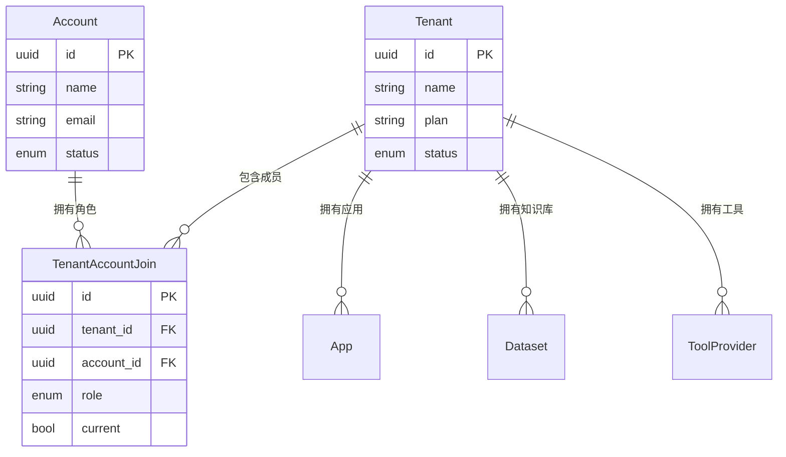
```mermaid
erDiagram
    Account ||--o{ TenantAccountJoin : "拥有角色"
    Tenant ||--o{ TenantAccountJoin : "包含成员"
    Tenant ||--o{ App : "拥有应用"
    Tenant ||--o{ Dataset : "拥有知识库"
    Tenant ||--o{ ToolProvider : "拥有工具"

    Account {
        uuid id PK
        string name
        string email
        enum status
    }

    Tenant {
        uuid id PK
        string name
        string plan
        enum status
    }

    TenantAccountJoin {
        uuid id PK
        uuid tenant_id FK
        uuid account_id FK
        enum role
        bool current
    }
```

**隔离机制：**

- **数据层**：所有模型（`App`、`Dataset`、`ToolProvider` 等）均包含 `tenant_id` 字段，查询时强制过滤
- **关联表**：`TenantAccountJoin` 管理用户与租户的多对多关系，同时存储角色信息
- **密钥隔离**：每个租户拥有独立的 RSA-2048 密钥对，用于凭证加密
- **当前租户**：`TenantAccountJoin.current` 字段标记用户当前活跃的工作空间

**关键实现：**

- `Account.current_tenant` 属性（`api/models/account.py`）：获取用户当前工作空间
- `Account.set_tenant_id()` 方法：切换当前工作空间并加载对应角色
- `current_account_with_tenant()`（`api/libs/login.py`）：每次请求验证用户-租户关联

#### 1.2 角色定义

Dify 定义了五个租户级角色，通过 `TenantAccountRole` 枚举（`api/models/account.py`）管理：

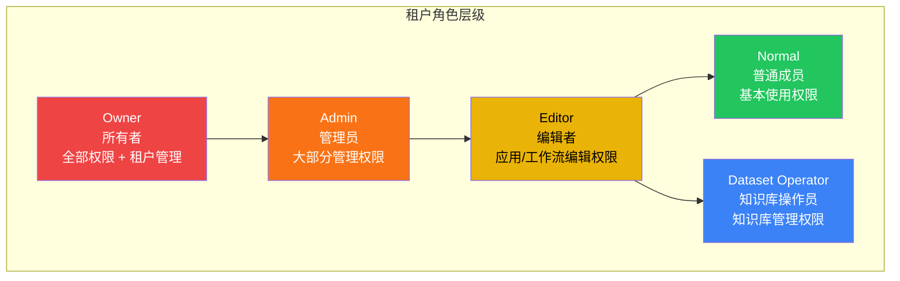
```mermaid
graph TB
    subgraph Roles["租户角色层级"]
        Owner["Owner<br/>所有者<br/>全部权限 + 租户管理"]
        Admin["Admin<br/>管理员<br/>大部分管理权限"]
        Editor["Editor<br/>编辑者<br/>应用/工作流编辑权限"]
        Normal["Normal<br/>普通成员<br/>基本使用权限"]
        DatasetOp["Dataset Operator<br/>知识库操作员<br/>知识库管理权限"]
    end

    Owner --> Admin
    Admin --> Editor
    Editor --> Normal
    Editor --> DatasetOp

    style Owner fill:#ef4444,color:#fff
    style Admin fill:#f97316,color:#fff
    style Editor fill:#eab308,color:#000
    style Normal fill:#22c55e,color:#fff
    style DatasetOp fill:#3b82f6,color:#fff
```

**角色权限矩阵：**

| 权限类别 | Owner | Admin | Editor | Normal | Dataset Operator |
|---------|:-----:|:-----:|:------:|:------:|:----------------:|
| 租户管理（成员邀请/移除） | ✅ | ✅ | ❌ | ❌ | ❌ |
| 成员角色变更 | ✅ | ❌ | ❌ | ❌ | ❌ |
| 应用创建/编辑/删除 | ✅ | ✅ | ✅ | ❌ | ❌ |
| 知识库管理 | ✅ | ✅ | ✅ | ❌ | ✅ |
| 模型供应商配置 | ✅ | ✅ | ❌ | ❌ | ❌ |
| 插件安装 | 可配置 | 可配置 | 可配置 | 可配置 | ❌ |
| 工作空间自定义 | ✅ | ✅ | ❌ | ❌ | ❌ |
| 应用使用（只读） | ✅ | ✅ | ✅ | ✅ | ❌ |

**角色判断方法（`TenantAccountRole`）：**

| 方法 | 包含角色 | 用途 |
|------|---------|------|
| `is_privileged_role()` | Owner, Admin | 管理操作权限检查 |
| `is_editing_role()` | Owner, Admin, Editor | 应用/工作流编辑权限 |
| `is_dataset_edit_role()` | Owner, Admin, Editor, Dataset Operator | 知识库编辑权限 |
| `is_admin_role()` | Admin | 管理员专属操作 |
| `is_non_owner_role()` | Admin, Editor, Normal, Dataset Operator | 非所有者角色判断 |

**Account 模型便捷属性：**

```python
account.is_admin_or_owner    # Owner 或 Admin
account.has_edit_permission  # Owner, Admin 或 Editor
account.is_dataset_editor    # Owner, Admin, Editor 或 Dataset Operator
account.is_dataset_operator  # 仅 Dataset Operator
```

#### 1.3 权限检查机制

权限检查通过装饰器链在控制器层实现，形成多层防护：

```mermaid
flowchart LR
    A[HTTP 请求] --> B{@setup_required}
    B -->|未初始化| C[403]
    B -->|已初始化| D{@login_required}
    D -->|未认证| E[401]
    D -->|已认证| F{CSRF 验证}
    F -->|失败| G[403]
    F -->|通过| H{@account_initialization_required}
    H -->|未初始化| I[403]
    H -->|已初始化| J{@billing_resource_check}
    J -->|超限| K[403]
    J -->|正常| L[业务逻辑]

    style A fill:#e2e8f0
    style L fill:#dcfce7,stroke:#22c55e
    style C fill:#fee2e2
    style E fill:#fee2e2
    style G fill:#fee2e2
    style I fill:#fee2e2
    style K fill:#fee2e2
```

**装饰器清单（`api/controllers/console/wraps.py`）：**

| 装饰器 | 作用 | 使用场景 |
|--------|------|---------|
| `@setup_required` | 验证系统已完成初始化 | 所有控制台 API |
| `@login_required` | 验证用户已登录 + CSRF 检查 | 需要认证的 API |
| `@account_initialization_required` | 验证账户已完成初始化 | 需要完整账户状态的 API |
| `@cloud_edition_billing_resource_check` | 检查计费配额（成员数、应用数等） | 创建资源类 API |
| `@only_edition_self_hosted` | 限制仅自部署版本可访问 | 自部署专属功能 |
| `@only_edition_cloud` | 限制仅云版本可访问 | 云版本专属功能 |
| `@enterprise_license_required` | 验证企业许可证 | 企业版功能 |
| `@email_password_login_enabled` | 检查是否启用邮箱密码登录 | 登录相关 API |

**成员操作权限检查（`TenantService.check_member_permission()`）：**

```python
perms = {
    "add":    [OWNER, ADMIN],
    "remove": [OWNER],
    "update": [OWNER],
}
```

### 2. 目标权限模型设计

#### 2.1 RBAC + ABAC 混合模型架构

当前模型已具备 RBAC + ABAC 混合特征。目标设计在现有基础上明确分层，增强可扩展性：

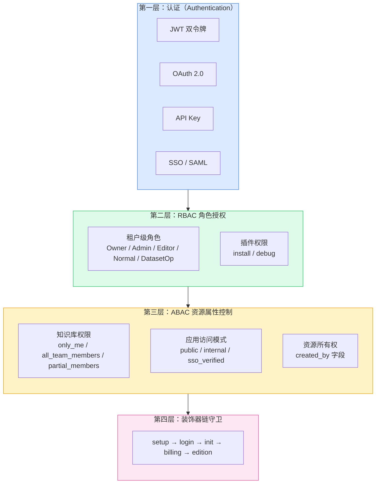
```mermaid
graph TB
    subgraph Layer1["第一层：认证（Authentication）"]
        JWT["JWT 双令牌"]
        OAuth["OAuth 2.0"]
        APIKey["API Key"]
        SSO["SSO / SAML"]
    end

    subgraph Layer2["第二层：RBAC 角色授权"]
        direction TB
        Tenant["租户级角色<br/>Owner / Admin / Editor / Normal / DatasetOp"]
        PluginPerm["插件权限<br/>install / debug"]
    end

    subgraph Layer3["第三层：ABAC 资源属性控制"]
        direction TB
        DatasetPerm["知识库权限<br/>only_me / all_team_members / partial_members"]
        AppAccess["应用访问模式<br/>public / internal / sso_verified"]
        ResourceOwner["资源所有权<br/>created_by 字段"]
    end

    subgraph Layer4["第四层：装饰器链守卫"]
        direction TB
        Decorators["setup → login → init → billing → edition"]
    end

    Layer1 --> Layer2
    Layer2 --> Layer3
    Layer3 --> Layer4

    style Layer1 fill:#dbeafe,stroke:#3b82f6
    style Layer2 fill:#dcfce7,stroke:#22c55e
    style Layer3 fill:#fef3c7,stroke:#f59e0b
    style Layer4 fill:#fce7f3,stroke:#ec4899
```

#### 2.2 角色定义（RBAC 层）

现有五级角色体系已覆盖主要场景。建议保持现有角色不变，但明确各角色的能力边界：

| 角色 | 定位 | 核心能力 | 典型用户 |
|------|------|---------|---------|
| **Owner** | 工作空间所有者 | 全部权限，包括成员管理、角色变更、所有权转让 | 团队负责人 |
| **Admin** | 管理员 | 成员邀请/移除、模型配置、工作空间设置，但不能变更角色 | 技术负责人 |
| **Editor** | 编辑者 | 创建/编辑/删除应用和工作流，管理知识库 | 开发者 |
| **Normal** | 普通成员 | 使用已发布的应用，查看工作空间信息 | 业务用户 |
| **Dataset Operator** | 知识库操作员 | 专注知识库管理（上传文档、配置索引），不能创建应用 | 数据标注员 |

**角色继承关系：**

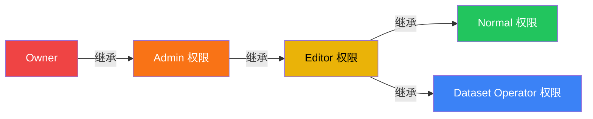
```mermaid
graph LR
    Owner["Owner"] -->|"继承"| Admin["Admin 权限"]
    Admin -->|"继承"| Editor["Editor 权限"]
    Editor -->|"继承"| Normal["Normal 权限"]
    Editor -->|"继承"| DatasetOp["Dataset Operator 权限"]

    style Owner fill:#ef4444,color:#fff
    style Admin fill:#f97316,color:#fff
    style Editor fill:#eab308,color:#000
    style Normal fill:#22c55e,color:#fff
    style DatasetOp fill:#3b82f6,color:#fff
```

权限向上累积：Owner 拥有 Admin 的所有权限，Admin 拥有 Editor 的所有权限，以此类推。

#### 2.3 属性控制（ABAC 层）

资源级权限通过属性字段实现细粒度控制：

**知识库权限（`Dataset.permission`）：**

| 属性值 | 含义 | 可见范围 |
|--------|------|---------|
| `only_me` | 仅创建者 | 只有资源创建者可见（默认值） |
| `all_team_members` | 全工作空间 | 工作空间内所有成员可见 |
| `partial_members` | 部分成员 | 通过 `DatasetMemberJoin` 表指定可见成员 |

**应用访问模式（企业版）：**

| 模式 | 含义 | 认证要求 |
|------|------|---------|
| `public` | 公开访问 | 无需认证 |
| `internal` / `private` | 内部访问 | 需要登录 + 权限检查 |
| `private_all` | 全员可访问 | 需要登录，工作空间成员均可 |
| `sso_verified` | SSO 验证 | 需要外部 SSO 认证 |

**插件权限（`TenantPluginPermission`）：**

| 权限维度 | 可选值 | 说明 |
|---------|--------|------|
| `install_permission` | `everyone` / `admins` / `noone` | 谁可以安装插件 |
| `debug_permission` | `everyone` / `admins` / `noone` | 谁可以调试插件 |

#### 2.4 冲突解决规则

当 RBAC 角色权限和 ABAC 属性控制同时存在时，遵循以下优先级：

1. **租户隔离 > 一切**：跨租户访问无论角色多高都被拒绝
2. **ABAC 属性 > RBAC 角色**：即使角色是 Owner，如果知识库设置为 `only_me` 且不是创建者，默认不可见（但 Owner/Admin 可修改权限设置）
3. **装饰器链 > 业务逻辑**：任何业务逻辑执行前，装饰器链的认证和授权检查必须先通过
4. **显式拒绝 > 隐式允许**：当多个规则冲突时，拒绝优先

#### 2.5 部门管理（企业版）

为支持企业级组织架构管理，Dify 企业版引入部门管理功能，使租户能够按部门组织成员、应用和知识库。

**核心目标：**

- 支持租户内部的多级部门树形结构，最多支持 10 级层级
- 实现基于部门的数据隔离（应用、知识库），确保数据安全
- 引入部门管理员角色，支持部门级权限管理，减轻租户管理员负担
- 保持向后兼容，现有数据自动迁移到默认部门，用户无感知
- 支持成员、应用、知识库在部门间的灵活转移

**部门数据模型：**

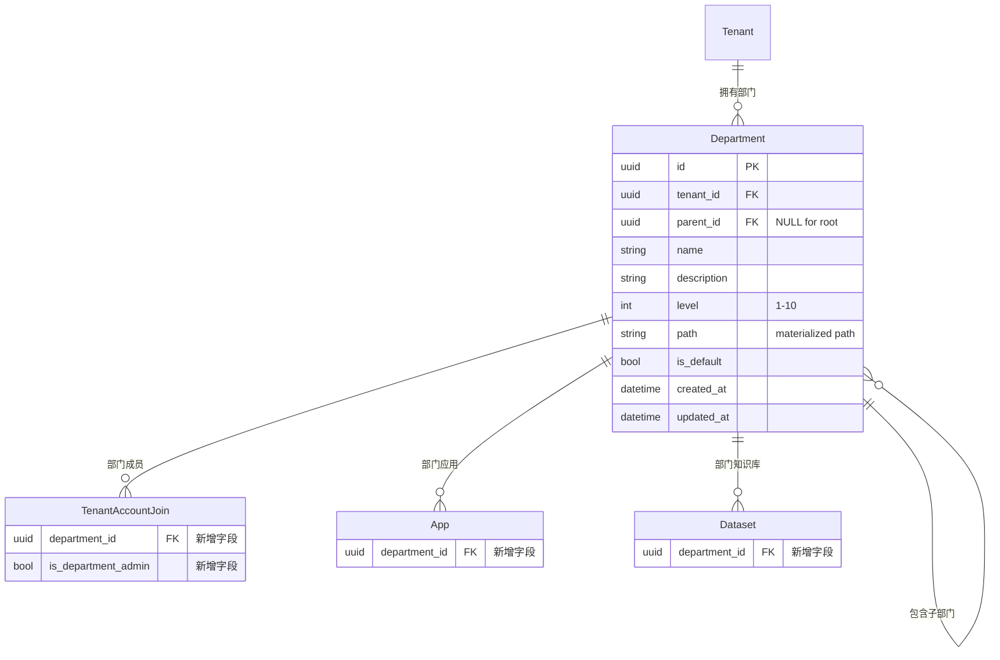
```mermaid
erDiagram
    Tenant ||--o{ Department : "拥有部门"
    Department ||--o{ Department : "包含子部门"
    Department ||--o{ TenantAccountJoin : "部门成员"
    Department ||--o{ App : "部门应用"
    Department ||--o{ Dataset : "部门知识库"

    Department {
        uuid id PK
        uuid tenant_id FK
        uuid parent_id FK "NULL for root"
        string name
        string description
        int level "1-10"
        string path "materialized path"
        bool is_default
        datetime created_at
        datetime updated_at
    }

    TenantAccountJoin {
        uuid department_id FK "新增字段"
        bool is_department_admin "新增字段"
    }

    App {
        uuid department_id FK "新增字段"
    }

    Dataset {
        uuid department_id FK "新增字段"
    }
```

**部门层级结构：**

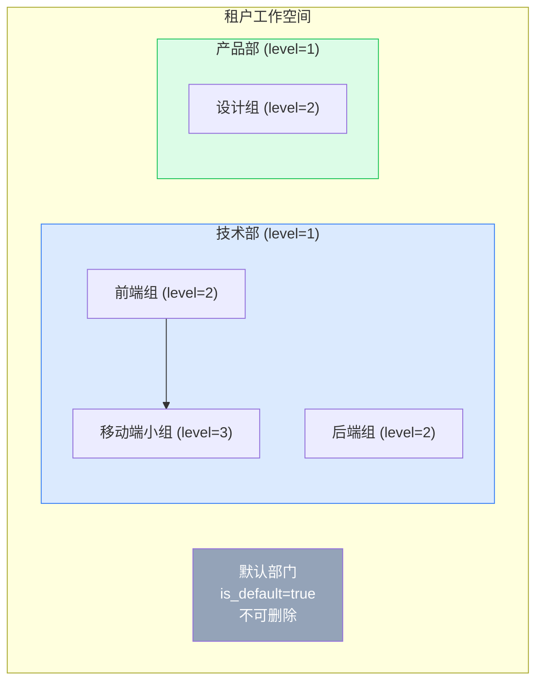
```mermaid
graph TB
    subgraph Tenant["租户工作空间"]
        Default["默认部门<br/>is_default=true<br/>不可删除"]
        
        subgraph Dept1["技术部 (level=1)"]
            Dept1A["前端组 (level=2)"]
            Dept1B["后端组 (level=2)"]
            Dept1A --> Dept1A1["移动端小组 (level=3)"]
        end
        
        subgraph Dept2["产品部 (level=1)"]
            Dept2A["设计组 (level=2)"]
        end
    end

    style Default fill:#94a3b8,color:#fff
    style Dept1 fill:#dbeafe,stroke:#3b82f6
    style Dept2 fill:#dcfce7,stroke:#22c55e
```

**三级权限体系：**

| 权限维度 | 租户管理员 (Owner/Admin) | 部门管理员 | 普通成员 |
|---------|:------------------------:|:----------:|:--------:|
| 创建/删除部门 | ✅ | ❌ | ❌ |
| 设置/取消部门管理员 | ✅ | ❌ | ❌ |
| 管理部门结构（重命名等） | ✅ | ❌ | ❌ |
| 管理本部门及子部门成员 | ✅ | ✅ | ❌ |
| 创建本部门及子部门成员 | ✅ | ✅ | ❌ |
| 移动本部门及子部门成员 | ✅ | ✅ | ❌ |
| 转移数据到本部门及子部门 | ✅ | ✅ | ❌ |
| 查看本部门及子部门数据 | ✅ | ✅ | ✅（仅自己的） |

**部门管理员规则：**

- 一个部门可以有多个部门管理员
- 部门管理员必须是该部门的成员
- 只有租户管理员可以设置/取消部门管理员
- 部门管理员可以管理部门成员，但不能管理部门结构
- 只有 `owner`/`admin`/`editor` 角色可以被设置为部门管理员
- 部门管理员可以看到和管理本部门及子部门的数据和成员
- 部门管理员不能移出自己
- 如果部门管理员的角色从 `owner`/`admin`/`editor` 变为 `normal` 或 `dataset_operator`，系统自动取消其部门管理员权限

**默认部门规则：**

- 每个租户有且仅有一个默认部门（`is_default = true`）
- 默认部门不可删除，但可以重命名
- 新租户创建时自动创建默认部门
- 数据迁移时，现有数据自动归属到默认部门
- 默认部门不能有子部门（前端创建部门时，父部门选择器中过滤掉默认部门）

**path 字段说明：**

- 格式：`/租户ID/根部门ID/子部门ID/孙部门ID`
- 示例：`/tenant1/abc123/def456/ghi789`
- 用途：通过 `path LIKE '/tenant1/abc123%'` 快速查询某部门的所有子部门
- 支持高效查询部门树、子部门列表、部门层级深度

### 3. 数据模型

#### 3.1 用户-角色-权限关系图

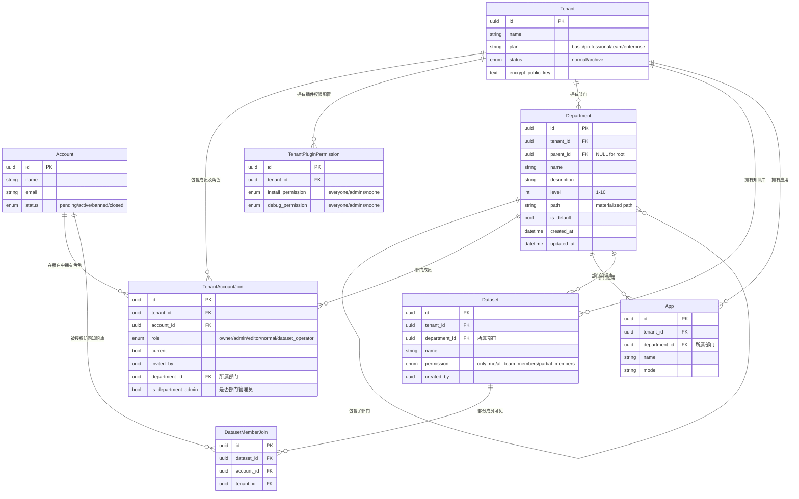
```mermaid
erDiagram
    Account ||--o{ TenantAccountJoin : "在租户中拥有角色"
    Tenant ||--o{ TenantAccountJoin : "包含成员及角色"
    Tenant ||--o{ TenantPluginPermission : "拥有插件权限配置"
    Tenant ||--o{ Department : "拥有部门"
    Tenant ||--o{ Dataset : "拥有知识库"
    Tenant ||--o{ App : "拥有应用"

    Department ||--o{ Department : "包含子部门"
    Department ||--o{ TenantAccountJoin : "部门成员"
    Department ||--o{ App : "部门应用"
    Department ||--o{ Dataset : "部门知识库"

    Dataset ||--o{ DatasetMemberJoin : "部分成员可见"
    Account ||--o{ DatasetMemberJoin : "被授权访问知识库"

    Account {
        uuid id PK
        string name
        string email
        enum status "pending/active/banned/closed"
    }

    Tenant {
        uuid id PK
        string name
        string plan "basic/professional/team/enterprise"
        enum status "normal/archive"
        text encrypt_public_key
    }

    Department {
        uuid id PK
        uuid tenant_id FK
        uuid parent_id FK "NULL for root"
        string name
        string description
        int level "1-10"
        string path "materialized path"
        bool is_default
        datetime created_at
        datetime updated_at
    }

    TenantAccountJoin {
        uuid id PK
        uuid tenant_id FK
        uuid account_id FK
        enum role "owner/admin/editor/normal/dataset_operator"
        bool current
        uuid invited_by
        uuid department_id FK "所属部门"
        bool is_department_admin "是否部门管理员"
    }

    Dataset {
        uuid id PK
        uuid tenant_id FK
        uuid department_id FK "所属部门"
        string name
        enum permission "only_me/all_team_members/partial_members"
        uuid created_by
    }

    App {
        uuid id PK
        uuid tenant_id FK
        uuid department_id FK "所属部门"
        string name
        string mode
    }

    TenantPluginPermission {
        uuid id PK
        uuid tenant_id FK
        enum install_permission "everyone/admins/noone"
        enum debug_permission "everyone/admins/noone"
    }

    DatasetMemberJoin {
        uuid id PK
        uuid dataset_id FK
        uuid account_id FK
        uuid tenant_id FK
    }
```

#### 3.2 数据库表结构

**核心权限相关表：**

| 表名 | 职责 | 关键字段 |
|------|------|---------|
| `accounts` | 用户账户 | `id`, `email`, `status`, `password`, `password_salt` |
| `tenants` | 工作空间 | `id`, `name`, `plan`, `status`, `encrypt_public_key` |
| `departments` | 部门（树形结构） | `tenant_id`, `parent_id`, `name`, `level`, `path`, `is_default` |
| `tenant_account_joins` | 用户-租户关联 + 角色 + 部门 | `tenant_id`, `account_id`, `role`, `current`, `department_id`, `is_department_admin` |
| `account_plugin_permissions` | 插件权限配置 | `tenant_id`, `install_permission`, `debug_permission` |
| `apps` | 应用（含部门归属） | `tenant_id`, `department_id`, `name`, `mode` |
| `datasets` | 知识库（含权限字段） | `tenant_id`, `department_id`, `permission`, `created_by` |
| `operation_log` | 操作审计日志 | `tenant_id`, `account_id`, `action`, `content` |

**索引设计：**

| 索引名 | 表 | 字段 | 用途 |
|--------|---|------|------|
| `tenant_account_join_account_id_idx` | `tenant_account_joins` | `account_id` | 按用户查询所属工作空间 |
| `tenant_account_join_tenant_id_idx` | `tenant_account_joins` | `tenant_id` | 按工作空间查询成员 |
| `unique_tenant_account_join` | `tenant_account_joins` | `(tenant_id, account_id)` | 唯一约束，防止重复关联 |
| `department_tenant_idx` | `departments` | `tenant_id` | 按工作空间查询部门 |
| `department_parent_idx` | `departments` | `parent_id` | 查询子部门 |
| `department_path_idx` | `departments` | `path` (前缀索引) | 快速查询子部门树 |
| `unique_tenant_department_name` | `departments` | `(tenant_id, parent_id, name)` | 同一父部门下名称唯一 |
| `dataset_tenant_idx` | `datasets` | `tenant_id` | 按工作空间查询知识库 |
| `app_tenant_idx` | `apps` | `tenant_id` | 按工作空间查询应用 |
| `app_department_idx` | `apps` | `department_id` | 按部门查询应用 |
| `dataset_department_idx` | `datasets` | `department_id` | 按部门查询知识库 |
| `operation_log_account_action_idx` | `operation_log` | `(tenant_id, account_id, action)` | 按租户和用户查询操作历史 |

### 4. 核心场景

#### 4.1 多租户资源隔离

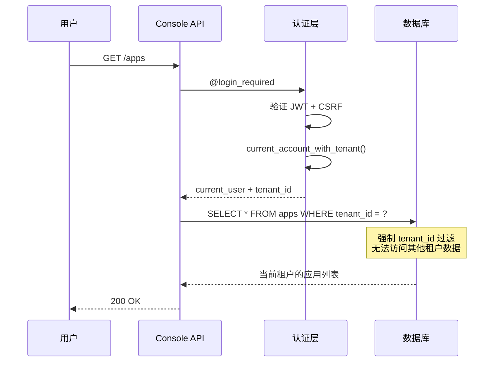
```mermaid
sequenceDiagram
    participant User as 用户
    participant API as Console API
    participant Auth as 认证层
    participant DB as 数据库

    User->>API: GET /apps
    API->>Auth: @login_required
    Auth->>Auth: 验证 JWT + CSRF
    Auth->>Auth: current_account_with_tenant()
    Auth-->>API: current_user + tenant_id

    API->>DB: SELECT * FROM apps WHERE tenant_id = ?
    Note over DB: 强制 tenant_id 过滤<br/>无法访问其他租户数据
    DB-->>API: 当前租户的应用列表
    API-->>User: 200 OK
```

**隔离保证：**

- 所有查询通过 `tenant_id` 过滤，ORM 层面通过模型定义强制关联
- 密钥加密使用租户级 RSA 密钥对，跨租户无法解密
- 向量数据库集合名包含 `tenant_id` 前缀（`VEC_{dataset_id}_Node`）

#### 4.2 跨团队协作

用户可属于多个工作空间，通过 `current` 字段切换活跃工作空间：

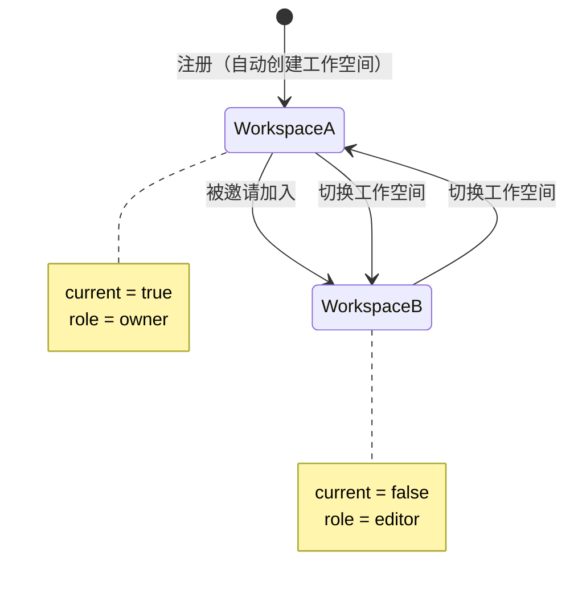
```mermaid
stateDiagram-v2
    [*] --> WorkspaceA: 注册（自动创建工作空间）
    WorkspaceA --> WorkspaceB: 被邀请加入
    WorkspaceB --> WorkspaceA: 切换工作空间
    WorkspaceA --> WorkspaceB: 切换工作空间

    note right of WorkspaceA
        current = true
        role = owner
    end note

    note right of WorkspaceB
        current = false
        role = editor
    end note
```

**切换流程（`TenantService.switch_tenant()`）：**

1. 验证用户是目标工作空间的成员
2. 将其他工作空间的 `current` 设为 `false`
3. 将目标工作空间的 `current` 设为 `true`
4. 重新加载 `Account.role` 和 `Account._current_tenant`

#### 4.3 知识库访问控制

知识库权限通过 `Dataset.permission` 字段控制可见性：

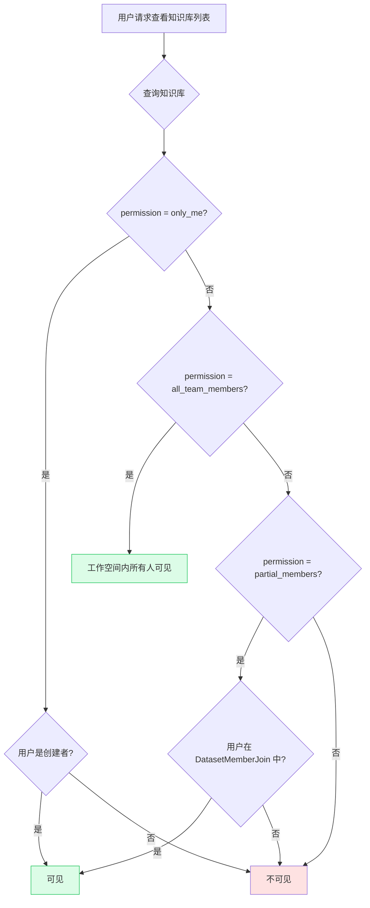
```mermaid
flowchart TD
    A[用户请求查看知识库列表] --> B{查询知识库}
    B --> C{permission = only_me?}
    C -->|是| D{用户是创建者?}
    D -->|是| E[可见]
    D -->|否| F[不可见]
    C -->|否| G{permission = all_team_members?}
    G -->|是| H[工作空间内所有人可见]
    G -->|否| I{permission = partial_members?}
    I -->|是| J{用户在 DatasetMemberJoin 中?}
    J -->|是| E
    J -->|否| F
    I -->|否| F

    style E fill:#dcfce7,stroke:#22c55e
    style F fill:#fee2e2
    style H fill:#dcfce7,stroke:#22c55e
```

**特殊规则：**

- Owner 和 Admin 可以修改任何知识库的权限设置，即使不是创建者
- Dataset Operator 只能管理知识库，不能创建应用
- 知识库被应用引用时，应用运行时的检索不受 `permission` 限制（由 `tenant_id` 保证隔离）

#### 4.4 API 调用权限

Service API 使用独立的 API Key 认证体系：

```mermaid
flowchart LR
    A[外部请求] --> B[Authorization: Bearer {api_key}]
    B --> C{验证 API Key}
    C -->|无效| D[401 Unauthorized]
    C -->|有效| E[获取 tenant_id]
    E --> F{检查 API 限速}
    F -->|超限| G[429 Too Many Requests]
    F -->|正常| H{检查计费配额}
    H -->|超限| I[403 Forbidden]
    H -->|正常| J[执行业务逻辑]

    style D fill:#fee2e2
    style G fill:#fee2e2
    style I fill:#fee2e2
    style J fill:#dcfce7,stroke:#22c55e
```

**API Key 类型：**

| 类型 | 用途 | 关联 |
|------|------|------|
| Dataset API Token | 知识库管理 API | 绑定租户 |
| App API Token | 应用调用 API | 绑定租户 + 应用 |

**应用级限速（`App` 模型）：**

- `api_rpm`：每分钟请求数限制
- `api_rph`：每小时请求数限制
- `max_active_requests`：最大并发请求数

#### 4.5 部门数据隔离（企业版）

企业版中，应用和知识库按部门隔离，查询时同时过滤 `tenant_id` 和 `department_id`：

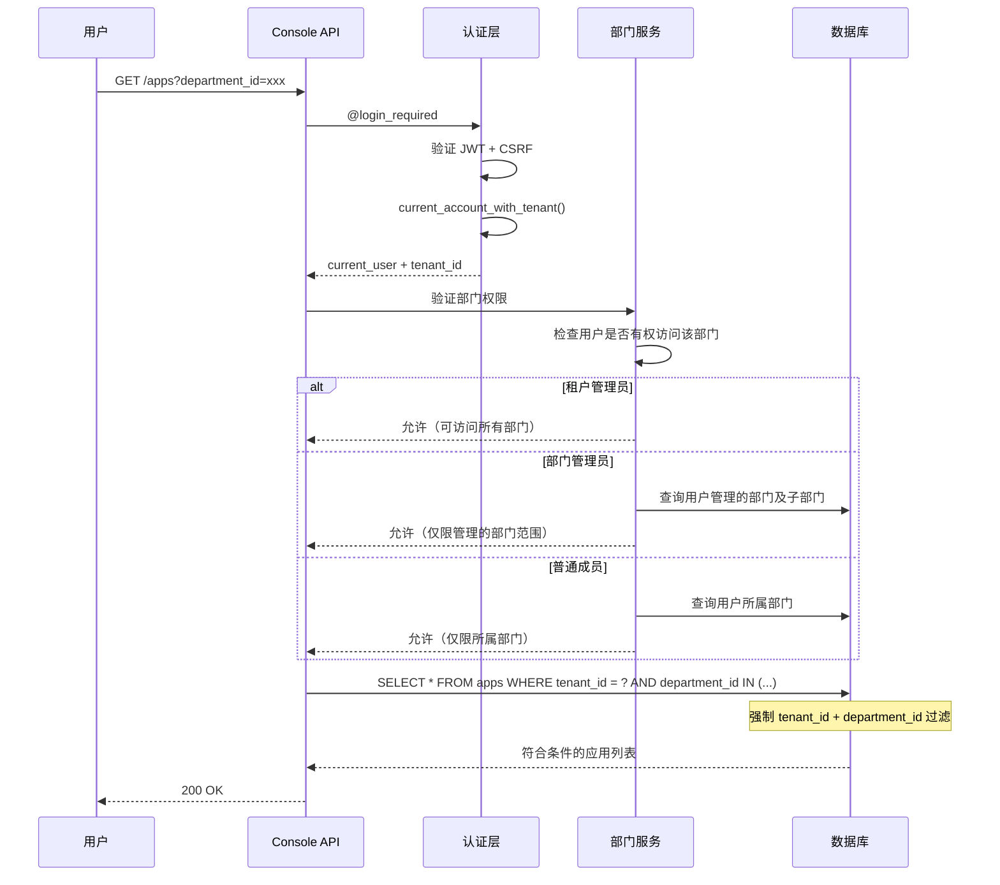
```mermaid
sequenceDiagram
    participant User as 用户
    participant API as Console API
    participant Auth as 认证层
    participant Dept as 部门服务
    participant DB as 数据库

    User->>API: GET /apps?department_id=xxx
    API->>Auth: @login_required
    Auth->>Auth: 验证 JWT + CSRF
    Auth->>Auth: current_account_with_tenant()
    Auth-->>API: current_user + tenant_id

    API->>Dept: 验证部门权限
    Dept->>Dept: 检查用户是否有权访问该部门
    alt 租户管理员
        Dept-->>API: 允许（可访问所有部门）
    else 部门管理员
        Dept->>DB: 查询用户管理的部门及子部门
        Dept-->>API: 允许（仅限管理的部门范围）
    else 普通成员
        Dept->>DB: 查询用户所属部门
        Dept-->>API: 允许（仅限所属部门）
    end

    API->>DB: SELECT * FROM apps WHERE tenant_id = ? AND department_id IN (...)
    Note over DB: 强制 tenant_id + department_id 过滤
    DB-->>API: 符合条件的应用列表
    API-->>User: 200 OK
```

**数据隔离规则：**

| 用户角色 | 可见应用/知识库范围 |
|---------|-------------------|
| 租户管理员 (Owner/Admin) | 租户内所有部门的数据 |
| 部门管理员 | 本部门及所有子部门的数据 |
| 普通成员 | 仅所属部门的数据（且受 `permission` 字段约束） |

#### 4.6 部门管理流程（企业版）

**创建部门流程：**

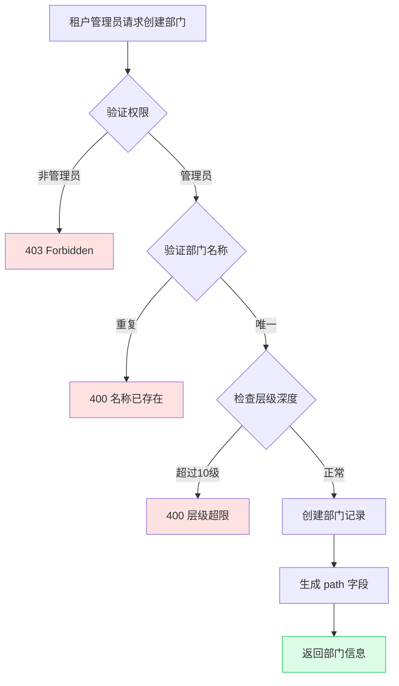
```mermaid
flowchart TD
    A[租户管理员请求创建部门] --> B{验证权限}
    B -->|非管理员| C[403 Forbidden]
    B -->|管理员| D{验证部门名称}
    D -->|重复| E[400 名称已存在]
    D -->|唯一| F{检查层级深度}
    F -->|超过10级| G[400 层级超限]
    F -->|正常| H[创建部门记录]
    H --> I[生成 path 字段]
    I --> J[返回部门信息]

    style C fill:#fee2e2
    style E fill:#fee2e2
    style G fill:#fee2e2
    style J fill:#dcfce7,stroke:#22c55e
```

**删除部门流程：**

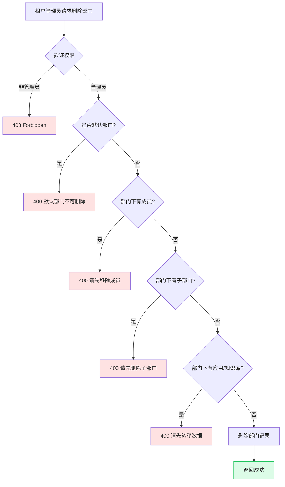
```mermaid
flowchart TD
    A[租户管理员请求删除部门] --> B{验证权限}
    B -->|非管理员| C[403 Forbidden]
    B -->|管理员| D{是否默认部门?}
    D -->|是| E[400 默认部门不可删除]
    D -->|否| F{部门下有成员?}
    F -->|是| G[400 请先移除成员]
    F -->|否| H{部门下有子部门?}
    H -->|是| I[400 请先删除子部门]
    H -->|否| J{部门下有应用/知识库?}
    J -->|是| K[400 请先转移数据]
    J -->|否| L[删除部门记录]
    L --> M[返回成功]

    style C fill:#fee2e2
    style E fill:#fee2e2
    style G fill:#fee2e2
    style I fill:#fee2e2
    style K fill:#fee2e2
    style M fill:#dcfce7,stroke:#22c55e
```

#### 4.7 成员部门转移（企业版）

成员可在部门间转移，转移后对原部门数据不再可见：

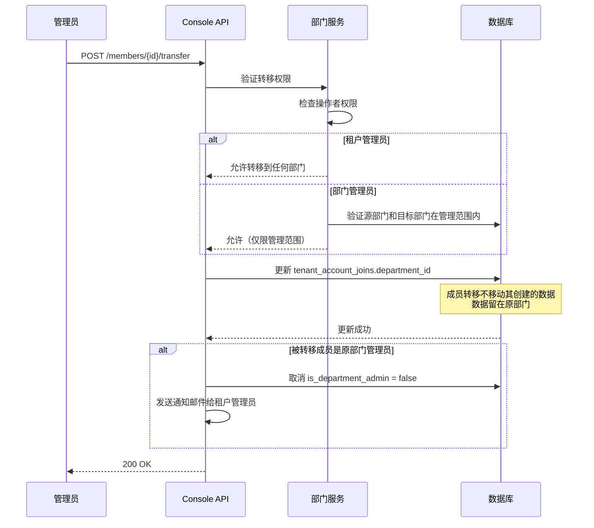
```mermaid
sequenceDiagram
    participant Admin as 管理员
    participant API as Console API
    participant Dept as 部门服务
    participant DB as 数据库

    Admin->>API: POST /members/{id}/transfer
    API->>Dept: 验证转移权限
    Dept->>Dept: 检查操作者权限
    
    alt 租户管理员
        Dept-->>API: 允许转移到任何部门
    else 部门管理员
        Dept->>DB: 验证源部门和目标部门在管理范围内
        Dept-->>API: 允许（仅限管理范围）
    end

    API->>DB: 更新 tenant_account_joins.department_id
    Note over DB: 成员转移不移动其创建的数据<br/>数据留在原部门
    DB-->>API: 更新成功

    alt 被转移成员是原部门管理员
        API->>DB: 取消 is_department_admin = false
        API->>API: 发送通知邮件给租户管理员
    end

    API-->>Admin: 200 OK
```

**转移规则：**

- 成员转移时，其创建的应用/知识库留在原部门（不随成员移动）
- 成员转移后，对原部门的数据不再可见
- 如果被转移的成员是部门管理员，系统自动取消其管理员权限并通知租户管理员
- 部门管理员不能移出自己

### 5. 实现方案

#### 5.1 权限检查中间件

权限检查通过装饰器链实现，按以下顺序执行：

```python
# 典型的控制器装饰器链
@console_ns.route("/apps")
class AppListApi(Resource):
    @setup_required                    # 1. 系统初始化检查
    @login_required                    # 2. 认证 + CSRF
    @account_initialization_required   # 3. 账户初始化检查
    @cloud_edition_billing_resource_check("apps")  # 4. 计费配额
    def get(self):
        current_user, current_tenant_id = current_account_with_tenant()
        # 5. 业务逻辑中的角色检查
        if not current_user.has_edit_permission:
            raise NoPermissionError()
        # 6. 数据查询（自动 tenant_id 过滤）
        ...
```

**装饰器执行顺序：**

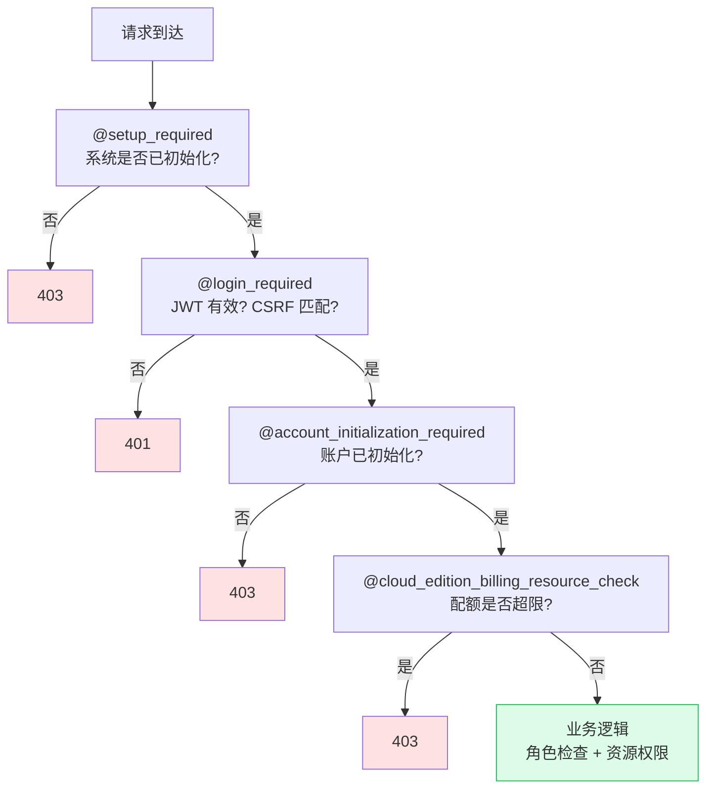
```mermaid
flowchart TD
    A[请求到达] --> B["@setup_required<br/>系统是否已初始化?"]
    B -->|否| B1[403]
    B -->|是| C["@login_required<br/>JWT 有效? CSRF 匹配?"]
    C -->|否| C1[401]
    C -->|是| D["@account_initialization_required<br/>账户已初始化?"]
    D -->|否| D1[403]
    D -->|是| E["@cloud_edition_billing_resource_check<br/>配额是否超限?"]
    E -->|是| E1[403]
    E -->|否| F["业务逻辑<br/>角色检查 + 资源权限"]

    style B1 fill:#fee2e2
    style C1 fill:#fee2e2
    style D1 fill:#fee2e2
    style E1 fill:#fee2e2
    style F fill:#dcfce7,stroke:#22c55e
```

#### 5.2 权限缓存策略

当前权限检查主要依赖数据库查询，缓存策略如下：

| 缓存对象 | 存储 | TTL | 说明 |
|---------|------|-----|------|
| Refresh Token | Redis | `REFRESH_TOKEN_EXPIRE_DAYS` | 令牌有效性验证 |
| 验证码令牌 | Redis | 可配置 TTL | 邮箱验证码、密码重置等 |
| RSA 私钥 | Redis | 120 秒 | 租户级解密密钥缓存 |
| 计费信息 | Redis | 由 `BillingService` 管理 | 配额检查结果缓存 |

**角色信息不缓存**：每次请求通过 `AccountService.load_user()` 从数据库加载角色，确保角色变更后立即生效。

**优化建议：**

- 角色信息可通过 Redis 短期缓存（TTL 30-60 秒），减少数据库查询
- 缓存键格式：`account_role:{account_id}:{tenant_id}`
- 角色变更时主动清除对应缓存

#### 5.3 权限审计日志

`OperationLog` 模型记录关键权限相关操作：

| 审计事件 | action 值 | 记录内容 |
|---------|-----------|---------|
| 成员邀请 | `invite_member` | 被邀请人邮箱、角色 |
| 成员移除 | `remove_member` | 被移除人 ID |
| 角色变更 | `update_member_role` | 目标成员、新角色 |
| 知识库权限变更 | `update_dataset_permission` | 知识库 ID、新权限值 |
| 插件权限变更 | `update_plugin_permission` | 新安装/调试权限 |
| 所有权转让 | `transfer_owner` | 新所有者邮箱 |
| 部门创建 | `create_department` | 部门 ID、名称、父部门 ID |
| 部门删除 | `delete_department` | 部门 ID、名称 |
| 部门更新 | `update_department` | 部门 ID、变更字段 |
| 设置部门管理员 | `set_department_admin` | 部门 ID、成员 ID |
| 取消部门管理员 | `remove_department_admin` | 部门 ID、成员 ID |
| 成员部门转移 | `transfer_member_department` | 成员 ID、源部门、目标部门 |
| 应用部门转移 | `transfer_app_department` | 应用 ID、源部门、目标部门 |
| 知识库部门转移 | `transfer_dataset_department` | 知识库 ID、源部门、目标部门 |

**登录审计字段（`Account` 模型）：**

- `last_login_at`：最后登录时间
- `last_login_ip`：最后登录 IP
- `last_active_at`：最后活跃时间（每 10 分钟自动更新）

### 6. 迁移方案

#### 6.1 现有权限数据迁移

当前权限模型已稳定运行，无需大规模数据迁移。如需扩展权限模型，建议采用增量方式：

**新增角色：**

1. 在 `TenantAccountRole` 枚举中添加新角色
2. 更新 `is_privileged_role()`、`is_editing_role()` 等方法
3. 添加数据库迁移脚本，为现有 `TenantAccountJoin` 记录设置默认角色
4. 更新前端角色选择器

**新增资源权限维度：**

1. 在资源模型中添加权限字段（如 `permission` 枚举列）
2. 设置合理的 `server_default` 值，确保现有数据自动获得默认权限
3. 更新查询逻辑，添加权限过滤条件

**部门管理数据迁移（企业版）：**

引入部门管理功能时，需要对现有数据进行迁移，确保向后兼容：

1. **创建 `departments` 表**：执行数据库迁移脚本创建部门表
2. **为每个租户创建默认部门**：遍历所有租户，为每个租户创建一个 `is_default = true` 的默认部门
3. **更新 `tenant_account_joins` 表**：将所有成员的 `department_id` 设置为所属租户的默认部门 ID，`is_department_admin` 设置为 `false`
4. **更新 `apps` 表**：将所有应用的 `department_id` 设置为所属租户的默认部门 ID
5. **更新 `datasets` 表**：将所有知识库的 `department_id` 设置为所属租户的默认部门 ID

**回滚策略：**

如果需要回滚，执行以下操作：
1. 清空 `tenant_account_joins` 表的 `department_id` 和 `is_department_admin` 字段
2. 清空 `apps` 表的 `department_id` 字段
3. 清空 `datasets` 表的 `department_id` 字段
4. 删除 `departments` 表的所有记录

#### 6.2 向后兼容策略

- **新角色默认无权限**：新增角色初始不包含任何权限，需显式授权
- **默认权限值**：资源权限字段使用最严格的默认值（如 `only_me`）
- **装饰器兼容**：新装饰器添加在现有装饰器链之后，不影响已有行为
- **API 版本控制**：权限相关 API 变更通过版本号管理

#### 6.3 灰度发布计划

如需引入重大权限模型变更：

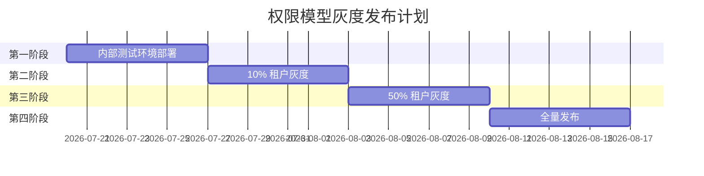
```mermaid
gantt
    title 权限模型灰度发布计划
    dateFormat  YYYY-MM-DD
    section 第一阶段
    内部测试环境部署         :a1, 2026-07-20, 7d
    section 第二阶段
    10% 租户灰度           :a2, after a1, 7d
    section 第三阶段
    50% 租户灰度           :a3, after a2, 7d
    section 第四阶段
    全量发布               :a4, after a3, 7d
```

**灰度策略：**

1. **内部测试**：在开发/测试环境验证权限逻辑
2. **小范围灰度**：选择 10% 的非企业租户启用新权限模型
3. **扩大灰度**：验证无异常后扩大到 50%
4. **全量发布**：确认稳定后对所有租户生效
5. **回滚机制**：通过 Feature Flag 控制，异常时立即回退

## 附录

### 权限模型总览图

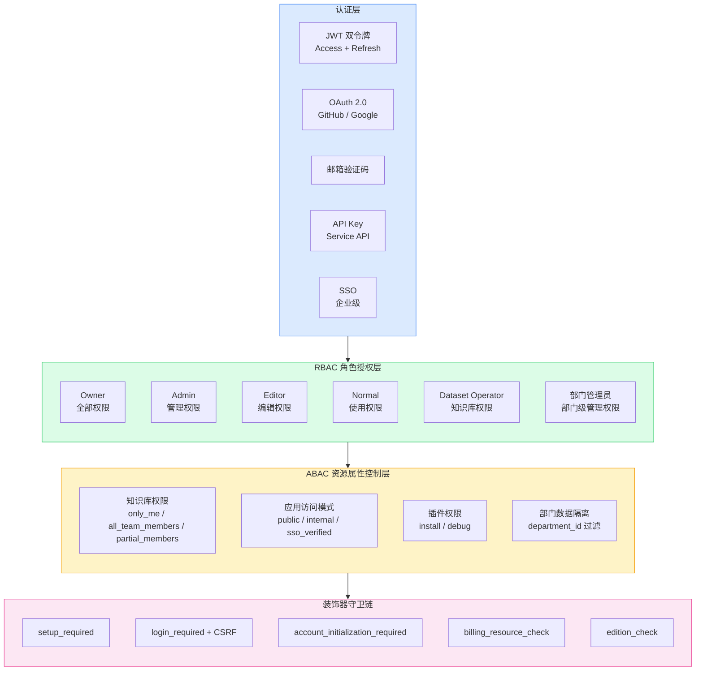
```mermaid
graph TB
    subgraph Auth["认证层"]
        JWT["JWT 双令牌<br/>Access + Refresh"]
        OAuth["OAuth 2.0<br/>GitHub / Google"]
        EmailCode["邮箱验证码"]
        APIKey["API Key<br/>Service API"]
        SSO["SSO<br/>企业级"]
    end

    subgraph RBAC["RBAC 角色授权层"]
        direction TB
        Owner["Owner<br/>全部权限"]
        Admin["Admin<br/>管理权限"]
        Editor["Editor<br/>编辑权限"]
        Normal["Normal<br/>使用权限"]
        DatasetOp["Dataset Operator<br/>知识库权限"]
        DeptAdmin["部门管理员<br/>部门级管理权限"]
    end

    subgraph ABAC["ABAC 资源属性控制层"]
        direction TB
        DatasetPerm["知识库权限<br/>only_me / all_team_members / partial_members"]
        AppAccess["应用访问模式<br/>public / internal / sso_verified"]
        PluginPerm["插件权限<br/>install / debug"]
        DeptPerm["部门数据隔离<br/>department_id 过滤"]
    end

    subgraph Guards["装饰器守卫链"]
        direction TB
        Setup["setup_required"]
        Login["login_required + CSRF"]
        Init["account_initialization_required"]
        Billing["billing_resource_check"]
        Edition["edition_check"]
    end

    Auth --> RBAC
    RBAC --> ABAC
    ABAC --> Guards

    style Auth fill:#dbeafe,stroke:#3b82f6
    style RBAC fill:#dcfce7,stroke:#22c55e
    style ABAC fill:#fef3c7,stroke:#f59e0b
    style Guards fill:#fce7f3,stroke:#ec4899
```

### 权限矩阵示例

**控制台 API 权限矩阵：**

| API 端点 | Owner | Admin | Editor | Normal | Dataset Op |
|---------|:-----:|:-----:|:------:|:------:|:----------:|
| `GET /workspaces/current/members` | ✅ | ✅ | ✅ | ✅ | ✅ |
| `POST /workspaces/current/members/invite-email` | ✅ | ✅ | ❌ | ❌ | ❌ |
| `PUT /workspaces/current/members/<id>/update-role` | ✅ | ❌ | ❌ | ❌ | ❌ |
| `DELETE /workspaces/current/members/<id>` | ✅ | ❌ | ❌ | ❌ | ❌ |
| `POST /apps` | ✅ | ✅ | ✅ | ❌ | ❌ |
| `PUT /apps/<id>` | ✅ | ✅ | ✅ | ❌ | ❌ |
| `DELETE /apps/<id>` | ✅ | ✅ | ✅ | ❌ | ❌ |
| `POST /datasets` | ✅ | ✅ | ✅ | ❌ | ✅ |
| `PUT /datasets/<id>` | ✅ | ✅ | ✅ | ❌ | ✅ |
| `POST /workspaces/current/model-providers` | ✅ | ✅ | ❌ | ❌ | ❌ |
| `POST /workspaces/current/plugins/install` | 可配置 | 可配置 | 可配置 | 可配置 | ❌ |

**部门管理 API（企业版）：**

| API 端点 | 租户管理员 | 部门管理员 | 普通成员 |
|---------|:----------:|:----------:|:--------:|
| `GET /workspaces/current/departments` | ✅ | ✅ | ✅ |
| `POST /workspaces/current/departments` | ✅ | ❌ | ❌ |
| `PUT /workspaces/current/departments/<id>` | ✅ | ❌ | ❌ |
| `DELETE /workspaces/current/departments/<id>` | ✅ | ❌ | ❌ |
| `POST /workspaces/current/members/create` | ✅ | ✅（本部门及子部门） | ❌ |
| `POST /workspaces/current/members/<id>/transfer` | ✅ | ✅（本部门及子部门） | ❌ |
| `PUT /workspaces/current/departments/<id>/set-admin` | ✅ | ❌ | ❌ |
| `PUT /workspaces/current/departments/<id>/remove-admin` | ✅ | ❌ | ❌ |
| `POST /workspaces/current/apps/<id>/transfer` | ✅ | ✅（本部门及子部门） | ❌ |
| `POST /workspaces/current/datasets/<id>/transfer` | ✅ | ✅（本部门及子部门） | ❌ |

### API 接口定义

**成员邀请：**

```
POST /console/api/workspaces/current/members/invite-email

Request:
{
    "emails": ["user@example.com"],
    "role": "editor",           // owner/admin/editor/normal/dataset_operator
    "language": "en-US"
}

Response:
{
    "result": "success"
}
```

**角色变更：**

```
PUT /console/api/workspaces/current/members/<member_id>/update-role

Request:
{
    "role": "admin"
}

Response:
{
    "result": "success"
}
```

**知识库权限更新：**

```
PUT /console/api/datasets/<dataset_id>

Request:
{
    "permission": "all_team_members"   // only_me / all_team_members / partial_members
}

Response:
{
    "id": "<dataset_id>",
    "name": "...",
    "permission": "all_team_members"
}
```

**插件权限查询与更新：**

```
GET /console/api/workspaces/current/plugins/permission

Response:
{
    "install_permission": "everyone",
    "debug_permission": "admins"
}

PUT /console/api/workspaces/current/plugins/permission

Request:
{
    "install_permission": "admins",
    "debug_permission": "noone"
}
```

**部门管理（企业版）：**

```
GET /console/api/workspaces/current/departments

Response:
{
    "departments": [
        {
            "id": "abc123",
            "name": "技术部",
            "parent_id": null,
            "level": 1,
            "member_count": 10,
            "app_count": 5,
            "dataset_count": 3
        }
    ],
    "tree": [
        {
            "id": "abc123",
            "name": "技术部",
            "children": [
                {
                    "id": "def456",
                    "name": "前端组",
                    "children": []
                }
            ]
        }
    ]
}
```

```
POST /console/api/workspaces/current/departments

Request:
{
    "name": "产品部",
    "parent_id": "abc123",
    "description": "负责产品设计"
}

Response:
{
    "id": "ghi789",
    "name": "产品部",
    "parent_id": "abc123",
    "level": 2,
    "path": "/abc123/ghi789",
    "created_at": "2026-07-08T10:00:00Z"
}
```

```
PUT /console/api/workspaces/current/departments/<department_id>/set-admin

Request:
{
    "account_id": "user123"
}

Response:
{
    "result": "success"
}
```

```
POST /console/api/workspaces/current/members/<member_id>/transfer

Request:
{
    "target_department_id": "def456"
}

Response:
{
    "result": "success"
}
```

## 变更日志

| 日期 | 版本 | 变更内容 |
|------|------|---------|
| 2026-07-20 | 1.1 | 新增部门管理（企业版）章节：部门数据模型、三级权限体系、部门管理员规则、默认部门规则、部门数据隔离场景、部门管理流程、成员部门转移流程、部门管理 API |
| 2026-07-19 | 1.0 | 初始版本，覆盖现有权限模型分析、RBAC + ABAC 混合设计、数据模型、核心场景、实现方案和迁移方案 |
