# Dify 平台改造方案

> **TL;DR**: 基于六域架构诊断，围绕企业级部署的六大核心差距（多租户隔离、权限模型、审计日志、SSO 集成、监控指标、容量规划），制定分三期（P0/P1/P2）的改造方案，在保持向后兼容的前提下将 Dify 从社区版开源平台升级为企业级 AI 应用平台。

## 概述

Dify 当前架构面向开源社区和中小规模部署设计，在企业级场景下存在六个关键差距。本改造方案以分域架构文档为基础，针对每个差距设计详细的技术方案、数据迁移策略和灰度发布计划。

**改造目标：**

- 将多租户隔离从租户级增强到工作空间级 + 项目级
- 将 RBAC 五级角色升级为可自定义的细粒度权限模型
- 将基础操作日志扩展为完整的审计追踪体系
- 从 GitHub/Google OAuth 扩展到企业级 SSO（SAML、OIDC、LDAP）
- 从基础日志升级为 Metrics + Traces + Logs 三位一体的可观测性
- 从手动评估转变为自动化容量规划工具

**改造原则：**

- **向后兼容**：所有改造不破坏现有 API 和数据模型
- **渐进式迁移**：支持灰度发布，可按租户逐步切换
- **最小侵入**：优先通过扩展机制实现，减少对核心代码的修改
- **可观测性优先**：每个改造项都包含监控和告警

## 详细设计

### 1. 改造需求清单

基于六域架构文档的诊断结果，整理出以下改造需求：

| 编号 | 需求 | 来源域 | 现状 | 目标状态 |
|------|------|--------|------|----------|
| R1 | 多租户隔离增强 | 安全 + 数据 | 租户级隔离（`tenant_id`） | 工作空间级 + 项目级细粒度隔离 |
| R2 | 权限模型升级 | 安全 + 业务 | 5 级固定角色（Owner/Admin/Editor/Normal/DatasetOp） | 可自定义角色 + 资源级权限 |
| R3 | 审计日志完善 | 安全 + 治理 | 基础 OperationLog | 完整审计追踪（谁、何时、做了什么、影响范围） |
| R4 | SSO 集成 | 安全 | GitHub/Google OAuth | SAML 2.0 + OIDC + LDAP/AD |
| R5 | 监控指标补充 | 基础设施 + 治理 | 基础日志 + Sentry + OTel（可选） | Prometheus 指标 + Grafana 仪表板 + 告警规则 |
| R6 | 容量规划工具 | 基础设施 | 手动评估 | 自动化容量评估、预警和扩缩容建议 |

### 2. 改造优先级

| 优先级 | 需求编号 | 需求名称 | 理由 | 预计工期 |
|--------|---------|---------|------|---------|
| **P0（必须）** | R4 | SSO 集成 | 企业部署的准入门槛，没有 SSO 无法接入企业身份体系 | 4 周 |
| **P0（必须）** | R3 | 审计日志完善 | 合规硬性要求（SOC 2、GDPR、EU AI Act），审计缺失无法通过安全评审 | 3 周 |
| **P1（重要）** | R2 | 权限模型升级 | 企业组织架构复杂，固定角色无法满足跨部门协作场景 | 5 周 |
| **P1（重要）** | R5 | 监控指标补充 | 生产环境必须具备可观测性，否则无法保障 SLA | 4 周 |
| **P2（增强）** | R1 | 多租户隔离增强 | 当前租户级隔离对多数场景够用，细粒度隔离为大规模部署准备 | 6 周 |
| **P2（增强）** | R6 | 容量规划工具 | 提升运维效率，非功能性阻塞项 | 4 周 |

### 3. 详细改造方案

#### 3.1 R4：SSO 集成（P0）

**目标：** 支持企业级单点登录，覆盖 SAML 2.0、OIDC 和 LDAP/AD 三种协议。

**技术方案：**

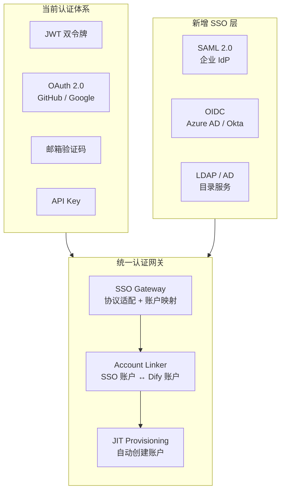

**实现细节：**

1. **SAML 2.0 集成**
   - 新增 `api/controllers/console/auth/saml.py` 控制器
   - 使用 `python3-saml` 库处理 SAML 断言
   - 每个租户可配置独立的 SAML 元数据 URL 或 XML
   - 新增 `TenantSSOConfig` 表存储 SAML 配置（IdP 证书、Entity ID、ACS URL）
   - 支持 SP-Initiated 和 IdP-Initiated 两种 SSO 流程

2. **OIDC 集成**
   - 新增 `api/controllers/console/auth/oidc.py` 控制器
   - 使用 `authlib` 库实现 OIDC 客户端
   - 支持 Discovery 端点自动配置
   - 支持多 IdP（Azure AD、Okta、Auth0、Keycloak 等）
   - 新增 `OIDCProvider` 表存储 provider 配置

3. **LDAP/AD 集成**
   - 新增 `api/controllers/console/auth/ldap.py` 控制器
   - 使用 `ldap3` 库连接 LDAP 服务器
   - 支持 LDAP 绑定认证和搜索绑定两种模式
   - 支持 LDAP 组到 Dify 角色的映射
   - 支持 LDAP 属性到 Dify 用户属性的映射

4. **统一账户映射**
   - 扩展 `AccountIntegrate` 表，新增 `saml_name_id`、`oidc_sub`、`ldap_dn` 字段
   - 实现 JIT（Just-In-Time）用户创建：首次 SSO 登录自动创建 Dify 账户
   - 支持手动账户关联：已有 Dify 账户可绑定 SSO 身份

**数据迁移：**

```sql
-- 新增 SSO 配置表
CREATE TABLE tenant_sso_configs (
    id UUID PRIMARY KEY DEFAULT uuid_generate_v4(),
    tenant_id UUID NOT NULL REFERENCES tenants(id),
    protocol VARCHAR(20) NOT NULL,  -- 'saml' / 'oidc' / 'ldap'
    config JSONB NOT NULL,          -- 协议特定配置（加密存储）
    enabled BOOLEAN DEFAULT true,
    created_at TIMESTAMP DEFAULT CURRENT_TIMESTAMP,
    updated_at TIMESTAMP DEFAULT CURRENT_TIMESTAMP,
    UNIQUE(tenant_id, protocol)
);

-- 扩展 AccountIntegrate 表
ALTER TABLE account_integrates
    ADD COLUMN saml_name_id VARCHAR(512),
    ADD COLUMN oidc_sub VARCHAR(512),
    ADD COLUMN oidc_provider VARCHAR(128),
    ADD COLUMN ldap_dn VARCHAR(1024);

-- 索引
CREATE INDEX idx_account_integrates_saml ON account_integrates(saml_name_id);
CREATE INDEX idx_account_integrates_oidc ON account_integrates(oidc_provider, oidc_sub);
CREATE INDEX idx_account_integrates_ldap ON account_integrates(ldap_dn);
```

**向后兼容：**

- 现有 OAuth（GitHub/Google）保持不变，SSO 作为额外认证方式
- 未配置 SSO 的租户行为完全不变
- SSO 登录的用户仍走 JWT 双令牌体系，只是认证入口不同

**灰度发布：**

- 通过 `ENABLE_SSO` 环境变量全局控制
- 通过 `TenantSSOConfig.enabled` 按租户启用
- 前端登录页动态展示 SSO 登录按钮（仅配置了 SSO 的租户可见）

---

#### 3.2 R3：审计日志完善（P0）

**目标：** 构建完整的审计追踪体系，覆盖所有关键操作，满足 SOC 2、GDPR 和 EU AI Act 合规要求。

**技术方案：**

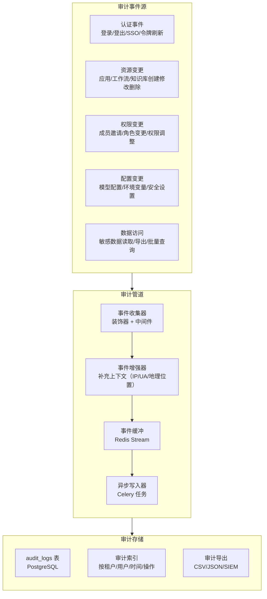

**实现细节：**

1. **审计事件模型**

   新增 `AuditLog` 模型，替代现有 `OperationLog` 的简单记录：

   | 字段 | 类型 | 说明 |
   |------|------|------|
   | `id` | UUID | 审计事件唯一标识 |
   | `tenant_id` | UUID | 所属租户 |
   | `account_id` | UUID | 执行操作的用户（可为系统） |
   | `event_type` | String | 事件类型（`auth.login`、`app.create`、`permission.change` 等） |
   | `resource_type` | String | 资源类型（`app`、`workflow`、`dataset`、`member` 等） |
   | `resource_id` | UUID | 资源 ID |
   | `action` | String | 操作（`create`、`update`、`delete`、`read`、`export`） |
   | `before_value` | JSONB | 变更前值（敏感字段脱敏） |
   | `after_value` | JSONB | 变更后值（敏感字段脱敏） |
   | `context` | JSONB | 上下文信息（IP、User-Agent、地理位置、请求 ID） |
   | `result` | String | 操作结果（`success`、`failure`） |
   | `reason` | Text | 操作原因（可选） |
   | `created_at` | Timestamp | 事件时间 |

2. **审计事件收集**

   - **装饰器方式**：新增 `@audit_log` 装饰器，标注在需要审计的控制器方法上
   - **中间件方式**：对敏感操作（权限变更、配置修改）通过中间件自动记录
   - **领域事件方式**：核心领域操作（应用发布、工作流执行）通过领域事件异步记录

3. **审计日志查询 API**

   新增审计日志查询端点：

   - `GET /console/api/audit-logs`：分页查询审计日志
   - `GET /console/api/audit-logs/export`：导出审计日志（CSV/JSON）
   - `GET /console/api/audit-logs/stats`：审计统计（按操作类型、时间段）

4. **审计日志保留策略**

   - 默认保留 90 天（可配置 `AUDIT_LOG_RETENTION_DAYS`）
   - 支持自动归档到对象存储（超过保留期的日志压缩归档）
   - 支持 SIEM 集成（通过 Webhook 或 Kafka 转发审计事件）

**数据迁移：**

```sql
-- 新增审计日志表
CREATE TABLE audit_logs (
    id UUID PRIMARY KEY DEFAULT uuid_generate_v4(),
    tenant_id UUID NOT NULL,
    account_id UUID,
    event_type VARCHAR(100) NOT NULL,
    resource_type VARCHAR(50),
    resource_id UUID,
    action VARCHAR(20) NOT NULL,
    before_value JSONB,
    after_value JSONB,
    context JSONB,
    result VARCHAR(20) DEFAULT 'success',
    reason TEXT,
    created_at TIMESTAMP DEFAULT CURRENT_TIMESTAMP
);

-- 分区表（按月分区，便于归档）
CREATE TABLE audit_logs_partitioned (
    LIKE audit_logs INCLUDING ALL
) PARTITION BY RANGE (created_at);

-- 索引
CREATE INDEX idx_audit_logs_tenant_time ON audit_logs_partitioned(tenant_id, created_at DESC);
CREATE INDEX idx_audit_logs_account ON audit_logs_partitioned(tenant_id, account_id);
CREATE INDEX idx_audit_logs_resource ON audit_logs_partitioned(resource_type, resource_id);
CREATE INDEX idx_audit_logs_event_type ON audit_logs_partitioned(event_type);

-- 迁移现有 OperationLog 数据
INSERT INTO audit_logs (tenant_id, account_id, event_type, action, context, created_at)
SELECT tenant_id, account_id, action, 'update',
       JSONB_BUILD_OBJECT('content', content, 'ip', created_ip),
       created_at
FROM operation_log;
```

**向后兼容：**

- 保留 `OperationLog` 表，新系统并行运行
- 现有操作日志查询 API 不变，内部实现切换到新审计系统
- 6 个月后废弃 `OperationLog`，提供迁移脚本

**灰度发布：**

- 通过 `ENABLE_AUDIT_LOG` 环境变量控制
- 初期仅记录不写入数据库（dry-run 模式），验证事件完整性
- 逐步开启写入，按租户灰度

---

#### 3.3 R2：权限模型升级（P1）

**目标：** 从固定五级角色升级为可自定义角色 + 资源级权限控制。

**技术方案：**

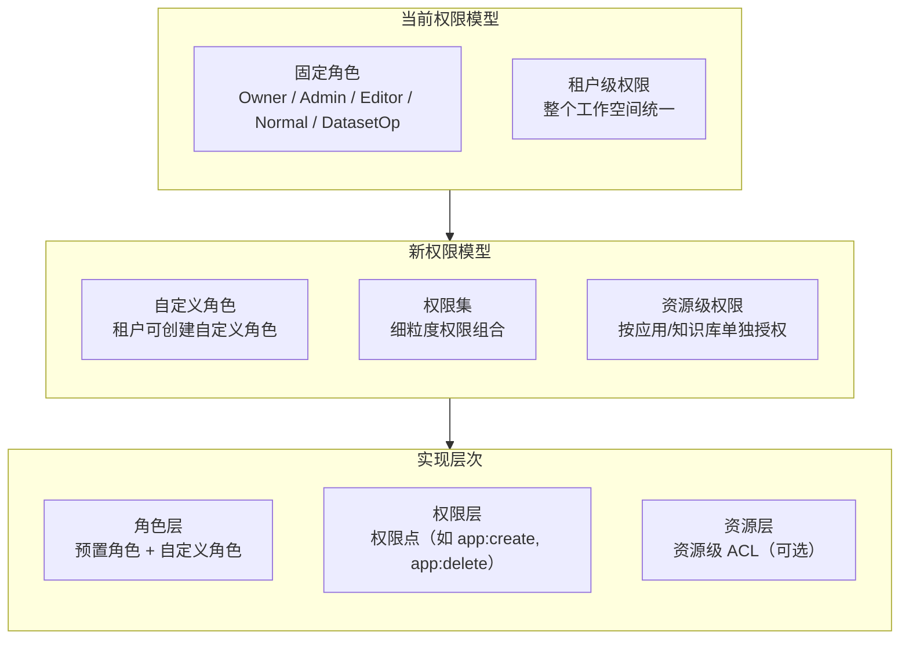

**实现细节：**

1. **权限点定义**

   将现有隐式权限显式化为权限点：

   | 权限类别 | 权限点 | 说明 |
   |---------|--------|------|
   | 租户管理 | `tenant:manage_members` | 邀请/移除成员 |
   | 租户管理 | `tenant:manage_billing` | 管理计费 |
   | 租户管理 | `tenant:manage_sso` | 管理 SSO 配置 |
   | 应用管理 | `app:create` | 创建应用 |
   | 应用管理 | `app:edit` | 编辑应用 |
   | 应用管理 | `app:delete` | 删除应用 |
   | 应用管理 | `app:publish` | 发布应用 |
   | 知识库 | `dataset:create` | 创建知识库 |
   | 知识库 | `dataset:edit` | 编辑知识库 |
   | 知识库 | `dataset:delete` | 删除知识库 |
   | 模型 | `model:configure` | 配置模型供应商 |
   | 插件 | `plugin:install` | 安装插件 |
   | 插件 | `plugin:debug` | 调试插件 |

2. **自定义角色**

   新增 `CustomRole` 模型：

   | 字段 | 类型 | 说明 |
   |------|------|------|
   | `id` | UUID | 角色 ID |
   | `tenant_id` | UUID | 所属租户 |
   | `name` | String | 角色名称 |
   | `description` | Text | 角色描述 |
   | `permissions` | JSONB | 权限点列表 |
   | `is_system` | Boolean | 是否系统预置角色 |
   | `created_at` | Timestamp | 创建时间 |

3. **资源级权限（可选）**

   对于需要更细粒度控制的场景，支持资源级 ACL：

   | 字段 | 类型 | 说明 |
   |------|------|------|
   | `id` | UUID | ACL ID |
   | `tenant_id` | UUID | 所属租户 |
   | `resource_type` | String | 资源类型（`app`、`dataset`） |
   | `resource_id` | UUID | 资源 ID |
   | `principal_type` | String | 主体类型（`user`、`role`） |
   | `principal_id` | UUID | 主体 ID |
   | `permission` | String | 权限（`read`、`write`、`admin`） |

**数据迁移：**

```sql
-- 新增自定义角色表
CREATE TABLE custom_roles (
    id UUID PRIMARY KEY DEFAULT uuid_generate_v4(),
    tenant_id UUID NOT NULL,
    name VARCHAR(100) NOT NULL,
    description TEXT,
    permissions JSONB NOT NULL DEFAULT '[]',
    is_system BOOLEAN DEFAULT false,
    created_at TIMESTAMP DEFAULT CURRENT_TIMESTAMP,
    updated_at TIMESTAMP DEFAULT CURRENT_TIMESTAMP
);

-- 新增资源级 ACL 表
CREATE TABLE resource_acls (
    id UUID PRIMARY KEY DEFAULT uuid_generate_v4(),
    tenant_id UUID NOT NULL,
    resource_type VARCHAR(50) NOT NULL,
    resource_id UUID NOT NULL,
    principal_type VARCHAR(20) NOT NULL,  -- 'user' / 'role'
    principal_id UUID NOT NULL,
    permission VARCHAR(20) NOT NULL,      -- 'read' / 'write' / 'admin'
    created_at TIMESTAMP DEFAULT CURRENT_TIMESTAMP,
    UNIQUE(tenant_id, resource_type, resource_id, principal_type, principal_id)
);

-- 为现有角色预置权限集
INSERT INTO custom_roles (tenant_id, name, permissions, is_system)
SELECT id, 'Owner',
       '["tenant:*", "app:*", "dataset:*", "model:*", "plugin:*"]'::jsonb,
       true
FROM tenants;
-- 类似地为 Admin、Editor、Normal、DatasetOp 创建系统角色
```

**向后兼容：**

- 现有 5 级角色映射为系统预置角色，权限集不变
- `TenantAccountJoin.role` 字段保留，新增 `role_id` 指向自定义角色
- 权限检查装饰器 `@cloud_edition_billing_resource_check` 内部切换到新权限系统
- 旧版 API 中角色字段仍返回 `owner/admin/editor/normal/dataset_editor`

**灰度发布：**

- 通过 `ENABLE_CUSTOM_ROLES` 环境变量控制
- 初期仅开放权限管理 UI，不改变现有权限检查逻辑
- 逐步切换权限检查到新系统，双写验证

---

#### 3.4 R5：监控指标补充（P1）

**目标：** 构建 Prometheus + Grafana 的完整监控体系，覆盖业务指标、系统指标和 AI 特定指标。

**技术方案：**

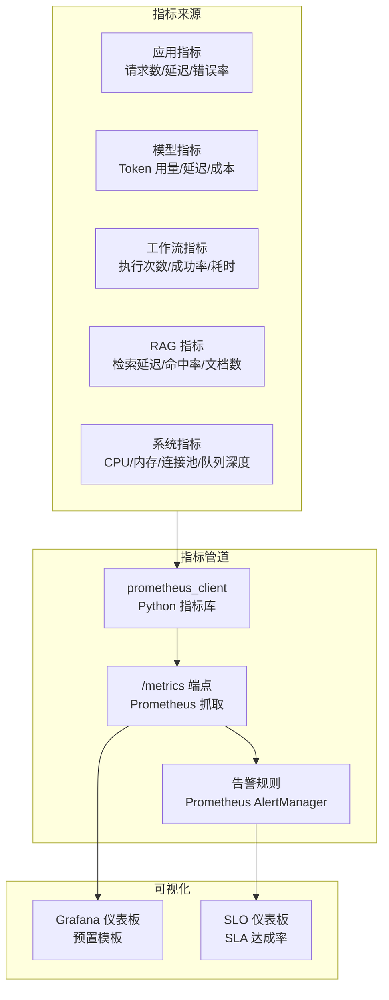

**实现细节：**

1. **指标定义**

   | 指标名称 | 类型 | 标签 | 说明 |
   |---------|------|------|------|
   | `dify_http_requests_total` | Counter | method, route, status, tenant_id | HTTP 请求总数 |
   | `dify_http_request_duration_seconds` | Histogram | method, route, tenant_id | HTTP 请求延迟分布 |
   | `dify_model_invocations_total` | Counter | model, provider, tenant_id, status | 模型调用总数 |
   | `dify_model_tokens_total` | Counter | model, provider, tenant_id, type | Token 消耗总量 |
   | `dify_model_latency_seconds` | Histogram | model, provider, tenant_id | 模型调用延迟 |
   | `dify_workflow_executions_total` | Counter | app_id, tenant_id, status | 工作流执行总数 |
   | `dify_workflow_execution_duration_seconds` | Histogram | app_id, tenant_id | 工作流执行耗时 |
   | `dify_rag_retrieval_duration_seconds` | Histogram | dataset_id, tenant_id | 检索延迟 |
   | `dify_rag_documents_indexed` | Gauge | dataset_id, tenant_id | 已索引文档数 |
   | `dify_celery_queue_depth` | Gauge | queue | Celery 队列深度 |
   | `dify_db_connection_pool_size` | Gauge | pool_name | 数据库连接池大小 |
   | `dify_db_connection_pool_checked_out` | Gauge | pool_name | 已借出连接数 |

2. **Flask 扩展**

   新增 `ext_metrics.py` 扩展：

   - 在扩展初始化顺序中插入（位于 `ext_blueprints` 之前）
   - 注册 `/metrics` 端点，暴露 Prometheus 格式指标
   - 通过 Flask `before_request` / `after_request` 钩子自动记录 HTTP 指标
   - 在模型调用、工作流执行、RAG 检索等关键路径埋点

3. **Grafana 预置仪表板**

   提供官方 Grafana 仪表板模板（JSON），覆盖：

   - **概览仪表板**：请求量、错误率、P50/P95/P99 延迟
   - **应用仪表板**：按应用维度的使用量和性能
   - **模型仪表板**：Token 消耗、成本、模型延迟对比
   - **工作流仪表板**：执行成功率、耗时分布、节点级性能
   - **系统仪表板**：CPU、内存、连接池、队列深度

4. **告警规则**

   预置 Prometheus 告警规则：

   | 告警名称 | 条件 | 严重级别 |
   |---------|------|---------|
   | `HighErrorRate` | 5xx 错误率 > 5%（5 分钟） | Critical |
   | `HighLatency` | P95 延迟 > 10s（5 分钟） | Warning |
   | `ModelQuotaExhausted` | Token 用量 > 配额 90% | Warning |
   | `CeleryQueueBacklog` | 队列深度 > 1000（10 分钟） | Warning |
   | `DBConnectionPoolExhausted` | 已借出连接 > 池大小 90% | Critical |
   | `DiskSpaceLow` | 磁盘使用 > 85% | Warning |

**数据迁移：**

无需数据迁移。指标为运行时采集，不涉及持久化数据。

**向后兼容：**

- `/metrics` 端点为新增端点，不影响现有 API
- 通过 `ENABLE_METRICS` 环境变量控制是否启用
- 默认关闭，不影响现有部署的性能

**灰度发布：**

- 先在开发/测试环境启用，验证指标准确性
- 在生产环境单副本启用，观察性能影响
- 全量启用后，逐步开放 Grafana 仪表板

---

#### 3.5 R1：多租户隔离增强（P2）

**目标：** 在现有租户级隔离基础上，增加项目级隔离维度，支持大规模多团队场景。

**技术方案：**

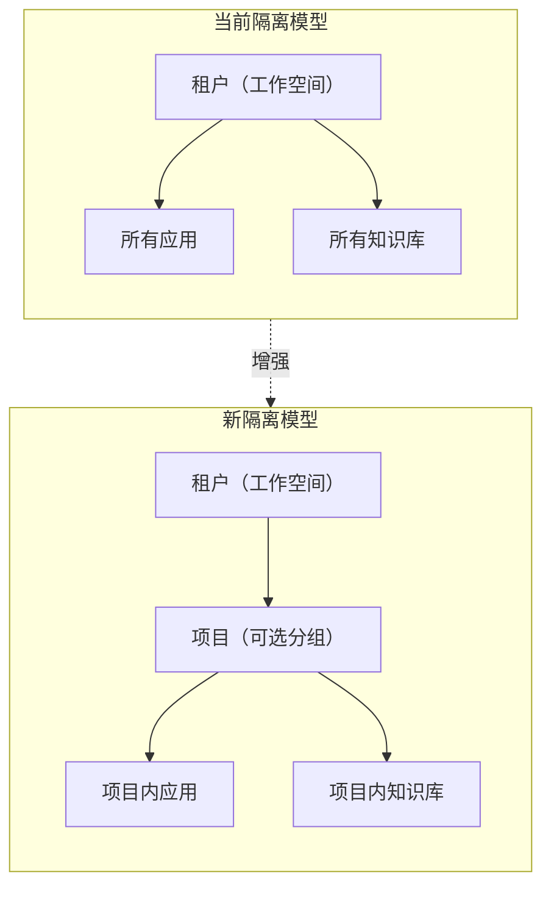

**实现细节：**

1. **项目模型**

   新增 `Project` 实体，作为租户下的资源分组：

   | 字段 | 类型 | 说明 |
   |------|------|------|
   | `id` | UUID | 项目 ID |
   | `tenant_id` | UUID | 所属租户 |
   | `name` | String | 项目名称 |
   | `description` | Text | 项目描述 |
   | `created_by` | UUID | 创建者 |
   | `created_at` | Timestamp | 创建时间 |

2. **资源关联**

   在 `App` 和 `Dataset` 表新增 `project_id` 字段（可选，NULL 表示不属于任何项目）：

   ```sql
   ALTER TABLE apps ADD COLUMN project_id UUID REFERENCES projects(id);
   ALTER TABLE datasets ADD COLUMN project_id UUID REFERENCES projects(id);
   CREATE INDEX idx_apps_project ON apps(project_id);
   CREATE INDEX idx_datasets_project ON datasets(project_id);
   ```

3. **权限集成**

   项目级权限与自定义角色（R2）集成：

   - 项目成员从租户成员中选取
   - 项目内可设置独立的角色和权限
   - 未分配项目的资源由租户管理员管理

**数据迁移：**

- `project_id` 字段默认为 NULL，现有资源不受影响
- 提供批量迁移脚本，将现有应用按标签或命名规则分配到项目
- 默认项目：为每个租户创建一个"默认项目"，将所有未分配资源归入

**向后兼容：**

- `project_id` 为可选字段，不使用项目的租户行为完全不变
- 所有现有 API 查询仍按 `tenant_id` 过滤，`project_id` 作为可选过滤条件
- 前端 UI 新增项目视图，但不强制使用

**灰度发布：**

- 通过 `ENABLE_PROJECTS` 环境变量控制
- 初期仅开放项目管理 UI，不改变现有权限逻辑
- 逐步启用项目级过滤和权限检查

---

#### 3.6 R6：容量规划工具（P2）

**目标：** 提供自动化容量评估工具，帮助运维团队合理规划资源。

**技术方案：**

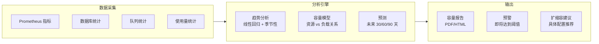

**实现细节：**

1. **容量评估维度**

   | 维度 | 指标 | 阈值 |
   |------|------|------|
   | 数据库连接 | 活跃连接数 / 最大连接数 | > 80% 告警 |
   | Redis 内存 | 已用内存 / 最大内存 | > 75% 告警 |
   | 向量数据库 | 文档数 / 单集合上限 | > 80% 告警 |
   | 对象存储 | 存储量 / 配额 | > 85% 告警 |
   | Celery 队列 | 待处理任务数 | > 1000 告警 |
   | API 延迟 | P95 延迟 | > 5s 告警 |
   | Token 用量 | 日用量 / 日配额 | > 90% 告警 |

2. **CLI 工具**

   新增 `flask capacity` 命令组：

   ```bash
   flask capacity assess          # 评估当前容量状态
   flask capacity forecast        # 预测未来资源需求
   flask capacity recommend       # 生成扩缩容建议
   flask capacity report --format html  # 生成容量报告
   ```

3. **API 端点**

   新增管理 API：

   - `GET /console/api/capacity/status`：当前容量状态
   - `GET /console/api/capacity-forecast`：资源预测
   - `GET /console/api/capacity-recommendations`：扩缩容建议

**数据迁移：**

无需数据迁移。工具基于运行时指标和统计数据工作。

**向后兼容：**

- 新增功能，不影响现有系统
- 通过 `ENABLE_CAPACITY_PLANNING` 环境变量控制

**灰度发布：**

- 先部署 CLI 工具，运维团队手动评估
- 逐步开放 API 和 UI

---

### 4. 改造前后对比

#### 4.1 对比表格

| 维度 | 改造前 | 改造后 |
|------|--------|--------|
| **认证方式** | JWT + OAuth（GitHub/Google）+ 邮箱验证码 | + SAML 2.0 + OIDC + LDAP/AD |
| **权限模型** | 5 级固定角色，租户级统一 | 自定义角色 + 资源级 ACL |
| **审计日志** | OperationLog（基础操作记录） | AuditLog（完整审计追踪 + 分区 + 归档） |
| **监控指标** | 基础日志 + Sentry + OTel（可选） | Prometheus 指标 + Grafana 仪表板 + 告警 |
| **租户隔离** | 租户级（`tenant_id`） | 租户级 + 项目级（`project_id`） |
| **容量规划** | 手动评估 | 自动化评估 + 预测 + 建议 |
| **合规支持** | EU AI Act 指南文档 | + SOC 2 审计追踪 + GDPR 数据生命周期 |
| **可观测性** | 4 层（OTel + Sentry + 请求日志 + 健康端点） | + 第 5 层：Prometheus 业务指标 |

#### 4.2 架构对比图

**改造前认证架构：**

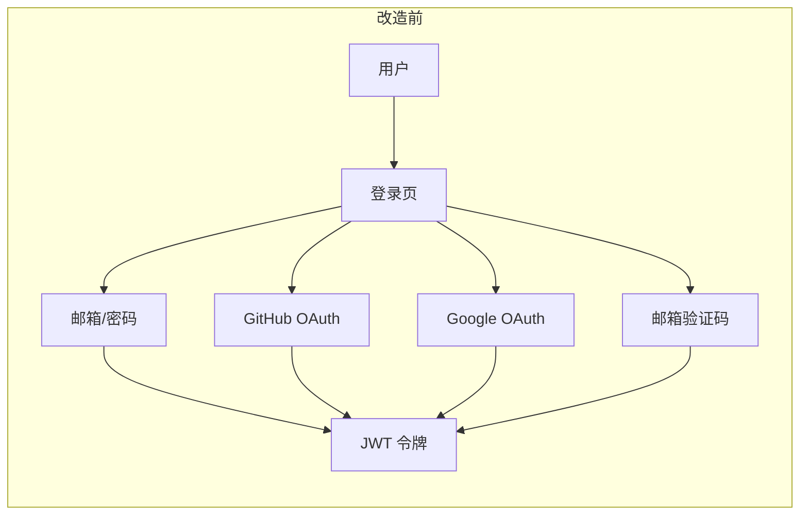

**改造后认证架构：**

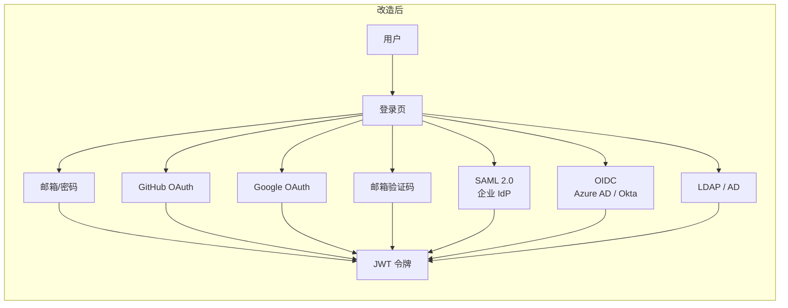

**改造前权限模型：**

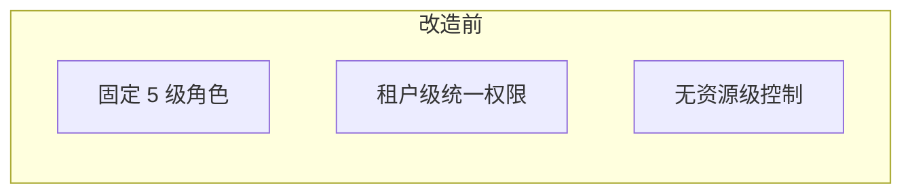

**改造后权限模型：**

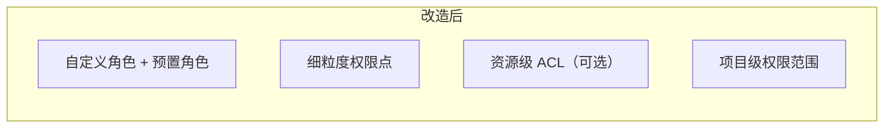

### 5. 迁移方案

#### 5.1 数据迁移

| 改造项 | 迁移类型 | 迁移方式 | 停机时间 | 回滚方案 |
|--------|---------|---------|---------|---------|
| SSO 集成 | Schema 扩展 | Alembic 迁移脚本 | 零停机（Online DDL） | 回滚迁移，删除新表 |
| 审计日志 | 新表 + 数据迁移 | Alembic + 后台任务 | 零停机 | 停止新表写入，回退到 OperationLog |
| 权限模型 | Schema 扩展 | Alembic 迁移脚本 | 零停机 | 回滚迁移，保留旧角色字段 |
| 监控指标 | 无数据迁移 | 新增端点 | 零停机 | 关闭环境变量 |
| 多租户增强 | Schema 扩展 | Alembic 迁移脚本 | 零停机 | 回滚迁移，project_id 为 NULL |
| 容量规划 | 无数据迁移 | 新增 CLI/API | 零停机 | 关闭环境变量 |

**迁移执行顺序：**

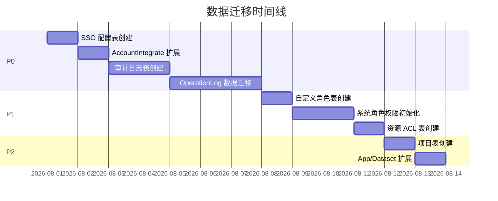

#### 5.2 配置迁移

| 新增环境变量 | 默认值 | 说明 |
|-------------|--------|------|
| `ENABLE_SSO` | `false` | SSO 功能总开关 |
| `ENABLE_AUDIT_LOG` | `false` | 审计日志总开关 |
| `ENABLE_CUSTOM_ROLES` | `false` | 自定义角色总开关 |
| `ENABLE_METRICS` | `false` | Prometheus 指标总开关 |
| `ENABLE_PROJECTS` | `false` | 项目功能总开关 |
| `ENABLE_CAPACITY_PLANNING` | `false` | 容量规划总开关 |
| `AUDIT_LOG_RETENTION_DAYS` | `90` | 审计日志保留天数 |
| `METRICS_ENDPOINT` | `/metrics` | Prometheus 指标端点路径 |

**配置迁移策略：**

- 所有新功能默认关闭，不影响现有部署
- 升级后需显式启用对应功能
- `.env.example` 中新增变量带注释说明
- `dify-env-sync.sh` 自动同步新增变量

#### 5.3 API 兼容性

| 改造项 | API 影响 | 兼容策略 |
|--------|---------|---------|
| SSO 集成 | 新增 SSO 配置 API | 纯新增，不影响现有 API |
| 审计日志 | 新增审计查询 API | 纯新增，现有 OperationLog API 保留 |
| 权限模型 | 新增角色管理 API | 纯新增，现有角色 API 返回兼容格式 |
| 监控指标 | 新增 `/metrics` 端点 | 纯新增 |
| 多租户增强 | 新增项目管理 API | 纯新增，现有 API 行为不变 |
| 容量规划 | 新增容量查询 API | 纯新增 |

**API 版本策略：**

- 所有新增 API 放在 `/console/api/v2/` 路径下（或保持 `/console/api/` 但使用新资源名）
- 现有 API 不修改响应格式
- 废弃的 API 标记 `Deprecated` 头，保留至少 6 个月

### 6. 风险评估

#### 6.1 技术风险

| 风险 | 影响 | 概率 | 缓解措施 |
|------|------|------|---------|
| SSO 协议实现缺陷导致认证绕过 | 高 | 低 | 第三方安全审计，渗透测试，SAML 签名验证强制开启 |
| 审计日志写入量过大影响数据库性能 | 中 | 中 | 异步写入（Celery），分区表，定期归档，限流 |
| 自定义角色权限检查增加请求延迟 | 中 | 中 | Redis 缓存权限数据，权限预计算，批量查询优化 |
| Prometheus 指标采集增加内存开销 | 低 | 中 | 合理设置指标基数（避免高基数标签），采样率可调 |
| 数据迁移过程中数据不一致 | 高 | 低 | 双写验证期，迁移脚本幂等设计，回滚预案 |
| 新功能引入安全漏洞 | 高 | 低 | 代码审查，安全测试，SSO 使用成熟库（不自行实现协议） |

#### 6.2 业务风险

| 风险 | 影响 | 概率 | 缓解措施 |
|------|------|------|---------|
| 改造周期过长影响产品迭代 | 中 | 中 | 分三期交付，每期独立可用，P0 优先交付 |
| 企业用户对新功能接受度低 | 中 | 低 | 灰度发布，用户培训，详细文档 |
| 向后兼容约束限制设计空间 | 低 | 中 | 早期原型验证，架构评审 |
| 多租户隔离增强导致查询复杂度增加 | 中 | 中 | 索引优化，查询缓存，分页限制 |

#### 6.3 缓解措施总览

1. **渐进式交付**：P0 → P1 → P2，每期独立可交付
2. **功能开关**：所有新功能通过环境变量控制，可随时关闭
3. **双写验证**：新旧系统并行运行期，对比结果一致性
4. **自动化测试**：每个改造项配套集成测试和回归测试
5. **灰度发布**：按租户逐步启用，观察指标和日志
6. **回滚预案**：每个改造项都有明确的回滚步骤和脚本
7. **安全审计**：SSO 和权限改造完成后进行第三方安全审计

## 附录

### A. 改造前后对比图（总览）

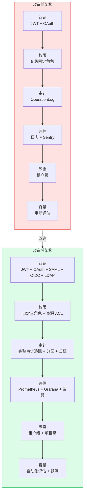

### B. 改造任务分解表

| 阶段 | 任务编号 | 任务名称 | 前置依赖 | 预计工期 | 交付物 |
|------|---------|---------|---------|---------|--------|
| **P0** | T1 | SAML 2.0 集成 | 无 | 2 周 | SAML 控制器 + 配置表 + 测试 |
| **P0** | T2 | OIDC 集成 | 无 | 1.5 周 | OIDC 控制器 + 配置表 + 测试 |
| **P0** | T3 | LDAP/AD 集成 | 无 | 1.5 周 | LDAP 控制器 + 配置表 + 测试 |
| **P0** | T4 | SSO 前端 UI | T1-T3 | 1 周 | 登录页 SSO 按钮 + 配置页 |
| **P0** | T5 | 审计事件模型 | 无 | 1 周 | AuditLog 模型 + 迁移脚本 |
| **P0** | T6 | 审计事件收集 | T5 | 1 周 | 装饰器 + 中间件 + 领域事件 |
| **P0** | T7 | 审计查询 API | T5 | 0.5 周 | 查询/导出/统计端点 |
| **P0** | T8 | 审计日志归档 | T5 | 0.5 周 | 归档任务 + 对象存储集成 |
| **P1** | T9 | 权限点定义 | 无 | 1 周 | 权限枚举 + 预置权限集 |
| **P1** | T10 | 自定义角色模型 | T9 | 1 周 | CustomRole 模型 + CRUD API |
| **P1** | T11 | 权限检查重构 | T9, T10 | 2 周 | 装饰器重构 + 缓存层 |
| **P1** | T12 | 资源级 ACL | T10 | 1.5 周 | ResourceACL 模型 + 检查逻辑 |
| **P1** | T13 | 权限管理 UI | T10, T11 | 1 周 | 角色管理页 + 权限配置页 |
| **P1** | T14 | Prometheus 指标 | 无 | 1.5 周 | ext_metrics + 指标定义 |
| **P1** | T15 | 业务指标埋点 | T14 | 1.5 周 | 模型/工作流/RAG 指标 |
| **P1** | T16 | Grafana 仪表板 | T14 | 1 周 | 5 个预置仪表板模板 |
| **P1** | T17 | 告警规则 | T14 | 0.5 周 | 预置告警规则 + AlertManager 配置 |
| **P2** | T18 | 项目模型 | 无 | 1 周 | Project 模型 + CRUD API |
| **P2** | T19 | 资源关联项目 | T18 | 1 周 | App/Dataset 扩展 + 迁移 |
| **P2** | T20 | 项目级权限 | T12, T18 | 2 周 | 项目权限检查 + 集成 |
| **P2** | T21 | 项目管理 UI | T18 | 1 周 | 项目列表页 + 详情页 |
| **P2** | T22 | 容量评估引擎 | T14 | 2 周 | 评估逻辑 + CLI 工具 |
| **P2** | T23 | 容量预测 | T22 | 1 周 | 趋势分析 + 预测模型 |
| **P2** | T24 | 容量报告 | T22 | 1 周 | HTML/PDF 报告生成 |

### C. 关键里程碑

| 里程碑 | 目标日期 | 交付内容 |
|--------|---------|---------|
| M1：SSO 可用 | 2026-08-15 | SAML + OIDC + LDAP 集成完成，企业用户可通过 IdP 登录 |
| M2：审计合规 | 2026-09-05 | 完整审计追踪上线，满足 SOC 2 审计要求 |
| M3：权限升级 | 2026-10-15 | 自定义角色 + 资源 ACL 上线 |
| M4：可观测性 | 2026-11-10 | Prometheus 指标 + Grafana 仪表板 + 告警上线 |
| M5：全面企业化 | 2026-12-20 | 项目级隔离 + 容量规划工具上线 |

## 变更日志

| 版本 | 日期 | 作者 | 变更内容 |
|------|------|------|----------|
| 1.0 | 2026-07-19 | AI Assistant | 初始版本，基于六域架构诊断制定改造方案 |
