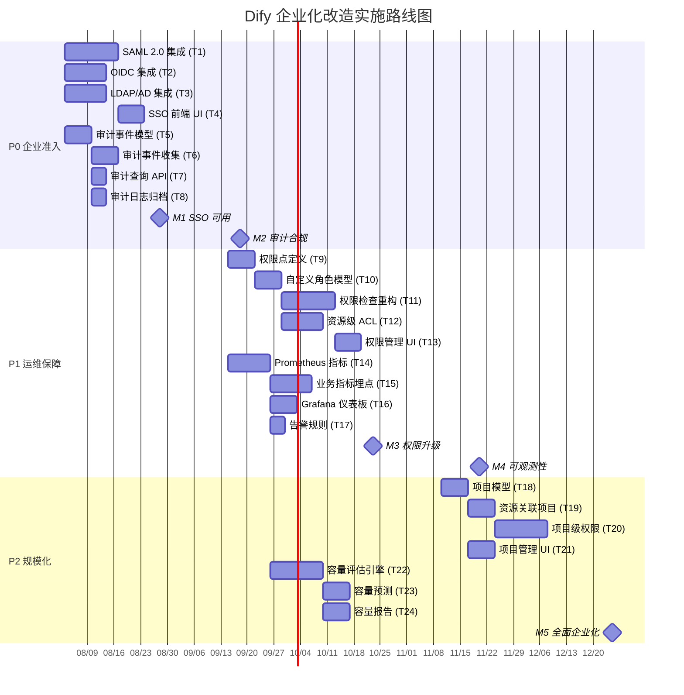
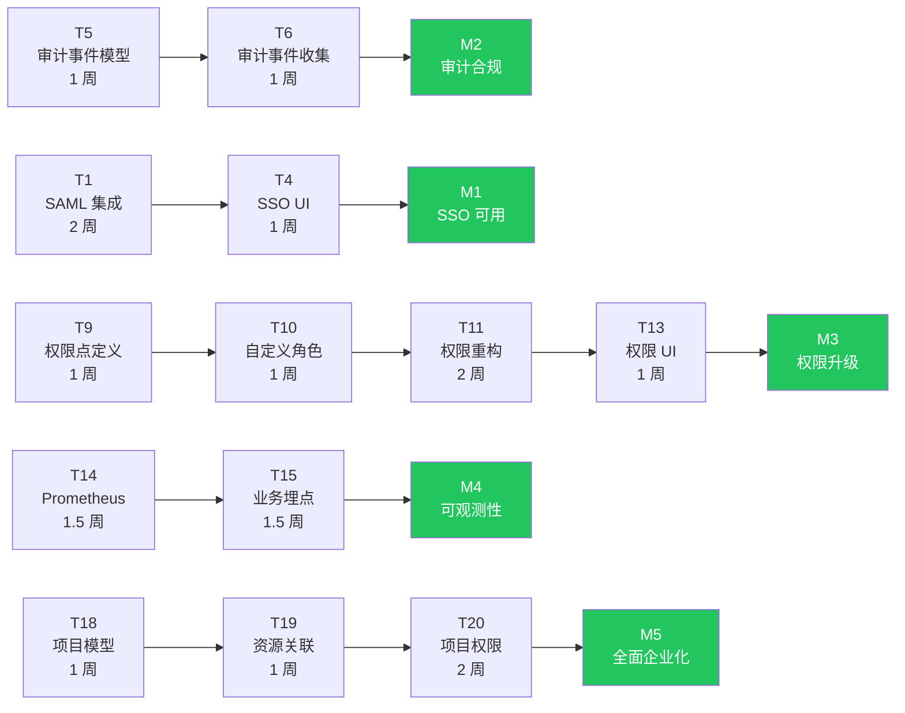
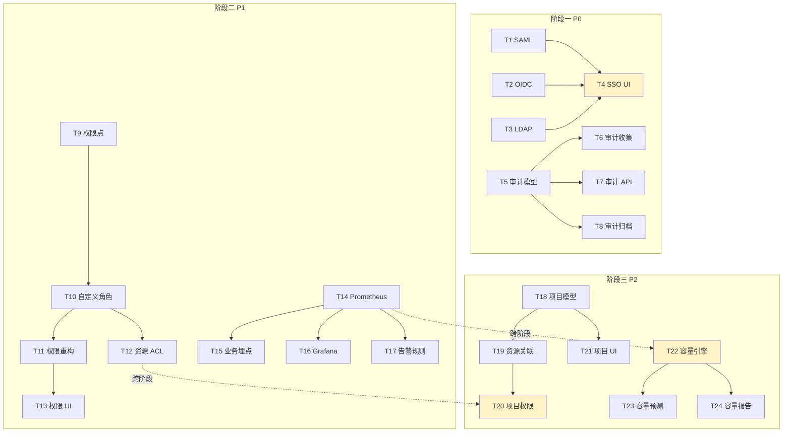
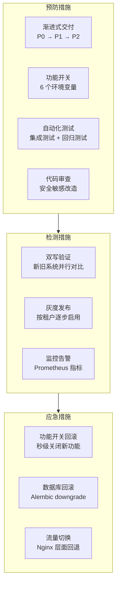
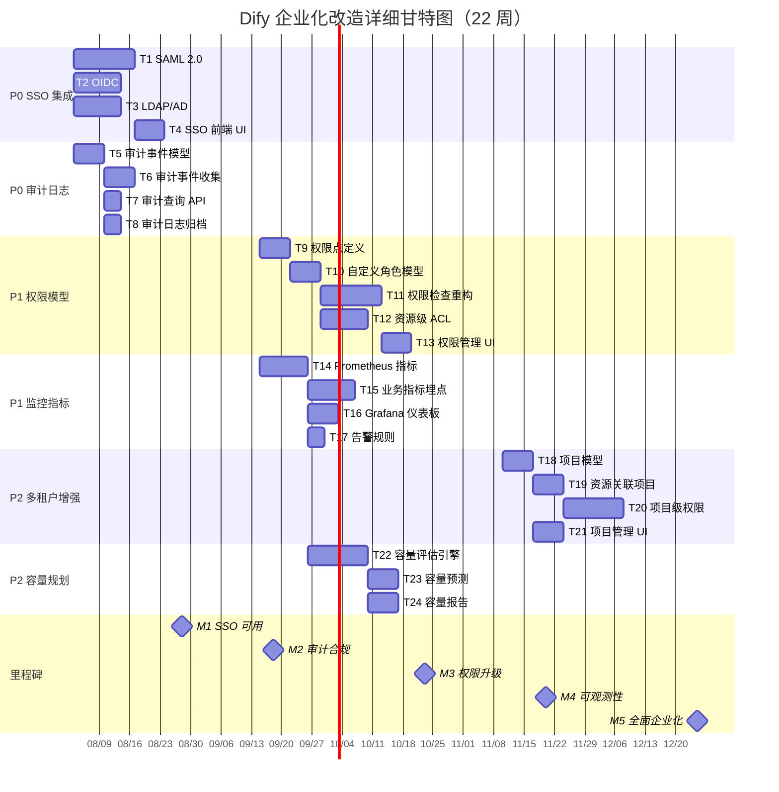
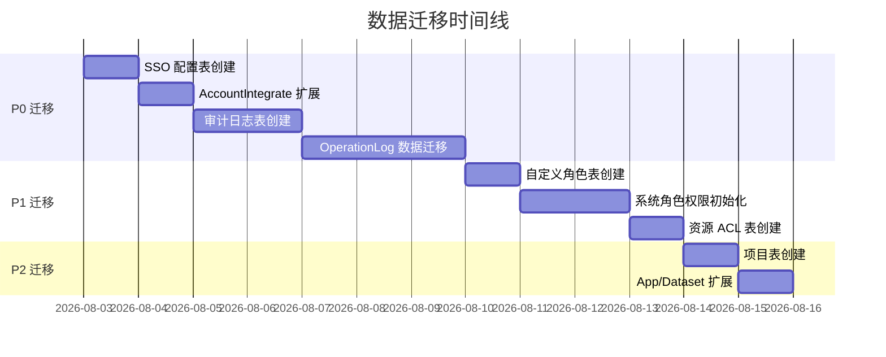

# 实施路线图

> **TL;DR**: 将 Dify 从社区版开源平台升级为企业级 AI 应用平台，分三期（P0/P1/P2）交付 6 大改造项、24 个任务，总工期约 22 周。P0 聚焦 SSO 集成和审计日志（企业准入门槛和合规基线），P1 完成权限模型升级和监控体系建设，P2 实现项目级隔离和容量规划工具。

## 概述

本路线图基于 [平台改造方案](../platform-modification.md) 和六域架构诊断文档，将 22 个架构文档中识别的企业级差距转化为可执行的实施计划。

**改造范围：**

| 编号 | 改造项 | 优先级 | 预计工期 | 核心价值 |
|------|--------|--------|---------|---------|
| R4 | SSO 集成 | P0 | 4 周 | 企业身份体系接入准入门槛 |
| R3 | 审计日志完善 | P0 | 3 周 | SOC 2 / GDPR / EU AI Act 合规基线 |
| R2 | 权限模型升级 | P1 | 5 周 | 支撑企业复杂组织架构 |
| R5 | 监控指标补充 | P1 | 4 周 | 生产环境 SLA 保障 |
| R1 | 多租户隔离增强 | P2 | 6 周 | 大规模多团队部署 |
| R6 | 容量规划工具 | P2 | 4 周 | 运维效率提升 |

**改造原则：**

- **向后兼容**：所有改造不破坏现有 API 和数据模型
- **渐进式迁移**：支持灰度发布，可按租户逐步切换
- **最小侵入**：优先通过扩展机制实现，减少对核心代码的修改
- **可观测性优先**：每个改造项都包含监控和告警

## 详细设计

### 1. 实施阶段划分

整体实施分为三个阶段，每期独立可交付。阶段之间允许适度重叠以缩短总工期。

#### 阶段一：企业准入（P0，第 1-7 周）

**目标：** 解决企业部署的两个硬性阻塞项，SSO 集成和审计日志。

**交付物：**

| 交付物 | 对应需求 | 验收标准 |
|--------|---------|---------|
| SAML 2.0 / OIDC / LDAP 集成 | R4 | 企业用户可通过 IdP 登录 Dify |
| SSO 配置管理 UI | R4 | 管理员可在控制台配置 SSO |
| 完整审计追踪体系 | R3 | 覆盖认证、资源变更、权限变更、配置变更、数据访问五类事件 |
| 审计日志查询和导出 API | R3 | 支持分页查询、CSV/JSON 导出、统计分析 |
| 审计日志归档机制 | R3 | 超期日志自动归档到对象存储 |

**阶段里程碑：**

- **M1（第 4 周末）**：SSO 可用，企业用户可通过 IdP 登录
- **M2（第 7 周末）**：审计合规，完整审计追踪上线

#### 阶段二：运维保障（P1，第 6-15 周）

**目标：** 升级权限模型满足企业组织架构需求，构建可观测性体系保障生产 SLA。

**交付物：**

| 交付物 | 对应需求 | 验收标准 |
|--------|---------|---------|
| 权限点定义和预置权限集 | R2 | 13+ 权限点覆盖所有关键操作 |
| 自定义角色 CRUD | R2 | 租户可创建自定义角色并分配权限 |
| 权限检查重构 | R2 | 装饰器链切换到新权限系统，Redis 缓存 |
| 资源级 ACL | R2 | 支持按应用/知识库单独授权 |
| 权限管理 UI | R2 | 角色管理页 + 权限配置页 |
| Prometheus 指标采集 | R5 | 12+ 核心指标，`/metrics` 端点 |
| 业务指标埋点 | R5 | 模型/工作流/RAG 关键路径埋点 |
| Grafana 预置仪表板 | R5 | 5 个仪表板模板（概览/应用/模型/工作流/系统） |
| 告警规则 | R5 | 6 条预置告警规则 |

**阶段里程碑：**

- **M3（第 11 周末）**：权限升级，自定义角色 + 资源 ACL 上线
- **M4（第 15 周末）**：可观测性，Prometheus + Grafana + 告警上线

#### 阶段三：规模化（P2，第 14-22 周）

**目标：** 实现项目级隔离支撑大规模多团队场景，提供容量规划工具提升运维效率。

**交付物：**

| 交付物 | 对应需求 | 验收标准 |
|--------|---------|---------|
| 项目模型和 CRUD API | R1 | 租户可创建项目并管理成员 |
| 资源关联项目 | R1 | 应用和知识库可归属项目 |
| 项目级权限 | R1 | 项目内资源隔离，与自定义角色集成 |
| 项目管理 UI | R1 | 项目列表页 + 详情页 |
| 容量评估引擎 | R6 | 7 维度自动评估 + CLI 工具 |
| 容量预测 | R6 | 30/60/90 天趋势预测 |
| 容量报告 | R6 | HTML/PDF 格式报告生成 |

**阶段里程碑：**

- **M5（第 22 周末）**：全面企业化，项目级隔离 + 容量规划工具上线

### 2. 任务分解

#### 2.1 阶段一任务（P0）

| 任务编号 | 任务名称 | 前置依赖 | 预计工期 | 交付物 | 负责角色 |
|---------|---------|---------|---------|--------|---------|
| T1 | SAML 2.0 集成 | 无 | 2 周 | SAML 控制器 + `TenantSSOConfig` 表 + 集成测试 | 后端 |
| T2 | OIDC 集成 | 无 | 1.5 周 | OIDC 控制器 + `OIDCProvider` 表 + 集成测试 | 后端 |
| T3 | LDAP/AD 集成 | 无 | 1.5 周 | LDAP 控制器 + 组映射 + 集成测试 | 后端 |
| T4 | SSO 前端 UI | T1, T2, T3 | 1 周 | 登录页 SSO 按钮 + SSO 配置页 | 前端 |
| T5 | 审计事件模型 | 无 | 1 周 | `AuditLog` 模型 + Alembic 迁移脚本 + 分区表 | 后端 |
| T6 | 审计事件收集 | T5 | 1 周 | `@audit_log` 装饰器 + 中间件 + 领域事件 | 后端 |
| T7 | 审计查询 API | T5 | 0.5 周 | 查询/导出/统计端点 | 后端 |
| T8 | 审计日志归档 | T5 | 0.5 周 | Celery 归档任务 + 对象存储集成 | 后端 |

**并行策略：** T1/T2/T3 可并行开发（三种 SSO 协议独立），T5 与 SSO 任务并行。T4 需等待 T1-T3 完成后联调。

#### 2.2 阶段二任务（P1）

| 任务编号 | 任务名称 | 前置依赖 | 预计工期 | 交付物 | 负责角色 |
|---------|---------|---------|---------|--------|---------|
| T9 | 权限点定义 | 无 | 1 周 | 权限枚举 + 预置权限集映射 | 后端 |
| T10 | 自定义角色模型 | T9 | 1 周 | `CustomRole` 模型 + CRUD API | 后端 |
| T11 | 权限检查重构 | T9, T10 | 2 周 | 装饰器重构 + Redis 缓存层 + 双写验证 | 后端 |
| T12 | 资源级 ACL | T10 | 1.5 周 | `ResourceACL` 模型 + 检查逻辑 | 后端 |
| T13 | 权限管理 UI | T10, T11 | 1 周 | 角色管理页 + 权限配置页 | 前端 |
| T14 | Prometheus 指标 | 无 | 1.5 周 | `ext_metrics.py` + 12 项指标定义 | 后端 |
| T15 | 业务指标埋点 | T14 | 1.5 周 | 模型/工作流/RAG 指标采集 | 后端 |
| T16 | Grafana 仪表板 | T14 | 1 周 | 5 个预置仪表板 JSON 模板 | 运维/前端 |
| T17 | 告警规则 | T14 | 0.5 周 | 6 条告警规则 + AlertManager 配置 | 运维 |

**并行策略：** T9-T13（权限线）和 T14-T17（监控线）可并行推进。T14 无前置依赖，可与 T9 同步启动。

#### 2.3 阶段三任务（P2）

| 任务编号 | 任务名称 | 前置依赖 | 预计工期 | 交付物 | 负责角色 |
|---------|---------|---------|---------|--------|---------|
| T18 | 项目模型 | 无 | 1 周 | `Project` 模型 + CRUD API | 后端 |
| T19 | 资源关联项目 | T18 | 1 周 | App/Dataset `project_id` 扩展 + 迁移脚本 | 后端 |
| T20 | 项目级权限 | T12, T18 | 2 周 | 项目权限检查 + 与资源 ACL 集成 | 后端 |
| T21 | 项目管理 UI | T18 | 1 周 | 项目列表页 + 详情页 + 成员管理 | 前端 |
| T22 | 容量评估引擎 | T14 | 2 周 | 评估逻辑 + `flask capacity` CLI 命令组 | 后端 |
| T23 | 容量预测 | T22 | 1 周 | 趋势分析 + 线性回归预测模型 | 后端 |
| T24 | 容量报告 | T22 | 1 周 | HTML/PDF 报告生成 + API 端点 | 后端/前端 |

**并行策略：** T18-T21（项目线）和 T22-T24（容量线）可并行。T20 依赖 T12（资源 ACL）和 T18（项目模型），是阶段三的关键路径节点。

### 3. 时间安排

#### 3.1 甘特图

#### 3.2 关键路径

**关键路径分析：**

最长路径为 T14 → T15 → M4（监控线），总工期约 15 周。项目线（T18 → T19 → T20）依赖 T12（资源 ACL），是跨阶段依赖，需重点关注。

#### 3.3 里程碑总览

| 里程碑 | 目标日期 | 交付内容 | 验收条件 |
|--------|---------|---------|---------|
| M1：SSO 可用 | 2026-08-28 | SAML + OIDC + LDAP 集成 | 企业用户通过 IdP 成功登录，JIT 用户创建正常 |
| M2：审计合规 | 2026-09-18 | 完整审计追踪 | 五类审计事件全覆盖，查询/导出 API 可用，归档机制运行正常 |
| M3：权限升级 | 2026-10-23 | 自定义角色 + 资源 ACL | 租户可创建自定义角色，资源级授权生效，权限缓存命中 > 95% |
| M4：可观测性 | 2026-11-20 | Prometheus + Grafana + 告警 | 12 项指标正常采集，5 个仪表板可用，告警规则触发准确 |
| M5：全面企业化 | 2026-12-25 | 项目级隔离 + 容量规划 | 项目管理功能完整，容量评估报告可生成 |

### 4. 依赖关系

#### 4.1 任务间依赖

**关键依赖说明：**

| 依赖关系 | 类型 | 说明 |
|---------|------|------|
| T1/T2/T3 → T4 | 阶段内 | SSO 后端完成后前端才能联调 |
| T5 → T6/T7/T8 | 阶段内 | 审计模型是审计子系统的基座 |
| T9 → T10 → T11/T12 | 阶段内 | 权限点 → 角色 → 检查逻辑，严格串行 |
| T14 → T15/T16/T17 | 阶段内 | Prometheus 指标是监控体系的基座 |
| T12 → T20 | **跨阶段** | 项目级权限依赖资源 ACL，需确保 P1 阶段 T12 按时交付 |
| T14 → T22 | **跨阶段** | 容量评估引擎依赖 Prometheus 指标数据 |
| T18 → T19/T20/T21 | 阶段内 | 项目模型是项目线的基座 |

#### 4.2 外部依赖

| 依赖项 | 影响任务 | 风险等级 | 缓解措施 |
|--------|---------|---------|---------|
| `python3-saml` 库稳定性 | T1 | 低 | 成熟开源库（OneLogin 维护），社区活跃 |
| `authlib` 库 OIDC 支持 | T2 | 低 | 广泛使用的认证库 |
| `ldap3` 库 LDAP 支持 | T3 | 低 | 纯 Python LDAP 客户端 |
| `prometheus_client` 库 | T14 | 低 | Prometheus 官方 Python 客户端 |
| PostgreSQL 分区表支持 | T5 | 低 | PostgreSQL 10+ 原生支持 |
| 企业 IdP 测试环境 | T1-T4 | **中** | 提前联系目标企业获取测试 IdP 环境（Keycloak 自建备选） |
| Grafana 部署环境 | T16 | 低 | Docker 一键部署 |
| 对象存储（归档用） | T8 | 低 | 支持 S3 兼容存储，可用 MinIO 本地测试 |

#### 4.3 新增环境变量清单

所有新功能通过环境变量控制，默认关闭，不影响现有部署：

| 环境变量 | 默认值 | 影响任务 | 说明 |
|---------|--------|---------|------|
| `ENABLE_SSO` | `false` | T1-T4 | SSO 功能总开关 |
| `ENABLE_AUDIT_LOG` | `false` | T5-T8 | 审计日志总开关 |
| `ENABLE_CUSTOM_ROLES` | `false` | T9-T13 | 自定义角色总开关 |
| `ENABLE_METRICS` | `false` | T14-T17 | Prometheus 指标总开关 |
| `ENABLE_PROJECTS` | `false` | T18-T21 | 项目功能总开关 |
| `ENABLE_CAPACITY_PLANNING` | `false` | T22-T24 | 容量规划总开关 |
| `AUDIT_LOG_RETENTION_DAYS` | `90` | T8 | 审计日志保留天数 |
| `METRICS_ENDPOINT` | `/metrics` | T14 | Prometheus 指标端点路径 |

### 5. 风险管理

#### 5.1 技术风险

| 风险 ID | 风险描述 | 影响 | 概率 | 风险等级 | 缓解措施 | 应急预案 |
|---------|---------|------|------|---------|---------|---------|
| TR-01 | SSO 协议实现缺陷导致认证绕过 | 高 | 低 | **高** | 使用成熟库（不自行实现协议），SAML 签名验证强制开启，完成后第三方安全审计 | 关闭 `ENABLE_SSO`，回退到原有认证 |
| TR-02 | 审计日志写入量过大影响数据库性能 | 中 | 中 | **中** | 异步写入（Celery），分区表按月分区，定期归档，限流保护 | 切换到 dry-run 模式（仅记录不写入） |
| TR-03 | 自定义角色权限检查增加请求延迟 | 中 | 中 | **中** | Redis 缓存权限数据（TTL 30-60s），权限预计算，批量查询优化 | 关闭 `ENABLE_CUSTOM_ROLES`，回退到固定角色 |
| TR-04 | Prometheus 指标采集增加内存开销 | 低 | 中 | **低** | 合理控制指标基数（避免高基数标签），采样率可调 | 关闭 `ENABLE_METRICS` |
| TR-05 | 数据迁移过程中数据不一致 | 高 | 低 | **高** | 迁移脚本幂等设计，双写验证期，回滚预案 | 回滚迁移，保留旧数据 |
| TR-06 | 新功能引入安全漏洞 | 高 | 低 | **高** | 代码审查，安全测试，渗透测试 | 关闭对应功能开关 |

#### 5.2 业务风险

| 风险 ID | 风险描述 | 影响 | 概率 | 风险等级 | 缓解措施 |
|---------|---------|------|------|---------|---------|
| BR-01 | 改造周期过长影响产品迭代 | 中 | 中 | **中** | 分三期交付，每期独立可用；P0 优先交付（7 周见效） |
| BR-02 | 企业用户对新功能接受度低 | 中 | 低 | **低** | 灰度发布，详细文档，用户培训 |
| BR-03 | 向后兼容约束限制设计空间 | 低 | 中 | **低** | 早期原型验证，架构评审 |
| BR-04 | 多租户隔离增强导致查询复杂度增加 | 中 | 中 | **中** | 索引优化，查询缓存，分页限制 |

#### 5.3 风险应对总览

**核心原则：** 所有新功能都有对应的环境变量开关，异常时可在秒级关闭新功能，无需代码回滚和重新部署。

## 附录

### A. 实施路线图甘特图（详细版）

### B. 任务分解表（WBS）

| WBS | 任务名称 | 阶段 | 优先级 | 前置依赖 | 工期（周） | 开始日期 | 结束日期 | 负责角色 | 交付物 |
|-----|---------|------|--------|---------|-----------|---------|---------|---------|--------|
| 1.0 | **SSO 集成** | P0 | 必须 | - | 4 | 08-03 | 08-28 | - | - |
| 1.1 | T1 SAML 2.0 集成 | P0 | 必须 | - | 2 | 08-03 | 08-14 | 后端 | SAML 控制器 + 配置表 + 测试 |
| 1.2 | T2 OIDC 集成 | P0 | 必须 | - | 1.5 | 08-03 | 08-11 | 后端 | OIDC 控制器 + 配置表 + 测试 |
| 1.3 | T3 LDAP/AD 集成 | P0 | 必须 | - | 1.5 | 08-03 | 08-11 | 后端 | LDAP 控制器 + 配置表 + 测试 |
| 1.4 | T4 SSO 前端 UI | P0 | 必须 | T1-T3 | 1 | 08-17 | 08-28 | 前端 | 登录页 SSO 按钮 + 配置页 |
| 2.0 | **审计日志完善** | P0 | 必须 | - | 3 | 08-03 | 09-18 | - | - |
| 2.1 | T5 审计事件模型 | P0 | 必须 | - | 1 | 08-03 | 08-07 | 后端 | AuditLog 模型 + 迁移脚本 |
| 2.2 | T6 审计事件收集 | P0 | 必须 | T5 | 1 | 08-10 | 08-14 | 后端 | 装饰器 + 中间件 + 领域事件 |
| 2.3 | T7 审计查询 API | P0 | 必须 | T5 | 0.5 | 08-10 | 08-12 | 后端 | 查询/导出/统计端点 |
| 2.4 | T8 审计日志归档 | P0 | 必须 | T5 | 0.5 | 08-10 | 08-12 | 后端 | 归档任务 + 对象存储集成 |
| 3.0 | **权限模型升级** | P1 | 重要 | - | 5 | 09-15 | 10-23 | - | - |
| 3.1 | T9 权限点定义 | P1 | 重要 | - | 1 | 09-15 | 09-19 | 后端 | 权限枚举 + 预置权限集 |
| 3.2 | T10 自定义角色模型 | P1 | 重要 | T9 | 1 | 09-22 | 09-26 | 后端 | CustomRole 模型 + CRUD API |
| 3.3 | T11 权限检查重构 | P1 | 重要 | T9, T10 | 2 | 09-29 | 10-10 | 后端 | 装饰器重构 + 缓存层 |
| 3.4 | T12 资源级 ACL | P1 | 重要 | T10 | 1.5 | 09-29 | 10-08 | 后端 | ResourceACL 模型 + 检查逻辑 |
| 3.5 | T13 权限管理 UI | P1 | 重要 | T10, T11 | 1 | 10-13 | 10-23 | 前端 | 角色管理页 + 权限配置页 |
| 4.0 | **监控指标补充** | P1 | 重要 | - | 4 | 09-15 | 11-20 | - | - |
| 4.1 | T14 Prometheus 指标 | P1 | 重要 | - | 1.5 | 09-15 | 09-24 | 后端 | ext_metrics + 指标定义 |
| 4.2 | T15 业务指标埋点 | P1 | 重要 | T14 | 1.5 | 09-25 | 10-08 | 后端 | 模型/工作流/RAG 指标 |
| 4.3 | T16 Grafana 仪表板 | P1 | 重要 | T14 | 1 | 09-25 | 10-01 | 运维/前端 | 5 个预置仪表板模板 |
| 4.4 | T17 告警规则 | P1 | 重要 | T14 | 0.5 | 09-25 | 09-29 | 运维 | 预置告警规则 + AlertManager |
| 5.0 | **多租户隔离增强** | P2 | 增强 | - | 6 | 11-10 | 12-25 | - | - |
| 5.1 | T18 项目模型 | P2 | 增强 | - | 1 | 11-10 | 11-14 | 后端 | Project 模型 + CRUD API |
| 5.2 | T19 资源关联项目 | P2 | 增强 | T18 | 1 | 11-17 | 11-21 | 后端 | App/Dataset 扩展 + 迁移 |
| 5.3 | T20 项目级权限 | P2 | 增强 | T12, T18 | 2 | 11-24 | 12-05 | 后端 | 项目权限检查 + 集成 |
| 5.4 | T21 项目管理 UI | P2 | 增强 | T18 | 1 | 11-17 | 11-21 | 前端 | 项目列表页 + 详情页 |
| 6.0 | **容量规划工具** | P2 | 增强 | - | 4 | 10-09 | 12-25 | - | - |
| 6.1 | T22 容量评估引擎 | P2 | 增强 | T14 | 2 | 10-09 | 10-22 | 后端 | 评估逻辑 + CLI 工具 |
| 6.2 | T23 容量预测 | P2 | 增强 | T22 | 1 | 10-23 | 10-29 | 后端 | 趋势分析 + 预测模型 |
| 6.3 | T24 容量报告 | P2 | 增强 | T22 | 1 | 10-23 | 10-29 | 后端/前端 | HTML/PDF 报告生成 |

### C. 数据迁移时间线

**迁移原则：**

- 所有迁移零停机（Online DDL），通过 Alembic 管理
- 迁移脚本幂等设计，可重复执行
- 每个迁移都有对应的 downgrade 脚本
- 迁移前后自动校验数据一致性

### D. 团队资源需求

| 角色 | P0 阶段 | P1 阶段 | P2 阶段 | 关键技能要求 |
|------|---------|---------|---------|-------------|
| 后端工程师（高级） | 2 人 | 2 人 | 2 人 | Flask/Python，SSO 协议，权限系统设计 |
| 后端工程师（中级） | 1 人 | 2 人 | 2 人 | SQLAlchemy，Celery，Prometheus |
| 前端工程师 | 0 人 | 1 人 | 1 人 | Next.js/React，TypeScript |
| 运维工程师 | 0 人 | 1 人 | 0 人 | Prometheus/Grafana，Docker/K8s |
| 测试工程师 | 1 人 | 1 人 | 1 人 | 集成测试，安全测试，性能测试 |
| **合计** | **4 人** | **7 人** | **6 人** | - |

### E. 质量门禁

每个任务完成后需要通过以下质量门禁：

| 检查项 | 标准 | 自动化 |
|--------|------|--------|
| 单元测试 | 新增代码覆盖率 > 80% | CI（pytest + vitest） |
| 集成测试 | 关键路径集成测试通过 | CI（Docker Compose 环境） |
| 类型检查 | basedpyright + mypy 零错误 | CI |
| 代码风格 | Ruff（后端）+ ESLint（前端）零警告 | CI |
| 安全扫描 | 无高危/严重漏洞 | CI（Snyk / Trivy） |
| 性能测试 | API 延迟 P95 < 500ms（无退化） | CI（k6 / locust） |
| 向后兼容 | 现有 API 测试全部通过 | CI |
| 文档更新 | API 文档、配置文档同步更新 | 人工审查 |

## 变更日志

| 版本 | 日期 | 作者 | 变更内容 |
|------|------|------|---------|
| 1.0 | 2026-07-19 | AI Assistant | 初始版本，基于六域架构诊断和平台改造方案制定 22 周实施路线图 |
