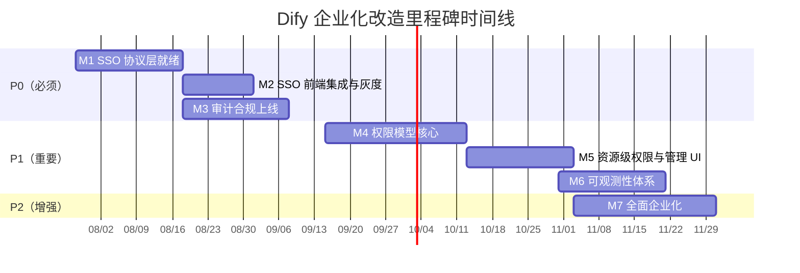
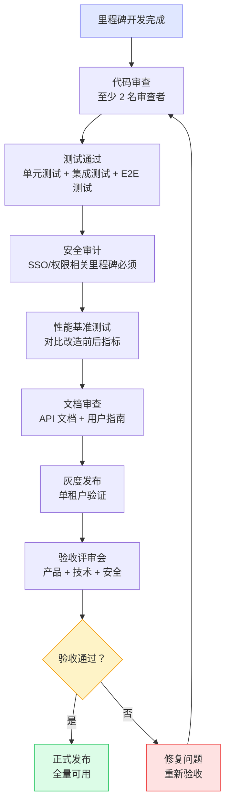
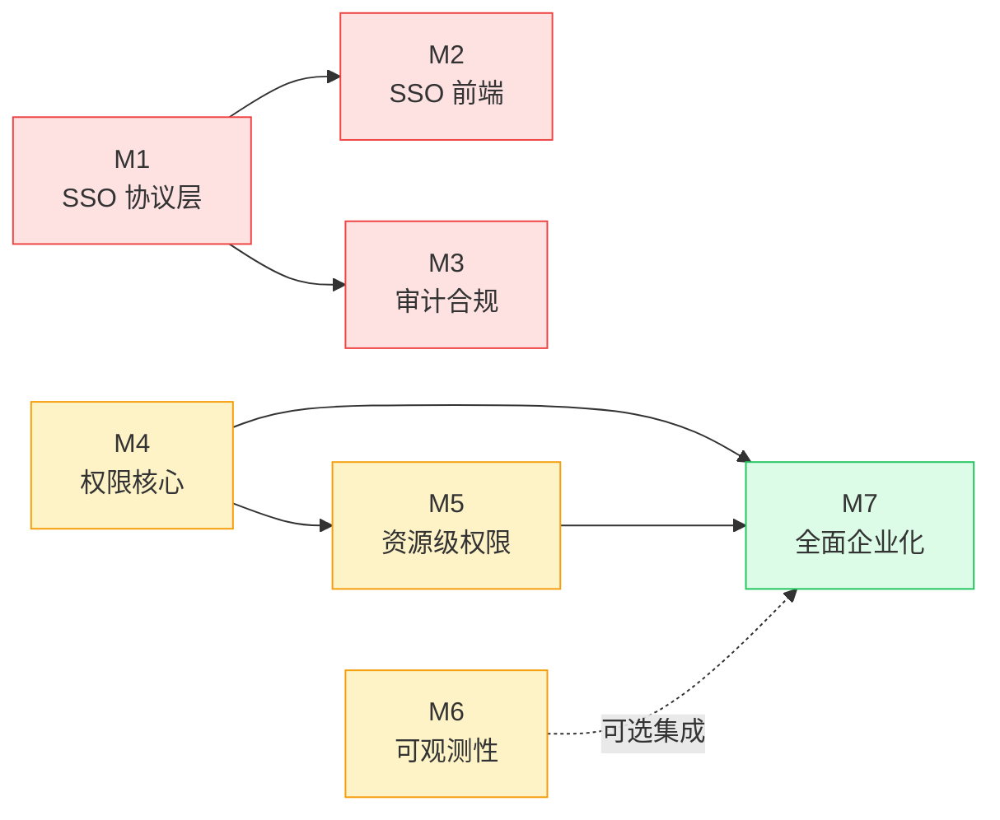
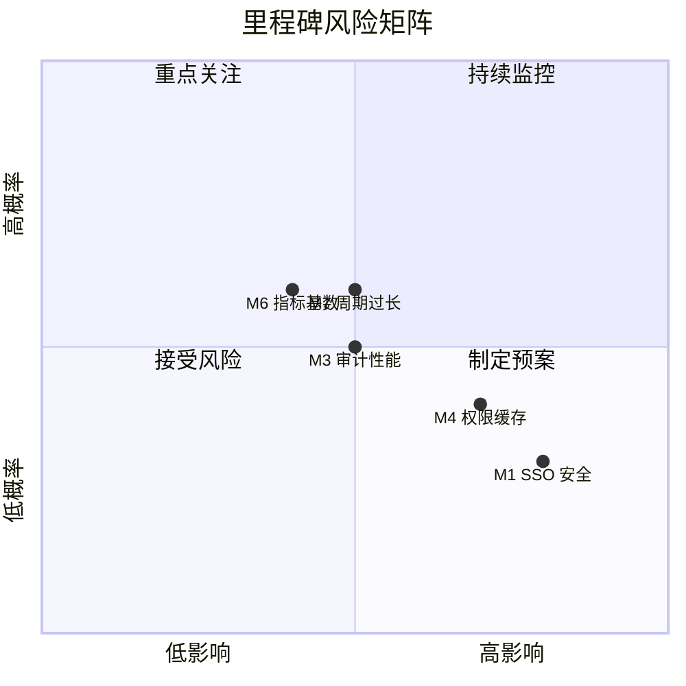

# 里程碑定义

> **TL;DR**: 将 Dify 从社区版开源平台升级为企业级 AI 应用平台，分 7 个里程碑、三期（P0/P1/P2）交付，覆盖 SSO、审计、权限、监控、隔离、容量六大改造域，总工期约 22 周。

## 概述

本文档定义 Dify 企业化改造的关键里程碑。每个里程碑对应一组可独立交付、可独立验收的能力集合，与 [平台改造方案](../platform-modification.md) 中的需求（R1-R6）和任务（T1-T24）直接对应。

**改造范围：**

| 需求编号 | 需求名称 | 优先级 | 关联里程碑 |
|---------|---------|--------|-----------|
| R4 | SSO 集成 | P0 | M1, M2 |
| R3 | 审计日志完善 | P0 | M3 |
| R2 | 权限模型升级 | P1 | M4, M5 |
| R5 | 监控指标补充 | P1 | M6 |
| R1 | 多租户隔离增强 | P2 | M7 |
| R6 | 容量规划工具 | P2 | M7 |

**交付原则：**

- 每个里程碑独立可交付，不依赖后续里程碑
- 所有改造向后兼容，现有部署零影响升级
- 功能开关控制，可按租户灰度启用
- 每个里程碑交付后进行一次安全审计和性能基准测试

## 详细设计

### 1. 里程碑清单

| 里程碑 | 名称 | 目标时间 | 工期 | 交付物 | 优先级 |
|--------|------|---------|------|--------|--------|
| M1 | SSO 协议层就绪 | 2026-08-08 | 3 周 | SAML 2.0 + OIDC + LDAP/AD 后端集成 | P0 |
| M2 | SSO 前端集成与灰度 | 2026-08-22 | 2 周 | SSO 登录页 + 配置页 + 灰度发布 | P0 |
| M3 | 审计合规上线 | 2026-09-12 | 3 周 | 完整审计追踪 + 查询 API + 归档 | P0 |
| M4 | 权限模型核心 | 2026-10-10 | 4 周 | 权限点 + 自定义角色 + 权限检查重构 | P1 |
| M5 | 资源级权限与管理 UI | 2026-10-31 | 3 周 | 资源 ACL + 权限管理界面 | P1 |
| M6 | 可观测性体系 | 2026-11-21 | 3 周 | Prometheus 指标 + Grafana 仪表板 + 告警 | P1 |
| M7 | 全面企业化 | 2026-12-19 | 4 周 | 项目级隔离 + 容量规划工具 | P2 |

### 2. 里程碑详情

#### M1：SSO 协议层就绪

**目标：** 完成后端 SSO 协议集成，企业用户可通过 SAML、OIDC、LDAP 三种协议认证身份。

**目标时间：** 2026-08-08

**关联任务：** T1（SAML 2.0 集成）、T2（OIDC 集成）、T3（LDAP/AD 集成）

**交付物：**

- `api/controllers/console/auth/saml.py`：SAML 2.0 控制器
- `api/controllers/console/auth/oidc.py`：OIDC 控制器
- `api/controllers/console/auth/ldap.py`：LDAP/AD 控制器
- `tenant_sso_configs` 表：存储租户级 SSO 配置
- `account_integrates` 表扩展：新增 `saml_name_id`、`oidc_sub`、`ldap_dn` 字段
- JIT（Just-In-Time）用户创建逻辑
- 每个协议的集成测试套件

**验收标准：**

- [ ] SAML 2.0 SP-Initiated 和 IdP-Initiated 流程均可完成登录
- [ ] OIDC Discovery 端点自动配置成功，支持 Azure AD、Okta、Auth0、Keycloak 至少一种
- [ ] LDAP 绑定认证和搜索绑定两种模式均可工作
- [ ] 首次 SSO 登录自动创建 Dify 账户（JIT Provisioning）
- [ ] 已有 Dify 账户可手动绑定 SSO 身份
- [ ] 未配置 SSO 的租户行为完全不变
- [ ] `ENABLE_SSO=false` 时所有 SSO 代码路径不执行
- [ ] SAML 签名验证强制开启，拒绝未签名断言
- [ ] 集成测试覆盖率 ≥ 90%

**依赖：** 无

**风险：**

| 风险 | 影响 | 缓解措施 |
|------|------|---------|
| SAML 协议实现缺陷导致认证绕过 | 高 | 使用成熟库 `python3-saml`，不自行实现协议；第三方渗透测试 |
| 企业 IdP 配置差异大，兼容性不足 | 中 | 覆盖主流 IdP 测试（Azure AD、Okta、Keycloak、OneLogin） |
| JIT 创建用户时属性映射错误 | 中 | 提供属性映射配置界面，支持手动修正 |

---

#### M2：SSO 前端集成与灰度

**目标：** 完成 SSO 前端界面，支持按租户灰度发布，企业用户可通过登录页选择 SSO 方式登录。

**目标时间：** 2026-08-22

**关联任务：** T4（SSO 前端 UI）

**交付物：**

- 登录页 SSO 登录按钮（动态展示，仅配置了 SSO 的租户可见）
- 租户管理后台 SSO 配置页面（SAML/OIDC/LDAP 配置表单）
- SSO 配置加密存储（数据库层面）
- 灰度发布机制（按租户启用）
- 前端 E2E 测试

**验收标准：**

- [ ] 登录页根据租户 SSO 配置动态展示对应登录按钮
- [ ] 管理员可在后台完成 SAML/OIDC/LDAP 配置（含连接测试）
- [ ] SSO 配置中的敏感信息（证书、密钥）加密存储
- [ ] 灰度开关可精确控制到租户级别
- [ ] SSO 登录成功后正确跳转回原页面
- [ ] SSO 登录失败时展示清晰的错误信息
- [ ] 现有邮箱/密码、GitHub/Google OAuth 登录不受影响
- [ ] 前端 E2E 测试覆盖主要 SSO 流程

**依赖：** M1 完成

**风险：**

| 风险 | 影响 | 缓解措施 |
|------|------|---------|
| 前端 SSO 按钮展示逻辑错误 | 低 | 充分的 E2E 测试覆盖 |
| SSO 配置页面用户体验差导致配置错误 | 中 | 提供配置向导和连接测试功能 |

---

#### M3：审计合规上线

**目标：** 构建完整审计追踪体系，满足 SOC 2、GDPR 和 EU AI Act 合规要求。

**目标时间：** 2026-09-12

**关联任务：** T5（审计事件模型）、T6（审计事件收集）、T7（审计查询 API）、T8（审计日志归档）

**交付物：**

- `audit_logs` 表（含分区表 `audit_logs_partitioned`）
- `@audit_log` 装饰器 + 中间件 + 领域事件收集器
- 审计日志查询 API（`/console/api/audit-logs`、`/export`、`/stats`）
- 审计日志归档任务（Celery）
- 审计日志保留策略配置（`AUDIT_LOG_RETENTION_DAYS`）
- SIEM 集成支持（Webhook/Kafka 转发）
- 从 `OperationLog` 到 `AuditLog` 的数据迁移脚本

**验收标准：**

- [ ] 所有认证事件（登录/登出/SSO/令牌刷新）被记录
- [ ] 所有资源变更事件（应用/工作流/知识库 CRUD）被记录
- [ ] 所有权限变更事件（成员邀请/角色变更）被记录
- [ ] 所有配置变更事件（模型配置/环境变量/安全设置）被记录
- [ ] 审计日志包含完整上下文（谁、何时、做了什么、影响范围、IP、UA）
- [ ] 敏感字段（密码、令牌、密钥）在审计日志中脱敏
- [ ] 审计日志查询 API 支持按租户/用户/时间/操作类型过滤
- [ ] 审计日志导出支持 CSV 和 JSON 格式
- [ ] 超过保留期的日志自动归档到对象存储
- [ ] 审计日志写入不影响 API 响应时间（异步写入，P99 延迟增加 < 10ms）
- [ ] `OperationLog` 数据成功迁移到 `AuditLog`
- [ ] 现有 `OperationLog` API 仍正常工作（双写验证期）

**依赖：** M1 完成（SSO 事件需要被审计）

**风险：**

| 风险 | 影响 | 缓解措施 |
|------|------|---------|
| 审计日志写入量过大影响数据库性能 | 中 | 异步写入（Celery）、分区表、定期归档、限流 |
| 审计事件遗漏导致合规不通过 | 高 | 事件清单评审、自动化测试验证事件完整性 |
| 敏感数据泄露到审计日志 | 高 | 脱敏规则强制审查、安全测试 |

---

#### M4：权限模型核心

**目标：** 完成权限点定义、自定义角色模型和权限检查重构，替代固定五级角色。

**目标时间：** 2026-10-10

**关联任务：** T9（权限点定义）、T10（自定义角色模型）、T11（权限检查重构）

**交付物：**

- 权限点枚举定义（`tenant:*`、`app:*`、`dataset:*`、`model:*`、`plugin:*`）
- `custom_roles` 表
- 自定义角色 CRUD API
- 系统预置角色（Owner/Admin/Editor/Normal/DatasetOp）权限集初始化
- 权限检查装饰器重构（`@cloud_edition_billing_resource_check` 切换到新系统）
- Redis 权限缓存层
- 双写验证逻辑（新旧权限系统并行对比）

**验收标准：**

- [ ] 所有隐式权限显式化为权限点（至少 13 个权限点）
- [ ] 现有 5 级角色正确映射为系统预置角色，权限集不变
- [ ] 租户管理员可创建自定义角色并分配权限点
- [ ] 权限检查装饰器切换到新系统，行为与旧系统一致
- [ ] Redis 缓存命中时权限检查延迟 < 1ms
- [ ] 缓存未命中时权限检查延迟 < 10ms
- [ ] 双写验证期新旧系统结果一致（差异率 = 0）
- [ ] `ENABLE_CUSTOM_ROLES=false` 时回退到旧权限系统
- [ ] 权限变更立即生效（缓存主动失效）
- [ ] 集成测试覆盖所有权限点检查场景

**依赖：** 无（可与 M3 并行）

**风险：**

| 风险 | 影响 | 缓解措施 |
|------|------|---------|
| 权限检查重构引入安全漏洞 | 高 | 双写验证期、充分的集成测试、安全审计 |
| 权限缓存不一致导致越权 | 高 | 缓存主动失效机制、缓存 TTL 兜底、监控告警 |
| 权限检查增加请求延迟 | 中 | Redis 缓存、权限预计算、批量查询优化 |

---

#### M5：资源级权限与管理 UI

**目标：** 完成资源级 ACL 和权限管理前端界面，实现细粒度权限控制。

**目标时间：** 2026-10-31

**关联任务：** T12（资源级 ACL）、T13（权限管理 UI）

**交付物：**

- `resource_acls` 表
- 资源级 ACL CRUD API
- 资源级权限检查逻辑
- 权限管理前端页面（角色管理 + 权限配置）
- 资源权限设置界面（应用/知识库级别）

**验收标准：**

- [ ] 支持对单个应用/知识库设置独立权限
- [ ] 支持按用户或角色授权
- [ ] 支持 `read`、`write`、`admin` 三种权限级别
- [ ] 资源级权限与租户级权限正确叠加（资源级优先）
- [ ] 权限管理页面可完成角色创建、编辑、删除
- [ ] 权限管理页面可展示每个角色的权限点矩阵
- [ ] 权限变更实时生效，无需重新登录
- [ ] 未设置资源级 ACL 时回退到租户级权限
- [ ] 前端权限按钮根据用户权限动态展示/隐藏

**依赖：** M4 完成

**风险：**

| 风险 | 影响 | 缓解措施 |
|------|------|---------|
| 资源级 ACL 查询复杂度增加 | 中 | 索引优化、查询缓存、分页限制 |
| 权限模型过于复杂导致用户困惑 | 中 | 提供权限模板、默认推荐配置、帮助文档 |

---

#### M6：可观测性体系

**目标：** 构建 Prometheus + Grafana 完整监控体系，覆盖业务指标、系统指标和 AI 特定指标。

**目标时间：** 2026-11-21

**关联任务：** T14（Prometheus 指标）、T15（业务指标埋点）、T16（Grafana 仪表板）、T17（告警规则）

**交付物：**

- `ext_metrics.py` Flask 扩展
- `/metrics` 端点（Prometheus 格式）
- 12 个核心指标定义（HTTP、模型、工作流、RAG、系统）
- 业务指标埋点（模型调用、工作流执行、RAG 检索）
- 5 个 Grafana 预置仪表板模板（概览/应用/模型/工作流/系统）
- 6 个预置告警规则
- Prometheus AlertManager 配置

**验收标准：**

- [ ] `/metrics` 端点正确暴露所有 12 个核心指标
- [ ] HTTP 请求指标（请求数、延迟分布）自动采集，无需手动埋点
- [ ] 模型调用指标包含 model、provider、tenant_id、status 标签
- [ ] 工作流执行指标包含 app_id、tenant_id、status 标签
- [ ] RAG 检索指标包含 dataset_id、tenant_id 标签
- [ ] 系统指标（连接池、队列深度）正确采集
- [ ] Grafana 仪表板可正确展示所有指标
- [ ] 告警规则在触发条件满足时正确发送告警
- [ ] `ENABLE_METRICS=false` 时 `/metrics` 端点不暴露
- [ ] 指标采集对 API 响应时间影响 < 5ms（P99）
- [ ] 指标基数可控（避免高基数标签导致内存膨胀）

**依赖：** 无（可与 M4、M5 并行）

**风险：**

| 风险 | 影响 | 缓解措施 |
|------|------|---------|
| 高基数标签导致 Prometheus 内存膨胀 | 中 | 合理设计标签、避免用户级标签、采样率可调 |
| 指标采集增加内存开销 | 低 | 默认关闭、按需启用、性能基准测试 |
| 告警规则误报导致告警疲劳 | 中 | 合理设置阈值、告警收敛、分级告警 |

---

#### M7：全面企业化

**目标：** 完成项目级隔离和容量规划工具，Dify 具备完整企业级能力。

**目标时间：** 2026-12-19

**关联任务：** T18（项目模型）、T19（资源关联项目）、T20（项目级权限）、T21（项目管理 UI）、T22（容量评估引擎）、T23（容量预测）、T24（容量报告）

**交付物：**

- `projects` 表
- `apps` 和 `datasets` 表扩展 `project_id` 字段
- 项目 CRUD API
- 项目级权限检查逻辑（与 M4/M5 权限系统集成）
- 项目管理前端页面
- `flask capacity` CLI 命令组（assess/forecast/recommend/report）
- 容量评估 API（`/console/api/capacity-status`、`/forecast`、`/recommendations`）
- 容量报告生成（HTML/PDF）

**验收标准：**

- [ ] 租户可创建项目并将应用/知识库分配到项目
- [ ] 项目级资源过滤正确（查询只返回项目内资源）
- [ ] 项目级权限与自定义角色系统集成
- [ ] 未分配项目的资源行为不变（`project_id = NULL`）
- [ ] 项目管理页面可完成项目创建、编辑、删除、成员管理
- [ ] `flask capacity assess` 正确输出当前容量状态
- [ ] `flask capacity forecast` 正确预测未来 30/60/90 天资源需求
- [ ] `flask capacity recommend` 给出具体扩缩容建议
- [ ] 容量报告支持 HTML 和 PDF 格式导出
- [ ] `ENABLE_PROJECTS=false` 和 `ENABLE_CAPACITY_PLANNING=false` 时功能不可见
- [ ] 现有 API 查询仍按 `tenant_id` 过滤，`project_id` 作为可选过滤条件

**依赖：** M4、M5 完成（项目级权限依赖权限系统）

**风险：**

| 风险 | 影响 | 缓解措施 |
|------|------|---------|
| 项目级隔离导致查询复杂度增加 | 中 | 索引优化、查询缓存、分页限制 |
| 容量预测模型不准确 | 低 | 基于历史数据训练、定期校准、提供置信区间 |
| 改造周期过长导致团队疲劳 | 中 | 分三期交付、每期独立可交付、阶段性庆祝 |

### 3. 里程碑时间线

**关键节点：**

| 日期 | 节点 | 意义 |
|------|------|------|
| 2026-07-28 | 改造启动 | 正式开始 P0 阶段开发 |
| 2026-08-08 | M1 完成 | SSO 协议层就绪，企业可通过 IdP 登录 |
| 2026-08-22 | M2 完成 | SSO 全面可用，可灰度发布 |
| 2026-09-12 | M3 完成 | 审计合规上线，满足 SOC 2 要求 |
| 2026-10-10 | M4 完成 | 权限模型核心就绪，支持自定义角色 |
| 2026-10-31 | M5 完成 | 资源级权限上线，权限管理完整 |
| 2026-11-21 | M6 完成 | 可观测性体系上线，生产环境可保障 SLA |
| 2026-12-19 | M7 完成 | 全面企业化完成，Dify 具备完整企业级能力 |

### 4. 验收流程

#### 4.1 验收标准分级

| 级别 | 说明 | 要求 |
|------|------|------|
| **必须通过** | 核心功能、安全、合规 | 100% 通过，否则里程碑不验收 |
| **应该通过** | 性能、用户体验 | ≥ 90% 通过，否则需制定改进计划 |
| **建议通过** | 文档、代码质量 | ≥ 80% 通过，可在下个里程碑前补齐 |

#### 4.2 验收流程

#### 4.3 验收负责人

| 角色 | 职责 | 人员 |
|------|------|------|
| 产品负责人 | 确认功能满足需求 | 产品经理 |
| 技术负责人 | 确认技术方案合理、代码质量达标 | 架构师 / 技术 Lead |
| 安全负责人 | 确认安全审计通过、无安全漏洞 | 安全工程师 |
| QA 负责人 | 确认测试覆盖充分、无严重 Bug | QA Lead |
| 运维负责人 | 确认部署方案可行、监控告警完备 | 运维 Lead |

#### 4.4 验收检查清单

每个里程碑验收时，需确认以下检查项：

**通用检查项（所有里程碑）：**

- [ ] 所有"必须通过"验收标准已满足
- [ ] 代码审查通过（至少 2 名审查者）
- [ ] 单元测试覆盖率 ≥ 90%
- [ ] 集成测试通过
- [ ] 向后兼容性验证（现有 API 行为不变）
- [ ] 功能开关可正常切换（开/关）
- [ ] 灰度发布方案已准备
- [ ] 回滚预案已准备并测试
- [ ] API 文档已更新
- [ ] 用户指南已更新

**特定检查项（按里程碑）：**

| 里程碑 | 特定检查项 |
|--------|-----------|
| M1/M2 | SSO 安全审计通过、渗透测试通过、SAML 签名验证强制开启 |
| M3 | SOC 2 合规审查通过、敏感数据脱敏验证、审计日志完整性验证 |
| M4/M5 | 权限安全审计通过、双写验证差异率 = 0、越权测试通过 |
| M6 | 指标基数审查、Grafana 仪表板功能验证、告警规则准确性验证 |
| M7 | 项目级隔离验证、容量预测准确性验证、报告格式验证 |

## 附录

### A. 里程碑依赖关系图

### B. 里程碑与任务对应关系

| 里程碑 | 关联任务 | 任务数 |
|--------|---------|--------|
| M1 | T1, T2, T3 | 3 |
| M2 | T4 | 1 |
| M3 | T5, T6, T7, T8 | 4 |
| M4 | T9, T10, T11 | 3 |
| M5 | T12, T13 | 2 |
| M6 | T14, T15, T16, T17 | 4 |
| M7 | T18, T19, T20, T21, T22, T23, T24 | 7 |

### C. 里程碑风险矩阵

### D. 验收检查清单汇总

| 里程碑 | 通用检查项 | 特定检查项 | 验收负责人 | 预计验收日期 |
|--------|-----------|-----------|-----------|-------------|
| M1 | 10 项 | 3 项 | 产品 + 技术 + 安全 | 2026-08-08 |
| M2 | 10 项 | 2 项 | 产品 + 技术 + QA | 2026-08-22 |
| M3 | 10 项 | 3 项 | 产品 + 技术 + 安全 + 合规 | 2026-09-12 |
| M4 | 10 项 | 3 项 | 产品 + 技术 + 安全 | 2026-10-10 |
| M5 | 10 项 | 2 项 | 产品 + 技术 + QA | 2026-10-31 |
| M6 | 10 项 | 3 项 | 技术 + 运维 | 2026-11-21 |
| M7 | 10 项 | 3 项 | 产品 + 技术 + 运维 | 2026-12-19 |

## 变更日志

| 版本 | 日期 | 作者 | 变更内容 |
|------|------|------|----------|
| 1.0 | 2026-07-19 | AI Assistant | 初始版本，定义 7 个里程碑及验收标准 |
