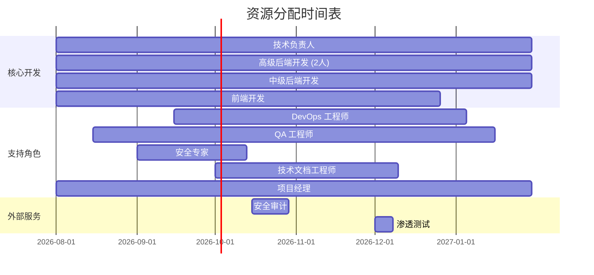

# 资源计划

> **TL;DR**: 基于 Dify 平台改造方案的三期实施计划（P0/P1/P2，共 26 周），本资源计划详细列出所需人力、基础设施、软件资源及成本估算，确保企业级改造（SSO、审计日志、权限模型、监控指标、多租户隔离、容量规划）顺利交付。

## 概述

本资源计划支撑 Dify 从社区版开源平台升级为企业级 AI 应用平台的改造工作。改造涵盖六大核心领域，分三期交付：

- **P0（必须）**：SSO 集成 + 审计日志完善（7 周）
- **P1（重要）**：权限模型升级 + 监控指标补充（9 周）
- **P2（增强）**：多租户隔离增强 + 容量规划工具（10 周）

**资源规划原则：**

- **最小可行团队**：基于任务并行度优化人力配置，避免资源闲置
- **弹性扩展**：预留 20% 缓冲应对技术风险和范围变更
- **成本可控**：优先使用开源工具，按需采购商业服务
- **技能匹配**：确保团队成员具备对应技术栈经验

## 详细设计

### 1. 人力资源需求

#### 1.1 核心角色定义

| 角色 | 人数 | 技能要求 | 投入时间 | 职责范围 |
|------|------|---------|---------|---------|
| **技术负责人** | 1 | Python/Flask 专家，架构设计经验，熟悉 Dify 代码库 | 100%（26 周） | 技术方案评审、架构决策、代码审查、风险把控 |
| **后端开发工程师（高级）** | 2 | Python/Flask 精通，PostgreSQL 经验，熟悉认证协议（SAML/OIDC/LDAP） | 100%（26 周） | SSO 集成、审计日志、权限模型、多租户隔离核心开发 |
| **后端开发工程师（中级）** | 1 | Python/Flask 熟练，Celery 经验 | 100%（26 周） | 监控指标埋点、容量规划工具、异步任务开发 |
| **前端开发工程师** | 1 | React/Next.js 精通，TypeScript，UI/UX 经验 | 80%（26 周） | SSO 登录页、权限管理 UI、项目管理 UI、审计日志查询页 |
| **DevOps 工程师** | 1 | Docker/Kubernetes 精通，Prometheus/Grafana 经验 | 60%（26 周） | 监控体系搭建、CI/CD 优化、部署自动化、容量评估环境 |
| **QA 工程师** | 1 | 自动化测试经验，安全测试基础 | 70%（26 周） | 集成测试、回归测试、安全测试（SSO/权限）、性能测试 |
| **安全专家（兼职）** | 0.5 | 认证协议安全审计经验，渗透测试经验 | 20%（26 周） | SSO 安全评审、权限模型审计、渗透测试 |
| **技术文档工程师（兼职）** | 0.5 | 技术写作经验，API 文档经验 | 15%（26 周） | API 文档更新、用户指南、部署指南、迁移指南 |
| **项目经理** | 0.5 | 敏捷项目管理经验，技术背景 | 30%（26 周） | 进度跟踪、风险管理、资源协调、干系人沟通 |

#### 1.2 团队配置说明

**总人力投入：** 8.5 人 × 26 周 = 221 人周

**分阶段人力分配：**

| 阶段 | 周期 | 核心开发 | 支持角色 | 关键交付 |
|------|------|---------|---------|---------|
| **P0** | 7 周 | 2 高级后端 + 1 前端 | 技术负责人、QA、安全专家 | SSO 集成、审计日志 |
| **P1** | 9 周 | 2 高级后端 + 1 中级后端 + 1 前端 | 技术负责人、DevOps、QA | 权限模型、监控指标 |
| **P2** | 10 周 | 1 高级后端 + 1 中级后端 + 1 前端 | 技术负责人、DevOps、QA | 多租户隔离、容量规划 |

**技能要求详解：**

1. **后端高级开发**
   - 精通 Python 3.10+、Flask、SQLAlchemy
   - 熟悉 SAML 2.0、OIDC、LDAP 协议（至少实现过一种）
   - PostgreSQL 高级特性（分区表、JSONB、性能优化）
   - Celery 异步任务开发
   - 单元测试、集成测试经验

2. **前端开发**
   - React 18+、Next.js App Router、TypeScript
   - Tailwind CSS、Shadcn/ui 组件库
   - 表单处理、状态管理（Zustand/Jotai）
   - 国际化（i18n）经验

3. **DevOps 工程师**
   - Docker Compose、Kubernetes 部署
   - Prometheus、Grafana、AlertManager
   - CI/CD 流水线（GitHub Actions）
   - 日志收集与监控体系搭建

4. **QA 工程师**
   - pytest、Playwright 自动化测试
   - API 测试（Postman/REST 客户端）
   - 安全测试基础（OWASP Top 10）
   - 性能测试工具（Locust/k6）

#### 1.3 外部资源需求

| 资源类型 | 数量 | 用途 | 获取方式 |
|---------|------|------|---------|
| **安全审计服务** | 1 次 | SSO 和权限模型第三方安全审计 | 外包（预计 2 周） |
| **渗透测试服务** | 1 次 | 上线前安全验证 | 外包（预计 1 周） |
| **UI/UX 设计评审** | 2 次 | 权限管理 UI、项目管理 UI 设计评审 | 内部设计团队或外包 |

### 2. 基础设施资源

#### 2.1 开发环境

| 资源 | 规格 | 数量 | 用途 | 成本估算 |
|------|------|------|------|---------|
| **开发服务器** | 8 核 CPU, 32GB RAM, 500GB SSD | 6 台 | 开发人员本地环境 | 已有（或 $200/台/月 × 6） |
| **PostgreSQL 开发库** | 4 核, 16GB RAM, 1TB 存储 | 2 实例 | 开发/测试数据库 | $150/实例/月 |
| **Redis 开发实例** | 2 核, 8GB RAM | 2 实例 | 缓存/队列开发测试 | $80/实例/月 |
| **向量数据库（开发）** | 根据选型（Milvus/Qdrant/Weaviate） | 2 实例 | RAG 功能测试 | $120/实例/月 |

**开发环境总成本：** $1,100/月 × 6 个月 = $6,600

#### 2.2 测试环境

| 资源 | 规格 | 数量 | 用途 | 成本估算 |
|------|------|------|------|---------|
| **测试服务器** | 8 核, 32GB RAM, 1TB SSD | 3 台 | 集成测试、性能测试 | $300/台/月 |
| **PostgreSQL 测试库** | 8 核, 32GB RAM, 2TB 存储 | 1 实例 | 生产级测试数据库 | $300/实例/月 |
| **Redis 测试实例** | 4 核, 16GB RAM | 1 实例 | 生产级缓存测试 | $160/实例/月 |
| **SSO 测试 IdP** | Keycloak/Auth0 测试实例 | 1 实例 | SSO 集成测试 | $100/月（或使用开源 Keycloak） |
| **LDAP 测试服务器** | OpenLDAP 实例 | 1 实例 | LDAP 集成测试 | $50/月（或自建） |

**测试环境总成本：** $1,210/月 × 6 个月 = $7,260

#### 2.3 生产环境（新增组件）

| 资源 | 规格 | 数量 | 用途 | 成本估算 |
|------|------|------|------|---------|
| **Prometheus 服务器** | 4 核, 16GB RAM, 500GB SSD | 2 实例（主备） | 指标采集与存储 | $250/实例/月 |
| **Grafana 服务器** | 2 核, 8GB RAM, 200GB SSD | 2 实例（主备） | 监控可视化 | $120/实例/月 |
| **审计日志归档存储** | 对象存储（S3/OSS） | 按需 | 审计日志长期归档 | $0.023/GB/月（预估 $100/月） |
| **备份存储** | 对象存储 | 按需 | 数据库备份、配置备份 | $50/月（预估） |

**生产环境新增成本：** $770/月 × 6 个月 = $4,620

#### 2.4 CI/CD 基础设施

| 资源 | 规格 | 数量 | 用途 | 成本估算 |
|------|------|------|------|---------|
| **GitHub Actions 运行器** | 标准运行器 | 按需 | 自动化测试、构建 | 已有（或 $200/月） |
| **容器镜像仓库** | Docker Hub/阿里云 ACR | 1 | 镜像存储与分发 | $50/月 |
| **代码质量扫描** | SonarQube/Snyk | 1 实例 | 代码安全与质量检查 | $100/月（或使用开源版） |

**CI/CD 成本：** $350/月 × 6 个月 = $2,100

#### 2.5 网络与安全

| 资源 | 规格 | 数量 | 用途 | 成本估算 |
|------|------|------|------|---------|
| **SSL 证书** | 通配符证书 | 1 | HTTPS 加密 | $200/年 |
| **WAF（Web 应用防火墙）** | 云 WAF 服务 | 1 | 生产环境安全防护 | $200/月 |
| **VPN/跳板机** | 安全访问通道 | 1 | 开发/测试环境安全访问 | $50/月 |

**网络安全成本：** $2,850（一次性 + 6 个月）

### 3. 软件资源

#### 3.1 开发工具

| 工具 | 用途 | 许可证类型 | 成本 |
|------|------|-----------|------|
| **Python 3.10+** | 后端开发 | 开源免费 | $0 |
| **Node.js 18+** | 前端开发 | 开源免费 | $0 |
| **PostgreSQL 15+** | 数据库 | 开源免费 | $0 |
| **Redis 7+** | 缓存/队列 | 开源免费 | $0 |
| **Docker Desktop** | 容器化开发 | 免费（个人/小团队） | $0 |
| **VS Code / PyCharm** | IDE | 免费 / 商业许可 | $0 或 $190/年/人 |
| **Git** | 版本控制 | 开源免费 | $0 |

**开发工具总成本：** $0（使用开源工具）或 $1,140（6 人 × $190 PyCharm）

#### 3.2 第三方库与服务

| 库/服务 | 用途 | 许可证 | 成本 |
|---------|------|--------|------|
| **python3-saml** | SAML 2.0 集成 | MIT | $0 |
| **authlib** | OIDC 客户端 | BSD | $0 |
| **ldap3** | LDAP 集成 | LGPL | $0 |
| **prometheus-client** | Prometheus 指标 | Apache 2.0 | $0 |
| **Grafana OSS** | 监控可视化 | AGPLv3 | $0 |
| **Keycloak** | SSO 测试 IdP | Apache 2.0 | $0 |

**第三方库总成本：** $0（全部使用开源库）

#### 3.3 商业软件（可选）

| 软件 | 用途 | 成本 | 备注 |
|------|------|------|------|
| **Auth0/Okta** | 生产 IdP（如不自建） | $500/月 | 可选，可用 Keycloak 替代 |
| **Datadog/New Relic** | APM 监控（如不用 Prometheus） | $300/月 | 可选，已有 Prometheus 方案 |
| **Figma** | UI/UX 设计协作 | $15/月/人 | 可选，已有设计流程可忽略 |

**商业软件总成本：** $0（使用开源替代方案）

#### 3.4 云服务（如使用云部署）

| 服务 | 提供商 | 规格 | 成本估算 |
|------|--------|------|---------|
| **RDS PostgreSQL** | AWS/阿里云 | 8 核, 32GB, 多可用区 | $800/月 |
| **ElastiCache Redis** | AWS/阿里云 | 集群模式, 16GB | $400/月 |
| **ECS/Kubernetes** | AWS/阿里云 | 3 节点, 8 核 32GB | $600/月 |
| **S3/OSS 对象存储** | AWS/阿里云 | 按需 | $100/月 |
| **CloudFront/CDN** | AWS/阿里云 | 按需 | $150/月 |

**云服务总成本（如使用）：** $2,050/月 × 6 个月 = $12,300

### 4. 成本估算

#### 4.1 人力成本

**假设条件：**
- 技术负责人：$120/小时
- 高级后端开发：$100/小时
- 中级后端开发：$80/小时
- 前端开发：$90/小时
- DevOps 工程师：$100/小时
- QA 工程师：$70/小时
- 安全专家：$150/小时
- 技术文档工程师：$60/小时
- 项目经理：$90/小时

**标准工作周：** 40 小时

| 角色 | 人数 | 投入比例 | 时薪 | 总工时 | 成本 |
|------|------|---------|------|--------|------|
| 技术负责人 | 1 | 100% | $120 | 1,040 小时 | $124,800 |
| 高级后端开发 | 2 | 100% | $100 | 2,080 小时 | $208,000 |
| 中级后端开发 | 1 | 100% | $80 | 1,040 小时 | $83,200 |
| 前端开发 | 1 | 80% | $90 | 832 小时 | $74,880 |
| DevOps 工程师 | 1 | 60% | $100 | 624 小时 | $62,400 |
| QA 工程师 | 1 | 70% | $70 | 728 小时 | $50,960 |
| 安全专家 | 0.5 | 20% | $150 | 208 小时 | $31,200 |
| 技术文档工程师 | 0.5 | 15% | $60 | 156 小时 | $9,360 |
| 项目经理 | 0.5 | 30% | $90 | 312 小时 | $28,080 |

**人力成本小计：** $672,880

**外部服务成本：**
- 安全审计服务：$15,000（一次性）
- 渗透测试服务：$8,000（一次性）
- UI/UX 设计评审：$5,000（2 次）

**外部服务小计：** $28,000

**人力总成本：** $700,880

#### 4.2 基础设施成本

| 类别 | 月成本 | 6 个月总成本 |
|------|--------|-------------|
| 开发环境 | $1,100 | $6,600 |
| 测试环境 | $1,210 | $7,260 |
| 生产环境（新增） | $770 | $4,620 |
| CI/CD 基础设施 | $350 | $2,100 |
| 网络与安全 | $475（平均） | $2,850 |

**基础设施总成本：** $23,430

**如使用云服务替代自建：** $12,300（云服务） - $4,620（自建生产环境） = $7,680 增量

#### 4.3 软件成本

| 类别 | 成本 |
|------|------|
| 开发工具（开源方案） | $0 |
| 第三方库（开源） | $0 |
| 商业软件（可选，未计入） | $0 |

**软件总成本：** $0（使用开源方案）

#### 4.4 总成本汇总

| 类别 | 成本 | 占比 |
|------|------|------|
| 人力成本 | $700,880 | 96.3% |
| 基础设施成本 | $23,430 | 3.2% |
| 软件成本 | $0 | 0% |
| 风险缓冲（10%） | $72,431 | 10% |
| **总计** | **$796,741** | **100%** |

**成本范围：**
- **最低成本（全开源 + 自建）：** $724,310
- **中等成本（部分云服务）：** $796,741
- **最高成本（全云服务 + 商业软件）：** $950,000+

### 5. 资源分配

#### 5.1 分阶段资源分配

**P0 阶段（第 1-7 周）：SSO + 审计日志**

| 角色 | 人数 | 主要任务 | 交付物 |
|------|------|---------|--------|
| 技术负责人 | 1 | 架构评审、技术方案把关 | 技术评审文档 |
| 高级后端开发 | 2 | SAML/OIDC/LDAP 集成、审计日志模型 | SSO 控制器、审计表、迁移脚本 |
| 前端开发 | 1 | SSO 登录页、配置页 UI | 前端组件、国际化 |
| QA 工程师 | 1 | SSO 集成测试、审计日志测试 | 测试用例、自动化脚本 |
| 安全专家 | 0.5 | SSO 安全评审 | 安全评审报告 |

**P0 阶段成本：** $189,000（人力） + $3,900（基础设施） = $192,900

**P1 阶段（第 8-16 周）：权限模型 + 监控指标**

| 角色 | 人数 | 主要任务 | 交付物 |
|------|------|---------|--------|
| 技术负责人 | 1 | 权限模型设计、监控架构评审 | 设计文档 |
| 高级后端开发 | 2 | 自定义角色、权限检查重构 | 权限模型、API |
| 中级后端开发 | 1 | Prometheus 指标埋点、Grafana 仪表板 | 指标定义、仪表板模板 |
| 前端开发 | 1 | 权限管理 UI | 角色管理页、权限配置页 |
| DevOps 工程师 | 1 | Prometheus/Grafana 部署、告警规则 | 监控体系、告警配置 |
| QA 工程师 | 1 | 权限测试、性能测试 | 测试报告 |

**P1 阶段成本：** $245,000（人力） + $7,800（基础设施） = $252,800

**P2 阶段（第 17-26 周）：多租户隔离 + 容量规划**

| 角色 | 人数 | 主要任务 | 交付物 |
|------|------|---------|--------|
| 技术负责人 | 1 | 多租户架构评审 | 评审文档 |
| 高级后端开发 | 1 | 项目模型、资源关联 | Project 模型、API |
| 中级后端开发 | 1 | 容量评估引擎、预测模型 | CLI 工具、API |
| 前端开发 | 1 | 项目管理 UI | 项目列表页、详情页 |
| DevOps 工程师 | 1 | 容量规划环境搭建 | 测试环境 |
| QA 工程师 | 1 | 集成测试、回归测试 | 测试报告 |

**P2 阶段成本：** $238,880（人力） + $11,730（基础设施） = $250,610

#### 5.2 资源冲突解决

**潜在冲突：**

1. **后端开发资源紧张**
   - P0 和 P1 阶段需要 2 名高级后端全程投入
   - 解决方案：P0 阶段优先 SSO（技术复杂度高），审计日志可并行开发
   - 风险缓解：预留 1 名中级后端作为后备，必要时升级为高级

2. **前端开发时间不足**
   - 前端仅 80% 投入，需覆盖 3 个阶段的 UI 开发
   - 解决方案：优先 P0 SSO 登录页，P1/P2 UI 可延后或简化
   - 风险缓解：如进度滞后，可临时增加 0.5 名前端开发

3. **DevOps 资源分散**
   - DevOps 仅 60% 投入，需支持监控体系、CI/CD、环境搭建
   - 解决方案：P1 阶段集中投入监控体系，其他阶段按需支持
   - 风险缓解：使用托管服务（如云 Prometheus）减少运维负担

4. **安全专家时间有限**
   - 安全专家仅 20% 投入，需覆盖 SSO 审计和权限审计
   - 解决方案：集中在 P0 末尾和 P1 末尾进行安全评审
   - 风险缓解：如安全评审发现问题，预留 1 周缓冲时间修复

**资源缓冲策略：**

- **时间缓冲**：每个阶段预留 1 周缓冲时间（已计入 26 周总工期）
- **人力缓冲**：预留 10% 人力成本作为风险缓冲（$72,431）
- **技术缓冲**：关键技术点（SSO、权限模型）提前原型验证

#### 5.3 资源使用时间表

## 附录

### 附录 A：资源分配表

| 阶段 | 角色 | 人数 | 投入比例 | 工期（周） | 工时（小时） | 成本 |
|------|------|------|---------|-----------|-------------|------|
| **P0** | 技术负责人 | 1 | 100% | 7 | 280 | $33,600 |
| P0 | 高级后端开发 | 2 | 100% | 7 | 560 | $56,000 |
| P0 | 前端开发 | 1 | 80% | 7 | 224 | $20,160 |
| P0 | QA 工程师 | 1 | 70% | 7 | 196 | $13,720 |
| P0 | 安全专家 | 0.5 | 20% | 7 | 56 | $8,400 |
| P0 | 项目经理 | 0.5 | 30% | 7 | 84 | $7,560 |
| **P1** | 技术负责人 | 1 | 100% | 9 | 360 | $43,200 |
| P1 | 高级后端开发 | 2 | 100% | 9 | 720 | $72,000 |
| P1 | 中级后端开发 | 1 | 100% | 9 | 360 | $28,800 |
| P1 | 前端开发 | 1 | 80% | 9 | 288 | $25,920 |
| P1 | DevOps 工程师 | 1 | 60% | 9 | 216 | $21,600 |
| P1 | QA 工程师 | 1 | 70% | 9 | 252 | $17,640 |
| P1 | 项目经理 | 0.5 | 30% | 9 | 108 | $9,720 |
| **P2** | 技术负责人 | 1 | 100% | 10 | 400 | $48,000 |
| P2 | 高级后端开发 | 1 | 100% | 10 | 400 | $40,000 |
| P2 | 中级后端开发 | 1 | 100% | 10 | 400 | $32,000 |
| P2 | 前端开发 | 1 | 80% | 10 | 320 | $28,800 |
| P2 | DevOps 工程师 | 1 | 60% | 10 | 240 | $24,000 |
| P2 | QA 工程师 | 1 | 70% | 10 | 280 | $19,600 |
| P2 | 技术文档工程师 | 0.5 | 15% | 10 | 60 | $3,600 |
| P2 | 项目经理 | 0.5 | 30% | 10 | 120 | $10,800 |

### 附录 B：成本估算表

| 类别 | 子类别 | P0 成本 | P1 成本 | P2 成本 | 总计 |
|------|--------|---------|---------|---------|------|
| **人力成本** | 核心开发 | $109,760 | $166,800 | $140,800 | $417,360 |
| | 支持角色 | $29,680 | $48,960 | $46,400 | $125,040 |
| | 外部服务 | $15,000 | $8,000 | $5,000 | $28,000 |
| **基础设施** | 开发环境 | $1,100 | $2,200 | $3,300 | $6,600 |
| | 测试环境 | $1,210 | $2,420 | $3,630 | $7,260 |
| | 生产环境 | $770 | $1,540 | $2,310 | $4,620 |
| | CI/CD | $350 | $700 | $1,050 | $2,100 |
| | 网络安全 | $475 | $950 | $1,425 | $2,850 |
| **软件成本** | 开发工具 | $0 | $0 | $0 | $0 |
| | 第三方库 | $0 | $0 | $0 | $0 |
| **小计** | | $158,345 | $231,570 | $203,915 | $593,830 |
| **风险缓冲（10%）** | | $15,835 | $23,157 | $20,392 | $59,384 |
| **总计** | | **$174,180** | **$254,727** | **$224,307** | **$653,214** |

**注：** 上表为保守估算，实际成本可能因地区、市场 rates、云服务商定价等因素有所浮动。

### 附录 C：关键假设

1. **汇率假设**：所有成本以 USD 计算，汇率波动不影响相对比例
2. **工作时长**：标准工作周 40 小时，不含加班
3. **人员稳定性**：假设团队人员在项目期间保持稳定，无大规模离职
4. **技术风险**：假设无重大技术障碍，SSO 协议实现顺利
5. **范围稳定**：假设需求范围不发生重大变更（变更需走变更控制流程）
6. **基础设施**：假设公司已有基础开发环境，仅需新增测试和生产环境
7. **开源方案**：假设全部采用开源工具，不采购商业软件

### 附录 D：成本优化建议

1. **人力成本优化**
   - 优先招聘内部员工而非外包，长期成本更低
   - 考虑远程办公，扩大人才池，降低地域成本差异
   - 初级开发人员可承担部分测试和文档工作，降低高级人员负担

2. **基础设施成本优化**
   - 使用云服务商的免费层（如 AWS Free Tier、阿里云免费试用）
   - 开发/测试环境使用低配置实例，按需扩容
   - 使用 Spot 实例或预留实例降低云成本（可节省 30-60%）

3. **软件成本优化**
   - 全部采用开源工具（已在本计划中实现）
   - 使用社区版而非企业版（如 Grafana OSS vs Grafana Enterprise）
   - 利用开源替代商业方案（如 Keycloak 替代 Auth0）

4. **时间成本优化**
   - 采用敏捷开发，快速交付 MVP，减少返工
   - 自动化测试和 CI/CD，减少人工测试成本
   - 代码审查和知识共享，减少技术债务

## 变更日志

| 版本 | 日期 | 作者 | 变更内容 |
|------|------|------|----------|
| 1.0 | 2026-07-19 | AI Assistant | 初始版本，基于平台改造方案制定资源计划 |
