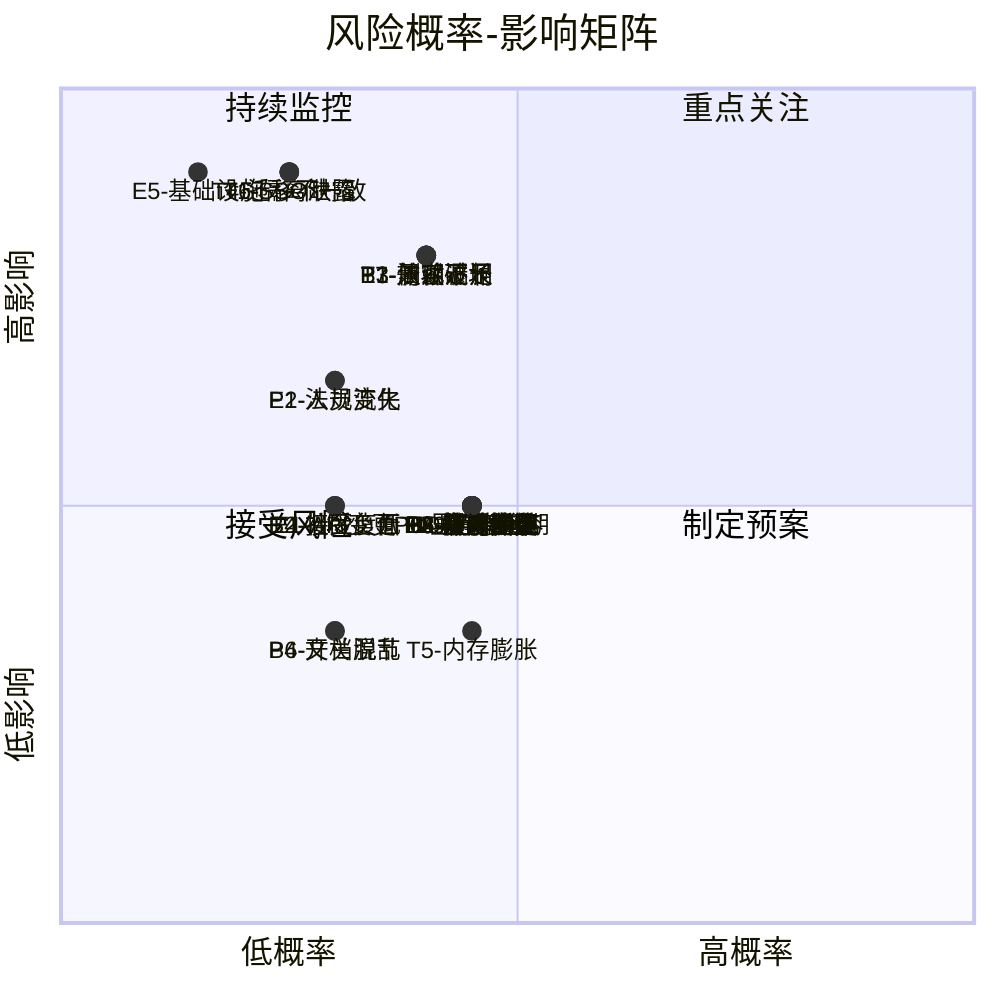
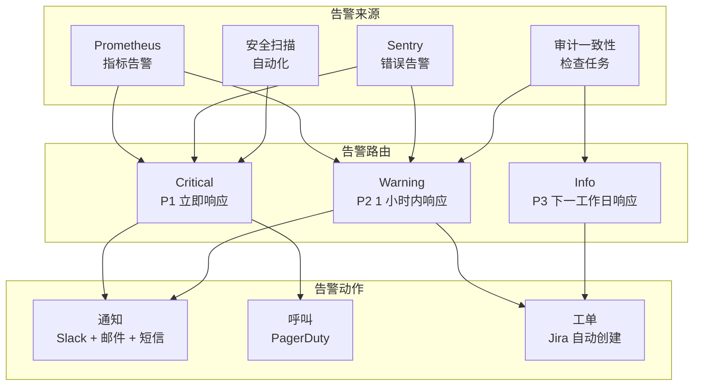
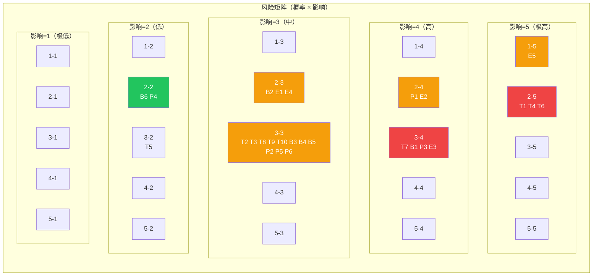

# 风险评估与保障措施

> **TL;DR**: 本文档系统识别 Dify 企业级改造过程中的技术、业务、项目和外部风险，通过概率-影响矩阵评估风险等级，并为每个高风险项设计缓解措施和应急预案，确保改造过程可控、可回滚、可验证。

## 概述

Dify 从社区版开源平台升级为企业级 AI 应用平台的改造涉及六大核心领域：SSO 集成、审计日志、权限模型、监控指标、多租户隔离和容量规划。改造周期约 26 周（P0: 7 周 + P1: 9 周 + P2: 10 周），涉及数据库 Schema 变更、新认证协议接入、权限体系重构等高风险操作。

本文档的目标是：

- 识别改造全生命周期中可能遇到的各类风险
- 量化评估每个风险的概率和影响
- 为高风险项制定具体的缓解措施和应急预案
- 建立风险监控机制，确保风险在可控范围内
- 提供质量、安全和合规三方面的保障体系

**风险评估方法论：**

- 概率等级：极低（<5%）、低（5-20%）、中（20-50%）、高（50-80%）、极高（>80%）
- 影响等级：极低（可忽略）、低（轻微影响）、中（可恢复的延迟或成本增加）、高（重大功能受损或数据丢失）、极高（系统不可用或安全事件）
- 风险等级 = 概率 × 影响，分为四级：低风险（1-4）、中风险（5-9）、高风险（10-16）、极高风险（17-25）

## 详细设计

### 1. 风险识别

#### 1.1 技术风险

| 编号 | 风险名称 | 风险描述 | 关联改造项 |
|------|----------|----------|-----------|
| T1 | SSO 协议实现缺陷 | SAML/OIDC/LDAP 协议实现存在安全漏洞，可能导致认证绕过或令牌泄露 | R4: SSO 集成 |
| T2 | 审计日志性能瓶颈 | 高并发场景下审计日志写入量过大，导致数据库性能下降或写入延迟 | R3: 审计日志 |
| T3 | 权限检查延迟增加 | 自定义角色 + 资源级 ACL 引入额外的权限查询开销，增加 API 响应延迟 | R2: 权限模型 |
| T4 | 数据迁移不一致 | Schema 变更或数据迁移过程中出现数据丢失或不一致 | 所有改造项 |
| T5 | 指标采集内存膨胀 | Prometheus 指标基数过高导致内存占用持续增长 | R5: 监控指标 |
| T6 | 多租户隔离泄露 | 项目级隔离引入新的查询维度，遗漏 `project_id` 过滤导致跨项目数据泄露 | R1: 多租户隔离 |
| T7 | 向后兼容破坏 | 改造过程中意外修改现有 API 行为或数据格式，影响已有集成 | 所有改造项 |
| T8 | Celery 任务积压 | 审计日志异步写入或容量评估任务量过大，导致 Celery 队列积压 | R3, R6 |
| T9 | 数据库连接池耗尽 | 新增功能增加数据库查询量，连接池配置不足导致请求阻塞 | R2, R3 |
| T10 | 前端兼容性破坏 | 权限模型变更导致前端 UI 渲染异常或功能不可用 | R2 |

#### 1.2 业务风险

| 编号 | 风险名称 | 风险描述 | 关联改造项 |
|------|----------|----------|-----------|
| B1 | 改造周期过长 | 26 周改造期间产品功能迭代停滞，竞争对手抢占市场 | 全部 |
| B2 | 企业用户接受度低 | 新功能（自定义角色、项目隔离）学习成本高，用户抵触 | R1, R2 |
| B3 | 向后兼容约束限制设计 | 为保持兼容导致新架构设计妥协，留下技术债 | 全部 |
| B4 | 查询复杂度增加 | 项目级隔离 + 资源级 ACL 导致 SQL 查询 JOIN 增多，性能下降 | R1, R2 |
| B5 | 灰度发布冲突 | 新旧系统并行运行期间，同一租户的数据在两套系统间不一致 | R2, R3 |
| B6 | 功能开关管理混乱 | 6 个 `ENABLE_*` 开关组合过多，测试覆盖不全 | 全部 |

#### 1.3 项目风险

| 编号 | 风险名称 | 风险描述 | 关联改造项 |
|------|----------|----------|-----------|
| P1 | 关键人员流失 | 核心开发人员离职导致知识断层，改造进度受阻 | 全部 |
| P2 | 需求变更频繁 | 企业客户需求变化导致改造范围扩大或优先级调整 | 全部 |
| P3 | 测试覆盖不足 | 改造涉及核心认证和权限逻辑，回归测试不充分导致线上故障 | 全部 |
| P4 | 文档与实现脱节 | 改造过程中设计变更未及时更新文档，导致后续维护困难 | 全部 |
| P5 | 跨团队协调困难 | 前端、后端、运维多团队并行改造，接口约定不一致 | 全部 |
| P6 | 里程碑延期 | 某一期改造延期导致后续里程碑连锁推迟 | 全部 |

#### 1.4 外部风险

| 编号 | 风险名称 | 风险描述 | 关联改造项 |
|------|----------|----------|-----------|
| E1 | LLM 供应商 API 变更 | 模型供应商 API 接口变更或下线，影响 AI 功能 | 间接影响 |
| E2 | 合规法规变化 | EU AI Act、GDPR 等法规更新，需要调整审计和数据处理逻辑 | R3 |
| E3 | 开源依赖漏洞 | 第三方库（python3-saml、authlib、ldap3 等）曝出安全漏洞 | R4 |
| E4 | 社区反馈负面 | 改造方向与社区期望不一致，导致社区贡献减少或 fork 分裂 | 全部 |
| E5 | 基础设施供应商故障 | 云服务商（AWS/Azure/GCP）区域级故障影响部署 | 间接影响 |

### 2. 风险评估

#### 2.1 风险矩阵

使用概率（1-5）× 影响（1-5）计算风险等级：

| 风险编号 | 概率（1-5） | 影响（1-5） | 风险分数 | 风险等级 |
|---------|------------|------------|---------|---------|
| T1 | 2 | 5 | 10 | 🔴 高 |
| T2 | 3 | 3 | 9 | 🟡 中 |
| T3 | 3 | 3 | 9 | 🟡 中 |
| T4 | 2 | 5 | 10 | 🔴 高 |
| T5 | 3 | 2 | 6 | 🟡 中 |
| T6 | 2 | 5 | 10 | 🔴 高 |
| T7 | 3 | 4 | 12 | 🔴 高 |
| T8 | 3 | 3 | 9 | 🟡 中 |
| T9 | 3 | 3 | 9 | 🟡 中 |
| T10 | 3 | 3 | 9 | 🟡 中 |
| B1 | 3 | 4 | 12 | 🔴 高 |
| B2 | 2 | 3 | 6 | 🟡 中 |
| B3 | 3 | 3 | 9 | 🟡 中 |
| B4 | 3 | 3 | 9 | 🟡 中 |
| B5 | 3 | 3 | 9 | 🟡 中 |
| B6 | 2 | 2 | 4 | 🟢 低 |
| P1 | 2 | 4 | 8 | 🟡 中 |
| P2 | 3 | 3 | 9 | 🟡 中 |
| P3 | 3 | 4 | 12 | 🔴 高 |
| P4 | 2 | 2 | 4 | 🟢 低 |
| P5 | 3 | 3 | 9 | 🟡 中 |
| P6 | 3 | 3 | 9 | 🟡 中 |
| E1 | 2 | 3 | 6 | 🟡 中 |
| E2 | 2 | 4 | 8 | 🟡 中 |
| E3 | 3 | 4 | 12 | 🔴 高 |
| E4 | 2 | 3 | 6 | 🟡 中 |
| E5 | 1 | 5 | 5 | 🟡 中 |

#### 2.2 风险分布图

### 3. 风险缓解措施

#### 3.1 高风险缓解策略

##### T1: SSO 协议实现缺陷（风险分数: 10）

**缓解措施：**

1. **使用成熟库，不自行实现协议**
   - SAML: 使用 `python3-saml`（基于 python-xmlsec），不自行解析 SAML 断言
   - OIDC: 使用 `authlib`（已审计的 OAuth/OIDC 库），不自行实现 JWT 验证
   - LDAP: 使用 `ldap3`（纯 Python LDAP 客户端），不自行实现 LDAP 协议

2. **强制安全配置**
   - SAML: 强制开启签名验证（`wantAssertionsSigned=True`），拒绝未签名断言
   - OIDC: 强制验证 `iss`、`aud`、`exp` 声明，拒绝过期令牌
   - LDAP: 强制使用 LDAPS（TLS 加密），禁止明文传输凭证

3. **第三方安全审计**
   - SSO 功能上线前聘请专业安全公司进行渗透测试
   - 重点测试：SAML 签名绕过、OIDC 令牌伪造、LDAP 注入
   - 审计结果公开（脱敏后），接受社区监督

4. **自动化安全测试**
   - 集成 SAML/OIDC 合规测试套件到 CI
   - 每次 PR 涉及认证代码时自动运行安全测试
   - 使用 OWASP ZAP 进行定期自动化渗透测试

**应急预案：**

- 发现认证绕过漏洞时，立即通过 `ENABLE_SSO=false` 关闭 SSO 功能
- 通知所有启用 SSO 的租户管理员，要求强制重新认证
- 审计受影响时间窗口内的所有登录记录，识别异常访问
- 24 小时内发布安全补丁，72 小时内完成所有租户升级

##### T4: 数据迁移不一致（风险分数: 10）

**缓解措施：**

1. **幂等迁移脚本**
   - 所有 Alembic 迁移脚本设计为幂等操作（可重复执行不产生副作用）
   - 使用 `IF NOT EXISTS` / `IF EXISTS` 保护 Schema 变更
   - 数据迁移使用 `INSERT ... ON CONFLICT DO NOTHING` 避免重复插入

2. **双写验证期**
   - 新旧系统并行运行至少 2 周
   - 每次写入同时更新新旧两张表
   - 后台任务定期对比新旧表数据一致性
   - 发现不一致时自动告警并记录差异

3. **迁移前备份**
   - 每次迁移前自动创建数据库快照（pg_dump）
   - 备份保留至少 7 天
   - 迁移脚本执行前验证备份完整性

4. **灰度迁移**
   - 先在测试环境执行完整迁移流程
   - 生产环境按租户灰度（1% → 10% → 50% → 100%）
   - 每个灰度阶段观察 24 小时，无异常后继续

**应急预案：**

- 迁移过程中发现数据不一致，立即暂停迁移
- 评估影响范围：如果仅影响新表，回滚新表数据（`TRUNCATE` + 重新迁移）
- 如果影响旧表，从备份恢复（RTO < 4 小时）
- 事后分析根因，修复迁移脚本后重新执行

##### T6: 多租户隔离泄露（风险分数: 10）

**缓解措施：**

1. **强制查询过滤**
   - 所有新增查询必须包含 `tenant_id` 和 `project_id`（如适用）过滤
   - 代码审查检查清单中增加"隔离验证"项
   - 使用 AST 分析工具自动检测缺少租户过滤的查询

2. **集成测试覆盖**
   - 编写多租户隔离专项测试：创建两个租户/项目，验证数据不可交叉访问
   - 测试覆盖所有新增 API 端点
   - CI 中强制运行隔离测试，失败则阻止合并

3. **运行时监控**
   - 审计日志记录每次数据访问的 `tenant_id` 和 `project_id`
   - 异常检测：同一请求访问多个租户/项目的数据时触发告警
   - 定期审查跨租户访问日志

**应急预案：**

- 发现隔离泄露漏洞时，评估泄露范围（受影响租户数、数据类型）
- 如果漏洞可被利用，立即发布安全公告并建议租户轮换敏感凭证
- 修复漏洞后，审计历史日志确认是否已被实际利用
- 如确认被利用，通知受影响租户并协助采取补救措施

##### T7: 向后兼容破坏（风险分数: 12）

**缓解措施：**

1. **API 兼容性测试**
   - 维护现有 API 的 Golden Test（黄金测试），确保响应格式不变
   - 新增字段使用 `Optional`，不修改已有字段的类型或语义
   - 废弃字段保留至少 6 个月，标记 `Deprecated` 响应头

2. **版本化策略**
   - 新增 API 使用新路径（如 `/console/api/v2/`）或新资源名
   - 现有 API 不修改 URL 路径，仅扩展响应体
   - 请求头中支持 `Accept-Version` 用于未来版本协商

3. **契约测试**
   - 使用 Pact 或类似工具进行 API 契约测试
   - 前端和后端独立维护契约，CI 中验证兼容性
   - 任何破坏契约的变更需要双方团队共同评审

**应急预案：**

- 发现兼容性问题后，评估影响范围（受影响的 API 调用方）
- 如果是新增字段导致，回滚字段添加（向后兼容）
- 如果是修改现有字段导致，提供兼容层（Adapter 模式）转换新旧格式
- 通知受影响的 API 调用方，提供迁移指南

##### B1: 改造周期过长（风险分数: 12）

**缓解措施：**

1. **分阶段交付**
   - P0（7 周）：SSO + 审计日志，企业部署准入门槛
   - P1（9 周）：权限模型 + 监控指标，生产环境必备
   - P2（10 周）：多租户增强 + 容量规划，大规模部署优化
   - 每期独立可交付，不依赖后续期次

2. **并行开发**
   - SSO 和审计日志无依赖，可并行开发
   - 权限模型和监控指标无依赖，可并行开发
   - 前端和后端按接口约定并行开发

3. **MVP 优先**
   - 每期先交付核心功能（MVP），增强功能后续迭代
   - P0 MVP：SAML + 基础审计日志（不含归档）
   - P1 MVP：自定义角色（不含资源级 ACL）+ 基础指标

**应急预案：**

- 某一期延期超过 2 周，重新评估优先级，必要时裁剪范围
- P0 延期影响企业客户接入，优先保障 SSO 功能（可先只支持 SAML）
- P1 延期影响生产稳定性，优先保障监控指标（可先只覆盖核心指标）
- P2 延期影响较小，可推迟到下一季度

##### P3: 测试覆盖不足（风险分数: 12）

**缓解措施：**

1. **测试金字塔**
   - 单元测试：覆盖所有新增模型、服务、工具函数（目标覆盖率 > 80%）
   - 集成测试：覆盖所有新增 API 端点（100% 覆盖）
   - E2E 测试：覆盖核心用户流程（SSO 登录、权限变更、审计查询）

2. **回归测试**
   - 现有测试套件必须全部通过才能合并改造代码
   - 新增测试覆盖改造影响的所有现有功能
   - CI 中运行完整测试套件（不跳过任何测试）

3. **安全测试**
   - SSO 功能：SAML/OIDC 合规测试 + 渗透测试
   - 权限模型：越权访问测试（水平越权 + 垂直越权）
   - 审计日志：日志完整性测试（确保所有关键操作被记录）

**应急预案：**

- 上线后发现严重 bug，立即回滚到改造前版本（通过功能开关）
- 分析 bug 根因，补充缺失的测试用例
- 修复后在测试环境运行完整回归测试，确认无新问题后重新上线

##### E3: 开源依赖漏洞（风险分数: 12）

**缓解措施：**

1. **依赖安全扫描**
   - CI 中集成 `safety`（Python 依赖漏洞扫描）
   - 每日自动运行扫描，发现高危漏洞立即告警
   - 使用 `pip-audit` 检查已知 CVE

2. **依赖版本管理**
   - 锁定依赖版本（`requirements.txt` 或 `pyproject.toml`）
   - 定期更新依赖（每月一次），及时应用安全补丁
   - 使用 Dependabot 或 Renovate 自动创建更新 PR

3. **最小依赖原则**
   - 新增依赖前评估替代方案，优先选择标准库或已有依赖
   - 审查依赖的维护状态（最近更新时间、Issue 响应速度）
   - 避免引入过度依赖（如 `python3-saml` 依赖 `lxml` 和 `xmlsec`，需确认维护状态）

**应急预案：**

- 发现高危漏洞（CVSS > 9.0）且无补丁时：
  - 评估漏洞是否可被利用（攻击路径、前置条件）
  - 如果可被利用，临时禁用受影响功能（通过功能开关）
  - 联系依赖维护者确认修复时间线
  - 如有可能，自行修复并提交 PR 上游
- 发现中危漏洞（CVSS 4.0-9.0）时：
  - 在下一个维护窗口更新依赖
  - 监控漏洞公告，确认是否有 PoC 公开

#### 3.2 中风险缓解策略

| 风险编号 | 风险名称 | 缓解措施 | 应急预案 |
|---------|----------|---------|---------|
| T2 | 审计日志性能瓶颈 | 异步写入（Celery）、分区表、定期归档、限流 | 临时关闭审计写入（`ENABLE_AUDIT_LOG=false`），回退到 OperationLog |
| T3 | 权限检查延迟增加 | Redis 缓存权限数据（TTL 60s）、权限预计算、批量查询优化 | 临时关闭资源级 ACL（仅保留角色级权限） |
| T5 | 指标采集内存膨胀 | 合理设置指标基数（避免高基数标签）、采样率可调 | 临时关闭指标采集（`ENABLE_METRICS=false`） |
| T8 | Celery 任务积压 | 监控队列深度、自动扩缩 Worker、任务优先级分级 | 增加 Worker 副本、临时降低非关键任务优先级 |
| T9 | 数据库连接池耗尽 | 监控连接池使用率、动态调整池大小、优化慢查询 | 临时增加连接池上限、重启连接池 |
| T10 | 前端兼容性破坏 | 前端 E2E 测试覆盖、灰度发布、快速回滚 | 回滚前端到改造前版本 |
| B2 | 企业用户接受度低 | 用户培训、详细文档、灰度发布、收集反馈迭代 | 提供"经典模式"开关，回退到旧版 UI |
| B3 | 向后兼容约束限制设计 | 早期原型验证、架构评审、技术债登记 | 接受技术债，在后续版本中重构 |
| B4 | 查询复杂度增加 | 索引优化、查询缓存、分页限制、慢查询监控 | 临时关闭项目级过滤（回退到租户级） |
| B5 | 灰度发布冲突 | 双写验证期、一致性检查任务、灰度比例控制 | 暂停灰度，修复一致性问题后继续 |
| E2 | 合规法规变化 | 关注法规动态、预留合规调整空间、法律顾问审查 | 紧急调整审计和数据处理逻辑 |
| P1 | 关键人员流失 | 知识文档化、代码审查交叉覆盖、关键模块双人熟悉 | 临时调整优先级，集中资源保障核心功能 |
| P2 | 需求变更频繁 | 需求冻结窗口（每期开始前 2 周冻结）、变更评审流程 | 评估变更影响，必要时调整里程碑 |
| P5 | 跨团队协调困难 | 接口约定文档化、定期同步会议、共享看板 | 升级问题到管理层，协调资源 |
| P6 | 里程碑延期 | 缓冲时间（每期预留 1 周缓冲）、进度周报 | 重新评估优先级，裁剪非核心功能 |

#### 3.3 低风险缓解策略

| 风险编号 | 风险名称 | 缓解措施 |
|---------|----------|---------|
| B6 | 功能开关管理混乱 | 维护开关清单文档、测试所有开关组合、提供一键关闭脚本 |
| P4 | 文档与实现脱节 | 代码变更同步更新文档、文档审查纳入 Definition of Done |

### 4. 风险监控

#### 4.1 监控指标

| 指标类别 | 监控指标 | 告警阈值 | 监控频率 |
|---------|---------|---------|---------|
| **安全指标** | SSO 登录失败率 | > 10%（5 分钟） | 实时 |
| **安全指标** | 异常登录检测（异地/异设备） | 每事件 | 实时 |
| **安全指标** | 权限越权尝试次数 | > 5 次/小时/用户 | 实时 |
| **性能指标** | API P95 延迟 | > 5s（5 分钟） | 每分钟 |
| **性能指标** | 数据库连接池使用率 | > 80%（5 分钟） | 每分钟 |
| **性能指标** | Celery 队列深度 | > 1000（10 分钟） | 每分钟 |
| **数据指标** | 审计日志写入延迟 | > 5s（5 分钟） | 每分钟 |
| **数据指标** | 数据迁移一致性检查 | 不一致记录 > 0 | 每小时 |
| **业务指标** | 功能开关状态变更 | 每事件 | 实时 |
| **业务指标** | 灰度发布进度 | 偏离计划 > 1 天 | 每天 |

#### 4.2 监控频率

| 监控类型 | 频率 | 负责人 | 输出 |
|---------|------|--------|------|
| 安全告警审查 | 实时 | 安全团队 | 告警通知（Slack/邮件） |
| 性能指标审查 | 每天 | 运维团队 | 日报（指标趋势） |
| 数据一致性检查 | 每周 | 开发团队 | 周报（一致性状态） |
| 风险登记册审查 | 每两周 | 项目经理 | 风险状态更新 |
| 里程碑进度审查 | 每周 | 项目经理 | 进度报告 |

#### 4.3 告警机制

**告警分级：**

| 级别 | 响应时间 | 通知方式 | 示例 |
|------|---------|---------|------|
| Critical（P1） | 立即（15 分钟内） | PagerDuty + Slack + 短信 + 电话 | SSO 认证绕过、数据泄露、系统不可用 |
| Warning（P2） | 1 小时内 | Slack + 邮件 + Jira 工单 | API 延迟升高、队列积压、迁移不一致 |
| Info（P3） | 下一工作日 | Jira 工单 + 邮件 | 非关键指标异常、文档过期 |

### 5. 保障措施

#### 5.1 质量保障

**代码质量：**

- [ ] 所有新增代码通过 Ruff 格式化和 lint 检查
- [ ] 所有新增代码通过 basedpyright 类型检查
- [ ] 代码覆盖率 > 80%（单元测试 + 集成测试）
- [ ] 所有 PR 至少经过 2 名审查者评审
- [ ] 安全相关代码（认证、权限、加密）需要安全团队额外审查

**测试质量：**

- [ ] 单元测试覆盖所有新增模型、服务、工具函数
- [ ] 集成测试覆盖所有新增 API 端点
- [ ] E2E 测试覆盖核心用户流程（SSO 登录、权限变更、审计查询）
- [ ] 回归测试覆盖改造影响的所有现有功能
- [ ] 性能测试验证改造后 API 延迟无明显增加（P95 < 5s）
- [ ] 安全测试覆盖 SSO 协议合规、越权访问、注入攻击

**部署质量：**

- [ ] 灰度发布按 1% → 10% → 50% → 100% 逐步推进
- [ ] 每个灰度阶段观察至少 24 小时
- [ ] 灰度期间监控核心指标（错误率、延迟、资源使用）
- [ ] 灰度期间收集用户反馈，及时处理问题
- [ ] 全量发布后持续监控 1 周

#### 5.2 安全保障

**认证安全：**

- [ ] SSO 实现使用成熟库（python3-saml、authlib、ldap3），不自行实现协议
- [ ] SAML 强制开启签名验证，拒绝未签名断言
- [ ] OIDC 强制验证 iss、aud、exp 声明
- [ ] LDAP 强制使用 LDAPS（TLS 加密）
- [ ] SSO 上线前进行第三方渗透测试
- [ ] SSO 上线后每月进行自动化安全扫描

**数据安全：**

- [ ] 所有数据库查询包含 tenant_id 过滤（多租户隔离）
- [ ] 敏感字段（凭证、密码）使用混合加密存储
- [ ] API 响应中凭证已脱敏
- [ ] 审计日志中敏感信息已脱敏
- [ ] 备份数据加密存储

**访问控制：**

- [ ] 权限检查装饰器正确应用于所有受保护端点
- [ ] 资源级 ACL 检查覆盖所有新增资源类型
- [ ] 越权访问测试覆盖水平越权和垂直越权
- [ ] 权限变更触发审计日志记录

#### 5.3 合规保障

**EU AI Act 合规：**

- [ ] 对话日志完整记录（用户输入、模型输出、时间戳）
- [ ] 模型追踪记录每次交互使用的模型
- [ ] Token 用量记录支持成本核算
- [ ] 文档检索记录 RAG 来源文档
- [ ] 用户标识支持行为追踪
- [ ] 数据保留策略可配置

**GDPR 合规：**

- [ ] 数据处理法律依据文档化
- [ ] 数据最小化原则（RAG 管道仅传递必要上下文）
- [ ] 删除权支持（用户请求删除时清理所有相关数据）
- [ ] 跨境传输控制（非 EEA 供应商需要 SCC）
- [ ] 数据泄露通知流程（72 小时内通知监管机构）

**SOC 2 合规：**

- [ ] 审计日志覆盖所有关键操作（谁、何时、做了什么、影响范围）
- [ ] 审计日志保留至少 90 天（可配置）
- [ ] 审计日志支持导出（CSV/JSON）供外部审计
- [ ] 访问控制策略文档化并执行
- [ ] 变更管理流程文档化并执行

### 6. 风险登记册

| 编号 | 风险名称 | 类别 | 概率 | 影响 | 风险分数 | 等级 | 缓解状态 | 负责人 | 最后更新 |
|------|----------|------|------|------|---------|------|---------|--------|---------|
| T1 | SSO 协议实现缺陷 | 技术 | 2 | 5 | 10 | 🔴 高 | 待缓解 | 安全团队 | 2026-07-19 |
| T2 | 审计日志性能瓶颈 | 技术 | 3 | 3 | 9 | 🟡 中 | 待缓解 | 后端团队 | 2026-07-19 |
| T3 | 权限检查延迟增加 | 技术 | 3 | 3 | 9 | 🟡 中 | 待缓解 | 后端团队 | 2026-07-19 |
| T4 | 数据迁移不一致 | 技术 | 2 | 5 | 10 | 🔴 高 | 待缓解 | DBA | 2026-07-19 |
| T5 | 指标采集内存膨胀 | 技术 | 3 | 2 | 6 | 🟡 中 | 待缓解 | 运维团队 | 2026-07-19 |
| T6 | 多租户隔离泄露 | 技术 | 2 | 5 | 10 | 🔴 高 | 待缓解 | 安全团队 | 2026-07-19 |
| T7 | 向后兼容破坏 | 技术 | 3 | 4 | 12 | 🔴 高 | 待缓解 | 架构师 | 2026-07-19 |
| T8 | Celery 任务积压 | 技术 | 3 | 3 | 9 | 🟡 中 | 待缓解 | 运维团队 | 2026-07-19 |
| T9 | 数据库连接池耗尽 | 技术 | 3 | 3 | 9 | 🟡 中 | 待缓解 | DBA | 2026-07-19 |
| T10 | 前端兼容性破坏 | 技术 | 3 | 3 | 9 | 🟡 中 | 待缓解 | 前端团队 | 2026-07-19 |
| B1 | 改造周期过长 | 业务 | 3 | 4 | 12 | 🔴 高 | 待缓解 | 项目经理 | 2026-07-19 |
| B2 | 企业用户接受度低 | 业务 | 2 | 3 | 6 | 🟡 中 | 待缓解 | 产品经理 | 2026-07-19 |
| B3 | 向后兼容约束限制设计 | 业务 | 3 | 3 | 9 | 🟡 中 | 待缓解 | 架构师 | 2026-07-19 |
| B4 | 查询复杂度增加 | 业务 | 3 | 3 | 9 | 🟡 中 | 待缓解 | DBA | 2026-07-19 |
| B5 | 灰度发布冲突 | 业务 | 3 | 3 | 9 | 🟡 中 | 待缓解 | 后端团队 | 2026-07-19 |
| B6 | 功能开关管理混乱 | 业务 | 2 | 2 | 4 | 🟢 低 | 待缓解 | 运维团队 | 2026-07-19 |
| P1 | 关键人员流失 | 项目 | 2 | 4 | 8 | 🟡 中 | 待缓解 | 项目经理 | 2026-07-19 |
| P2 | 需求变更频繁 | 项目 | 3 | 3 | 9 | 🟡 中 | 待缓解 | 产品经理 | 2026-07-19 |
| P3 | 测试覆盖不足 | 项目 | 3 | 4 | 12 | 🔴 高 | 待缓解 | QA 团队 | 2026-07-19 |
| P4 | 文档与实现脱节 | 项目 | 2 | 2 | 4 | 🟢 低 | 待缓解 | 技术写作 | 2026-07-19 |
| P5 | 跨团队协调困难 | 项目 | 3 | 3 | 9 | 🟡 中 | 待缓解 | 项目经理 | 2026-07-19 |
| P6 | 里程碑延期 | 项目 | 3 | 3 | 9 | 🟡 中 | 待缓解 | 项目经理 | 2026-07-19 |
| E1 | LLM 供应商 API 变更 | 外部 | 2 | 3 | 6 | 🟡 中 | 待缓解 | 后端团队 | 2026-07-19 |
| E2 | 合规法规变化 | 外部 | 2 | 4 | 8 | 🟡 中 | 待缓解 | 法务团队 | 2026-07-19 |
| E3 | 开源依赖漏洞 | 外部 | 3 | 4 | 12 | 🔴 高 | 待缓解 | 安全团队 | 2026-07-19 |
| E4 | 社区反馈负面 | 外部 | 2 | 3 | 6 | 🟡 中 | 待缓解 | 社区经理 | 2026-07-19 |
| E5 | 基础设施供应商故障 | 外部 | 1 | 5 | 5 | 🟡 中 | 待缓解 | 运维团队 | 2026-07-19 |

## 附录

### A. 风险矩阵图

**图例：**

- 🔴 红色（10-25）：高风险，需要立即缓解
- 🟡 橙色（5-9）：中风险，需要监控和预案
- 🟢 绿色（1-4）：低风险，接受并监控

### B. 保障措施检查清单

#### 上线前检查清单

- [ ] 所有高风险项缓解措施已实施
- [ ] 所有测试通过（单元、集成、E2E、安全、性能）
- [ ] 代码审查完成（至少 2 名审查者）
- [ ] 安全审查完成（SSO 渗透测试、权限越权测试）
- [ ] 文档更新完成（API 文档、用户指南、运维手册）
- [ ] 灰度发布计划已制定（1% → 10% → 50% → 100%）
- [ ] 回滚预案已准备（功能开关、备份恢复）
- [ ] 监控告警已配置（Prometheus 规则、Grafana 仪表板）
- [ ] 值班表已安排（上线后 1 周 7×24 值班）
- [ ] 沟通计划已制定（通知租户、社区公告）

#### 上线后检查清单

- [ ] 灰度发布按计划执行
- [ ] 每个灰度阶段观察至少 24 小时
- [ ] 核心指标正常（错误率、延迟、资源使用）
- [ ] 用户反馈收集和处理
- [ ] 审计日志完整性验证
- [ ] 权限检查正确性验证
- [ ] SSO 登录流程验证
- [ ] 全量发布后持续监控 1 周
- [ ] 事后复盘（经验教训文档化）

### C. 关键术语

| 术语 | 定义 |
|------|------|
| RTO | Recovery Time Objective，恢复时间目标 |
| RPO | Recovery Point Objective，恢复点目标 |
| SSO | Single Sign-On，单点登录 |
| SAML | Security Assertion Markup Language，安全断言标记语言 |
| OIDC | OpenID Connect，基于 OAuth 2.0 的身份认证协议 |
| LDAP | Lightweight Directory Access Protocol，轻量级目录访问协议 |
| RBAC | Role-Based Access Control，基于角色的访问控制 |
| ACL | Access Control List，访问控制列表 |
| CVSS | Common Vulnerability Scoring System，通用漏洞评分系统 |

## 变更日志

| 版本 | 日期 | 作者 | 变更内容 |
|------|------|------|----------|
| 1.0 | 2026-07-19 | AI Assistant | 初始版本，覆盖 27 个风险项和完整保障体系 |
