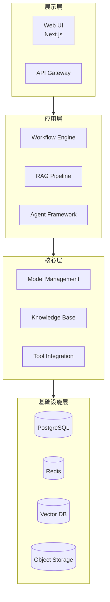

# Dify 架构文档体系实现计划

> **面向 AI 代理的工作者：** 必需子技能：使用 superpowers:subagent-driven-development（推荐）或 superpowers:executing-plans 逐任务实现此计划。步骤使用复选框（`- [ ]`）语法来跟踪进度。

**目标：** 为 Dify 项目编写一套完整的架构文档体系，包含 22 个独立文档，覆盖从现状诊断到实施路线图的全生命周期。

**架构：** 多文件模块化结构，每个主题独立成章，通过索引文档关联。文档采用三层结构（概述 → 详细设计 → 附录），服务于管理层、架构师、开发运维团队三类受众。

**技术栈：** Markdown + Mermaid 图表 + SVG 架构图 + YAML front matter

**设计规格：** `docs/superpowers/specs/2026-07-19-dify-architecture-documentation-design.md`

---

## 文件结构

```
docs/architecture/
├── 00-index.md                    # 文档索引 + 阅读路径指南
├── 01-executive-summary.md        # 执行摘要（面向管理层）
├── 02-current-architecture.md     # 现状架构诊断
├── 03-architecture-overview.md    # 总体架构全景图
├── domains/                       # 分域架构（7 个领域）
│   ├── business.md                # 业务架构
│   ├── application.md             # 应用架构
│   ├── data.md                    # 数据架构
│   ├── technology.md              # 技术架构
│   ├── security.md                # 安全架构
│   ├── infrastructure.md          # 基础设施架构
│   └── governance.md              # 治理架构
├── model-deployment.md            # 模型部署架构
├── platform-modification.md       # Dify 平台改造方案
├── permission-model.md            # 权限模型设计
├── knowledge-base-isolation.md    # 知识库隔离与共享审核方案
├── audit-logging.md               # 日志审计方案
├── operations/                    # 运维保障体系
│   ├── high-availability.md       # 高可用架构
│   ├── backup-disaster-recovery.md # 备份与容灾
│   ├── monitoring.md              # 监控体系
│   └── capacity-planning.md       # 容量评估与性能指标
├── roadmap/                       # 实施规划
│   ├── implementation-roadmap.md  # 实施路线图
│   ├── milestones.md              # 里程碑定义
│   ├── resource-plan.md           # 资源计划
│   └── risk-assessment.md         # 风险评估与保障措施
└── diagrams/                      # 图表资源目录
```

---

## 阶段 1：基础诊断（2 周）

### 任务 1：创建目录结构和文档索引

**文件：**
- 创建：`docs/architecture/00-index.md`
- 创建：`docs/architecture/domains/`（目录）
- 创建：`docs/architecture/operations/`（目录）
- 创建：`docs/architecture/roadmap/`（目录）
- 创建：`docs/architecture/diagrams/`（目录）

- [ ] **步骤 1：创建目录结构**

```bash
mkdir -p docs/architecture/domains
mkdir -p docs/architecture/operations
mkdir -p docs/architecture/roadmap
mkdir -p docs/architecture/diagrams
```

- [ ] **步骤 2：编写文档索引**

创建 `docs/architecture/00-index.md`，包含：
- YAML front matter（version, last_updated, author, status）
- 文档概述（一段话说明文档体系的目标和范围）
- 文档清单（表格形式，列出 22 个文档的标题、路径、状态）
- 三种阅读路径（管理层、架构师、开发运维）
- 全局术语表
- 变更日志

- [ ] **步骤 3：验证目录结构**

```bash
tree docs/architecture/
```

预期输出：显示完整的目录树结构

- [ ] **步骤 4：Commit**

```bash
git add docs/architecture/
git commit -m "docs: create architecture documentation structure and index"
```

---

### 任务 2：编写现状架构诊断文档

**文件：**
- 创建：`docs/architecture/02-current-architecture.md`
- 参考：`api/`, `web/`, `docker/` 目录结构和代码

- [ ] **步骤 1：分析后端架构**

阅读以下文件/目录，提取关键信息：
- `api/app_factory.py` - Flask 应用工厂
- `api/dify_app.py` - DifyApp 类
- `api/configs/__init__.py` - 配置管理
- `api/extensions/` - 扩展机制
- `api/core/` - 核心模块（40 个子目录）
- `api/tasks/` - Celery 异步任务

记录：
- 后端技术栈（Flask, Celery, Redis, PostgreSQL）
- 分层架构（Controller → Service → Core/Domain）
- 核心模块清单和职责
- 扩展点列表

- [ ] **步骤 2：分析前端架构**

阅读以下文件/目录：
- `web/app/layout.tsx` - 根布局
- `web/env.ts` - 环境配置
- `web/contract/` - API 契约
- `web/service/` - 服务层
- `web/app/components/` - 组件体系

记录：
- 前端技术栈（Next.js App Router, React, TypeScript）
- 状态管理方案（Jotai, TanStack Query）
- 组件体系（108 个基础组件）
- 工作流画布实现

- [ ] **步骤 3：分析数据架构**

阅读以下文件：
- `docker/docker-compose-template.yaml` - 数据库配置
- `api/models/` - 数据模型
- `api/core/rag/` - RAG 相关数据模型

记录：
- 主数据库（PostgreSQL）
- 缓存/队列（Redis）
- 向量数据库支持列表（20+ 种）
- 文件存储（S3 兼容）
- 配置管理（680+ 环境变量）

- [ ] **步骤 4：分析部署架构**

阅读以下文件：
- `docker/` - Docker 配置
- `.github/workflows/` - CI/CD 工作流

记录：
- Docker Compose 架构（单镜像三进程）
- 自动生成的 compose 配置机制
- CI/CD 工作流（22 个 GitHub Actions）

- [ ] **步骤 5：分析安全现状**

阅读以下文件：
- `api/controllers/console/auth/` - 认证相关
- `api/models/account.py` - 账户模型
- `docs/eu-ai-act-compliance.md` - 合规文档

记录：
- 认证机制（JWT + Session）
- 授权机制（基于租户的隔离）
- 审计日志现状
- 合规支持（EU AI Act）

- [ ] **步骤 6：编写现状架构诊断文档**

创建 `docs/architecture/02-current-architecture.md`，结构：

```markdown
---
title: 现状架构诊断
version: 1.0
last_updated: 2026-07-19
author: [作者]
status: draft
related_docs:
  - [总体架构全景图](03-architecture-overview.md)
  - [分域架构](domains/)
---

# 现状架构诊断

> **TL;DR**: Dify 采用 Flask + Next.js 前后端分离架构，基于 DDD 分层，支持 20+ 向量数据库，通过 Docker Compose 部署。企业级部署的主要差距在于多租户隔离、审计日志、SSO 集成和监控指标。

## 概述
[1-2 页，总结核心架构、优势、局限性]

## 详细设计

### 1. 后端架构
[Flask + DDD 分层结构、核心模块、扩展机制、异步任务]

### 2. 前端架构
[Next.js App Router、组件体系、状态管理、工作流画布]

### 3. 数据架构
[数据库、向量数据库、文件存储、配置管理]

### 4. 部署架构
[Docker Compose、CI/CD]

### 5. 安全现状
[认证、授权、审计、合规]

### 6. 差距分析
[多租户隔离、审计日志、SSO、监控、容量规划]

## 附录
- 核心模块依赖图（Mermaid）
- 环境变量分类清单

## 变更日志
| 版本 | 日期 | 作者 | 变更内容 |
|------|------|------|----------|
| 1.0 | 2026-07-19 | [作者] | 初始版本 |
```

- [ ] **步骤 7：创建架构图**

使用 Mermaid 创建以下图表（内联在文档中）：
1. 系统分层架构图
2. 核心模块依赖图
3. 部署拓扑图
4. 数据流图

- [ ] **步骤 8：质量检查**

对照质量检查清单验证文档：
- [ ] 包含概述、详细设计、附录三层结构
- [ ] 概述部分能在 2 分钟内理解核心内容
- [ ] 所有架构图与实际代码一致
- [ ] 引用了相关的代码文件路径
- [ ] 文档头部包含版本号、日期、作者

- [ ] **步骤 9：Commit**

```bash
git add docs/architecture/02-current-architecture.md
git commit -m "docs: add current architecture diagnosis"
```

---

### 任务 3：编写总体架构全景图文档

**文件：**
- 创建：`docs/architecture/03-architecture-overview.md`
- 参考：`docs/architecture/02-current-architecture.md`

- [ ] **步骤 1：基于现状诊断提取核心架构**

阅读 `docs/architecture/02-current-architecture.md`，提取：
- 核心组件清单
- 组件之间的关系
- 数据流向
- 技术栈概览

- [ ] **步骤 2：设计全景图结构**

确定全景图要展示的内容：
1. 系统边界和外部交互
2. 核心组件（工作流引擎、RAG 管道、智能体框架、模型管理）
3. 组件间的依赖关系
4. 数据流向（用户请求 → 处理 → 响应）
5. 基础设施层（数据库、缓存、存储）

- [ ] **步骤 3：编写总体架构全景图文档**

创建 `docs/architecture/03-architecture-overview.md`，结构：

```markdown
---
title: 总体架构全景图
version: 1.0
last_updated: 2026-07-19
author: [作者]
status: draft
related_docs:
  - [现状架构诊断](02-current-architecture.md)
  - [分域架构](domains/)
---

# 总体架构全景图

> **TL;DR**: Dify 平台由展示层、应用层、核心层、基础设施层四层组成，核心能力包括工作流引擎、RAG 管道、智能体框架和模型管理。

## 概述
[1-2 页，全景图概述、核心组件、关键设计决策]

## 详细设计

### 1. 架构分层
[展示层、应用层、核心层、基础设施层]

### 2. 核心组件
[工作流引擎、RAG 管道、智能体框架、模型管理、知识库、工具集成]

### 3. 组件交互
[组件间的依赖关系、调用流程]

### 4. 数据流
[用户请求处理流程、数据流向图]

### 5. 技术栈
[前后端技术栈、数据库、缓存、存储]

## 附录
- 全景图（Mermaid 或 SVG）
- 组件清单表

## 变更日志
| 版本 | 日期 | 作者 | 变更内容 |
|------|------|------|----------|
| 1.0 | 2026-07-19 | [作者] | 初始版本 |
```

- [ ] **步骤 4：创建全景图**

使用 Mermaid 创建总体架构全景图（内联在文档中）：



- [ ] **步骤 5：质量检查**

对照质量检查清单验证文档

- [ ] **步骤 6：Commit**

```bash
git add docs/architecture/03-architecture-overview.md
git commit -m "docs: add architecture overview"
```

---

### 任务 4：编写执行摘要文档

**文件：**
- 创建：`docs/architecture/01-executive-summary.md`
- 参考：所有已完成的文档

- [ ] **步骤 1：汇总核心信息**

阅读已完成的文档，提取：
- 现状架构的核心优势和局限性
- 目标架构的关键改进
- 主要差距和挑战
- 实施路线图的关键里程碑
- 资源需求和风险评估

- [ ] **步骤 2：编写执行摘要文档**

创建 `docs/architecture/01-executive-summary.md`，结构：

```markdown
---
title: 执行摘要
version: 1.0
last_updated: 2026-07-19
author: [作者]
status: draft
related_docs:
  - [现状架构诊断](02-current-architecture.md)
  - [总体架构全景图](03-architecture-overview.md)
  - [实施路线图](roadmap/implementation-roadmap.md)
---

# 执行摘要

> **TL;DR**: 一句话总结核心内容和关键决策

## 项目背景
[1 段，说明为什么需要这套架构文档]

## 现状概述
[1 页，核心架构、优势、局限性]

## 目标架构
[1 页，关键改进、新增能力]

## 差距分析
[1 页，主要差距和挑战]

## 实施路线图
[1 页，关键里程碑、时间线]

## 资源需求
[半页，人力、时间、成本估算]

## 风险评估
[半页，主要风险和缓解措施]

## 关键决策
[1 页，需要管理层决策的事项]

## 变更日志
| 版本 | 日期 | 作者 | 变更内容 |
|------|------|------|----------|
| 1.0 | 2026-07-19 | [作者] | 初始版本 |
```

- [ ] **步骤 3：质量检查**

对照质量检查清单验证文档，特别关注：
- [ ] 概述部分能在 5-10 分钟内让管理层理解核心内容
- [ ] 图表清晰，有图例和说明
- [ ] 关键决策有权衡分析

- [ ] **步骤 4：Commit**

```bash
git add docs/architecture/01-executive-summary.md
git commit -m "docs: add executive summary"
```

---

## 阶段 2：分域设计（3 周）

### 任务 5：编写业务架构文档

**文件：**
- 创建：`docs/architecture/domains/business.md`

- [ ] **步骤 1：分析业务领域**

阅读代码和文档，提取业务领域信息：
- `api/core/app/` - 应用管理
- `api/core/workflow/` - 工作流
- `api/core/rag/` - RAG 管道
- `api/core/agent/` - 智能体

记录：
- 核心业务领域（应用、工作流、知识库、智能体、模型）
- 业务流程（应用创建、工作流编排、知识库构建）
- 业务规则和约束

- [ ] **步骤 2：编写业务架构文档**

创建 `docs/architecture/domains/business.md`，结构：

```markdown
---
title: 业务架构
version: 1.0
last_updated: 2026-07-19
author: [作者]
status: draft
related_docs:
  - [总体架构全景图](../03-architecture-overview.md)
  - [应用架构](application.md)
---

# 业务架构

> **TL;DR**: Dify 平台的核心业务领域包括应用管理、工作流编排、知识库构建、智能体框架和模型管理。

## 概述
[1-2 页，业务领域概述、核心业务能力]

## 详细设计

### 1. 核心业务领域
[应用管理、工作流、知识库、智能体、模型管理]

### 2. 业务流程
[应用创建流程、工作流编排流程、知识库构建流程]

### 3. 业务规则和约束
[权限规则、资源限制、合规要求]

### 4. 业务能力矩阵
[表格形式，列出各业务能力和支持状态]

## 附录
- 业务流程图（Mermaid）
- 业务能力清单

## 变更日志
| 版本 | 日期 | 作者 | 变更内容 |
|------|------|------|----------|
| 1.0 | 2026-07-19 | [作者] | 初始版本 |
```

- [ ] **步骤 3：创建业务流程图**

使用 Mermaid 创建核心业务流程图

- [ ] **步骤 4：质量检查**

- [ ] **步骤 5：Commit**

```bash
git add docs/architecture/domains/business.md
git commit -m "docs: add business architecture"
```

---

### 任务 6：编写应用架构文档

**文件：**
- 创建：`docs/architecture/domains/application.md`

- [ ] **步骤 1：分析应用层架构**

阅读以下文件：
- `api/controllers/` - 控制器层
- `api/services/` - 服务层
- `web/app/components/` - 前端组件
- `web/service/` - 前端服务层

记录：
- 应用层组件（控制器、服务、组件）
- 应用层职责（请求处理、业务逻辑、UI 渲染）
- 前后端交互模式（REST API、WebSocket）

- [ ] **步骤 2：编写应用架构文档**

创建 `docs/architecture/domains/application.md`，遵循统一模板

- [ ] **步骤 3：创建应用架构图**

- [ ] **步骤 4：质量检查**

- [ ] **步骤 5：Commit**

```bash
git add docs/architecture/domains/application.md
git commit -m "docs: add application architecture"
```

---

### 任务 7：编写数据架构文档

**文件：**
- 创建：`docs/architecture/domains/data.md`

- [ ] **步骤 1：分析数据层架构**

阅读以下文件：
- `api/models/` - 数据模型
- `api/migrations/` - 数据库迁移
- `api/core/rag/` - RAG 数据模型
- `docker/docker-compose-template.yaml` - 数据库配置

记录：
- 数据模型（实体关系）
- 数据库 schema
- 向量数据库集成
- 数据流和数据存储

- [ ] **步骤 2：编写数据架构文档**

创建 `docs/architecture/domains/data.md`，遵循统一模板

- [ ] **步骤 3：创建 ER 图**

使用 Mermaid 创建核心实体关系图

- [ ] **步骤 4：质量检查**

- [ ] **步骤 5：Commit**

```bash
git add docs/architecture/domains/data.md
git commit -m "docs: add data architecture"
```

---

### 任务 8：编写技术架构文档

**文件：**
- 创建：`docs/architecture/domains/technology.md`

- [ ] **步骤 1：分析技术栈**

阅读以下文件：
- `api/pyproject.toml` - Python 依赖
- `web/package.json` - Node.js 依赖
- `docker/` - 基础设施配置

记录：
- 前后端技术栈
- 第三方服务和集成
- 技术选型决策和权衡

- [ ] **步骤 2：编写技术架构文档**

创建 `docs/architecture/domains/technology.md`，遵循统一模板

- [ ] **步骤 3：创建技术栈图**

- [ ] **步骤 4：质量检查**

- [ ] **步骤 5：Commit**

```bash
git add docs/architecture/domains/technology.md
git commit -m "docs: add technology architecture"
```

---

### 任务 9：编写安全架构文档

**文件：**
- 创建：`docs/architecture/domains/security.md`

- [ ] **步骤 1：分析安全机制**

阅读以下文件：
- `api/controllers/console/auth/` - 认证
- `api/models/account.py` - 账户模型
- `docs/eu-ai-act-compliance.md` - 合规

记录：
- 认证机制（JWT、Session、SSO）
- 授权机制（RBAC、租户隔离）
- 数据加密和隐私保护
- 审计日志
- 合规支持

- [ ] **步骤 2：编写安全架构文档**

创建 `docs/architecture/domains/security.md`，遵循统一模板

- [ ] **步骤 3：创建安全架构图**

- [ ] **步骤 4：质量检查**

- [ ] **步骤 5：Commit**

```bash
git add docs/architecture/domains/security.md
git commit -m "docs: add security architecture"
```

---

### 任务 10：编写基础设施架构文档

**文件：**
- 创建：`docs/architecture/domains/infrastructure.md`

- [ ] **步骤 1：分析基础设施**

阅读以下文件：
- `docker/` - Docker 配置
- `.github/workflows/` - CI/CD
- `api/extensions/` - 扩展机制

记录：
- 部署架构（Docker、Kubernetes）
- 网络和存储
- CI/CD 流水线
- 监控和日志

- [ ] **步骤 2：编写基础设施架构文档**

创建 `docs/architecture/domains/infrastructure.md`，遵循统一模板

- [ ] **步骤 3：创建部署拓扑图**

- [ ] **步骤 4：质量检查**

- [ ] **步骤 5：Commit**

```bash
git add docs/architecture/domains/infrastructure.md
git commit -m "docs: add infrastructure architecture"
```

---

### 任务 11：编写治理架构文档

**文件：**
- 创建：`docs/architecture/domains/governance.md`

- [ ] **步骤 1：分析治理机制**

阅读以下文件：
- `AGENTS.md` - AI 代理配置
- `.github/` - GitHub 配置
- `api/configs/` - 配置管理

记录：
- 配置管理
- 变更管理
- 合规和审计
- 文档和知识管理

- [ ] **步骤 2：编写治理架构文档**

创建 `docs/architecture/domains/governance.md`，遵循统一模板

- [ ] **步骤 3：创建治理流程图**

- [ ] **步骤 4：质量检查**

- [ ] **步骤 5：Commit**

```bash
git add docs/architecture/domains/governance.md
git commit -m "docs: add governance architecture"
```

---

## 阶段 3：专项方案（3 周）

### 任务 12：编写模型部署架构文档

**文件：**
- 创建：`docs/architecture/model-deployment.md`
- 参考：`docs/architecture/domains/technology.md`, `docs/architecture/domains/infrastructure.md`

- [ ] **步骤 1：分析模型部署现状**

阅读以下文件：
- `api/core/model_runtime/` - 模型运行时
- `api/core/entities/model_entities.py` - 模型实体
- `api/models/provider.py` - 提供商模型

记录：
- 支持的模型提供商
- 模型部署方式（云端 API、本地部署）
- 模型配置和管理
- 模型调用流程

- [ ] **步骤 2：设计目标模型部署架构**

基于现状分析，设计企业级模型部署方案：
- 多模型提供商集成
- 本地模型部署（GPU 集群）
- 模型负载均衡
- 模型版本管理
- 模型性能监控

- [ ] **步骤 3：编写模型部署架构文档**

创建 `docs/architecture/model-deployment.md`，遵循统一模板，包含：
- 现状分析
- 目标架构设计
- 部署方案（云端 + 本地）
- 负载均衡策略
- 性能优化建议

- [ ] **步骤 4：创建模型部署架构图**

- [ ] **步骤 5：质量检查**

- [ ] **步骤 6：Commit**

```bash
git add docs/architecture/model-deployment.md
git commit -m "docs: add model deployment architecture"
```

---

### 任务 13：编写 Dify 平台改造方案文档

**文件：**
- 创建：`docs/architecture/platform-modification.md`
- 参考：所有分域架构文档

- [ ] **步骤 1：汇总改造需求**

阅读所有分域架构文档，提取改造需求：
- 多租户隔离增强
- 权限模型升级
- 审计日志完善
- SSO 集成
- 监控指标补充
- 容量规划工具

- [ ] **步骤 2：设计改造方案**

针对每个改造需求，设计详细的改造方案：
- 改造目标和范围
- 技术方案
- 数据迁移方案
- 向后兼容策略
- 灰度发布计划

- [ ] **步骤 3：编写平台改造方案文档**

创建 `docs/architecture/platform-modification.md`，遵循统一模板，包含：
- 改造需求清单
- 改造优先级
- 详细改造方案（每个需求一个章节）
- 改造前后对比
- 迁移方案
- 风险评估

- [ ] **步骤 4：创建改造前后对比图**

- [ ] **步骤 5：质量检查**

- [ ] **步骤 6：Commit**

```bash
git add docs/architecture/platform-modification.md
git commit -m "docs: add platform modification plan"
```

---

### 任务 14：编写权限模型设计文档

**文件：**
- 创建：`docs/architecture/permission-model.md`
- 参考：`docs/architecture/domains/security.md`

- [ ] **步骤 1：分析现有权限模型**

阅读以下文件：
- `api/models/account.py` - 账户模型
- `api/controllers/console/auth/` - 认证授权
- `api/services/account_service.py` - 账户服务

记录：
- 现有权限模型（基于租户的隔离）
- 角色定义
- 权限检查机制

- [ ] **步骤 2：设计目标权限模型**

设计 RBAC + ABAC 混合权限模型：
- 角色定义（系统级 / 租户级 / 项目级）
- 权限粒度（资源级 / 操作级 / 字段级）
- 属性控制（基于条件的动态授权）
- 权限继承和冲突解决

- [ ] **步骤 3：编写权限模型设计文档**

创建 `docs/architecture/permission-model.md`，遵循统一模板，包含：
- 现有权限模型分析
- 目标权限模型设计
- 数据模型（用户-角色-权限关系）
- 核心场景（多租户、跨团队、知识库、API）
- 实现方案（中间件、缓存、审计）
- 迁移方案

- [ ] **步骤 4：创建权限模型图**

- [ ] **步骤 5：质量检查**

- [ ] **步骤 6：Commit**

```bash
git add docs/architecture/permission-model.md
git commit -m "docs: add permission model design"
```

---

### 任务 15：编写知识库隔离与共享审核方案文档

**文件：**
- 创建：`docs/architecture/knowledge-base-isolation.md`
- 参考：`docs/architecture/domains/data.md`, `docs/architecture/permission-model.md`

- [ ] **步骤 1：分析知识库现状**

阅读以下文件：
- `api/core/rag/` - RAG 核心
- `api/models/dataset.py` - 数据集模型
- `api/services/dataset_service.py` - 数据集服务

记录：
- 知识库数据模型
- 知识库访问控制
- 向量数据库隔离

- [ ] **步骤 2：设计隔离与共享方案**

设计知识库隔离与共享方案：
- 数据隔离策略（租户级、项目级）
- 共享机制（跨租户、跨项目）
- 审核流程
- 权限控制

- [ ] **步骤 3：编写知识库隔离与共享审核方案文档**

创建 `docs/architecture/knowledge-base-isolation.md`，遵循统一模板

- [ ] **步骤 4：创建知识库隔离架构图**

- [ ] **步骤 5：质量检查**

- [ ] **步骤 6：Commit**

```bash
git add docs/architecture/knowledge-base-isolation.md
git commit -m "docs: add knowledge base isolation plan"
```

---

### 任务 16：编写日志审计方案文档

**文件：**
- 创建：`docs/architecture/audit-logging.md`
- 参考：`docs/architecture/domains/security.md`, `docs/architecture/domains/governance.md`

- [ ] **步骤 1：分析审计日志现状**

阅读以下文件：
- `api/models/` - 查找审计相关模型
- `api/services/` - 查找审计相关服务

记录：
- 现有审计日志机制
- 日志存储和查询
- 日志格式和内容

- [ ] **步骤 2：设计审计日志方案**

设计企业级审计日志方案：
- 日志分类（操作日志、安全日志、系统日志）
- 日志格式和标准
- 日志存储和归档
- 日志查询和分析
- 日志合规要求

- [ ] **步骤 3：编写日志审计方案文档**

创建 `docs/architecture/audit-logging.md`，遵循统一模板

- [ ] **步骤 4：创建审计日志流程图**

- [ ] **步骤 5：质量检查**

- [ ] **步骤 6：Commit**

```bash
git add docs/architecture/audit-logging.md
git commit -m "docs: add audit logging plan"
```

---

## 阶段 4：运维保障（2 周）

### 任务 17：编写高可用架构文档

**文件：**
- 创建：`docs/architecture/operations/high-availability.md`

- [ ] **步骤 1：分析高可用需求**

- [ ] **步骤 2：设计高可用架构**

- [ ] **步骤 3：编写高可用架构文档**

创建 `docs/architecture/operations/high-availability.md`，遵循统一模板

- [ ] **步骤 4：创建高可用架构图**

- [ ] **步骤 5：质量检查**

- [ ] **步骤 6：Commit**

```bash
git add docs/architecture/operations/high-availability.md
git commit -m "docs: add high availability architecture"
```

---

### 任务 18：编写备份与容灾文档

**文件：**
- 创建：`docs/architecture/operations/backup-disaster-recovery.md`

- [ ] **步骤 1：分析备份与容灾需求**

- [ ] **步骤 2：设计备份与容灾方案**

- [ ] **步骤 3：编写备份与容灾文档**

创建 `docs/architecture/operations/backup-disaster-recovery.md`，遵循统一模板

- [ ] **步骤 4：创建备份与容灾流程图**

- [ ] **步骤 5：质量检查**

- [ ] **步骤 6：Commit**

```bash
git add docs/architecture/operations/backup-disaster-recovery.md
git commit -m "docs: add backup and disaster recovery plan"
```

---

### 任务 19：编写监控体系文档

**文件：**
- 创建：`docs/architecture/operations/monitoring.md`

- [ ] **步骤 1：分析监控需求**

- [ ] **步骤 2：设计监控体系**

- [ ] **步骤 3：编写监控体系文档**

创建 `docs/architecture/operations/monitoring.md`，遵循统一模板

- [ ] **步骤 4：创建监控架构图**

- [ ] **步骤 5：质量检查**

- [ ] **步骤 6：Commit**

```bash
git add docs/architecture/operations/monitoring.md
git commit -m "docs: add monitoring system"
```

---

### 任务 20：编写容量评估与性能指标文档

**文件：**
- 创建：`docs/architecture/operations/capacity-planning.md`

- [ ] **步骤 1：分析容量评估需求**

- [ ] **步骤 2：设计容量评估方案**

- [ ] **步骤 3：编写容量评估与性能指标文档**

创建 `docs/architecture/operations/capacity-planning.md`，遵循统一模板

- [ ] **步骤 4：创建容量评估模型**

- [ ] **步骤 5：质量检查**

- [ ] **步骤 6：Commit**

```bash
git add docs/architecture/operations/capacity-planning.md
git commit -m "docs: add capacity planning"
```

---

## 阶段 5：实施规划（1 周）

### 任务 21：编写实施路线图文档

**文件：**
- 创建：`docs/architecture/roadmap/implementation-roadmap.md`

- [ ] **步骤 1：汇总实施需求**

- [ ] **步骤 2：设计实施路线图**

- [ ] **步骤 3：编写实施路线图文档**

创建 `docs/architecture/roadmap/implementation-roadmap.md`，遵循统一模板

- [ ] **步骤 4：创建甘特图**

- [ ] **步骤 5：质量检查**

- [ ] **步骤 6：Commit**

```bash
git add docs/architecture/roadmap/implementation-roadmap.md
git commit -m "docs: add implementation roadmap"
```

---

### 任务 22：编写里程碑定义文档

**文件：**
- 创建：`docs/architecture/roadmap/milestones.md`

- [ ] **步骤 1：定义里程碑**

- [ ] **步骤 2：编写里程碑定义文档**

创建 `docs/architecture/roadmap/milestones.md`，遵循统一模板

- [ ] **步骤 3：创建里程碑时间线**

- [ ] **步骤 4：质量检查**

- [ ] **步骤 5：Commit**

```bash
git add docs/architecture/roadmap/milestones.md
git commit -m "docs: add milestones definition"
```

---

### 任务 23：编写资源计划文档

**文件：**
- 创建：`docs/architecture/roadmap/resource-plan.md`

- [ ] **步骤 1：评估资源需求**

- [ ] **步骤 2：编写资源计划文档**

创建 `docs/architecture/roadmap/resource-plan.md`，遵循统一模板

- [ ] **步骤 3：创建资源分配表**

- [ ] **步骤 4：质量检查**

- [ ] **步骤 5：Commit**

```bash
git add docs/architecture/roadmap/resource-plan.md
git commit -m "docs: add resource plan"
```

---

### 任务 24：编写风险评估与保障措施文档

**文件：**
- 创建：`docs/architecture/roadmap/risk-assessment.md`

- [ ] **步骤 1：识别风险**

- [ ] **步骤 2：设计缓解措施**

- [ ] **步骤 3：编写风险评估与保障措施文档**

创建 `docs/architecture/roadmap/risk-assessment.md`，遵循统一模板

- [ ] **步骤 4：创建风险矩阵**

- [ ] **步骤 5：质量检查**

- [ ] **步骤 6：Commit**

```bash
git add docs/architecture/roadmap/risk-assessment.md
git commit -m "docs: add risk assessment"
```

---

### 任务 25：更新文档索引

**文件：**
- 修改：`docs/architecture/00-index.md`

- [ ] **步骤 1：更新文档清单**

更新 `docs/architecture/00-index.md` 中的文档清单表格，将所有文档状态从 `draft` 更新为 `completed`（或实际状态）

- [ ] **步骤 2：验证所有链接**

检查文档索引中的所有链接是否正确指向对应的文档

- [ ] **步骤 3：Commit**

```bash
git add docs/architecture/00-index.md
git commit -m "docs: update index with all completed documents"
```

---

## 自检

### 1. 规格覆盖度

对照设计规格 `docs/superpowers/specs/2026-07-19-dify-architecture-documentation-design.md`，检查所有需求是否都有对应任务：

- ✅ 现状架构诊断 → 任务 2
- ✅ 总体架构全景图 → 任务 3
- ✅ 7 个分域架构 → 任务 5-11
- ✅ 模型部署架构 → 任务 12
- ✅ Dify 平台改造方案 → 任务 13
- ✅ 权限模型 → 任务 14
- ✅ 知识库隔离与共享审核方案 → 任务 15
- ✅ 日志审计方案 → 任务 16
- ✅ 高可用、备份、容灾、监控、容量评估 → 任务 17-20
- ✅ 实施路线图、里程碑、资源计划、风险评估 → 任务 21-24
- ✅ 文档索引 → 任务 1, 25
- ✅ 执行摘要 → 任务 4

**所有需求都已覆盖。**

### 2. 占位符扫描

检查计划中的红旗：
- ✅ 无"待定"、"TODO"、"后续实现"
- ✅ 无"添加适当的错误处理"等模糊描述
- ✅ 所有步骤都有具体内容
- ✅ 无"类似任务 N"的重复引用

### 3. 类型一致性

检查术语和命名：
- ✅ 文档标题一致
- ✅ 文件路径一致
- ✅ 术语使用一致

---

**计划已完成并保存到 `docs/superpowers/plans/2026-07-19-dify-architecture-documentation.md`。两种执行方式：**

**1. 子代理驱动（推荐）** - 每个任务调度一个新的子代理，任务间进行审查，快速迭代

**2. 内联执行** - 在当前会话中使用 executing-plans 执行任务，批量执行并设有检查点

**选哪种方式？**
